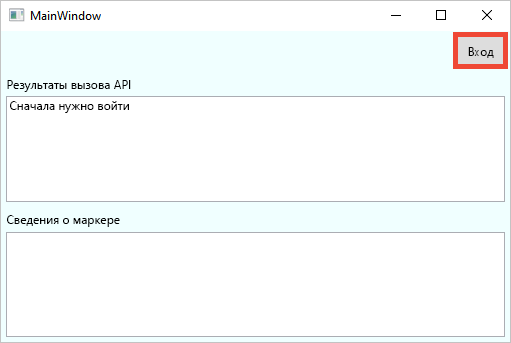

# Тестовый выпуск классического приложения, настроенного с помощью Azure AD B2C

Azure Active Directory B2C обеспечивает управление идентификаторами облака для защиты приложения, бизнеса и клиентов.  В этом кратком руководстве используется образец классического приложения Windows Presentation Foundation (WPF), чтобы продемонстрировать следующее:

* Использование политики **Регистрация или вход** для создания учетной записи социальной сети или входа с помощью поставщика удостоверений в социальных сетях или локальной учетной записи, используя адрес электронной почты. 
* **Вызов API** для извлечения отображаемого имени из защищенного ресурса Azure AD B2C.

## предварительным требованиям

* Установите [Visual Studio 2017](https://www.visualstudio.com/downloads/) с указанными ниже рабочими нагрузками:
    - **Разработка классического приложения .NET**.

* Учетная запись социальных сетей Facebook, Google, Microsoft или Twitter. При отсутствии учетной записи социальных сетей требуется допустимый адрес электронной почты.

[!INCLUDE [quickstarts-free-trial-note](../../includes/quickstarts-free-trial-note.md)]

## Скачивание примера приложения

[Скачайте или клонируйте образец приложения](https://github.com/Azure-Samples/active-directory-b2c-dotnet-desktop) из GitHub.

## Запуск приложения в Visual Studio

В папке проекта образца приложения откройте решение `active-directory-b2c-wpf.sln` в Visual Studio. 

Выберите **Debug > Start Debugging** (Отладка > Начать отладку), чтобы выполнить сборку и запустить приложение. 

## Создание учетной записи

Щелкните **Вход**, чтобы запустить рабочий процесс **регистрации или входа**. При создании учетной записи можно использовать имеющуюся учетную запись поставщика удостоверений в социальных сетях или учетную запись электронной почты.

### Регистрация с помощью поставщика удостоверений в социальных сетях

Чтобы зарегистрироваться с помощью поставщика удостоверений в социальных сетях, нажмите кнопку поставщика удостоверений, которого нужно использовать. Если вы предпочитаете использовать адрес электронной почты, перейдите к разделу [Регистрация с помощью адреса электронной почты](#sign-up-using-an-email-address).

В этом случае необходимо выполнить аутентификацию (вход) с помощью данных учетной записи социальных сетей и авторизовать приложение для чтения информации из учетной записи социальных сетей. Предоставляя доступ, приложение может получить сведения о профиле из учетной записи социальных сетей (например, имя и город). 

Сведения о профиле новой учетной записи будут заполнены информацией из учетной записи социальных сетей. Если необходимо, измените сведения и щелкните **Продолжить**.

Учетная запись пользователя Azure AD B2C, использующая поставщик удостоверений, успешно создана. После входа в систему маркер доступа отображается в текстовом поле *Token info* (Сведения о маркере). Маркер доступа используется при получении доступа к ресурсу API.

Далее перейдите к разделу [Изменение профиля](#edit-your-profile).

### Регистрация с помощью адреса электронной почты

Если вы решили не использовать учетную запись социальных сетей для аутентификации, можно создать учетную запись пользователя Azure AD B2C, используя адрес электронной почты. Учетная запись локального пользователя Azure AD B2C использует Azure Active Directory в качестве поставщика удостоверений. Чтобы использовать свой адрес электронной почты, щелкните ссылку **Нет учетной записи?** Зарегистрируйтесь сейчас.

Введите допустимый адрес электронной почты и нажмите кнопку **Отправить проверочный код**. Для получения проверочного кода из Azure AD B2C необходим допустимый адрес электронной почты.

Введите проверочный код, полученный по электронной почте, и нажмите кнопку **Проверить код**.

Введите данные профиля и нажмите кнопку **Создать**.

Новая учетная запись локального пользователя Azure AD B2C успешно создана. После входа в систему маркер доступа отображается в текстовом поле *Token info* (Сведения о маркере). Маркер доступа используется при получении доступа к ресурсу API.

## Изменение профиля

Azure Active Directory B2C предоставляет функциональные возможности, обеспечивающие пользователям возможность обновления профилей. Щелкните **Изменить профиль**, чтобы изменить созданный профиль.

Выберите поставщик удостоверений, связанный с созданной учетной записью. Например, если при создании учетной записи в качестве поставщика удостоверений использовался Twitter, выберите Twitter, чтобы изменить сведения связанного профиля.

Измените **отображаемое имя** или **город**. 

Новый маркер доступа появится в текстовом поле *Token info* (Сведения о маркере). Если вы хотите проверить изменения для профиля, скопируйте и вставьте маркер доступа в декодер маркеров https://jwt.ms.

## Получение доступа к ресурсу

Щелкните **Call API** (Вызов API), чтобы выполнить запрос к защищенному ресурсу Azure AD B2C https://fabrikamb2chello.azurewebsites.net/hello. 

Приложение включает в себя маркер доступа, отображаемый при запросе в текстовом поле *Token info* (Сведения о маркере). API отправляет отображаемое имя, содержащееся в маркере доступа.

## Дополнительная информация

Следующим шагом является создание клиента Azure AD B2C и настройка образца для запуска с помощью клиента. 

> [!div class="nextstepaction"]
> [Создание клиента Azure Active Directory B2C на портале Azure](active-directory-b2c-get-started.md)
