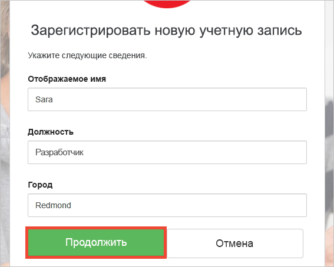
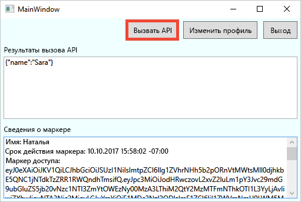

# <a name="quickstart-test-drive-an-azure-ad-b2c-enabled-desktop-app"></a>Краткое руководство по тестовому выпуску классического приложения с поддержкой Azure AD B2C

Azure Active Directory (Azure AD) B2C обеспечивает управление идентификаторами облака для защиты приложения, бизнеса и клиентов. Azure AD B2C позволяет приложениям выполнять проверку подлинности учетных записей социальных сетей и корпоративных учетных записей с помощью протоколов открытого стандарта.

В этом кратком руководстве используется пример классического приложения Windows Presentation Foundation с поддержкой Azure AD B2C для выполнения входа с помощью поставщика удостоверений в социальных сетях, а также для вызова защищенного веб-API Azure AD B2C.

[!INCLUDE [quickstarts-free-trial-note](../../includes/quickstarts-free-trial-note.md)]

## <a name="prerequisites"></a>предварительным требованиям

* [Visual Studio 2017](https://www.visualstudio.com/downloads/) с рабочей нагрузкой **ASP.NET и веб-разработка**. 
* Учетная запись социальных сетей Facebook, Google, Microsoft или Twitter.

## <a name="download-the-sample"></a>Скачивание примера приложения

[Загрузите ZIP-файл](https://github.com/Azure-Samples/active-directory-b2c-dotnet-desktop/archive/master.zip) или клонируйте пример приложения с GitHub.

```
git clone https://github.com/Azure-Samples/active-directory-b2c-dotnet-desktop.git
```

## <a name="run-the-app-in-visual-studio"></a>Запуск приложения в Visual Studio

В папке проекта образца приложения откройте решение `active-directory-b2c-wpf.sln` в Visual Studio.

Нажмите клавишу **F5** для запуска отладки приложения.

## <a name="create-an-account"></a>Создание учетной записи

Выберите **Sign in** (Вход), чтобы запустить рабочий процесс **регистрации или входа** Azure AD B2C на основе политики Azure AD B2C.


Образец поддерживает несколько вариантов регистрации, в том числе с использованием поставщика удостоверений в социальных сетях, а также создание локальной учетной записи путем использования адреса электронной почты. В рамках этого краткого руководства используется учетная запись поставщика удостоверений в социальных сетях (Facebook, Google, Microsoft или Twitter). 

### <a name="sign-up-using-a-social-identity-provider"></a>Регистрация с помощью поставщика удостоверений в социальных сетях

В Azure AD B2C в качестве образца веб-приложения представляется пользовательская страница входа для вымышленной торговой марки Wingtip Toys. 

1. Чтобы зарегистрироваться с помощью поставщика удостоверений в социальных сетях, нажмите кнопку поставщика удостоверений, которого нужно использовать. 

    

    Выполните проверку подлинности (вход) с помощью данных учетной записи социальных сетей и авторизацию приложения для чтения информации из учетной записи социальных сетей. Предоставляя доступ, приложение может получить сведения о профиле из учетной записи социальных сетей (например, имя и город). 

2. Завершите процесс входа для поставщика удостоверений. Например, если вы выбрали Twitter, введите свои учетные данные Twitter и нажмите кнопку **Sign in** (Войти).

    

    Сведения о профиле новой учетной записи будут заполнены информацией из учетной записи социальных сетей. 

3. Если необходимо, измените сведения и щелкните **Продолжить**. Введенные значения используются для профиля учетной записи пользователя Azure AD B2C.

    

    Учетная запись пользователя Azure AD B2C, использующая поставщик удостоверений, успешно создана. После входа в систему маркер доступа отображается в текстовом поле *Token info* (Сведения о маркере). Маркер доступа используется при получении доступа к ресурсу API.

## <a name="edit-your-profile"></a>Изменение профиля

Azure Active Directory B2C предоставляет функциональные возможности, обеспечивающие пользователям возможность обновления профилей.  Образец веб-приложения использует для рабочего процесса политику изменения профиля Azure AD B2C. 

1. Щелкните **Изменить профиль**, чтобы изменить созданный профиль.

    

2. Выберите поставщик удостоверений, связанный с созданной учетной записью. Например, если при создании учетной записи в качестве поставщика удостоверений использовался Twitter, выберите Twitter, чтобы изменить сведения связанного профиля.

3. Измените **отображаемое имя** или **город** и щелкните **Продолжить**.

    Новый маркер доступа появится в текстовом поле *Token info* (Сведения о маркере). Если вы хотите проверить изменения для профиля, скопируйте и вставьте маркер доступа в декодер маркеров https://jwt.ms.

## <a name="access-a-protected-web-api-resource"></a>Получение доступа к защищенному ресурсу веб-API

Щелкните **Call API** (Вызов API), чтобы выполнить запрос к защищенному ресурсу Azure AD B2C https://fabrikamb2chello.azurewebsites.net/hello. 



Приложение включает маркер доступа Azure AD в запрос к защищенному ресурсу веб-API. Веб-API отправляет отображаемое имя, содержащееся в маркере доступа.

Вы успешно применили свою учетную запись пользователя Azure AD B2C, чтобы выполнить авторизованный вызов защищенного веб-API Azure AD B2C.

## <a name="clean-up-resources"></a>Очистка ресурсов

Вы можете использовать свой клиент Azure AD B2C при работе с другими руководствами или краткими пособиями по Azure AD B2C. [Удалите клиент Azure AD B2C](active-directory-b2c-faqs.md#how-do-i-delete-my-azure-ad-b2c-tenant), если он больше не нужен.

## <a name="next-steps"></a>Дополнительная информация

Следующим шагом является создание клиента Azure AD B2C и настройка образца для запуска с помощью клиента. 

> [!div class="nextstepaction"]
> [Создание клиента Azure Active Directory B2C на портале Azure](active-directory-b2c-get-started.md)
