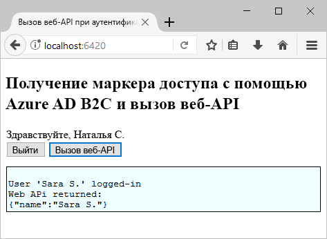

# <a name="test-drive-a-single-page-application-configured-with-azure-ad-b2c"></a>Тестовый выпуск одностраничного приложения, настроенного с помощью Azure AD B2C

## <a name="about-this-sample"></a>Об этом примере

Azure Active Directory B2C обеспечивает управление идентификаторами облака для защиты приложения, бизнеса и клиентов.  В этом кратком руководстве используется образец одностраничного приложения, чтобы продемонстрировать следующее:

* Использование политики **Регистрация или вход** для создания учетной записи социальной сети или входа с помощью поставщика удостоверений в социальных сетях или локальной учетной записи, используя адрес электронной почты. 
* **Вызов API** для извлечения отображаемого имени из защищенного ресурса Azure AD B2C.

## <a name="prerequisites"></a>предварительным требованиям

* Установите [Visual Studio 2017](https://www.visualstudio.com/downloads/) с указанными ниже рабочими нагрузками:
    - **ASP.NET и веб-разработка;**

* Установите [Node.js](https://nodejs.org/en/download/)

* Учетная запись социальных сетей Facebook, Google, Microsoft или Twitter. При отсутствии учетной записи социальных сетей требуется допустимый адрес электронной почты.

[!INCLUDE [quickstarts-free-trial-note](../../includes/quickstarts-free-trial-note.md)]

## <a name="download-the-sample"></a>Скачивание примера приложения

[Скачайте или клонируйте образец приложения](https://github.com/Azure-Samples/active-directory-b2c-javascript-msal-singlepageapp) из GitHub.

## <a name="run-the-sample-application"></a>Запуск примера приложения

Запустите этот пример из командной строки Node.js: 

```
cd active-directory-b2c-javascript-msal-singlepageapp
npm install && npm update
node server.js
```

В окне консоли отображается номер порта для веб-приложения, запущенного на локальном компьютере.

```
Listening on port 6420...
```

Откройте `http://localhost:6420` в веб-браузере для получения доступа к веб-приложению.


## <a name="create-an-account"></a>Создание учетной записи

Щелкните **Вход**, чтобы запустить рабочий процесс **регистрации или входа** Azure AD B2C. При создании учетной записи можно использовать имеющуюся учетную запись поставщика удостоверений в социальных сетях или учетную запись электронной почты.

### <a name="sign-up-using-a-social-identity-provider"></a>Регистрация с помощью поставщика удостоверений в социальных сетях

Чтобы зарегистрироваться с помощью поставщика удостоверений в социальных сетях, нажмите кнопку поставщика удостоверений, которого нужно использовать. Если вы предпочитаете использовать адрес электронной почты, перейдите к разделу [Регистрация с помощью адреса электронной почты](#sign-up-using-an-email-address).


В этом случае необходимо выполнить аутентификацию (вход) с помощью данных учетной записи социальных сетей и авторизовать приложение для чтения информации из учетной записи социальных сетей. Предоставляя доступ, приложение может получить сведения о профиле из учетной записи социальных сетей (например, имя и город). 


Сведения о профиле новой учетной записи будут заполнены информацией из учетной записи социальных сетей. 


Обновите поля "Отображаемое имя", "Должность" и "Город" и щелкните **Продолжить**.  Введенные значения используются для профиля учетной записи пользователя Azure AD B2C.

Учетная запись пользователя Azure AD B2C, использующая поставщик удостоверений, успешно создана. 

Далее перейдите к разделу [Вызов ресурса](#call-a-resource).

### <a name="sign-up-using-an-email-address"></a>Регистрация с помощью адреса электронной почты

Если вы решили не использовать учетную запись социальных сетей для аутентификации, можно создать учетную запись пользователя Azure AD B2C, используя адрес электронной почты. Учетная запись локального пользователя Azure AD B2C использует Azure Active Directory в качестве поставщика удостоверений. Чтобы использовать свой адрес электронной почты, щелкните ссылку **Нет учетной записи?** Зарегистрируйтесь сейчас.


Введите допустимый адрес электронной почты и нажмите кнопку **Отправить проверочный код**. Для получения проверочного кода из Azure AD B2C необходим допустимый адрес электронной почты. 

Введите проверочный код, полученный по электронной почте, и нажмите кнопку **Проверить код**.

Введите данные профиля и нажмите кнопку **Создать**.


Новая учетная запись локального пользователя Azure AD B2C успешно создана.

## <a name="call-a-resource"></a>Вызов ресурса

После входа можно щелкнуть **Call Web API** (Вызов веб-API), чтобы отображаемое имя возвращалось из вызова веб-интерфейса API в качестве объекта JSON. 



## <a name="next-steps"></a>Дополнительная информация

Следующим шагом является создание клиента Azure AD B2C и настройка образца для запуска с помощью клиента. 

> [!div class="nextstepaction"]
> [Создание клиента Azure Active Directory B2C на портале Azure](active-directory-b2c-get-started.md)