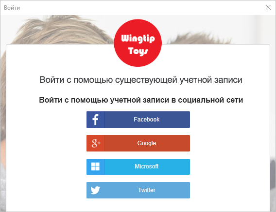

# <a name="quickstart-set-up-sign-in-for-an-aspnet-application-using-azure-active-directory-b2c"></a>Краткое руководство. Настройка входа в приложение ASP.NET с помощью Azure Active Directory B2C

Azure Active Directory (Azure AD) B2C обеспечивает управление идентификаторами облака для защиты приложения, бизнеса и клиентов. Azure AD B2C позволяет приложениям выполнять проверку подлинности учетных записей социальных сетей и корпоративных учетных записей с помощью протоколов открытого стандарта.

В этом кратком руководстве используется пример приложения ASP.NET с поддержкой Azure AD B2C для выполнения входа с помощью поставщика удостоверений в социальных сетях, а также для вызова защищенного веб-API Azure AD B2C.

[!INCLUDE [quickstarts-free-trial-note](../../includes/quickstarts-free-trial-note.md)]

## <a name="prerequisites"></a>предварительным требованиям

* [Visual Studio 2017](https://www.visualstudio.com/downloads/) с рабочей нагрузкой **ASP.NET и веб-разработка**. 
* Учетная запись социальных сетей Facebook, Google, Microsoft или Twitter.

## <a name="download-the-sample"></a>Скачивание примера приложения

[Загрузите ZIP-файл](https://github.com/Azure-Samples/active-directory-b2c-dotnet-webapp-and-webapi/archive/master.zip) или клонируйте пример приложения с GitHub.

```
git clone https://github.com/Azure-Samples/active-directory-b2c-dotnet-webapp-and-webapi.git
```

## <a name="run-the-app-in-visual-studio"></a>Запуск приложения в Visual Studio

В папке проекта образца приложения откройте решение `B2C-WebAPI-DotNet.sln` в Visual Studio.

Пример решения состоит из двух проектов.

**Пример веб-приложения (TaskWebApp):** веб-приложение для создания и изменения списка задач. Веб-приложение использует политику **регистрации или входа** для регистрации пользователей или входа в систему.

**Пример приложения веб-API (TaskService).** Веб-API, поддерживающий функции создания, чтения, обновления и удаления списка задач. Веб-API защищен с помощью Azure AD B2C и вызывается веб-приложением.

В рамках этого краткого руководства одновременно выполняются проекты `TaskWebApp` и `TaskService`. 

1. Выберите решение `B2C-WebAPI-DotNet` в обозревателе решений.
2. В меню Visual Studio выберите **Project > Назначить запускаемые проекты...** 
3. Выберите переключатель **Multiple startup projects** (Несколько запускаемых проектов).
4. Установите **Запуск** в качестве **действия** для обоих проектов. Последовательно выберите **ОК**.

Нажмите клавишу **F5** для отладки обоих приложений. Каждое приложение открывается в отдельной вкладке браузера.

`https://localhost:44316/` — эта страница является веб-приложением ASP.NET. В этом кратком руководстве вы работаете непосредственно с этим приложением.
`https://localhost:44332/` — эта страница является веб-API, который вызывается веб-приложением ASP.NET.

## <a name="create-an-account"></a>Создание учетной записи

Нажмите ссылку **Sign up / Sign in** (Вход / Регистрация) в веб-приложении ASP.NET, чтобы запустить рабочий процесс **регистрации или входа** на основе политики Azure Active Directory B2C.


Образец поддерживает несколько вариантов регистрации, в том числе с использованием поставщика удостоверений в социальных сетях, а также создание локальной учетной записи путем использования адреса электронной почты. В рамках этого краткого руководства используется учетная запись поставщика удостоверений в социальных сетях (Facebook, Google, Microsoft или Twitter). 

### <a name="sign-up-using-a-social-identity-provider"></a>Регистрация с помощью поставщика удостоверений в социальных сетях

В Azure AD B2C в качестве образца веб-приложения представляется пользовательская страница входа для вымышленной торговой марки Wingtip Toys. 

1. Чтобы зарегистрироваться с помощью поставщика удостоверений в социальных сетях, нажмите кнопку поставщика удостоверений, которого нужно использовать.

    

    Выполните проверку подлинности (вход) с помощью данных учетной записи социальных сетей и авторизацию приложения для чтения информации из учетной записи социальных сетей. Предоставляя доступ, приложение может получить сведения о профиле из учетной записи социальных сетей (например, имя и город). 

2. Завершите процесс входа для поставщика удостоверений. Например, если вы выбрали Twitter, введите свои учетные данные Twitter и нажмите кнопку **Sign in** (Войти).

    

    Сведения о профиле новой учетной записи Azure AD B2C будут заполнены информацией из учетной записи социальных сетей.

3. Обновите поля "Отображаемое имя", "Должность" и "Город" и щелкните **Продолжить**.  Введенные значения используются для профиля учетной записи пользователя Azure AD B2C.

    

    Вы применили образец веб-приложения, которое использует политику Azure AD B2C для проверки подлинности с помощью поставщика удостоверений и создания учетной записи пользователя Azure AD B2C. 

## <a name="edit-your-profile"></a>Изменение профиля

Azure Active Directory B2C предоставляет функциональные возможности, обеспечивающие пользователям возможность обновления профилей. Образец веб-приложения использует для рабочего процесса политику изменения профиля Azure AD B2C. 

1. В строке меню веб-приложения, щелкните имя профиля и выберите **Edit profile** (Изменить профиль), чтобы изменить созданный профиль.

    

2. Измените **отображаемое имя** и **город**.  
3. Нажмите кнопку **Продолжить**, чтобы обновить профиль. Новое отображаемое имя находится в правой верхней части домашней страницы веб-приложения.

## <a name="access-a-protected-web-api-resource"></a>Получение доступа к защищенному ресурсу веб-API

1. Щелкните **To-Do List** (Список дел), чтобы ввести и изменить элементы списка дел. 

2. Введите текст в текстовое поле **New Item** (Создать элемент). Щелкните **Add** (Добавить), чтобы вызвать защищенный веб-API Azure AD B2C, добавляющий элемент списка дел.

    

    Веб-приложение ASP.NET включает в себя маркер доступа в запросе к защищенному ресурсу веб-API для выполнения операций с элементами списка дел пользователя.

Вы успешно применили свою учетную запись пользователя Azure AD B2C, чтобы выполнить авторизованный вызов защищенного веб-API Azure AD B2C.

## <a name="clean-up-resources"></a>Очистка ресурсов

Вы можете использовать свой клиент Azure AD B2C при работе с другими руководствами или краткими пособиями по Azure AD B2C. [Удалите клиент Azure AD B2C](active-directory-b2c-faqs.md#how-do-i-delete-my-azure-ad-b2c-tenant), если он больше не нужен.

## <a name="next-steps"></a>Дополнительная информация

В этом кратком руководстве вы использовали пример приложения ASP.NET с включенным Azure AD B2C, чтобы выполнить вход в систему с помощью пользовательской страницы входа, а также для выполнения входа с помощью поставщика удостоверений в социальных сетях и для создания учетной записи Azure AD B2C и вызова веб-API, защищенного Azure AD B2C. 

Перейдите к изучению следующего руководства, чтобы узнать, как настроить пример ASP.NET для использования собственного клиента Azure AD B2C.

> [!div class="nextstepaction"]
> [Создание клиента Azure Active Directory B2C на портале Azure](tutorial-create-tenant.md)