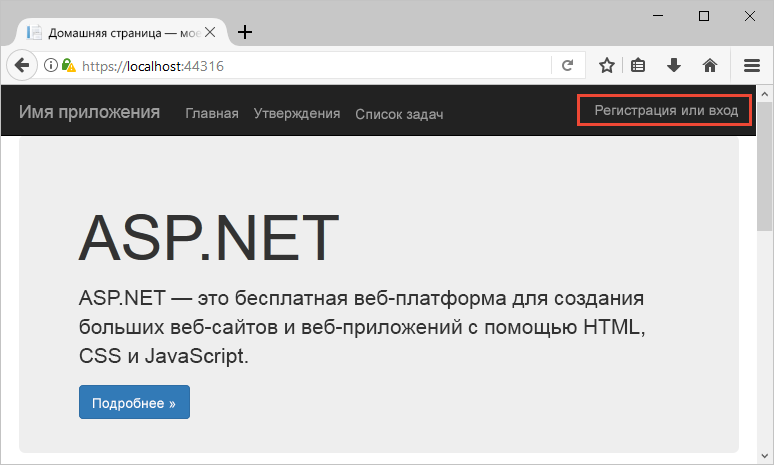

# Тестовый выпуск включенного веб-приложения Azure AD B2C

Azure Active Directory B2C обеспечивает управление идентификаторами облака для защиты приложения, бизнеса и клиентов. В этом кратком руководстве используется пример приложения списка текущих дел, чтобы продемонстрировать следующее:

> [!div class="checklist"]
> * вход в систему с пользовательской страницы входа;
> * регистрация с помощью поставщика удостоверений в социальных сетях;
> * создание учетной записи и профиля пользователя Azure AD B2C и управление ими;
> * вызов веб-API, защищенного Azure AD B2C.

## Предварительные требования

* [Visual Studio 2017](https://www.visualstudio.com/downloads/) с рабочей нагрузкой **ASP.NET и веб-разработка**. 
* Учетная запись социальных сетей Facebook, Google, Microsoft или Twitter.

[!INCLUDE [quickstarts-free-trial-note](../../includes/quickstarts-free-trial-note.md)]

## Скачивание примера приложения

[Скачайте или клонируйте образец приложения](https://github.com/Azure-Samples/active-directory-b2c-dotnet-webapp-and-webapi) из GitHub.

## Запуск приложения в Visual Studio

В папке проекта образца приложения откройте решение `B2C-WebAPI-DotNet.sln` в Visual Studio. 

Решение представляет собой пример приложения списка дел, состоящего из двух проектов:

* **TaskWebApp** — веб-приложение ASP.NET MVC, в котором пользователь может управлять элементами списка дел.  
* **TaskService** — серверная часть веб-API ASP.NET, которая управляет операциями, выполненными в элементах списка дел пользователя. Веб-приложение вызывает этот веб-API и отображает результаты.

Для этого краткого руководства необходимо одновременно выполнить проекты `TaskWebApp` и `TaskService`. 

1. В меню Visual Studio выберите **Проекты > Назначить запускаемые проекты...** 
2. Выберите переключатель **Multiple startup projects** (Несколько запускаемых проектов).
3. Установите **Запуск** в качестве **действия** для обоих проектов. Нажмите кнопку **ОК**.

Выберите **Debug > Start Debugging** (Отладка > Начать отладку), чтобы выполнить сборку и запустить оба приложения. Каждое приложение открывается в отдельной вкладке браузера.

`https://localhost:44316/` — эта страница является веб-приложением ASP.NET. В этом кратком руководстве вы работаете непосредственно с этим приложением.
`https://localhost:44332/` — эта страница является веб-API, который вызывается веб-приложением ASP.NET.

## Создание учетной записи

Нажмите ссылку **Sign up / Sign in** (Вход / Регистрация) в веб-приложении ASP.NET, чтобы запустить рабочий процесс **регистрации или входа**. При создании учетной записи можно использовать имеющуюся учетную запись поставщика удостоверений в социальных сетях или учетную запись электронной почты. В рамках этого краткого руководства используется учетная запись поставщика удостоверений в социальных сетях (Facebook, Google, Microsoft или Twitter).

### Регистрация с помощью поставщика удостоверений в социальных сетях

Чтобы зарегистрироваться с помощью поставщика удостоверений в социальных сетях, нажмите кнопку поставщика удостоверений, которого нужно использовать. 

В этом случае необходимо выполнить аутентификацию (вход) с помощью данных учетной записи социальных сетей и авторизовать приложение для чтения информации из учетной записи социальных сетей. Предоставляя доступ, приложение может получить сведения о профиле из учетной записи социальных сетей (например, имя и город). 

Завершите процесс входа для поставщика удостоверений. Например, если вы выбрали Twitter, введите свои учетные данные Twitter и нажмите кнопку **Sign in** (Войти).

Сведения о профиле новой учетной записи Azure AD B2C будут заполнены информацией из учетной записи социальных сетей.

Обновите поля "Отображаемое имя", "Должность" и "Город" и щелкните **Продолжить**.  Введенные значения используются для профиля учетной записи пользователя Azure AD B2C.

Вы успешно:

> [!div class="checklist"]
> * прошли проверку подлинности с помощью поставщика удостоверений;
> * создали учетную запись пользователя Azure AD B2C. 

## Изменение профиля

Azure Active Directory B2C предоставляет функциональные возможности, обеспечивающие пользователям возможность обновления профилей. В строке меню веб-приложения, щелкните имя профиля и выберите **Edit profile** (Изменить профиль), чтобы изменить созданный профиль.

Измените **отображаемое имя** и **город**.  Нажмите кнопку **Продолжить**, чтобы обновить профиль.

Обратите внимание, что отображаемое имя в верхней правой части страницы обновляется. 

## Доступ к защищенным ресурсам веб-API

Щелкните **To-Do List** (Список дел), чтобы ввести и изменить элементы списка дел. Веб-приложение ASP.NET включает в себя маркер доступа в запросе к ресурсу веб-API на разрешение выполнения операций с элементами списка дел пользователя. 

Введите текст в текстовое поле **New Item** (Создать элемент). Щелкните **Добавить**, чтобы вызвать защищенный веб-API Azure AD B2C, добавляющий элемент списка дел.

Вы успешно использовали свою учетную запись пользователя Azure AD B2C, чтобы выполнить авторизованный вызов защищенного веб-API Azure AD B2C.

## Дальнейшие действия

Образец, используемый в этом кратком руководстве, можно применять для других сценариев Azure AD B2C, включая:

* создание локальной учетной записи с помощью адреса электронной почты;
* сброс пароля локальной учетной записи.

Если вы готовы приступить к созданию клиента Azure AD B2C Azure AD B2C и настройке образца для запуска с помощью собственного клиента, изучите следующее руководство.

> [!div class="nextstepaction"]
> [Создание веб-приложения ASP.NET с возможностями регистрации, входа, редактирования профиля и сброса пароля Azure Active Directory B2C](active-directory-b2c-devquickstarts-web-dotnet-susi.md)