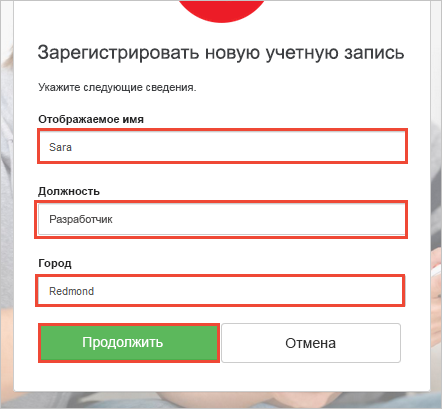
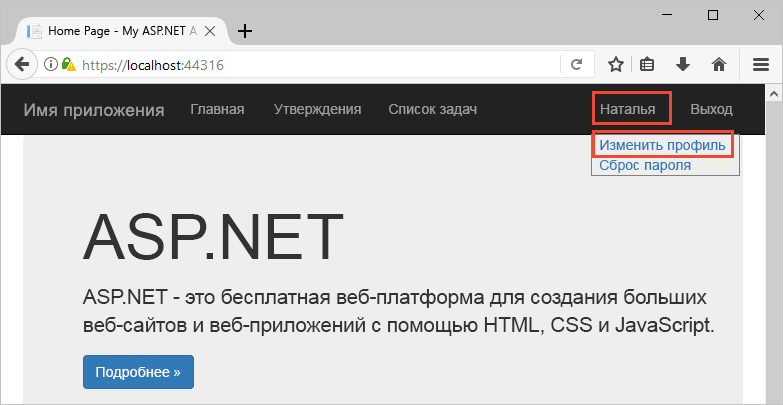

# Тестовый выпуск веб-приложения, настроенного с помощью Azure AD B2C

Azure Active Directory B2C обеспечивает управление идентификаторами облака для защиты приложения, бизнеса и клиентов.  В этом кратком руководстве используется пример приложения списка текущих дел, чтобы продемонстрировать следующее:

* Использование политики **Регистрация или вход** для создания учетной записи социальной сети или входа с помощью поставщика удостоверений в социальных сетях или локальной учетной записи, используя адрес электронной почты. 
* Вызов API, защищенного Azure AD B2C, для создания и изменения элементов списка дел.

## Предварительные требования

* Установите [Visual Studio 2017](https://www.visualstudio.com/downloads/) с указанными ниже рабочими нагрузками:
    - **ASP.NET и веб-разработка;**

* Учетная запись социальных сетей Facebook, Google, Microsoft или Twitter. При отсутствии учетной записи социальных сетей требуется допустимый адрес электронной почты.

[!INCLUDE [quickstarts-free-trial-note](../../includes/quickstarts-free-trial-note.md)]

## Скачивание примера приложения

[Скачайте или клонируйте образец приложения](https://github.com/Azure-Samples/active-directory-b2c-dotnet-webapp-and-webapi) из GitHub.

## Запуск приложения в Visual Studio

В папке проекта образца приложения откройте решение `B2C-WebAPI-DotNet.sln` в Visual Studio. 

Решение состоит из двух проектов:

* **TaskWebApp** — веб-приложение ASP.NET MVC, в котором пользователь может управлять элементами списка дел.  
* **TaskService** — серверная часть веб-API ASP.NET, которая управляет всеми операциями CRUD, выполненными в элементах списка дел пользователя. Веб-приложение вызывает этот API и отображает результаты.

Для этого краткого руководства необходимо одновременно выполнить проекты `TaskWebApp` и `TaskService`. 

1. В обозревателе решений щелкните решение правой кнопкой мыши и выберите **Set StartUp Projects...** (Назначить запускаемые проекты...). 
2. Выберите переключатель **Multiple startup projects** (Несколько запускаемых проектов).
3. Установите **Запуск** в качестве **действия** для обоих проектов. Нажмите кнопку **ОК**.

Выберите **Debug > Start Debugging** (Отладка > Начать отладку), чтобы выполнить сборку и запустить оба приложения. Каждое приложение открывается в отдельной вкладке браузера.

* `https://localhost:44316/` — эта страница является веб-приложением ASP.NET. В этом кратком руководстве вы работаете непосредственно с этим приложением.
* `https://localhost:44332/` — эта страница является веб-API, который вызывается веб-приложением ASP.NET.

## Создание учетной записи

Нажмите ссылку **Sign up / Sign in** (Вход / Регистрация) в веб-приложении ASP.NET, чтобы запустить рабочий процесс **регистрации или входа**. При создании учетной записи можно использовать имеющуюся учетную запись поставщика удостоверений в социальных сетях или учетную запись электронной почты.

### Регистрация с помощью поставщика удостоверений в социальных сетях

Чтобы зарегистрироваться с помощью поставщика удостоверений в социальных сетях, нажмите кнопку поставщика удостоверений, которого нужно использовать. Если вы предпочитаете использовать адрес электронной почты, перейдите к разделу [Регистрация с помощью адреса электронной почты](#sign-up-using-an-email-address).

В этом случае необходимо выполнить аутентификацию (вход) с помощью данных учетной записи социальных сетей и авторизовать приложение для чтения информации из учетной записи социальных сетей. Предоставляя доступ, приложение может получить сведения о профиле из учетной записи социальных сетей (например, имя и город). 

Завершите процесс входа для поставщика удостоверений. Например, щелкните кнопку **Вход** для Twitter.

Сведения о профиле новой учетной записи будут заполнены информацией из учетной записи социальных сетей.

Обновите поля "Отображаемое имя", "Должность" и "Город" и щелкните **Продолжить**.  Введенные значения используются для профиля учетной записи пользователя Azure AD B2C.

Учетная запись пользователя Azure AD B2C, использующая поставщик удостоверений, успешно создана. 

Далее перейдите к разделу [Просмотр утверждений](#view-your-claims).

### Регистрация с помощью адреса электронной почты

Если вы решили не использовать учетную запись социальных сетей для аутентификации, можно создать учетную запись пользователя Azure AD B2C, используя адрес электронной почты. Учетная запись локального пользователя Azure AD B2C использует Azure Active Directory в качестве поставщика удостоверений. Чтобы использовать свой адрес электронной почты, щелкните ссылку **Нет учетной записи?** Зарегистрируйтесь сейчас.

Введите допустимый адрес электронной почты и нажмите кнопку **Отправить проверочный код**. Для получения проверочного кода из Azure AD B2C необходим допустимый адрес электронной почты. 

Введите проверочный код, полученный по электронной почте, и нажмите кнопку **Проверить код**.

Введите данные профиля и нажмите кнопку **Создать**.

Новая учетная запись локального пользователя Azure AD B2C успешно создана.

## Сброс пароля

Если учетная запись создана с помощью адреса электронной почты, Azure AD B2C предоставляет функцию, обеспечивающую пользователям возможность сброса пароля. Чтобы изменить созданный профиль, щелкните имя своего профиля в строке меню и выберите **Reset Password** (Сбросить пароль).

Подтвердите адрес электронной почты, введя его и нажав кнопку **Отправить проверочный код**. Проверочный код отправляется на адрес электронной почты.

Введите проверочный код, полученный по электронной почте, и щелкните **Проверить код**.

После проверки адреса электронной почты щелкните **Продолжить**.

Введите новый пароль и щелкните **Продолжить**.

## Просмотр утверждений

Щелкните **Утверждения** в строке меню веб-приложения, чтобы просмотреть утверждения, связанные с последним действием. 

В этом примере последним действием было *регистрация или вход*. Обратите внимание, что **тип утверждения** `http://schemas.microsoft.com/claims/authnclassreference` — `b2c_1_susi`, указывающий последнее действие регистрации или входа в систему. Если последнее действие — сброс пароля, **типом утверждения** будет `b2c_1_reset`.

## Изменение профиля

Azure Active Directory B2C предоставляет функциональные возможности, обеспечивающие пользователям возможность обновления профилей. В строке меню веб-приложения, щелкните имя профиля и выберите **Edit profile** (Изменить профиль), чтобы изменить созданный профиль.

Измените **отображаемое имя** и **город**.  Нажмите кнопку **Продолжить**, чтобы обновить профиль.

Обратите внимание, что после смены имени отображаемое имя обновляется в верхней правой части страницы. 

Нажмите кнопку **Утверждения**. Изменения, внесенные в поля **Отображаемое имя** и **Город**, отображаются в утверждениях.

 Обратите внимание, что **тип утверждения** `http://schemas.microsoft.com/claims/authnclassreference` был обновлен до `b2c_1_edit_profile` и указывает, что последним действием было изменение профиля, а также, что для полей "Имя" и "Город" заданы новые значения *Sara S.* и *Seattle*.

## Получение доступа к ресурсу

Щелкните **To-Do List** (Список дел), чтобы ввести и изменить элементы списка дел. Веб-приложение ASP.NET включает в себя маркер доступа в запросе к ресурсу веб-API на разрешение выполнения операций с элементами списка дел пользователя. 

Введите текст в текстовое поле **New Item** (Создать элемент). Щелкните **Добавить**, чтобы вызвать защищенный веб-API Azure AD B2C, добавляющий элемент списка дел.

## Другие сценарии

Другие сценарии тестирования:

* Выйдите из приложения и щелкните **To-do list** (Список дел). Обратите внимание, как вам будет предложено войти в систему, и как сохраняются ваши элементы списка. 
* Создайте учетную запись с помощью другого типа учетной записи. Например, используйте поставщик удостоверений в социальных сетях, если учетная запись создана с помощью ранее указанного адреса электронной почты.

## Дальнейшие действия

Следующим шагом является создание клиента Azure AD B2C и настройка образца для запуска с помощью клиента. 

> [!div class="nextstepaction"]
> [Создание клиента Azure Active Directory B2C на портале Azure](active-directory-b2c-get-started.md)