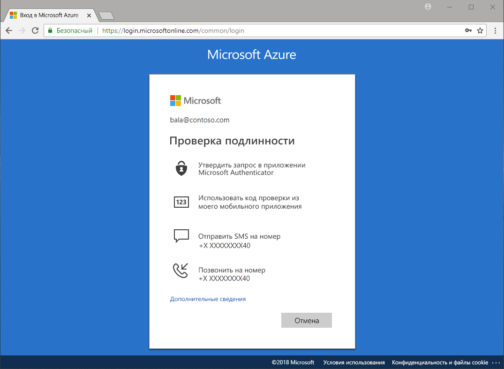

# Какие методы доступны для проверки подлинности?

Мы слышим новости о кражах паролей и компрометации удостоверений. Требование второго фактора помимо пароля сразу же повышает безопасность организации. Чтобы помочь администраторам защитить организации и пользователей с помощью дополнительных методов проверки подлинности, Microsoft Azure Active Directory (Azure AD) включает в себя такие функции, как Многофакторная идентификация Azure (Azure MFA) и самостоятельный сброс пароля Azure AD (SSPR).

Существует множество сценариев, включая вход в приложение, сброс пароля, включение Windows Hello и другие действия, для выполнения которых вашим пользователям нужно пройти дополнительную проверку подлинности.

Дополнительная проверка может проводиться с помощью таких методов:

* код, указанный в сообщении электронной почты или текстовом сообщении;
* телефонный звонок;
* уведомление или код по телефону;
* ответы на контрольные вопросы.

Самостоятельный сброс пароля Azure MFA и Azure AD дает администраторам контроль над конфигурациями, политикой, мониторингом и созданием отчетов с помощью Azure AD и портала Azure для защиты организаций.

## Самостоятельный сброс пароля

Самостоятельный сброс пароля дает пользователям возможность сбрасывать пароль без вмешательства администратора, где и когда им нужно.

> [!VIDEO https://www.youtube.com/embed/hc97Yx5PJiM]

Самостоятельный сброс пароля включает в себя следующее.

* **Изменение пароля.** Я знаю свой пароль, но хочу изменить его на новый.
* **Сброс пароля.** Я не могу войти и хочу сбросить свой пароль с помощью одного или нескольких утвержденных методов проверки подлинности.
* **Разблокирование учетной записи.** Я не могу войти, так как моя учетная запись заблокирована, и я хочу разблокировать ее с помощью одного или нескольких утвержденных методов проверки подлинности.

## Многофакторная идентификация

Многофакторная идентификация (MFA) Azure — решение Майкрософт для двухэтапной проверки. С помощью утвержденных администратором методов проверки подлинности Azure MFA помогает защитить доступ к данным и приложениям, при этом не усложняя простой процесс входа в систему.

## Дополнительная информация

Следующий шаг — перейти к настройке самостоятельного сброса пароля и Многофакторной идентификации Azure.

См. раздел [Быстрое развертывание самостоятельного сброса пароля в Azure AD](quickstart-sspr.md).

См. дополнительные сведения в [руководстве по самостоятельному сбросу пароля в Azure AD](concept-sspr-howitworks.md).

См. дополнительные сведения в [руководстве по Многофакторной идентификации Azure](concept-mfa-howitworks.md).
