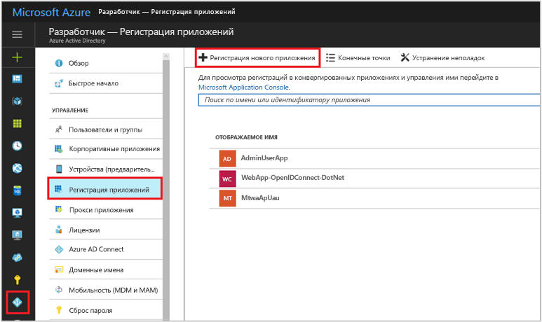
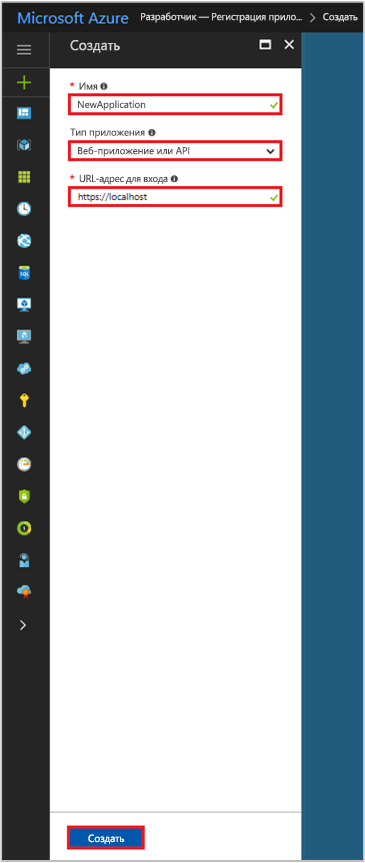

# Краткое руководство. Регистрация приложения в конечной точке Azure Active Directory версии 1.0

[!INCLUDE [active-directory-develop-applies-v1](../../../includes/active-directory-develop-applies-v1.md)]

Разработчики корпоративных решений и поставщики программного обеспечения как услуги (SaaS) могут разрабатывать коммерческие облачные службы или бизнес-приложения, которые можно интегрировать с Azure Active Directory (Azure AD) для обеспечения безопасного входа и авторизации для служб. Чтобы интегрировать приложение или службу с Azure AD, разработчику сначала необходимо зарегистрировать приложение в Azure AD.

Все приложения, которые будут использовать возможности Azure AD, сначала следует зарегистрировать в клиенте Azure AD. Этот процесс регистрации включает в себя предоставление Azure AD сведений о приложении, например URL-адреса, по которому оно расположено, URL-адреса для отправки ответов после проверки подлинности пользователя, URI, идентифицирующего приложение, и т. д.

В этом кратком руководстве объясняется, как добавить и зарегистрировать приложение в Azure AD с помощью существующей функции **Регистрация приложений** на портале Azure.

> [!NOTE]
> Регистрируете новое приложение? Опробуйте новую функцию **Регистрация приложений (предварительная версия)** на портале Azure. Чтобы приступить к работе, ознакомьтесь со статьей о [регистрации приложения (предварительная версия)](quickstart-register-app.md).

## Предварительные требования

Чтобы приступить к работе, у вас должен быть клиент Azure AD, который можно использовать для регистрации приложения. Если клиента нет, [узнайте, как его получить](quickstart-create-new-tenant.md).

## Регистрация нового приложения с помощью портала Azure

1. Войдите на [портале Azure](https://portal.azure.com).
1. Если учетная запись предоставляет доступ нескольким клиентам, выберите свою учетную запись в правом верхнем углу и нужный клиент Azure AD для этого сеанса портала.
1. В области навигации слева выберите службу **Azure Active Directory**.
1. Щелкните **Регистрация приложений** и выберите пункт **Регистрация нового приложения**.

    

1. После появления страницы **Создание** введите сведения о регистрации приложения: 

    - **Имя.** Введите понятное имя для приложения.
    - **Тип приложения:**
      - Выберите **Машинный код** для [клиентских приложений](developer-glossary.md#client-application), которые установлены локально на устройстве. Этот параметр используется для общедоступных [собственных клиентов](developer-glossary.md#native-client) OAuth.
      - Выберите **Веб-приложение или API** для [клиентских приложений](developer-glossary.md#client-application) и [приложений ресурсов или API](developer-glossary.md#resource-server), установленных на защищенном сервере. Этот параметр используется для конфиденциальных [веб-клиентов](developer-glossary.md#web-client) и общедоступных [клиентов на основе агента пользователя](developer-glossary.md#user-agent-based-client) OAuth. То же приложение может также предоставлять клиент и ресурс или API.
    - **URL-адрес входа**. Для приложений "Веб-приложение или API" укажите основной URL-адрес приложения. Например, `http://localhost:31544` может быть URL-адресом веб-приложения, выполняемого на локальном компьютере. Пользователи будут использовать этот URL-адрес для входа в приложение веб-клиента. 
    - **URI перенаправления**. Для приложений "Машинный код" укажите универсальный код ресурса (URI), который Azure AD будет использовать для возвращения токенов ответа. Укажите значение, специфичное для вашего приложения, например `http://MyFirstAADApp`.

      

    Конкретные примеры для веб-приложений или собственных приложений см. в **кратких руководствах** в нашей документации.

1. По завершении выберите **Создать**.

    Azure AD присвоит вашему приложению уникальный идентификатор, а затем откроется главная страница регистрации приложения. В зависимости от того, является ли ваше приложение веб-приложением или собственным приложением, будут предоставлены различные параметры для добавления дополнительных возможностей в приложение.

      > [!NOTE]
      > По умолчанию в только что зарегистрированное веб-приложение могут входить **только** пользователи того же клиента.

## Дополнительная информация

- Пример согласия см. в статье о [платформе предоставления согласия Azure AD](consent-framework.md).
- Сведения о том, как включить дополнительные функции настройки при регистрации приложения (учетные данные, разрешения, включения входа для пользователей из других клиентов), см. в руководстве по [обновлению приложения в Azure Active Directory](quickstart-v1-update-azure-ad-app.md).
- Дополнительные сведения о двух объектах Azure AD, представляющих зарегистрированное приложение, и о взаимосвязи между ними см. в описании [объектов приложения и субъекта-службы в Azure Active Directory (Azure AD)](app-objects-and-service-principals.md).
- Дополнительные сведения о фирменной символике, которой следует пользоваться при разработке приложений в среде Azure Active Directory см. в [рекомендациях по использованию фирменной символики для приложений](howto-add-branding-in-azure-ad-apps.md).
