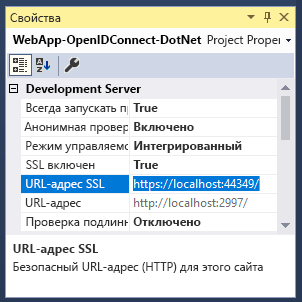
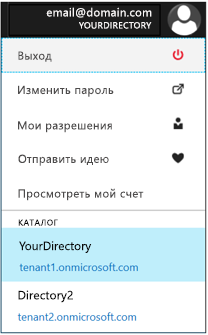
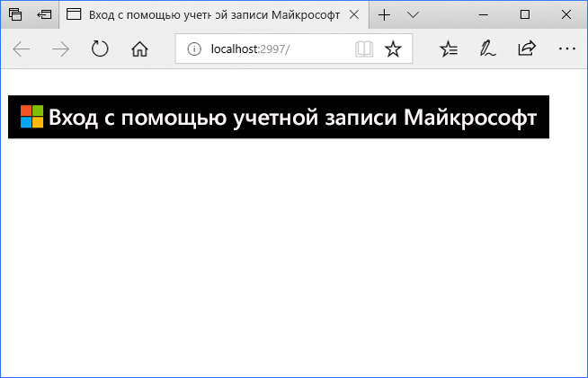
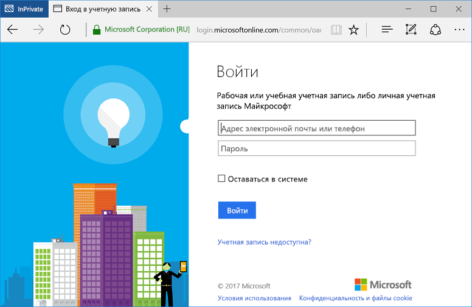

# <a name="quickstart-add-sign-in-with-microsoft-to-an-aspnet-web-app"></a>Краткое руководство. Добавление возможности входа в веб-приложение ASP.NET с помощью учетной записи Майкрософт

[!INCLUDE [active-directory-develop-applies-v1](../../../includes/active-directory-develop-applies-v1.md)]

В этом руководстве описывается, как реализовать вход через учетную запись Майкрософт, используя решение ASP.NET MVC с традиционным браузерным приложением с помощью OpenID Connect. Вы узнаете, как настроить вход с помощью рабочих и учебных учетных записей в приложении ASP.NET.

По завершении работы с данным руководством приложение будет принимать операции входа с помощью рабочих и учебных учетных записей из организаций, интегрированных с Azure Active Directory (Azure AD).

> [!NOTE]
> Если вы планируете включить вход для личных учетных записей помимо рабочих и учебных учетных записей, можно использовать [конечную точку версии 2](azure-ad-endpoint-comparison.md). Дополнительные сведения о текущих ограничениях конечной точки версии 2 см. в статье [Добавление возможности входа в веб-приложение ASP.NET с помощью учетной записи Майкрософт](tutorial-v2-asp-webapp.md), а также в [этой статье](active-directory-v2-limitations.md).

## <a name="prerequisites"></a>Предварительные требования

Чтобы приступить к работе, выполните следующие условия:

* Установите Visual Studio 2015 с обновлением 3 или Visual Studio 2017. У вас его нет? [Скачайте Visual Studio 2017 бесплатно.](https://www.visualstudio.com/downloads/)

## <a name="scenario-sign-in-users-from-work-and-school-accounts-in-your-aspnet-app"></a>Сценарий: реализация входа пользователей с помощью рабочих и учебных учетных записей в приложении ASP.NET


В этом случае браузер обращается к веб-сайту ASP.NET и требует, чтобы пользователь прошел проверку подлинности с помощью кнопки входа. В этом сценарии большая часть работы по отображению веб-страницы происходит на стороне сервера.

В этом руководстве показано, как обеспечить вход пользователей в веб-приложении ASP.NET, начиная с пустого шаблона. В нем описываются такие действия, как добавление кнопки входа, а также каждый контроллер и метод, а также обсуждаются некоторые основные понятия по этим задачам. Кроме того, можно создать проект для входа пользователей Azure AD (с использованием рабочих и учебных учетных записей) с помощью [веб-шаблона Visual Studio](https://docs.microsoft.com/aspnet/visual-studio/overview/2013/creating-web-projects-in-visual-studio#organizational-account-authentication-options), выбрать **Учетные записи в организации** и затем выбрать один из вариантов облака. Этот вариант позволяет использовать шаблон с большими возможностями, содержащий дополнительные контроллеры, методы и представления.

## <a name="libraries"></a>Библиотеки

В этом руководстве используются следующие пакеты.

| Библиотека | ОПИСАНИЕ |
|---|---|
| [Microsoft.Owin.Security.OpenIdConnect](https://www.nuget.org/packages/Microsoft.Owin.Security.OpenIdConnect/) | Промежуточный слой, который позволяет приложению использовать OpenIDConnect для проверки подлинности. |
| [Microsoft.Owin.Security.Cookies](https://www.nuget.org/packages/Microsoft.Owin.Security.Cookies) |Промежуточный слой, который позволяет приложению поддерживать пользовательский сеанс с помощью файлов cookie. |
| [Microsoft.Owin.Host.SystemWeb](https://www.nuget.org/packages/Microsoft.Owin.Host.SystemWeb) | Позволяет приложениям на основе OWIN работать на платформе IIS с помощью конвейера запросов ASP.NET. |
|  |  |

## <a name="step-1-set-up-your-project"></a>Шаг 1. Настройка проекта

В этом разделе описаны шаги по установке и настройке конвейера для проверки подлинности через ПО промежуточного слоя OWIN в проекте ASP.NET с помощью OpenID Connect.

Чтобы скачать этот пример проекта Visual Studio, сделайте следующее:
1. [Скачайте проект на сайте GitHub](https://github.com/AzureADQuickStarts/WebApp-OpenIdConnect-DotNet/archive/GuidedSetup.zip).
1. Затем перейдите к [настройке](#configure-your-webconfig-and-register-an-application), чтобы настроить пример кода перед выполнением.

## <a name="step-2-create-your-aspnet-project"></a>Шаг 2. Создание проекта ASP.NET

1. В Visual Studio выберите **Файл > Создать > Проект**.
2. В **Visual C#\Web** выберите **Веб-приложение ASP.NET (.NET Framework)**.
3. Присвойте имя приложению и нажмите кнопку **ОК**.
4. Выберите **Пусто** и установите флажок, чтобы добавить ссылки **MVC**.

## <a name="step-3-add-authentication-components"></a>Шаг 3. Добавление компонентов проверки подлинности

1. В Visual Studio щелкните **Инструменты > Диспетчер пакетов NuGet > Консоль диспетчера пакетов**.
2. Добавьте **пакеты NuGet для промежуточного слоя OWIN**, введя следующие команды в окне консоли диспетчера пакетов:

    ```powershell
    Install-Package Microsoft.Owin.Security.OpenIdConnect
    Install-Package Microsoft.Owin.Security.Cookies
    Install-Package Microsoft.Owin.Host.SystemWeb
    ```

<!--start-collapse-->
> ### <a name="about-these-packages"></a>Об этих пакетах
>Библиотеки, приведенные выше, позволяют выполнять единый вход с помощью OpenID Connect через проверку подлинности на основе файлов cookie. После завершения проверки подлинности и отправки приложению маркера, представляющего пользователя, промежуточный слой OWIN создаст файл cookie сеанса. Затем браузер будет использовать этот файл cookie при последующих запросах, так что пользователю не нужно будет повторно проходить аутентификацию или дополнительную проверку.
<!--end-collapse-->

## <a name="step-4-configure-the-authentication-pipeline"></a>Шаг 4. Настройка конвейера для проверки подлинности

Приведенные ниже шаги позволяют создать *класс Startup* ПО промежуточного слоя OWIN для настройки проверки подлинности OpenID Connect. Этот класс выполняется автоматически.

> [!TIP]
> Если проект не содержит файл `Startup.cs` в корневой папке, сделайте следующее:<br/>
> 1. Щелкните корневую папку проекта правой кнопкой мыши: >    **Добавить > Новый элемент... > Класс Startup OWIN**.<br/>
> 2. Назовите класс `Startup.cs`.<br/>
>
>> Выберите класс запуска OWIN, а не стандартный класс C#. Если вы выбрали нужный класс, вы должны увидеть `[assembly: OwinStartup(typeof({NameSpace}.Startup))]` над пространством имен.

Чтобы создать *класс Startup* ПО промежуточного слоя OWIN, сделайте следующее:

1. Добавьте в `Startup.cs` пространства имен *OWIN* и *Microsoft.IdentityModel*.

    [!code-csharp[main](../../../WebApp-OpenIDConnect-DotNet/WebApp-OpenIDConnect-DotNet/Startup.cs?name=AddedNameSpaces "Startup.cs")]

2. Замените класс Startup следующим кодом.

    [!code-csharp[main](../../../WebApp-OpenIDConnect-DotNet/WebApp-OpenIDConnect-DotNet/Startup.cs?name=Startup "Startup.cs")]

<!--start-collapse-->
> [!NOTE]
> Параметры, указанные в *OpenIDConnectAuthenticationOptions*, будут служить координатами приложения для взаимодействия с Azure AD. Так как ПО промежуточного слоя OpenID Connect использует файлы cookie, вам также необходимо настроить аутентификацию для этих файлов, как показано в коде выше. Значение *ValidateIssuer* сообщает OpenIdConnect не ограничивать доступ для определенной организации.
<!--end-collapse-->

<!--end-setup-->

<!--start-use-->

## <a name="step-5-add-a-controller-to-handle-sign-in-and-sign-out-requests"></a>Шаг 5. Добавление контроллера для обработки запросов на вход и выход

Создайте контроллер для предоставления методов входа и выхода.

1.  Щелкните правой кнопкой мыши папку **Контроллеры** и выберите **Добавить > Контроллер**.
2.  Выберите **MVC (.NET version) Controller – Empty** (Контроллер MVC (.NET) — пусто).
3.  Выберите **Добавить**.
4.  Назовите его `HomeController` и выберите **Добавить**.
5.  Добавьте в класс следующие пространства имен **OWIN**.

    [!code-csharp[main](../../../WebApp-OpenIDConnect-DotNet/WebApp-OpenIDConnect-DotNet/Controllers/HomeController.cs?name=AddedNameSpaces "HomeController.cs")]

6. Добавьте методы, которые приведены ниже, чтобы обрабатывать операции входа и выхода для контроллера, запуская запросы защиты для аутентификации с помощью кода.

    [!code-csharp[main](../../../WebApp-OpenIDConnect-DotNet/WebApp-OpenIDConnect-DotNet/Controllers/HomeController.cs?name=SigInAndSignOut "HomeController.cs")]

## <a name="step-6-create-the-apps-home-page-to-sign-in-users-via-a-sign-in-button"></a>Шаг 6. Создание домашней страницы приложения для выполнения входа пользователями с помощью кнопки "Вход"

Создайте в Visual Studio новое представление, где будет содержаться кнопка входа, а также будут отображаться сведения о пользователе после проверки подлинности:

1. Щелкните правой кнопкой мыши папку **Views\Home** и выберите **Добавление представления**.
1. Назовите его **Индекс**.
1. Добавьте следующий код HTML, включающий кнопку входа, в файл:

    [!code-html[main](../../../WebApp-OpenIDConnect-DotNet/WebApp-OpenIDConnect-DotNet/Views/Home/Index.cshtml "Index.cshtml")]

<!--start-collapse--> С помощью этой страницы можно добавить кнопку входа в формате SVG с черным фоном:<br/><br/> Расширенный список кнопок входа можно найти [на этой странице](howto-add-branding-in-azure-ad-apps.md).
<!--end-collapse-->

## <a name="step-7-display-users-claims-by-adding-a-controller"></a>Шаг 7. Добавление контроллера для отображения утверждений пользователя

Этот контроллер демонстрирует использование атрибута `[Authorize]` для защиты. Этот атрибут разрешает доступ к контроллеру только тем пользователям, которые прошли проверку подлинности. В приведенном ниже коде атрибут используется для отображения утверждений пользователя, полученных при выполнении входа.

1. Щелкните правой кнопкой мыши папку **Контроллеры** и выберите **Добавить > Контроллер**.
1. Выберите **MVC {version} Controller – Empty** (Контроллер MVC {версия} — пусто).
1. Выберите **Добавить**.
1. Назовите его **ClaimsController**.
1. Замените код класса контроллера кодом, приведенным ниже. Таким образом вы добавите в класс атрибут `[Authorize]`.

    [!code-csharp[main](../../../WebApp-OpenIDConnect-DotNet/WebApp-OpenIDConnect-DotNet/Controllers/ClaimsController.cs?name=ClaimsController "ClaimsController.cs")]

<!--start-collapse-->
> [!NOTE]
> Из-за использования атрибута `[Authorize]` все методы контроллера выполняются, только если пользователь прошел проверку подлинности. Если пользователь не прошел аутентификацию и пытается получить доступ к контроллеру, OWIN инициирует запрос на аутентификацию, что заставит пользователя ее пройти. Приведенный выше код просматривает коллекцию утверждений пользователя для обнаружения определенных атрибутов, включенных в маркер пользователя. Эти атрибуты включают имя и фамилию пользователя, а также субъект глобального идентификатора пользователя. Этот субъект содержит *идентификатор клиента*, который представляет идентификатор организации пользователя.
<!--end-collapse-->

## <a name="step-8-create-a-view-to-display-the-users-claims"></a>Шаг 8. Создание представления для отображения утверждений пользователя

В Visual Studio создайте новое представление для отображения утверждений пользователя на веб-странице:

1. Щелкните правой кнопкой мыши папку **Views\Claims** и выберите **Добавление представления**.
1. Назовите его **Индекс**.
1. Добавьте в файл следующий код HTML:

    [!code-html[main](../../../WebApp-OpenIDConnect-DotNet/WebApp-OpenIDConnect-DotNet/Views/Claims/Index.cshtml "Index.cshtml")]

<!--end-use-->

<!--start-configure-->

## <a name="step-9-configure-your-webconfig-and-register-an-application"></a>Шаг 9. Настройка файла *web.config* и регистрация приложения

1. В Visual Studio добавьте следующий код в файл `web.config`, расположенный в корневой папке в разделе `configuration\appSettings`.

    ```xml
    <add key="ClientId" value="Enter_the_Application_Id_here" />
    <add key="RedirectUrl" value="Enter_the_Redirect_Url_here" />
    <add key="Tenant" value="common" />
    <add key="Authority" value="https://login.microsoftonline.com/{0}" />
    ```
2. В обозревателе решений выберите проект и просмотрите окно <i>Свойства</i> (если это окно не отображается, нажмите клавишу F4).
3. Для параметра "SSL включен" измените значение на <code>True</code>.
4. Скопируйте URL-адрес SSL проекта в буфер обмена.<br/><br/><br />
5. В <code>web.config</code> замените <code>Enter_the_Redirect_URL_here</code> URL-адресом SSL проекта.

### <a name="register-your-application-in-the-azure-portal-then-add-its-information-to-webconfig"></a>Зарегистрируйте приложение на портале Azure, а затем добавьте его данные в файл *web.config*.

1. Перейдите на [портал регистрации приложений Microsoft Azure](https://portal.azure.com/#blade/Microsoft_AAD_IAM/ActiveDirectoryMenuBlade/RegisteredApps), чтобы зарегистрировать приложение.
2. Выберите **Регистрация нового приложения**.
3. Введите имя приложения.
4. Вставьте *URL-адрес SSL* проекта Visual Studio в поле **URL-адрес входа**. Этот URL-адрес также автоматически добавляется в список URL-адресов ответа для приложения, которое вы регистрируете.
5. Чтобы зарегистрировать приложение, выберите **Создать**. После этого вы вернетесь к списку приложений.
6. Теперь найдите и (или) выберите приложение, которое вы только что создали, и откройте окно его свойств.
7. Скопируйте в буфер обмена идентификатор GUID из **идентификатора приложения**.
8. Вернитесь в Visual Studio и в `web.config` замените `Enter_the_Application_Id_here` идентификатором зарегистрированного приложения.

> [!TIP]
> Если ваша учетная запись настроена для доступа к нескольким каталогам, убедитесь, что вы выбрали правильный каталог для организации, в котором требуется зарегистрировать приложение. Для этого щелкните имя учетной записи в верхней правой части портала Azure и проверьте выбранный каталог, как описано ниже.<br/>

## <a name="step-10-configure-sign-in-options"></a>Шаг 10. Настройка параметров входа

Приложение можно настроить таким образом, чтобы разрешить вход только пользователям, принадлежащим к одному экземпляру Azure AD организации, или принимать операции входа от пользователей, принадлежащих к любой организации. Следуйте инструкциям для одного из следующих вариантов.

### <a name="configure-your-application-to-allow-sign-ins-of-work-and-school-accounts-from-any-company-or-organization-multi-tenant"></a>Настройка приложения для разрешения входа с рабочими и учебными учетными записями из любой компании или организации (мультитенантное приложение)

Выполните следующие действия, если требуется принимать операции входа с рабочими и учебными учетными записями из любой компании или организации, интегрированной с Azure AD. Это очень распространенный сценарий для *приложений SaaS*.

1. Вернитесь на [портал регистрации приложений Microsoft Azure](https://portal.azure.com/#blade/Microsoft_AAD_IAM/ActiveDirectoryMenuBlade/RegisteredApps) и найдите только что зарегистрированное приложение.
2. В разделе **Все параметры** выберите **Свойства**.
3. Задайте для свойства **Мультитенантный** значение **Да**, а затем нажмите кнопку **Сохранить**.

Дополнительные сведения о данном параметре и принцип работы мультитенантных приложений приведены в статье [Как реализовать вход любого пользователя Azure Active Directory с помощью шаблона мультитенантного приложения](howto-convert-app-to-be-multi-tenant.md).

### <a name="restrict-users-from-only-one-organizations-active-directory-instance-to-sign-in-to-your-application-single-tenant"></a>Разрешение входа в приложение только пользователям отдельного экземпляра Active Directory организации (приложение с одним клиентом)

Это распространенный сценарий для бизнес-приложений.

Если требуется, чтобы приложение принимало операции входа только с использованием учетных записей, относящихся к определенному экземпляру Azure AD (включая *гостевые учетные записи* этого экземпляра), сделайте следующее:

1. Замените значение параметра `Tenant` в файле *web.config* `Common` именем клиента организации, например *contoso.onmicrosoft.com*.
1. После этого измените аргумент `ValidateIssuer` в [*классе Startup OWIN*](#configure-the-authentication-pipeline), задав для него значение `true`.

Чтобы разрешить вход для пользователей из списка определенных организаций, сделайте следующее:

1. `ValidateIssuer` — присвойте значение True.
1. Используйте параметр `ValidIssuers`, чтобы указать список организаций.

Другой вариант — реализовать пользовательский метод для проверки издателей с помощью параметра *IssuerValidator*. Дополнительные сведения о `TokenValidationParameters` см. в этой [статье MSDN](https://msdn.microsoft.com/library/system.identitymodel.tokens.tokenvalidationparameters.aspx "Статья о классе TokenValidationParameters на сайте MSDN").

<!--end-configure-->

<!--start-configure-arp-->
<!--
## Configure your ASP.NET Web App with the application's registration information

In this step, you will configure your project to use SSL, and then use the SSL URL to configure your application’s registration information. After this, add the application’ registration information to your solution via *web.config*.

1.  In Solution Explorer, select the project and look at the `Properties` window (if you don’t see a Properties window, press F4)
2.  Change `SSL Enabled` to `True`
3.  Copy the value from `SSL URL` above and paste it in the `Redirect URL` field on the top of this page, then click *Update*:<br/><br/><br />
4.  Add the following in `web.config` file located in root’s folder, under section `configuration\appSettings`:

```xml
<add key="ClientId" value="[Enter the application Id here]" />
<add key="RedirectUri" value="[Enter the Redirect URL here]" />
<add key="Tenant" value="common" />
<add key="Authority" value="https://login.microsoftonline.com/{0}" /> 
```
-->
<!--end-configure-arp-->
<!--start-test-->

## <a name="step-11-test-your-code"></a>Шаг 11. Тестирование кода

1. Нажмите клавишу **F5**, чтобы запустить проект в Visual Studio. Откроется браузер, и вы будете перенаправлены на страницу `http://localhost:{port}`, где вы увидите кнопку **Войдите с помощью учетной записи Майкрософт**.
1. Нажмите кнопку, чтобы войти.

### <a name="sign-in"></a>Вход

Когда все будет готово для тестирования, используйте для входа рабочую учетную запись (Azure AD).





#### <a name="expected-results"></a>Ожидаемые результаты

После входа в систему пользователь перенаправляется на домашнюю страницу веб-сайта, URL-адрес для протокола HTTPS которой указан в сведениях о регистрации приложения на портале регистрации приложений Майкрософт. Теперь на этой странице отображается *приветствие*, ссылка, чтобы выйти из приложения, и ссылка, чтобы увидеть утверждения пользователя. Она является ссылкой на ранее созданный контроллер авторизации.

### <a name="see-users-claims"></a>Просмотр утверждений пользователя

Выберите гиперссылку, чтобы просмотреть утверждения пользователя. Вы перейдете к контроллеру и представлению, которое доступно только для пользователей, прошедших аутентификацию.

#### <a name="expected-results"></a>Ожидаемые результаты

 Вы должны увидеть таблицу, содержащую основные свойства пользователя, выполнившего вход.

| Свойство | Значение | ОПИСАНИЕ |
|---|---|---|
| ИМЯ | {Полное имя пользователя} | Имя и фамилия пользователя |
| Имя пользователя | <span>user@domain.com</span> | Имя пользователя, используемое для его идентификации |
| Субъект| {Тема} |Строка для уникальной идентификации входа пользователя в Интернете |
| Tenant ID | Guid | *Уникальный идентификатор*, который представляет организацию Azure AD пользователя |

Кроме того, вы увидите таблицу со всеми утверждениями пользователя, включенными в запрос на аутентификацию. Список всех утверждений в маркере идентификатора и их описание см. в статье [Справочник по токенам в Azure AD](https://docs.microsoft.com/azure/active-directory/develop/active-directory-token-and-claims).

### <a name="optional-access-a-method-that-has-an-authorize-attribute"></a>Доступ к методу, включающему атрибут *[Authorize]* (необязательно)

На этом шаге вы проверите доступ к контроллеру утверждений в качестве анонимного пользователя.<br/>
Выберите ссылку для выхода пользователя и завершения процесса выхода.<br/>
Теперь в окне браузера введите http://localhost:{port}/claims, чтобы получить доступ к контроллеру, защищенному атрибутом `[Authorize]`.

#### <a name="expected-results"></a>Ожидаемые результаты

Вы должны получить запрос на выполнение проверки подлинности, чтобы открылось представление.

## <a name="additional-information"></a>Дополнительная информация

<!--start-collapse-->
### <a name="protect-your-entire-web-site"></a>Защита всего веб-сайта

Для защиты всего веб-сайта добавьте `AuthorizeAttribute` для `GlobalFilters` в метод `Global.asax` `Application_Start`:

```csharp
GlobalFilters.Filters.Add(new AuthorizeAttribute());
```
<!--end-collapse-->

<div></div>
<br/>

<!--end-test-->

## <a name="next-steps"></a>Дополнительная информация

Теперь можно приступить к изучению других сценариев.

> [!div class="nextstepaction"]
> [Добавление возможности входа в веб-приложение ASP.NET с помощью учетной записи Майкрософт](https://docs.microsoft.com/azure/active-directory/develop/tutorial-v2-asp-webapp)