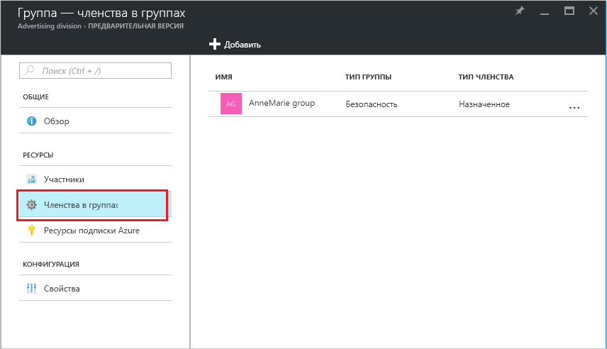

# Практическое руководство. Добавление или удаление группы из другой группы в Azure Active Directory
В этой статье описано, как добавить или удалить группу из другой группы в Azure Active Directory.

>[!Note]
>Если вы пытаетесь удалить родительскую группу, см. раздел [Как обновить или удалить группу и ее участников](active-directory-groups-delete-group.md).

## Добавление группы в другую группу
Существующую группу безопасности можно добавить в другую существующую группу безопасности (вложение группы). Для этого нужно создать группу-участник (подгруппу) и родительскую группу. Группа-участник наследует атрибуты и свойства родительской группы, позволяя сэкономить время на настройке.

>[!Important]
>Сейчас не поддерживается:<ul><li>добавление групп безопасности в группы Office 365;</li><li>добавление групп Office 365 в группы безопасности или другие группы Office 365;</li><li>назначение приложений вложенным группам;</li><li>применение лицензий ко вложенным группам.</li></ul>

### Добавление группы в качестве элемента другой группы

1. Войдите на [портал Azure](https://portal.azure.com) с учетной записью глобального администратора каталога.

2. Выберите **Azure Active Directory**, а затем щелкните **Группы**.

3. На странице **Группы — Все группы** найдите и выберите группу, которая будет участником другой группы. В этом упражнении мы используем группу **Политика управления мобильными устройствами — Запад**.

    >[!Note]
    >Одним действием группу можно добавить только в одну группу. Кроме того, в поле **Выбрать группу** можно ввести часть имени пользователя или устройства, чтобы отфильтровать по нему список отображенных элементов. Подстановочные знаки не поддерживаются.

    

4. На странице **Политика управления мобильными устройствами — Запад — Членства в группах** выберите **Членства в группах**, нажмите **Добавить**, найдите группу, участником которой будет ваша группа, а затем нажмите  **Выбрать**. В этом упражнении мы используем группу **Политика управления мобильными устройствами — Все организации**.

    Теперь группа **Политика управления мобильными устройствами — Запад** является участником группы **Политика управления мобильными устройствами — Все организации** и наследует все ее свойства и настройки.

    

5. Перейдите на страницу **Политика управления мобильными устройствами — Запад — Членства в группах**, чтобы просмотреть связи между группой и участниками.

    

6. Чтобы подробнее изучить связь между группой и участником, выберите имя группы (**Политика управления мобильными устройствами — Все организации**) и просмотрите страницу **Политика управления мобильными устройствами — Запад**.

    

## Удаление группы из другой группы
Существующую группу безопасности можно удалить из другой группы безопасности. При удалении группы также удаляются все унаследованные атрибуты и свойства ее участников.

### Удаление группы из другой группы
1. На странице **Группы — Все группы** найдите и выберите группу, которую требуется удалить из участников. В этом упражнении мы снова используем группу **Политика управления мобильными устройствами — Запад**.

2. На странице обзора группы **Политика управления мобильными устройствами — Запад** выберите **Членства в группах**.

    

3. Выберите группу **Политика управления мобильными устройствами — Все организации** на странице **Политика управления мобильными устройствами — Запад — Членства в группах**, а затем выберите **Удалить** на странице деталей **Политика управления мобильными устройствами — Запад**.

    

## Дополнительная информация
В следующих статьях содержатся дополнительные сведения об Azure Active Directory.

- [Просмотр групп и участников](active-directory-groups-view-azure-portal.md)

- [Создание простой группы и добавление участников](active-directory-groups-create-azure-portal.md)

- [Добавление или удаление участников из группы](active-directory-groups-members-azure-portal.md)

- [Изменение параметров группы](active-directory-groups-settings-azure-portal.md)

- [Использование группы для управления доступом к приложениям SaaS](../users-groups-roles/groups-saasapps.md)

- [Сценарии, ограничения и известные проблемы при использовании групп для управления лицензированием в Azure Active Directory](../users-groups-roles/licensing-group-advanced.md#limitations-and-known-issues)
