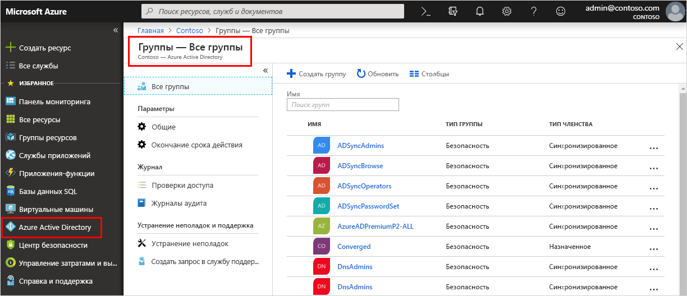

<!--As a brand-new Azure AD administrator, I need to view my organization’s groups along with the assigned members, so I can manage permissions to apps and services for people in my organization-->

# Краткое руководство. Просмотр групп и членов вашей организации в Azure Active Directory
Вы можете просмотреть существующие в вашей организации группы и членов этих групп с помощью портала Azure. Группы используются для управления пользователями (членами), которым нужны одинаковые уровни доступа и разрешения в приложениях и службах с ограниченным доступом.

В этом кратком руководстве вы просмотрите все существующие в организации группы и назначенных членов.

Если у вас еще нет подписки Azure, [создайте бесплатную учетную запись Azure](https://azure.microsoft.com/free/), прежде чем начинать работу. 

## Предварительные требования
Для этого потребуются следующие компоненты.

- Создайте клиента Azure Active Directory. Дополнительные сведения см. в статье [Quickstart: Access Azure Active Directory to create a new tenant](active-directory-access-create-new-tenant.md) (Краткое руководство. Использование Azure Active Directory для создания нового клиента).

## Вход на портал Azure
Для входа на [портал Azure](https://portal.azure.com/) используйте учетную запись глобального администратора вашего каталога.

## Создание группы 
Создайте новую группу с именем _MDM policy - West_. Дополнительные сведения о создании группы см. в статье [Создание группы и добавление в нее пользователей в Azure Active Directory](active-directory-groups-create-azure-portal.md).

1. Выберите **Azure Active Directory**, затем **Группы** и щелкните **Новая группа**.

2. Заполните страницу **Группа**:
    
    - **Тип группы.** Выберите **Безопасность**.
    
    - **Имя группы.** Введите _MDM policy - West_.
    
    - **Тип членства.** Выберите **Назначенный**.

3. Нажмите кнопку **Создать**.

## Создание пользователя
Создайте нового пользователя с именем _Alain Charon_. В качестве члена группы можно добавить только существующих пользователей. Дополнительные сведения о создании пользователей см. в [этой статье](add-users-azure-active-directory.md).

1. Выберите **Azure Active Directory**, затем **Пользователи** и щелкните **Новый пользователь**.

2. Заполните данные на странице **Пользователь**.

    - **Имя.** Введите _Alain Charon_.

    - **Имя пользователя.** Введите *alain\@contoso.com*.

3. Скопируйте автоматически созданный пароль, который подставляется в поле **Пароль**, а затем щелкните **Создать**.

## Добавление члена группы
Теперь у вас есть группа и пользователь для нее. Добавьте _Alain Charon_ в число членов группы _MDM policy - West_. Дополнительные сведения о добавлении членов группы, см. в статье [Управление участниками групп в клиенте Azure Active Directory](active-directory-groups-members-azure-portal.md).

1. Выберите **Azure Active Directory** > **Группы**.

2. На странице **Группы — Все группы** найдите и выберите группу **MDM policy - West**.

3. На странице **Обзор MDM policy - West** выберите **Члены** из области **Управление**.

4. Выберите **Добавление членов**, а затем найдите и выберите **Alain Charon**.

5. Щелкните **Выбрать**.

## Просмотр всех групп
Все группы своей организации можно просмотреть на странице **Группы — Все группы** портала Azure.

- Выберите **Azure Active Directory** > **Группы**.

    Откроется страница **Группы — Все группы** со списком активных групп.

    

## Поиск группы
На странице **Группы — Все группы** найдите группу **MDM policy - West**.

1. На странице **Группы — Все группы** введите строку _MDM_ в поле **Поиск**.

    Под полем **Поиск** отобразятся найденные результаты, включая группу _MDM policy - West_.

    

3. Выберите группу **MDM policy - West**.

4. Просмотрите сведения о группе на странице **Обзор MDM policy - West**, в том числе проверьте число членов этой группы.

    

## Просмотр членов группы
Итак, вы нашли нужную группу и можете просмотреть назначенных в нее членов.

- Выберите **Члены** в области **Управление** и просмотрите полный список членов, назначенных этой группе, включая _Alain Charon_.

    

## Очистка ресурсов
Эта группа используется в нескольких руководствах, которые собраны в разделе документации **Практические руководства**. Но если вы не намерены ее использовать, удалите ее вместе с назначенными членами с помощью следующей процедуры.

1. На странице **Группы — Все группы** найдите группу **MDM policy - West**.

2.  Выберите группу **MDM policy - West**.

    Откроется страница **Обзор MDM policy - West**.

3. Нажмите кнопку **Удалить**.

    Это действие удаляет группы и всех связанных с ней членов.

    

    >[!Important]
    >Но удаляется не сам пользователь Ален Charon, а его членство в удаленной группе.

## Дополнительная информация
Перейдите к следующей статье, которая описывает процесс привязки подписки к каталогу Azure AD.

> [!div class="nextstepaction"]
> [Привязка подписки Azure](active-directory-how-subscriptions-associated-directory.md)
