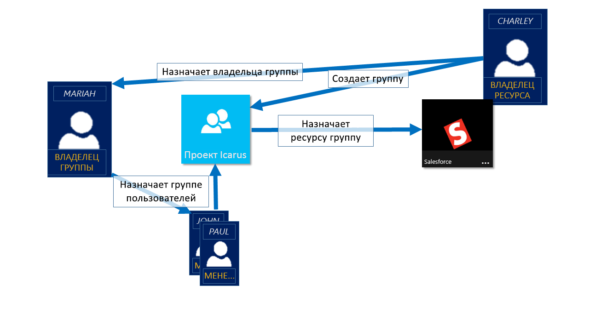
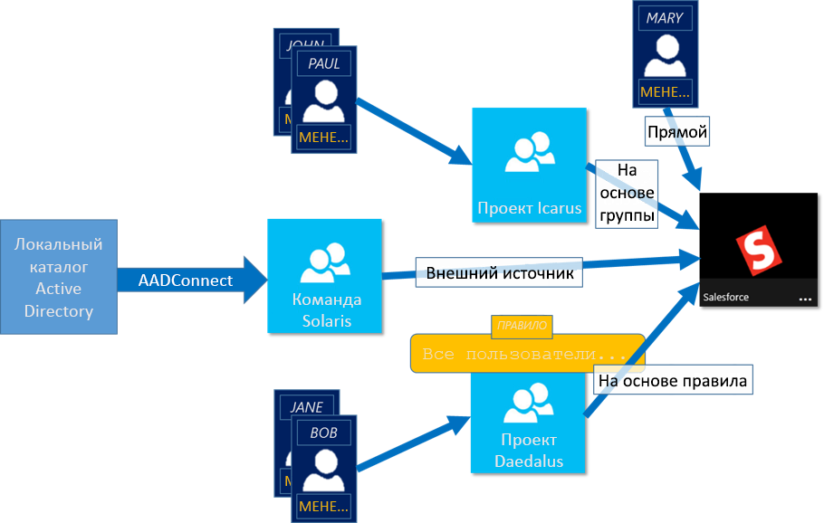

# Управление доступом к приложениям и ресурсам с помощью групп Azure Active Directory
Azure Active Directory (Azure AD) помогает управлять облачными приложениями, локальными приложениями и ресурсами с помощью корпоративных групп. Ваши ресурсы могут как относиться к каталогу, например разрешения на управление объектами с помощью ролей в каталоге, так и не относиться, например приложения SaaS, службы Azure, сайты SharePoint и локальные ресурсы.

>[!NOTE]
>Чтобы использовать Azure Active Directory, необходима учетная запись Azure. Если у вас нет учетной записи, вы можете [зарегистрироваться для получения бесплатной учетной записи Azure](https://azure.microsoft.com/free/).

## Как работает управление доступом в Azure AD?
Azure AD позволяет предоставлять доступ к корпоративным ресурсам, предоставляя права доступа одному пользователю или группе Azure AD. Используя группы, владелец ресурса (или владелец каталога Azure AD) может назначить набор разрешений на доступ всем членам группы, а не предоставлять права по-отдельности. Владелец ресурса или каталога может также предоставить права на управление списком членов кому-либо другому, например руководителю отдела или администратору службы технической поддержки, позволяя этому лицу добавлять и удалять участников по мере необходимости. См. дополнительные сведения о том, как [управлять владельцами групп](active-directory-accessmanagement-managing-group-owners.md).

## Способы назначения прав доступа
Существует четыре способа назначить пользователям права доступа к ресурсу:

- **Прямое назначение.** Владелец ресурса непосредственно назначает пользователя ресурсу.

- **Назначение группы.** Владелец ресурса назначает ресурсу группу Azure AD, которая автоматически предоставляет всем своим членам доступ к этому ресурсу. Членством в группе управляют как владелец группы, так и владелец ресурса, что позволяет каждому из них добавлять и удалять членов группы. Дополнительные сведения о добавлении и удалении членства в группе см. в разделе [Практическое руководство. Добавление или удаление группы из другой группы в Azure Active Directory](active-directory-groups-membership-azure-portal.md). 

- **Назначение на основе правил.** Владелец ресурса создает группу и с помощью правила определяет, какие пользователи назначены определенному ресурсу. Правило основывается на атрибутах, назначенных отдельным пользователям. Владелец ресурса управляет правилом, определяя, какие атрибуты и значения необходимы для предоставления доступа к ресурсу. Дополнительные сведения см. в руководстве по [созданию динамической группы и проверке состояния](../users-groups-roles/groups-create-rule.md).

    Вы также можете посмотреть этот короткий видеоролик с описанием создания и использования динамических групп:

    >[!VIDEO https://channel9.msdn.com/Series/Azure-Active-Directory-Videos-Demos/Azure-AD--Introduction-to-Dynamic-Memberships-for-Groups/player]

- **Назначение внешним источником.** Доступ предоставляется внешним источником, таким как локальный каталог или приложение SaaS. В этой ситуации владелец ресурса назначает группу для предоставления доступа к ресурсу, а членами группы управляет внешний источник.

   

## Могут ли пользователи присоединяться к группам без назначения?
Владелец группы может разрешить пользователям самим находить группы для присоединения, а не назначать их. Также владелец может настроить для группы автоматически включать всех пользователей, которые присоединяются или запрашивают утверждение.

Когда пользователь захочет присоединиться к группе, запрос будет перенаправлен владельцу группы. Если это необходимо, владелец может утвердить запрос, и пользователь будет уведомлен о членстве в группе. Но если при наличии нескольких владельцев один из них отклонит запрос, пользователь будет уведомлен, но не добавлен в группу. См. дополнительные сведения в руководстве по [настройке Azure AD для самостоятельного изменения членства в группах пользователями](../users-groups-roles/groups-self-service-management.md).

## Дополнительная информация
Теперь, когда вы ознакомились с управлением доступом с помощью групп, можно начать управление собственными ресурсами и приложениями.

- [Создание группы с помощью Azure Active Directory](active-directory-groups-create-azure-portal.md) или [Создание группы и управление ею с помощью командлетов PowerShell](../users-groups-roles/groups-settings-v2-cmdlets.md)

- [Использование групп для назначения доступа к интегрированному приложению SaaS](../users-groups-roles/groups-saasapps.md)

- [Синхронизация локальной группы с Azure с помощью Azure AD Connect](../hybrid/whatis-hybrid-identity.md)
