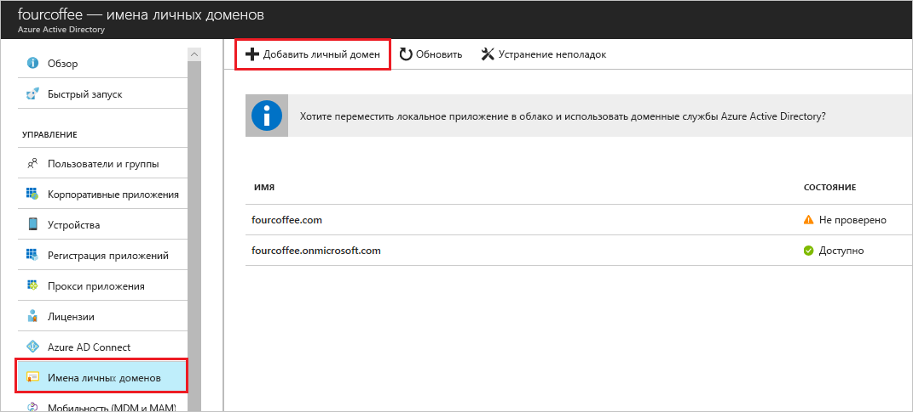

# Практическое руководство. Добавление имени личного домена с помощью портала Azure Active Directory
Каждый новый клиент Azure AD получает исходное доменное имя в формате *имя_домена*.onmicrosoft.com. Вы не можете изменить или удалить исходное доменное имя, но можете добавить дополнительные имена, принадлежащие вашей организации. Добавив имена личных доменов, вы сможете создать привычные для пользователей имена пользователей, например *alain@contoso.com*.

## Перед началом работы
Прежде чем добавлять имя личного домена, его нужно создать с помощью регистратора доменных имен. Аккредитованные регистраторы перечислены [на этой странице](https://www.icann.org/registrar-reports/accredited-list.html).

## Создание каталога в AAD
Получив имя домена, создайте первый каталог AAD.

1. Войдите на [портал Azure](https://portal.azure.com/) для нужного каталога с учетной записью **владельца** подписки, а затем выберите **Azure Active Directory**. Дополнительные сведения о ролях в подписке см. в статье [Роли классического администратора подписки, роли RBAC Azure и роли администратора Azure AD](../../role-based-access-control/rbac-and-directory-admin-roles.md#azure-rbac-roles).

    

    >[!TIP]
    > Если вы планируете создать федерацию локальной среды Windows Server AD с Azure AD, при запуске средства Azure AD Connect для синхронизации каталогов необходимо установить флажок **Я планирую настроить этот домен для единого входа с использованием локального каталога Active Directory**. Необходимо также зарегистрировать то же имя домена, выбранное для федерации с локальным каталогом на шаге **Домен Azure AD** мастера. Узнать, как выглядит этот шаг в мастере, можно [здесь](../hybrid/how-to-connect-install-custom.md#verify-the-azure-ad-domain-selected-for-federation). Если у вас нет средства Azure AD Connect, вы можете [скачать его здесь](http://go.microsoft.com/fwlink/?LinkId=615771).

2. Создайте новый каталог, выполнив действия из [этого раздела](active-directory-access-create-new-tenant.md#create-a-new-tenant-for-your-organization).

    >[!Important]
    >Создатель клиента автоматически становится глобальным администратором для этого клиента. Глобальный администратор может добавить дополнительных администраторов для клиента.

## Добавление имени личного домена в Azure Active Directory
После создания каталога вы можете добавить в него имя личного домена.

1. Выберите **Имена личных доменов** и щелкните **Добавить личный домен**.

    

2. Введите новое значение в поле **имени личного домена** (например, _contoso.com_), а затем щелкните **Добавить домен**.

    Добавится непроверенный домен и откроется страница **Contoso** с данными DNS.

    >[!Important]
    >Чтобы все работало правильно, добавьте .com, .net или другое расширение верхнего уровня.

    

4. Скопируйте сведения DNS со страницы **Contoso**. Например, MS=ms64983159.

    

## Настройка сведений о DNS в системе регистратора доменных имен
После добавления имени личного домена в Azure AD вам следует вернуться на сайт регистратора домена и настроить сведения о DNS, которые вы скопировали из AAD в TXT-файл. Запись типа TXT создается для домена, чтобы подтвердить права владения доменным именем.

-  Вернитесь на сайт регистратора домена, создайте для домена новую запись типа TXT на основе скопированных данных DNS, установите срок жизни (**TTL**) длительностью 60 минут и сохраните изменения.

    >[!Important]
    >Вы можете зарегистрировать любое количество доменных имен. Но для каждого домена AAD создает собственную запись типа TXT. Соблюдайте осторожность при вводе данных файл TXT на сайте регистратора домена. Если вы случайно введете или скопируете неправильную информацию, перед попыткой исправить ее вам придется подождать, пока истечет указанное время ожидания (60 минут).

## Проверка имени личного домена
После регистрации имени личного домена необходимо убедиться, что оно является допустимым в AAD. Распространение данных от регистратора доменных имен до AAD может пройти мгновенно или занять несколько дней. Период зависит от регистратора домена.

### Проверка имени личного домена
1. Войдите на [портал Azure](https://portal.azure.com/) с учетной записью глобального администратора каталога.

2. Выберите **Azure Active Directory** и щелкните **Имена личных доменов**.

3. На странице **имен личных доменов Fabrikam** выберите имя личного домена **Contoso**.

    

4. На странице **Contoso** выберите действие **Проверить** и убедитесь, что личный домен правильно зарегистрирован и является допустимым для AAD.

    

## Распространенные проблемы при проверке
- Если Azure AD не сможет подтвердить имя личного домена, воспользуйтесь приведенными ниже рекомендациями.
    - **Подождите не менее часа и повторите попытку**. Azure AD сможет проверить домен только после распространения DNS-записей, а этот процесс может занять час или даже больше.

    - **Проверьте правильность записи DNS.** Вернитесь на сайт регистратора доменного имени и убедитесь, что нужная запись существует и содержит правильные сведения о DNS, предоставленные в AAD.

    Если вы не можете обновить запись на сайте регистратора, предоставьте эту запись тому, кто имеет нужные разрешения для ее добавления. Убедитесь, что данные внесены правильно.

- **Убедитесь, что введенное доменное имя не используется в другом каталоге.** Доменное имя может успешно пройти проверку только в одном каталоге. Это означает, что вы не сможете повторно использовать имя, уже проверенное для другого каталога. Чтобы устранить эту проблему дублирования, удалите доменное имя из старого каталога. Дополнительные сведения об удалении доменных имен см. в статье об [управлении именами личных доменов](../users-groups-roles/domains-manage.md).

- **Убедитесь, что у вас нет неуправляемых клиентов Power BI.** Если пользователи активировали Power BI через функцию самостоятельной регистрации и создали неуправляемый клиент для организации, необходимо взять на себя управление в качестве внутреннего или внешнего администратора с помощью PowerShell. Дополнительные сведения о том, как взять под контроль неуправляемый каталог, см. в статье [Смена неуправляемого каталога от имени администратора в Azure Active Directory](../users-groups-roles/domains-admin-takeover.md).

## Дополнительная информация

- Добавьте в каталог еще одного глобального администратора. Дополнительные сведения см. в статье [Назначение пользователю ролей администратора в Azure Active Directory](active-directory-users-assign-role-azure-portal.md).

- Добавьте пользователей в домен, как описано в статье [Краткое руководство по добавлению новых пользователей в Azure Active Directory](add-users-azure-active-directory.md).

- Измените информацию о доменном имени в Azure AD. Дополнительные сведения см. в статье [Управление личными доменными именами в Azure Active Directory](../users-groups-roles/domains-manage.md).

- Если у вас есть локальные версии Windows Server и вы хотите использовать их вместе с Azure Active Directory, изучите статью об [интеграции локальных каталогов с Azure Active Directory](../connect/active-directory-aadconnect.md).
