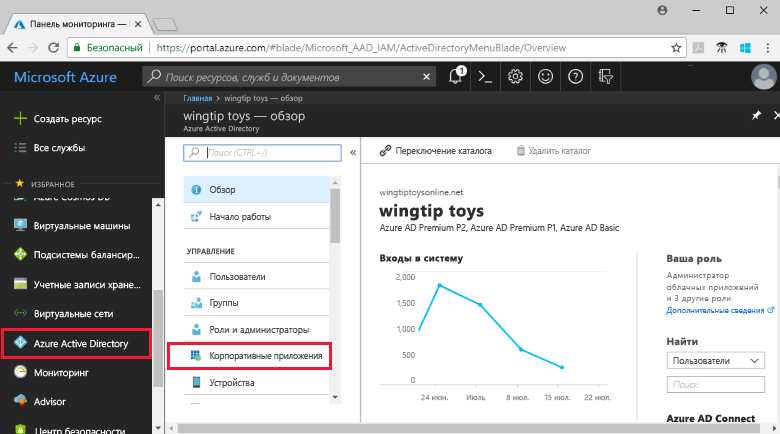
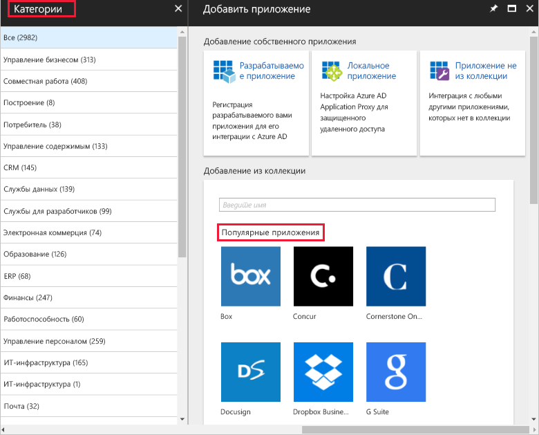
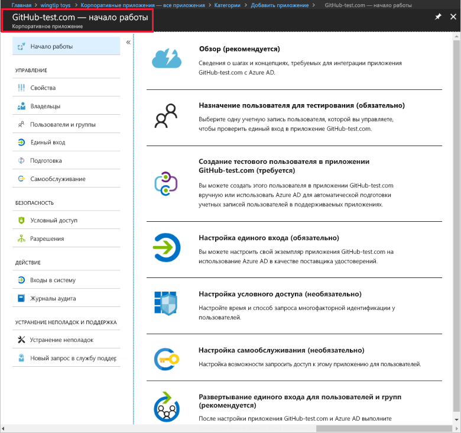
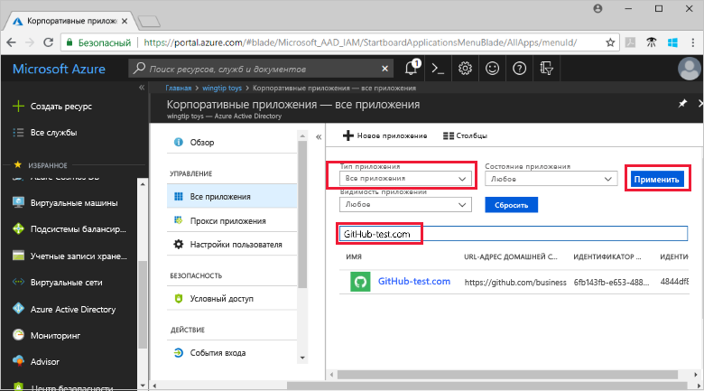
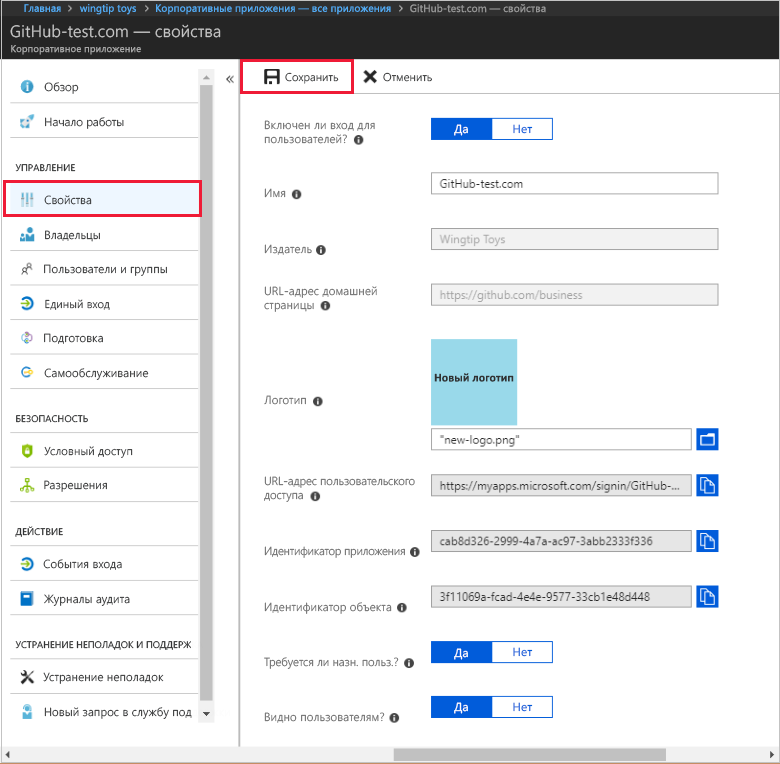
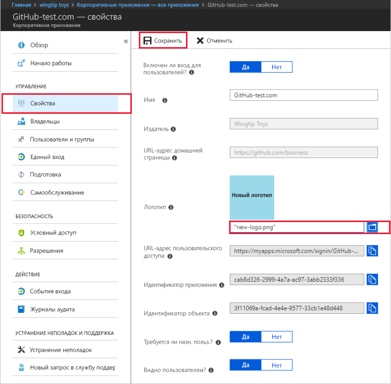

# Краткое руководство. Добавление приложения в клиент Azure Active Directory

Azure Active Directory (Azure AD) имеет галерею, содержащую тысячи предварительно интегрированных приложений. Некоторые приложения, которые используются вашей организацией, вероятно, находятся в коллекции. В этом кратком руководстве используется портал Azure для добавления приложения коллекции в клиент Azure Active Directory (Azure AD).

После добавления приложения в клиент Azure AD вы получите следующие возможности.

- Управлять доступом пользователей к приложению с помощью политики условного доступа.
- Настраивать единый вход в приложение для пользователей со своими учетными записями Azure AD.

## Перед началом работы

Чтобы добавить приложение в клиент, потребуется:

- подписка Azure AD;
- подписка с поддержкой единого входа для приложения.

Войдите на [портал Azure](https://portal.azure.com) в клиент Azure AD в качестве глобального администратора, администратора облачных приложений или администратора приложения.

Рекомендуется использовать нерабочую среду для проверки шагов в этом учебнике. Если у вас нет нерабочей среды Azure AD, можно [получить пробную версию на один месяц](https://azure.microsoft.com/pricing/free-trial/).

## Добавление приложения в клиент Azure AD

Чтобы добавить приложение коллекции в клиент Azure AD, выполните следующие действия.

1. На [портале Azure](https://portal.azure.com) в области навигации слева щелкните **Azure Active Directory**.

2. В колонке **Azure Active Directory** нажмите **Корпоративные приложения**.

    

3. Откроется колонка **Все приложения** для отображения случайной выборки из приложений в клиенте Azure AD.

    

4. В верхней части колонки **Все приложения** щелкните **Новое приложение**.

    

5. Чтобы просмотреть список приложений в галерее, проще всего использовать **Категории**, так как значки в разделе **Избранные приложения** представляют собой случайную выборку приложений галереи.

    

    Для просмотра других приложений щелкните **Показать больше**. Не рекомендуется выполнять поиск таким образом, так как в коллекции существуют тысячи приложений.

6. Для выполнения поиска приложения в разделе **Добавить из коллекции** введите имя приложения, которое необходимо добавить. Выберите приложение из результатов поиска и щелкните **Добавить**. В следующем примере показана форма **Добавить приложение**, которая появляется в результате поиска GitHub.com.

    

6. В форме конкретного приложения можно изменить сведения о свойстве. Например, можно изменить имя приложения в соответствии с потребностями организации. В этом примере используется имя **GitHub-test**.

8. Когда закончите вносить изменения в свойства, щелкните **Добавить**.

9. На странице "Начало работы" отображаются параметры для настройки приложения организации.

    

Приложение добавлено. Вы можете сделать перерыв. В следующих разделах показано, как изменить логотип и другие свойства приложения.

## Поиск клиента приложения Azure AD

Предположим, вам пришлось уйти, и теперь вы возвращаетесь, чтобы продолжить настройку своего приложения. Сначала нужно найти это приложение.

1. На **[портале Azure](https://portal.azure.com)** в области навигации слева щелкните **Azure Active Directory**.

2. В колонке Azure Active Directory нажмите **Корпоративные приложения**.

3. В раскрывающемся меню **Тип приложения** выберите **Все приложения** и нажмите **Применить**. Дополнительные сведения о параметрах просмотра см. в разделе [Просмотр всех корпоративных приложений, которыми вы можете управлять в Azure Active Directory](view-applications-portal.md).

4. Теперь видно список всех приложений в клиенте Azure AD. Список представляет собой случайную выборку. Чтобы просмотреть дополнительные приложения, нажмите один или несколько раз **Показать больше**.

5. Чтобы быстро найти приложение в клиенте, в поле поиска введите имя приложения и нажмите **Применить**. Этот пример находит тестовое приложение GitHub, которое было добавлено ранее.

    

## Настройка свойства входа пользователя

Теперь, когда приложение найдено, можно открыть и настроить его свойства.

Чтобы изменить свойства приложения, выполните следующие действия.

1. Щелкните приложение, чтобы открыть его.
2. Щелкните **Свойства**, чтобы открыть колонку "Свойства" для редактирования.

    

3. Выделите минуту времени, чтобы разобраться в параметрах входа. Комбинация параметров **Включено для входа пользователей**, **Требуется назначение пользователей** и **Видимый пользователю** определяет, могут ли назначенные или не назначенные пользователи выполнять вход в приложение. Они также определяют, может ли пользователь видеть приложение на панели доступа.

    - Параметр **Включено для входа пользователя** определяет, могут ли пользователи, назначенные приложению, выполнять вход в приложение.
    - Параметр **Требуется назначение пользователей** определяет, могут ли пользователи, не назначенные приложению, выполнять вход.
    - Параметр **Видимый пользователю** определяет, могут ли пользователи, назначенные приложению, видеть его на панели доступа и в средстве запуска O365.

4. Используйте следующие таблицы, которые помогут выбрать параметры, которые лучше всего подходят для ваших потребностей.

    - Поведение **назначенных** пользователей.

        | Параметры свойств приложения | | | Взаимодействие с назначенным пользователем | |
        |---|---|---|---|---|
        | Включено для входа пользователей? | Требуется назначение пользователя? | Видимый для пользователей? | Могут ли назначенные пользователи войти? | Могут ли назначенные пользователи видеть приложение?* |
        | Да | Да | Да | Да | Да  |
        | Да | Да | Нет  | Да | Нет   |
        | Да | Нет  | Да | Да | Да  |
        | Да | Нет  | Нет  | Да | Нет   |
        | Нет  | Да | Да | Нет  | Нет   |
        | Нет  | Да | Нет  | Нет  | Нет   |
        | Нет  | Нет  | Да | Нет  | Нет   |
        | Нет  | Нет  | Нет  | Нет  | Нет   |

    - Поведение **неназначенных** пользователей.

        | Параметры свойств приложения | | | Взаимодействие с неназначенным пользователем | |
        |---|---|---|---|---|
        | Включено для входа пользователей? | Требуется назначение пользователя? | Видимый для пользователей? | Могут ли неназначенные пользователи войти? | Могут ли неназначенные пользователи видеть приложение?* |
        | Да | Да | Да | Нет  | Нет   |
        | Да | Да | Нет  | Нет  | Нет   |
        | Да | Нет  | Да | Да | Нет   |
        | Да | Нет  | Нет  | Да | Нет   |
        | Нет  | Да | Да | Нет  | Нет   |
        | Нет  | Да | Нет  | Нет  | Нет   |
        | Нет  | Нет  | Да | Нет  | Нет   |
        | Нет  | Нет  | Нет  | Нет  | Нет   |

    * Может ли пользователь видеть приложение на панели доступа и средство запуска приложений Office 365?

## Использование пользовательского логотипа

Чтобы использовать пользовательский логотип, выполните следующие действия.

1. Создайте логотип размером 215 на 215 пикселей и сохраните его в формате PNG.
2. Поскольку приложение уже найдено, щелкните его.
2. В левой колонке щелкните **Свойства**.
4. Загрузите логотип.
5. Закончив, щелкните **Сохранить**.

    

## Дополнительная информация

Из этого краткого руководства вы узнали, как добавить приложение коллекции в клиент Azure AD. А также, как изменить свойства приложения.

Теперь все готово для настройки единого входа.

> [!div class="nextstepaction"]
> [Настройка единого входа](configure-single-sign-on-portal.md)

