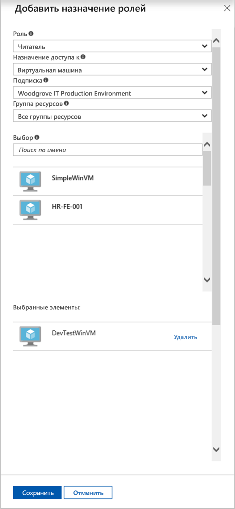

# <a name="use-a-windows-vm-system-assigned-managed-identity-to-access-resource-manager"></a>Использование назначаемого системой управляемого удостоверения на виртуальной машине Windows для доступа к Resource Manager

[!INCLUDE [preview-notice](../../../includes/active-directory-msi-preview-notice.md)]

В этом кратком руководстве показано, как получить доступ к API Azure Resource Manager с помощью виртуальной машины Windows с включенным управляемым удостоверением, назначаемым системой. Управляемыми удостоверениями для ресурсов Azure автоматически управляет Azure. Они позволяют проходить проверку подлинности в службах, поддерживающих аутентификацию Azure Active Directory, без указания учетных данных в коде. Вы узнаете, как выполнять следующие задачи:

> [!div class="checklist"] 
> * Предоставление виртуальной машине доступа к группе ресурсов в Azure Resource Manager 
> * Получение маркера доступа с помощью удостоверения виртуальной машины и вызов Azure Resource Manager с его помощью.

## <a name="prerequisites"></a>Предварительные требования

[!INCLUDE [msi-tut-prereqs](../../../includes/active-directory-msi-tut-prereqs.md)]

## <a name="grant-your-vm-access-to-a-resource-group-in-resource-manager"></a>Предоставление виртуальной машине доступа к группе ресурсов в Resource Manager
С помощью управляемых удостоверений для ресурсов Azure код может получить маркеры доступа, чтобы пройти проверку подлинности и получить доступ к ресурсам, поддерживающим аутентификацию Azure AD.  Azure Resource Manager поддерживает аутентификацию Azure AD.  Сначала нам необходимо предоставить этому назначаемому системой удостоверению виртуальной машины доступ к ресурсу в Resource Manager, в этом случае — к группе ресурсов, в которой находится виртуальная машина.  

1.  Перейдите на вкладку **Группы ресурсов**. 
2.  Выберите определенную **группу ресурсов**, созданную ранее для **виртуальной машины Windows**. 
3.  Перейдите к элементу **Управление доступом (IAM)** на панели слева. 
4.  Щелкните **Добавить**, чтобы добавить новое назначение роли **виртуальной машине Windows**.  В поле **Роль** выберите **Читатель**. 
5.  В раскрывающемся списке далее в поле **Назначение доступа к** выберите ресурс **Виртуальная машина**. 
6.  Проверьте, чтобы в раскрывающемся списке **Подписка** была выбрана нужная подписка. В поле **Группа ресурсов** выберите **Все группы ресурсов**. 
7.  И наконец, в поле **Выбрать** выберите свою виртуальную машину Windows в раскрывающемся списке, а затем нажмите кнопку **Сохранить**.

    

## <a name="get-an-access-token-using-the-vms-system-assigned-managed-identity-and-use-it-to-call-azure-resource-manager"></a>Получение маркера доступа с использованием назначаемого системой управляемого удостоверения виртуальной машины и вызов Azure Resource Manager с помощью этого маркера 

На этом этапе понадобится использовать **PowerShell**.  Если среда **PowerShell** не установлена, загрузите ее [отсюда](https://docs.microsoft.com/powershell/azure/overview?view=azurermps-4.3.1). 

1.  На портале перейдите к разделу **Виртуальные машины**, выберите свою виртуальную машину Windows и в разделе **Обзор** щелкните **Подключить**. 
2.  Введите **имя пользователя** и **пароль**, добавленные при создании виртуальной машины Windows. 
3.  Теперь, когда создано **подключение к удаленному рабочему столу** с виртуальной машиной, откройте **PowerShell** в удаленном сеансе. 
4.  С помощью командлета PowerShell Invoke-WebRequest выполните запрос к локальной конечной точке управляемых удостоверений для ресурсов Azure, чтобы получить маркер доступа к Azure Resource Manager.

    ```powershell
       $response = Invoke-WebRequest -Uri 'http://169.254.169.254/metadata/identity/oauth2/token?api-version=2018-02-01&resource=https%3A%2F%2Fmanagement.azure.com%2F' -Method GET -Headers @{Metadata="true"}
    ```
    
    > [!NOTE]
    > Значение параметра resource должно точно совпадать со значением, которое будет использоваться в Azure AD. Если используется идентификатор ресурса Resource Manager, добавьте косую черту после универсального кода ресурса (URI).
    
    Затем извлеките полный ответ, который хранится в виде форматированной строки JSON в объекте $response. 
    
    ```powershell
    $content = $response.Content | ConvertFrom-Json
    ```
    Затем извлеките маркер доступа из ответа.
    
    ```powershell
    $ArmToken = $content.access_token
    ```
    
    Теперь вызовите Azure Resource Manager с использованием маркера доступа. В этом примере мы также используем команду Invoke-WebRequest PowerShell для вызова Azure Resource Manager и включаем маркер доступа в заголовок авторизации.
    
    ```powershell
    (Invoke-WebRequest -Uri https://management.azure.com/subscriptions/<SUBSCRIPTION ID>/resourceGroups/<RESOURCE GROUP>?api-version=2016-06-01 -Method GET -ContentType "application/json" -Headers @{ Authorization ="Bearer $ArmToken"}).content
    ```
    > [!NOTE] 
    > URL-адрес чувствителен к регистру, поэтому должен использоваться тот же регистр, который использовался, когда вы присваивали имя группе ресурсов. Проверьте, чтобы в resourceGroups обязательно использовался символ "G" (прописная буква).
        
    Следующая команда возвращает сведения о группе ресурсов:

    ```powershell
    {"id":"/subscriptions/98f51385-2edc-4b79-bed9-7718de4cb861/resourceGroups/DevTest","name":"DevTest","location":"westus","properties":{"provisioningState":"Succeeded"}}
    ```

## <a name="next-steps"></a>Дополнительная информация

Из этого краткого руководства вы узнали, как использовать назначаемое системой управляемое удостоверение для доступа к API Azure Resource Manager.  Сведения об Azure Resource Manager см. здесь:

> [!div class="nextstepaction"]
>[Azure Resource Manager](/azure/azure-resource-manager/resource-group-overview)

