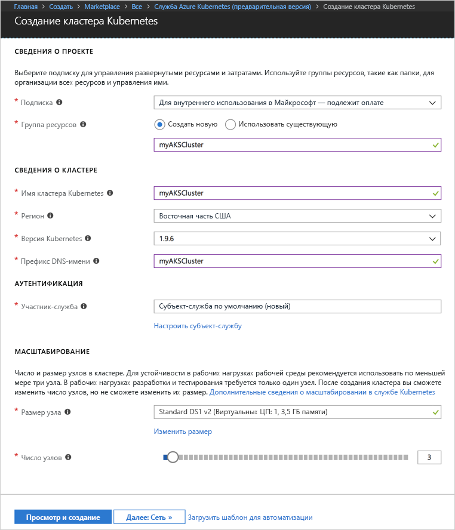
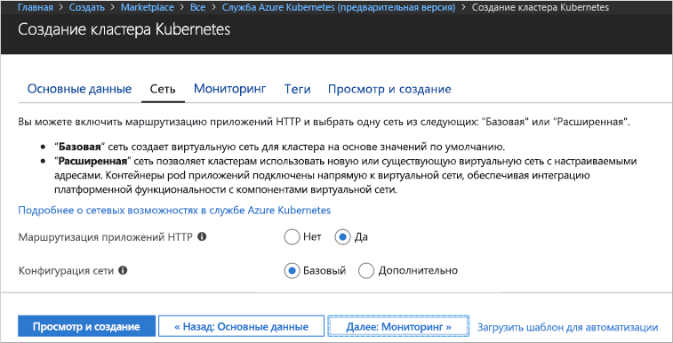
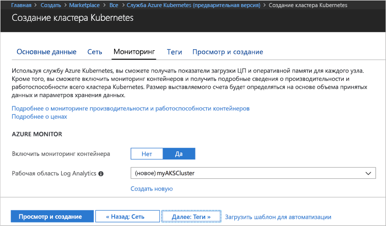
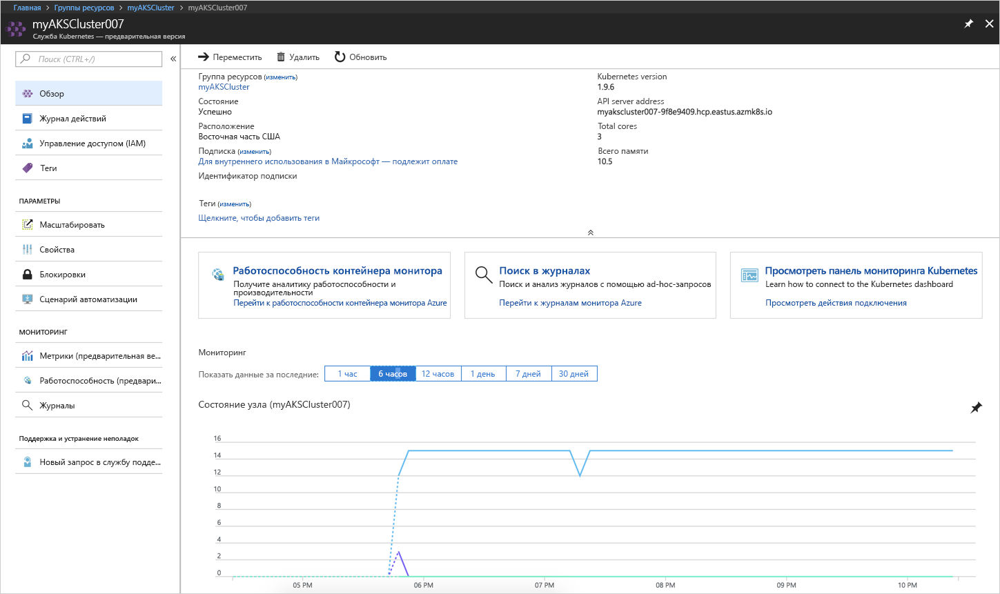
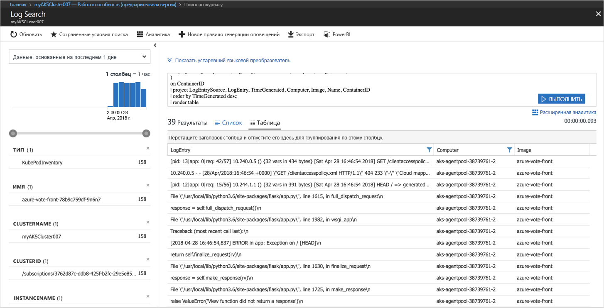

# <a name="quickstart-deploy-an-azure-kubernetes-service-aks-cluster"></a>Краткое руководство по развертыванию кластера службы Azure Kubernetes (AKS)

В этом кратком руководстве вы развернете кластер AKS с помощью портала Azure. Затем в кластере будет запущено многоконтейнерное приложение, состоящее из веб-интерфейса и экземпляра Redis. По завершении приложение будет доступно через Интернет.


В этом руководстве предполагается, что у вас есть некоторое представление о функциях Kubernetes. Дополнительные сведения см. в [документации по Kubernetes][kubernetes-documentation].

## <a name="sign-in-to-azure"></a>Вход в Azure

Войдите на портал Azure по адресу http://portal.azure.com.

## <a name="create-aks-cluster"></a>Создание кластера AKS

Последовательно выберите **Создать ресурс** > **Служба Kubernetes**.

Выполните приведенные ниже действия под каждым заголовком в форме создания кластера AKS.

- **PROJECT DETAILS** (Сведения о проекте): выберите подписку Azure и создайте новую или выберите существующую группу ресурсов Azure.
- **CLUSTER DETAILS** (Сведения о кластере): введите имя, регион, версию и префикс DNS-имени для кластера AKS.
- **AUTHENTICATION** (Аутентификация): создайте новый или используйте существующий субъект-службу. При использовании существующего имени субъекта-службы необходимо указать для него идентификатор клиента и секрет.
- **SCALE** (Масштаб): выберите размер виртуальной машины для узлов AKS. Размер виртуальной машины **невозможно** изменить после развертывания кластера с AKS. Кроме того, выберите количество узлов для развертывания в кластере. Количество узлов **можно** изменить после развертывания кластера.

По завершении выберите **Next: Networking** (Далее: сети).



Настройте следующие параметры сети.

- **Http application routing** (Маршрутизация HTTP для приложений): позволяет настроить интегрированный контроллер входящего трафика для автоматического создания общих DNS-имен. Дополнительные сведения о маршрутизации HTTP приведены в разделе [HTTP application routing][http-routing] (Маршрутизация HTTP для приложений).
- **Network configuration** (Конфигурация сети): выберите базовую конфигурацию сети с использованием подключаемого модуля Kubernetes [kubenet][kubenet] или расширенную конфигурацию сети с использованием [Azure CNI][azure-cni]. Дополнительные сведения о параметрах сети см. в разделе [Network configuration in Azure Kubernetes Service (AKS)][aks-network] (Конфигурация сети в службе Azure Kubernetes (AKS)).

По завершении выберите **Next: Monitoring** (Далее: мониторинг).



При развертывании кластера AKS службу аналитики для контейнеров Azure можно настроить для отслеживания работоспособности кластера AKS и модулей pod, работающих в кластере. Дополнительные сведения о мониторинге работоспособности контейнеров см. в разделе [Мониторинг работоспособности службы Azure Kubernetes (AKS) (предварительная версия)][aks-monitor].

Выберите **Yes** (Да), чтобы включить мониторинг контейнеров, и выберите существующую рабочую область Log Analytics или создайте новую.

Выберите **Review + create** (Проверить и создать), а по завершении щелкните **Create** (Создать).



После короткого ожидания кластер AKS будет развернут и готов к использованию. Перейдите в группу ресурсов кластера AKS, выберите ресурс AKS, и вы увидите панель мониторинга кластера AKS.



## <a name="connect-to-the-cluster"></a>Подключение к кластеру

Управлять кластером Kubernetes можно при помощи [kubectl][kubectl], клиента командной строки Kubernetes. Клиент kubectl предварительно установлен в Azure Cloud Shell.

Откройте Cloud Shell с помощью кнопки в правом верхнем углу портала Azure.


Выполните команду [az acs kubernetes get-credentials][az-aks-get-credentials], чтобы настроить подключение kubectl к кластеру Kubernetes.

Скопируйте следующий код и вставьте его в Cloud Shell. Если нужно, измените в нем имя группы ресурсов и имя кластера.

```azurecli-interactive
az aks get-credentials --resource-group myAKSCluster --name myAKSCluster
```

Проверьте подключение к кластеру, выполнив команду [kubectl get][kubectl-get], чтобы просмотреть список узлов кластера.

```azurecli-interactive
kubectl get nodes
```

Выходные данные:

```
NAME                       STATUS    ROLES     AGE       VERSION
aks-agentpool-11482510-0   Ready     agent     9m        v1.9.6
aks-agentpool-11482510-1   Ready     agent     8m        v1.9.6
aks-agentpool-11482510-2   Ready     agent     9m        v1.9.6
```

## <a name="run-the-application"></a>Выполнение приложения

Файл манифеста Kubernetes определяет требуемое состояние для кластера, включая образы контейнеров, которые нужно запустить. В этом примере манифест используется для создания всех объектов, необходимых для запуска приложения Azure для голосования. Сюда входят два [развертывания Kubernetes][kubernetes-deployment]. Одно используется для внешнего интерфейса приложения Azure Vote, а другой — для экземпляра Redis. Кроме того, создаются две [службы Kubernetes][kubernetes-service], внутренняя и внешняя. Внутренняя служба используется для экземпляра Redis, а внешняя — для доступа к приложению Azure для голосования из Интернета.

Создайте файл с именем `azure-vote.yaml` и скопируйте в него следующий код YAML. Если вы работаете в Azure Cloud Shell, создайте этот файл с помощью Vi или Nano, как в обычной виртуальной или физической системе.

```yaml
apiVersion: apps/v1beta1
kind: Deployment
metadata:
  name: azure-vote-back
spec:
  replicas: 1
  template:
    metadata:
      labels:
        app: azure-vote-back
    spec:
      containers:
      - name: azure-vote-back
        image: redis
        ports:
        - containerPort: 6379
          name: redis
---
apiVersion: v1
kind: Service
metadata:
  name: azure-vote-back
spec:
  ports:
  - port: 6379
  selector:
    app: azure-vote-back
---
apiVersion: apps/v1beta1
kind: Deployment
metadata:
  name: azure-vote-front
spec:
  replicas: 1
  template:
    metadata:
      labels:
        app: azure-vote-front
    spec:
      containers:
      - name: azure-vote-front
        image: microsoft/azure-vote-front:v1
        ports:
        - containerPort: 80
        env:
        - name: REDIS
          value: "azure-vote-back"
---
apiVersion: v1
kind: Service
metadata:
  name: azure-vote-front
spec:
  type: LoadBalancer
  ports:
  - port: 80
  selector:
    app: azure-vote-front
```

Запустите приложение с помощью команды [kubectl apply][kubectl-apply].

```azurecli-interactive
kubectl apply -f azure-vote.yaml
```

Выходные данные:

```
deployment "azure-vote-back" created
service "azure-vote-back" created
deployment "azure-vote-front" created
service "azure-vote-front" created
```

## <a name="test-the-application"></a>Тестирование приложения

При запуске приложения создается [служба Kubernetes][kubernetes-service], которая предоставляет это приложение в Интернете. Процесс создания может занять несколько минут.

Чтобы отслеживать ход выполнения, используйте команду [kubectl get service][kubectl-get] с аргументом `--watch`.

```azurecli-interactive
kubectl get service azure-vote-front --watch
```

Изначально для параметра *EXTERNAL-IP* службы *azure-vote-front* отображается значение *pending* (ожидание).

```
NAME               TYPE           CLUSTER-IP   EXTERNAL-IP   PORT(S)        AGE
azure-vote-front   LoadBalancer   10.0.37.27   <pending>     80:30572/TCP   6s
```

Как только *ВНЕШНИЙ IP-АДРЕС* изменится с состояния *ожидания* на *IP-адрес*, используйте команду `CTRL-C`, чтобы остановить процесс отслеживания kubectl.

```
azure-vote-front   LoadBalancer   10.0.37.27   52.179.23.131   80:30572/TCP   2m
```

Теперь перейдите по внешнему IP-адресу в приложение Azure для голосования.


## <a name="monitor-health-and-logs"></a>Мониторинг работоспособности и журналов

Если был включен мониторинг службы аналитики для контейнеров, то метрики работоспособности для кластера AKS и работающих в нем модулей pod будут доступны на панели мониторинга кластера AKS. Дополнительные сведения о мониторинге работоспособности контейнеров см. в разделе [Мониторинг работоспособности службы Azure Kubernetes (AKS) (предварительная версия)][aks-monitor].

Чтобы просмотреть текущее состояние, время бесперебойной работы и данные об использовании ресурсов для модулей pod Azure Vote, вернитесь к ресурсу AKS, выберите **Monitor Container Health** (Мониторинг работоспособности контейнеров), выберите пространство имен **default** и щелкните **Контейнеры**. Он может потребоваться несколько минут, чтобы эти данные отобразились на портале Azure.


Чтобы просмотреть журналы для pod `azure-vote-front`, щелкните ссылку **Просмотреть журналы**. Эти журналы содержат потоки stdout и stderr из контейнера.



## <a name="delete-cluster"></a>Удаление кластера

Если кластер больше не нужен, просто удалите кластерный ресурс. После этого будут удалены все связанные ресурсы. Для этого на портале Azure можно нажать кнопку "Удалить" на панели мониторинга AKS. Можно также выполнить команду [az group delete][az-aks-delete] в Cloud Shell.

```azurecli-interactive
az aks delete --resource-group myAKSCluster --name myAKSCluster --no-wait
```

## <a name="get-the-code"></a>Получение кода

В этом кратком руководстве для развертывания Kubernetes используются предварительно созданные образы контейнеров. Связанный с приложением код, файл Dockerfile и файл манифеста Kubernetes доступны на сайте GitHub.

[https://github.com/Azure-Samples/azure-voting-app-redis][azure-vote-app]

## <a name="next-steps"></a>Дальнейшие действия

С помощью этого краткого руководства мы развернули кластер Kubernetes, а затем развернули в нем многоконтейнерное приложение.

Дополнительные сведения о AKS и инструкции по созданию полного кода для примера развертывания см. в руководстве по кластерам Kubernetes.

> [!div class="nextstepaction"]
> [Руководство по AKS][aks-tutorial]

<!-- LINKS - external -->
[azure-vote-app]: https://github.com/Azure-Samples/azure-voting-app-redis.git
[azure-cni]: https://github.com/Azure/azure-container-networking/blob/master/docs/cni.md
[kubectl]: https://kubernetes.io/docs/user-guide/kubectl/
[kubectl-apply]: https://kubernetes.io/docs/reference/generated/kubectl/kubectl-commands#apply
[kubectl-get]: https://kubernetes.io/docs/reference/generated/kubectl/kubectl-commands#get
[kubenet]: https://kubernetes.io/docs/concepts/cluster-administration/network-plugins/#kubenet
[kubernetes-deployment]: https://kubernetes.io/docs/concepts/workloads/controllers/deployment/
[kubernetes-documentation]: https://kubernetes.io/docs/home/
[kubernetes-service]: https://kubernetes.io/docs/concepts/services-networking/service/

<!-- LINKS - internal -->
[az-aks-get-credentials]: /cli/azure/aks?view=azure-cli-latest#az_aks_get_credentials
[az-aks-delete]: /cli/azure/aks#az-aks-delete
[aks-monitor]: ../monitoring/monitoring-container-health.md
[aks-network]: ./networking-overview.md
[aks-tutorial]: ./tutorial-kubernetes-prepare-app.md
[http-routing]: ./http-application-routing.md
