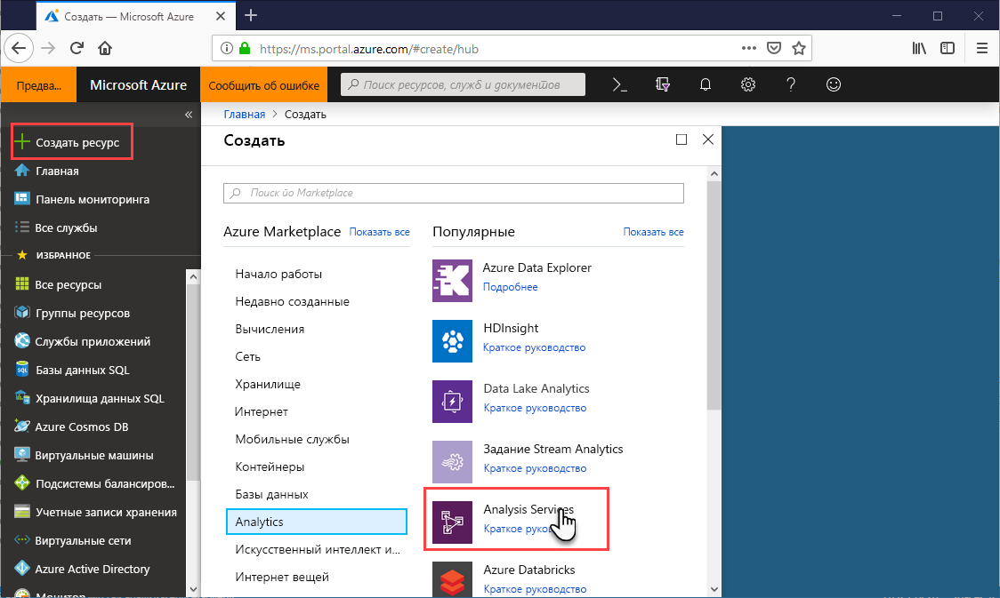

# Создание сервера Analysis Services на портале Azure
В этой статье приведено пошаговое руководство по созданию ресурса сервера служб Analysis Services в подписке Azure.

Для этого потребуются следующие компоненты. 

* **Подписка Azure**: откройте ссылку на [бесплатную пробную версию Azure](https://azure.microsoft.com/offers/ms-azr-0044p/), чтобы создать учетную запись.
* **Azure Active Directory**: ваша подписка должна быть связана с клиентом Azure Active Directory. И необходимо войти в Azure с учетной записью в этом Azure Active Directory. Дополнительные сведения см. в руководстве по [аутентификации и настройке пользовательских разрешений](analysis-services-manage-users.md).

## Войдите на портал Azure. 

Войдите на [портал Azure](https://portal.azure.com)

## Создание сервера

1. Выберите **Создать ресурс** > **Данные и аналитика** > **Службы Analysis Services**.

    

2. В колонке **Службы Analysis Services** заполните обязательные поля и нажмите кнопку **Создать**.
   
    
   
   * **Имя сервера**: введите уникальное имя, используемое для обращения к серверу.
   * **Подписка**: выберите подписку, с которой будет связан этот сервер.
   * **Группа ресурсов**: создайте новую группу ресурсов или выберите уже имеющуюся. Группы ресурсов предназначены для управления коллекцией ресурсов Azure. Дополнительные сведения см. в описании [групп ресурсов](../azure-resource-manager/resource-group-overview.md).
   * **Расположение**: в этом расположении центра обработки данных Azure размещается сервер. Выберите расположение, ближайшее к крупнейшей имеющейся базе пользователей.
   * **Ценовая категория**: выберите ценовую категорию. Если вы тестируете и собираетесь установить пример шаблона базы данных модели, выберите свободный уровень **D1**. Дополнительные сведения см. в разделе [цен на службы Azure Analysis Services](https://azure.microsoft.com/pricing/details/analysis-services/). 
    * **Администратор**: по умолчанию это будет учетная запись, с которой вы вошли в систему. Вы можете выбрать другую учетную запись в Azure Active Directory.
    * **Настройка резервного хранилища**: необязательно. Если у вас уже есть [учетная запись хранения](../storage/common/storage-introduction.md), вы можете указать ее как резервную копию шаблона базы данных по умолчанию. Вы также можете указать [параметры резервного копирования и восстановления](analysis-services-backup.md) позже.
    * **Истечение срока хранения ключа**: необязательно. Укажите период истечения срока хранения ключа.
3. Нажмите кнопку **Создать**.

Создание обычно занимает менее минуты. Если был выбран параметр **Add to Portal** (Добавить на портал), перейдите на портал, чтобы просмотреть новый сервер. Или перейдите по меню **Все службы** > **Analysis Services**, чтобы проверить, готов ли ваш сервер.

## Очистка ресурсов
Если сервер больше не нужен, удалите его. В разделе **Обзор** вашего сервера нажмите кнопку **Удалить**. 

 

## Дополнительная информация

[Добавьте пример модели данных](analysis-services-create-sample-model.md) на ваш сервер.  
[Установите локальный шлюз данных](analysis-services-gateway-install.md), если ваша модель данных подключается к локальным источникам данных.  
[Разверните проект табличной модели](analysis-services-deploy.md) из Visual Studio.   

