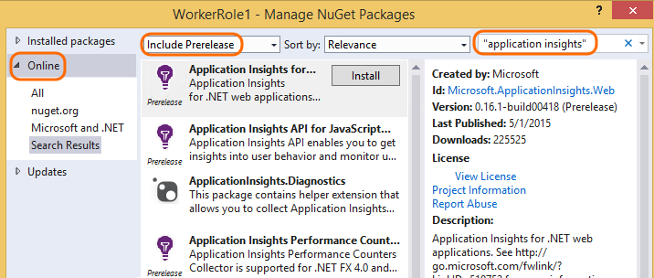

<properties
   pageTitle="Application Insights для облачных служб Azure"
   description="Эффективное отслеживание веб-ролей и рабочих ролей с помощью Application Insights"
   services="application-insights"
   documentationCenter=""
   authors="soubhagyadash"
   manager="victormu"
   editor="alancameronwills"/>

<tags
   ms.service="application-insights"
   ms.devlang="na"
   ms.tgt_pltfrm="ibiza"
   ms.topic="article"
   ms.workload="tbd"
   ms.date="05/21/2015"
   ms.author="sdash"/>

# Application Insights для облачных служб Azure


*Application Insights находится в состоянии предварительной версии*

[Приложения облачных служб Microsoft Azure](http://azure.microsoft.com/services/cloud-services/) можно отслеживать с помощью [Visual Studio Application Insights][start], чтобы оценивать доступность, производительность, характер сбоев и частоту использования.

<!-- For illustration purposes, we have added Application Insights to this [sample Azure cloud service](sample link). This code is available [here](git link), for you to follow along with the steps below. -->

## Создание ресурса Application Insights для каждой роли

Ресурс Application Insights — это место, в котором выполняется отображение и анализ данных телеметрии.

1.  На [портале Azure][portal] создайте новый ресурс Application Insights. Для параметра типа приложения выберите приложение ASP.NET. 

    

2.  Сделайте копию ключа инструментирования Он потребуется позже для настройки пакета SDK.

    


Обычно лучше создавать отдельный ресурс для данных из каждой рабочей роли и веб-роли.

В качестве альтернативы можно отправлять данные из всех ролей только в один ресурс, но задать значение [свойства по умолчанию][apidefaults], чтобы можно было фильтровать или группировать результаты из каждой роли.

## <a name="sdk"></a>Установка пакета SDK в каждый проект


1. В Visual Studio отредактируйте пакеты NuGet вашего проекта классического приложения. 

2. Установите пакет SDK Application Insights для веб-приложений.

    

    (В качестве альтернативы можно выбрать пакет SDK Application Insights для веб-приложений. Это обеспечивает некоторые данные  телеметрии встроенного счетчика производительности. )

3. Настройте пакет SDK для отправки данных в ресурсы Application Insights.

    Откройте `ApplicationInsights.config` и вставьте эту строку:

    `<InstrumentationKey>` *скопированный ключ инструментирования* `</InstrumentationKey>`

    Используйте ключ инструментирования, скопированный из ресурса Application Insights.

    В качестве альтернативы можно [задать ключ во время выполнения][apidynamicikey]. Это позволяет направлять данные телеметрии из разных сред (разработки, тестирования, производства) для различных ресурсов.

## Запуск приложения для Android

Запустите проект в режиме отладки на компьютере разработчика или опубликуйте его в Azure. Используйте его в течение нескольких минут для генерирования некоторых данных телеметрии.

## <a name="monitor"></a> Просмотр своих данных телеметрии

Вернитесь на [портал Azure][portal] и перейдите к своим ресурсам Application Insights.


Выполните поиск данных в диаграммах «Обзор». Сначала вы увидите только одну или две точки. Например:


Щелкните любую диаграмму, чтобы увидеть более подробные метрики. [Дополнительные сведения о метриках.][perf]

Теперь разверните свое приложение и понаблюдайте за тем, как накапливаются данные.


#### Данные отсутствуют?

* Откройте плитку [Поиск][diagnostic], чтобы просмотреть отдельные события.
* Используйте приложение, открывая различные страницы, чтобы создать некоторый объем данных телеметрии.
* Подождите несколько секунд и нажмите «Обновить».
* См. раздел [Устранение неполадок][qna].


## Завершение установки

Для получения полного представления о приложении можно выполнить несколько дополнительных действий.


* [Добавьте пакет SDK JavaScript на веб-страницы][client], которые позволяют получать браузерные данные телеметрии, такие как число просмотров страниц, время загрузки страницы, исключения скриптов, и записывать настраиваемую телеметрию в скрипты страниц.
* Добавьте отслеживание зависимостей для диагностики проблем, связанных с базами данных или другими компонентами, используемыми приложением:
 * [в веб-приложениях или виртуальной машине Azure;][azure]
 * [на локальном сервере IIS.][redfield]
* [Запись трассировки журналов][netlogs] из предпочтительной платформы ведения журналов
* [Отслеживание пользовательских событий и метрик][api] на клиенте, на сервере или с обеих сторон для получения сведений об использовании приложения.
* [Настройте веб-тесты][availability], которые помогут быть уверенными в том, что приложение остается работоспособным и правильно отвечает на запросы.

#### Отслеживание запросов для рабочих ролей

Производительность вызовов для рабочих ролей можно регистрировать, отслеживая их таким же образом, как запросы HTTP. В Application Insights тип телеметрии запроса определяет единицу работы для указанного сервера, которую можно учесть и которая может быть выполнена или не выполнена. Во время автоматической регистрации HTTP-запросов пакетом SDK можно добавить собственный код для отслеживания запросов к рабочим ролям.

Ниже приведен типичный цикл выполнения для рабочей роли.

```C#

    while (true)
    {
      Stopwatch s1 = Stopwatch.StartNew();
      var startTime = DateTimeOffset.UtcNow;
      try
      {
        // ... get and process messages ...

        s1.Stop();
        telemetryClient.TrackRequest("CheckItemsTable",
            startTime, s1.Elapsed, SUCCESS_CODE, true);
      }
      catch (Exception ex)
      {
        string err = ex.Message;
        if (ex.InnerException != null)
        {
           err += " Inner Exception: " + ex.InnerException.Message;
        }
        s1.Stop();
        telemetryClient.TrackRequest("CheckItemsTable", 
            startTime, s1.Elapsed, FAILURE_CODE, false);
        telemetryClient.TrackException(ex);

        // Don't flood if we have a bug in queue process loop.
        System.Threading.Thread.Sleep(60 * 1000);
      }
    }
```


[api]: app-insights-api-custom-events-metrics.md
[apidefaults]: app-insights-api-custom-events-metrics.md#default-properties
[apidynamicikey]: app-insights-api-custom-events-metrics.md#dynamic-ikey
[availability]: app-insights-monitor-web-app-availability.md
[azure]: app-insights-azure.md
[client]: app-insights-javascript.md
[diagnostic]: app-insights-diagnostic-search.md
[netlogs]: app-insights-asp-net-trace-logs.md
[perf]: app-insights-web-monitor-performance.md
[portal]: http://portal.azure.com/
[qna]: app-insights-troubleshoot-faq.md
[redfield]: app-insights-monitor-performance-live-website-now.md
[start]: app-insights-get-started.md

<!---HONumber=58-->