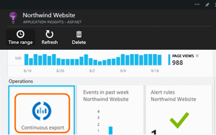
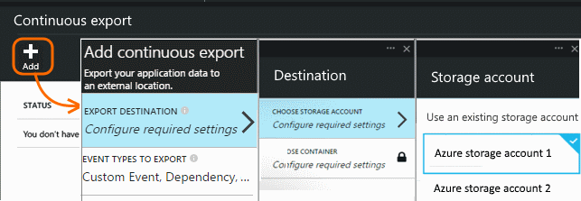
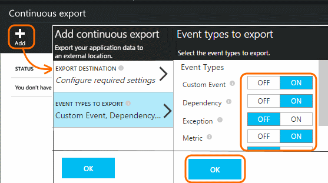
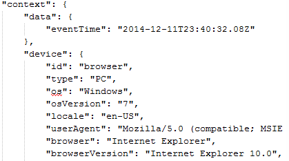
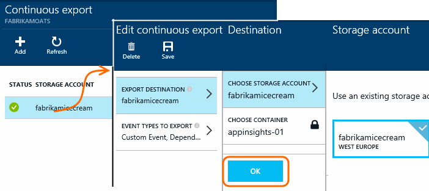

<properties 
	pageTitle="Непрерывный экспорт данных телеметрии из Application Insights" 
	description="Экспортируйте данные диагностики и использования в хранилище в Microsoft Azure и загрузите их оттуда." 
	services="application-insights" 
    documentationCenter=""
	authors="alancameronwills" 
	manager="ronmart"/>

<tags 
	ms.service="application-insights" 
	ms.workload="tbd" 
	ms.tgt_pltfrm="ibiza" 
	ms.devlang="na" 
	ms.topic="article" 
	ms.date="04/27/2015" 
	ms.author="awills"/>
 
# Экспорт данных телеметрии из Application Insights

Требуется специальный анализ данных телеметрии? Или, может быть, хотелось бы получать оповещения по электронной почте о событиях с определенными свойствами? Функция "Непрерывный экспорт" идеально подходит для этого. События, которые отображаются на портале Application Insights, можно экспортировать в хранилище Microsoft Azure в формате JSON. Отсюда можно загрузить данные, а также вы можете написать любой код, необходимый для их обработки.

##  Настройка непрерывного экспорта

В колонке обзора приложения на портале Application Insights откройте раздел непрерывного экспорта:

Добавьте параметры экспорта, а затем выберите [учетную запись хранилища Azure](storage-introduction.md), где требуется разместить данные:

Выберите типы событий, которые требуется экспортировать:

После создания параметров экспорта запускается процедура экспорта. (Вы получите только те данные, которые поступят после создания параметров экспорта.)

Если позднее потребуется изменить типы событий, просто изменить параметры экспорта:

Чтобы остановить поток, нажмите кнопку "Отключить". При повторном нажатии кнопки включения поток будет перезапущен с новыми данными. Пока экспорт был отключен, вы не будете получать данные, которые поступают на портал.

Чтобы остановить поток навсегда, удалите параметры экспорта. Это действие не повлечет удаление данных из хранилища.
#### Не удается добавить или изменить параметры экспорта?

* Чтобы добавить или изменить параметры экспорта, необходимы права доступа владельца, участника или участника Application Insights. [Дополнительные сведения о ролях][roles].

##  Какие события вы получаете?

Экспортированные данные являются необработанными данными телеметрии, которые мы получаем от вашего приложения, за исключением:

* результаты веб-тестов на данный момент не включены; 
* мы добавляем данные о местоположении на основе IP-адреса клиента.  

Вычисляемые метрики не включаются. Например, мы не экспортируем показатель среднего использования ЦП, но мы экспортируем необработанные данные телеметрии, на основе которых можно вычислить это среднее значение.

##  Как вам получить данные?

При открытии хранилища BLOB-объектов с помощью какого-либо инструмента, например [обозревателя серверов](http://msdn.microsoft.com/library/azure/ff683677.aspx), вы увидите контейнер с набором файлов больших двоичных объектов. Код URI для каждого файла имеет вид идентификатор_приложения /тип_телеметрии/дата/время.

Дата и время имеют формат UTC и соответствуют моменту, когда элемент телеметрии был внесен в хранилище (не моменту его создания). Поэтому при написании кода для загрузки данных можно линейно  перемещаться по данным.

Чтобы загрузить эти данные программно, используйте [REST API хранилища BLOB-объектов](storage-dotnet-how-to-use-blobs.md#configure-access) или [командлеты Azure PowerShell](http://msdn.microsoft.com/library/azure/dn806401.aspx).

Или [DataFactory](http://azure.microsoft.com/services/data-factory/), где можно настроить конвейеры для управления данными в масштабе.

Мы начинаем запись нового большого двоичного объекта каждый час (при получении событий). Таким образом, вы должны всегда выполнять обработку за предыдущий час, но ожидать завершения текущего часа.

[Пример кода][exportcode]

##  Как выглядят данные?

* Каждый BLOB-объект является текстовым файлом, который содержит несколько строк, разделенных символом новой строки "\n".
* Каждая строка представляет собой неформатированный JSON-документ. Чтобы просмотреть эти данные, попробуйте средство просмотра, например Notepad++ с подключаемым модулем JSON.

Продолжительность времени измеряется в тактах, где 10 000  тактов составляют 1 мс. Например, следующие значения показывают время 10 мс для отправки запроса из браузера, 30 мс для его получения и 1,8 с для обработки страницы в браузере:

	"sendRequest": {"value": 10000.0},
	"receiveRequest": {"value": 30000.0},
	"clientProcess": {"value": 17970000.0}

## Как обработать данные?

Для небольших объемов данных можно написать код, который будет выделять элементы данных, записывать их в электронную таблицу и т. д. Например:

    private IEnumerable<T> DeserializeMany<T>(string folderName)
    {
      var files = Directory.EnumerateFiles(folderName, "*.blob", SearchOption.AllDirectories);
      foreach (var file in files)
      {
         using (var fileReader = File.OpenText(file))
         {
            string fileContent = fileReader.ReadToEnd();
            IEnumerable<string> entities = fileContent.Split('\n').Where(s => !string.IsNullOrWhiteSpace(s));
            foreach (var entity in entities)
            {
                yield return JsonConvert.DeserializeObject<T>(entity);
            }
         }
      }
    }

Или можно занести информацию в базу данных SQL (см. [пример кода][exportcode]).

Для больших объемов данных рассмотрите возможность использования [HDInsight](http://azure.microsoft.com/services/hdinsight/) — кластеров Hadoop в облаке. HDInsight предоставляет широкий набор технологий для управления и анализа больших объемов данных.

## Удаление старых данных
Обратите внимание на то, что вы несете ответственность за управление емкостью хранилища и удаление при необходимости старых данных.

## При повторном создании ключа хранилища...

Если изменить ключ хранилища, непрерывный экспорт перестанет работать. Вы увидите уведомление в учетной записи Azure.

Откройте колонку непрерывного экспорта и измените параметры экспорта. Измените параметр назначения экспорта, но оставьте выбранным то же самое хранилище. Нажмите кнопку "ОК" для подтверждения.

Непрерывный экспорт будет перезапущен.

## Пример кода

[Перенос экспортированных данных в базу данных SQL][exportcode]

## Вопросы и ответы

* *Все, что мне требуется, — всего лишь однократная загрузка диаграммы.*  
 
    Мы работаем над этим отдельно.

* *Параметры экспорта настроены, но в хранилище нет данных.*

    Получала ли служба Application Insights какие-либо данные телеметрии из вашего приложения с момента настройки параметров экспорта? Вы получите только новые данные.

* *Я попытался настроить параметры экспорта, но было отказано в доступе.*

    Если учетная запись принадлежит организации, необходимо быть членом группы владельцев или участников.

    <!-- Your account has to be either a paid-for account, or in the free trial period. -->

* *Могу ли я экспортировать данные непосредственно в свое локальное хранилище?*

    Нет. Наш механизм экспорта полагается на "широкие врата" при передаче туда данных.

* *Существует ли предел для объема данных, помещаемых в мое хранилище?*

    Нет. Мы будем хранить переданные данные в хранилище, пока вы не удалите данные экспорта. Мы остановим передачу данных, если столкнемся с внешними ограничениями для хранилища больших двоичных объектов, но хранилище очень большое. Вы можете настроить объем используемого хранилища.

* *После повторного создания ключа для моего хранилища или изменения имени контейнера  экспорт больше не работает.*

    Измените параметры экспорта и откройте колонку назначения экспорта. Оставьте выбранным прежнее  хранилище и нажмите кнопку "OK" для подтверждения. Экспорт будет перезапущен. Если это изменение было сделано в течение последних нескольких дней, данные не будут потеряны.

* *Можно ли приостановить экспорт?*

    Да. Нажмите кнопку "Отключить".

<!--Link references-->

[exportcode]: app-insights-code-sample-export-telemetry-sql-database.md
[roles]: app-insights-resources-roles-access-control.md

<!--HONumber=54-->