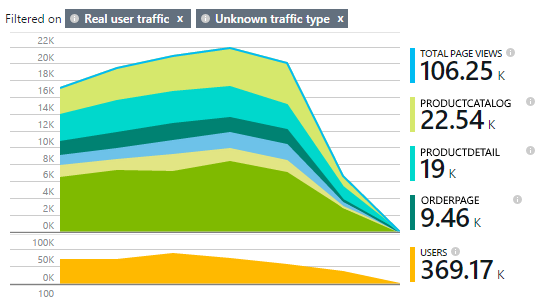
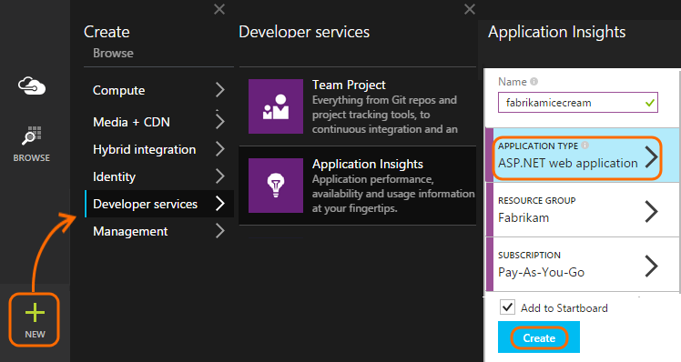
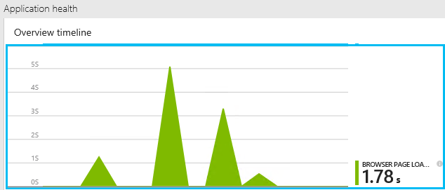
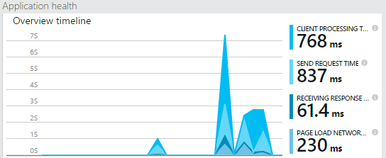
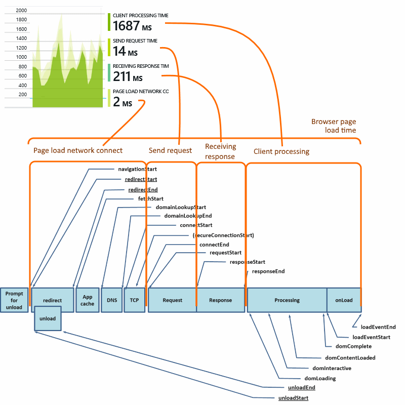
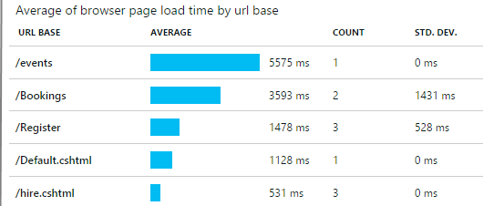
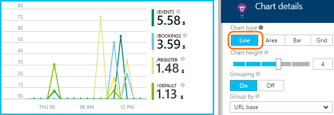
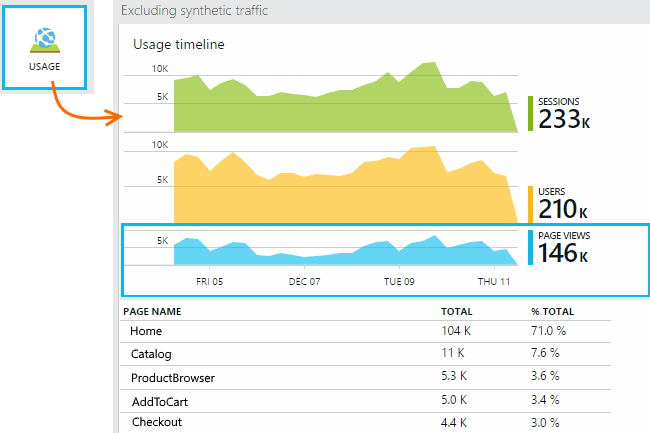
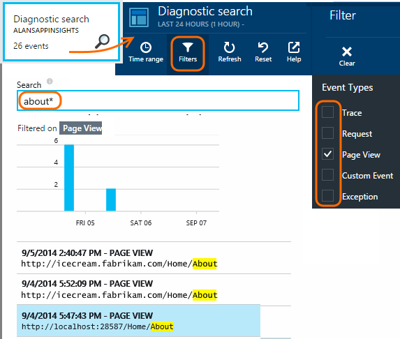

<properties 
	pageTitle="Application Insights для приложений JavaScript и веб-страниц" 
	description="Получайте данные о количестве просмотров страницы и количестве сеансов, данные веб-клиента и отслеживайте закономерности использования. Обнаруживайте исключения и проблемы с производительностью в приложениях JavaScript и на веб-страницах." 
	services="application-insights" 
    documentationCenter=""
	authors="alancameronwills" 
	manager="ronmart"/>

<tags 
	ms.service="application-insights" 
	ms.workload="tbd" 
	ms.tgt_pltfrm="ibiza" 
	ms.devlang="na" 
	ms.topic="article" 
	ms.date="04/26/2015" 
	ms.author="awills"/>
 
# Application Insights для приложений JavaScript и веб-страниц

[AZURE.INCLUDE [app-insights-selector-get-started](../includes/app-insights-selector-get-started.md)]

Узнайте о производительности и использовании своей веб-страницы. Добавьте Visual Studio Application Insights на страницу, и вы узнаете такую информацию, как количество пользователей, как часто они возвращаются на страницу и какие страницы используют чаще всего. Вы также можете получать отчеты о времени загрузки и любых исключениях. Добавляя [пользовательские события и метрики][track], вы сможете детально проанализировать самые популярные функции, распространенные ошибки и настроить свою страницу для успешного использования.

Если телеметрия сервера уже настроена для веб-приложения [ASP.NET][greenbrown] или [Java][java], вы сможете получать данные клиента и сервера. На портале Application Insights будут интегрированы два потока.

## Создание ресурса Application Insights

Ресурс Application Insights — это место, где отображаются данные о производительности и об использовании страницы. (Если вы уже создали ресурс, чтобы собирать данные с веб-сервера, вы можете пропустить этот шаг.)

На [портале Azure](http://portal.azure.com) создайте новый ресурс Application Insights:

*Уже появились вопросы?* [Дополнительная информация о создании ресурса][new].

## Добавление сценария пакета SDK в приложение или на веб-страницу

В разделе «Быстрый запуск» получите сценарий для веб-страниц:

Вставьте сценарий прямо перед тегом &lt;/head&gt; на каждой странице, которую необходимо отслеживать. Если на вашем веб-сайте есть главная страница, можно разместить скрипт на ней. Например:

* В проекте ASP.NET MVC разместите сценарий на странице View\Shared_Layout.cshtml.
* На сайте SharePoint на панели управления откройте [Параметры сайта/Главная страница](app-insights-sharepoint.md).

Сценарий содержит ключ инструментирования, который направляет данные к ресурсу Application Insights.

*(Если вы используете известную платформу веб-страницы, найдите адаптеры Application Insights. Например, [модуль AngularJS](http://ngmodules.org/modules/angular-appinsights).)*

#### Если приложение не является веб-страницей...

Если приложение JavaScript — приложение [Cordova](http://cordova.apache.org/), вставьте дополнительную строку после ключа инструментирования:

    ...{
        instrumentationKey:"00000000-662d-4479-0000-40c89770e67c",
        endpointUrl:"https://dc.services.visualstudio.com/v2/track"
    } ...

Если это [приложение среды выполнения Windows, использующее JavaScript](https://msdn.microsoft.com/library/windows/apps/br211385.aspx), добавьте в проект пакет NuGet *Application Insights для приложений Javascript*. (В обозревателе решений щелкните правой кнопкой мыши свой проект и выберите «Управление пакетами NuGet». Укажите «Включить предварительный выпуск» и найдите Application Insights.)
 
## Запуск приложения

Запустите веб-приложение, используйте его в течение непродолжительного времени для формирования телеметрии и подождите несколько секунд. Приложение можно запустить на компьютере, на котором ведется разработка, нажав клавишу F5, или опубликовать приложение и позволить пользователям его использовать.

Если вам нужно проверить телеметрию, отправляемую веб-приложением в Application Insights, используйте инструменты отладки браузера (во многих браузерах это можно сделать нажатием клавиши F12 ). Данные отправляются по адресу dc.services.visualstudio.com.

## Изучение данных

В верхней части колонки обзора приложения есть диаграмма, на которой показано среднее время загрузки страницы в браузере:

*Еще нет данных? Нажмите кнопку **Обновить** в верхней части страницы. По-прежнему нет данных? См. раздел [Устранение неполадок][qna].*

Щелкните диаграмму, чтобы просмотреть более подробные данные:

Это диаграмма с накоплением, на которой время загрузки страницы разбито на [стандартные отрезки времени, определенные консорциумом W3C](http://www.w3.org/TR/navigation-timing/#processing-model).

Обратите внимание, что значение времени *подключения к сети* обычно меньше ожидаемого, так как это среднее значение по всем запросам из браузера на сервер. Для множества отдельных запросов значение времени подключения — «0» из-за наличия активного подключения к серверу.

### Производительность по страницам

Ниже в колонке подробных данных есть сетка, разбитая по URL-адресам страниц:

Если вам нужно увидеть производительность страниц по времени, дважды щелкните сетку и измените тип диаграммы:

## Обзор использования клиента

В колонке обзора щелкните «Использование»:

* **Пользователи** — количество отдельных пользователей за диапазон времени на диаграмме. (Чтобы определить пользователей, возвращающихся на страницу, используются файлы cookie).
* **Сеансы** — сеанс учитывается, если пользователь не выполнял никаких запросов в течение 30 минут.
* **Количество просмотров страницы** — подсчитывается количество вызовов функции trackPageView(), которая обычно вызывается один раз на каждой веб-странице.

### Щелкните, чтобы увидеть больше данных

Щелкните любую диаграмму, чтобы увидеть более подробные данные. Обратите внимание, что диапазоны времени диаграмм можно менять.

Щелкните диаграмму, чтоб увидеть метрики, которые она может отобразить, либо добавьте новую диаграмму и выберите метрики, которые она отображает.

> [AZURE.NOTE]Метрики могут отображаться только в определенных сочетаниях. При выборе какой-либо метрики все несовместимые метрики будут отключены.

## Настраиваемые счетчики страниц

По умолчанию счетчик страницы увеличивается на единицу каждый раз, когда страница загружается в клиентском браузере. Однако вам может потребоваться подсчитать дополнительные просмотры страницы. Например, если содержимое страницы разбито на вкладки, возможно, вы захотите, чтобы счетчик увеличивался на единицу при каждом переключении между ними. Другой пример — ситуация, когда код JavaScript на странице загружает новое содержимое, но URL-адрес в браузере при этом не меняется.

Вставьте в соответствующем месте клиентского кода вызов JavaScript наподобие следующего:

    appInsights.trackPageView(myPageName);

Имя страницы может содержать те же символы, что и URL-адрес, но все символы после "#" или "?" игнорируются.

## Изучение отдельных событий просмотра страницы

Обычно телеметрия просмотра страниц анализируется службой Application Insights, и вы видите только сводные отчеты со средними значениями для всех пользователей. Однако в целях отладки можно также изучать отдельные события просмотра страниц.

В колонке Diagnostic Search (Поиск данных диагностики) в разделе Filter (Фильтр) установите флажок Page View (Просмотр страниц).

Выберите любое событие, чтобы просмотреть подробные сведения.

> [AZURE.NOTE]Если вы используете [Поиск][diagnostic], обратите внимание, что вы должны сопоставлять слова целиком: «Пр» и «о» не соответствуют «Про», в отличие от «Пр*». Поисковый запрос нельзя начинать с подстановочного знака. Например, по запросу "*нформаци" не будет найдено слово "Информация".

> [Дополнительная информация о поиске диагностических данных][diagnostic]

## Отслеживание использования элементов пользователями

Хотите узнать, что пользователи делают в вашем приложении? Вставив вызовы в коде клиента и сервера, вы можете отправить свою телеметрию в Application Insights. Например, вы можете выяснить, сколько пользователей создали заказы, но не завершили их, какие ошибки проверки возникают наиболее часто или среднее количество очков, набранных пользователями в игре.

[Дополнительная информация о пользовательских событиях и метриках API][track].

## Телеметрия сервера

Вы можете получить дополнительную информацию с сервера и отобразить данные сервера и клиента, если вы еще не сделали этого. Это позволит вам оценить производительность сервера и диагностировать любые проблемы.

* [Добавление Application Insights в приложение ASP.NET][greenbrown]
* [Добавление Application Insights на страницу Java][java]

## Видео «Отслеживание использования»

> [AZURE.VIDEO tracking-usage-with-application-insights]

## Дальнейшие действия

[Отслеживание использования приложения с помощью пользовательских событий и метрик][track]

<!--Link references-->

[diagnostic]: app-insights-diagnostic-search.md
[greenbrown]: app-insights-start-monitoring-app-health-usage.md
[java]: app-insights-java-get-started.md
[new]: app-insights-create-new-resource.md
[qna]: app-insights-troubleshoot-faq.md
[track]: app-insights-custom-events-metrics-api.md

<!---HONumber=58-->