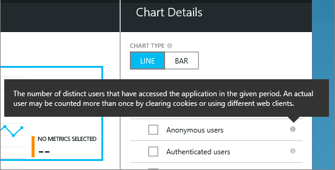

<properties title="Monitor your app's health and usage with Application Insights" pageTitle="Отслеживание работоспособности и использования вашего приложения с помощью Application Insights" description="Приступая к работе с Application Insights. Анализ использования, доступности и производительности локальных приложений или веб-приложений Microsoft Azure." metaKeywords="analytics monitoring application insights" authors="awills"  manager="kamrani" />

<tags ms.service="application-insights" ms.workload="tbd" ms.tgt_pltfrm="ibiza" ms.devlang="na" ms.topic="article" ms.date="2014-09-24" ms.author="awills" />
 
# Отслеживание производительности в веб-приложениях

*Служба Application Insights доступна в предварительной версии.*

Вы можете убедиться, что приложение работает нормально, а также быстро узнать о любых возникших неполадках. [Application Insights][start] сообщает о любых проблемах с производительностью и исключениях, помогая выявлять и диагностировать их причины.

Служба Application Insights может отслеживать веб-приложения ASP.NET, размещенные в локальной среде или на виртуальных машинах, а также веб-сайты Microsoft Azure. 

* [Настройка мониторинга производительности](#setup)
* [Просмотр данных](#view)
* [Что все это значит?](#metrics)
* [Диагностика неполадок](#diagnosis)
* [Дальнейшие действия](#next)

## Настройка мониторинга производительности

Если вы еще не добавили Application Insights в проект (т. е. если в нем нет файла ApplicationInsights.config), вы можете приступить к работе с этой службой одним из следующих способов:

* [добавьте Application Insights в проект приложения в Visual Studio][greenbrown] (рекомендуемый способ) - Кроме пассивного мониторинга производительности, вы можете вести журналы диагностики и отслеживать использование.
* [Отслеживайте производительность работающего веб-сайта][redfield] - для этого не нужно обновлять проект приложения или выполнять повторное развертывание веб-сайта.
* [Для веб-сайтов Microsoft Azure](../insights-how-to-customize-monitoring/)  вы можете просматривать метрики в области "Мониторинг" веб-сайта. 

## Просмотр отчетов

Запустите приложение, нажав клавишу F5, и попробуйте открыть разные страницы.

В Visual Studio вы увидите число полученных событий.

Откройте Application Insights из проекта.

Просматривайте данные на плитках **Работоспособность приложения**. Сначала вы увидите только одну или две точки. Например: 

При работе в режиме отладки телеметрия передается через конвейер, поэтому данные должны появиться в течение нескольких секунд. При развертывании приложения данные собираются медленнее.

Если данные сразу не отображаются, подождите минуту и нажмите Refresh (Обновить).

### Изучение метрик

Чтобы увидеть подробные данные и результаты за более длительный период, щелкните любую из плиток. Например, щелкните плитку "Запросы" и выберите временной диапазон.

Чтобы выбрать метрики для отображения на графике, щелкните его:

> [AZURE.NOTE] **Чтобы увидеть все доступные метрики, **снимите все флажки. Метрики разделены на группы: если выбран один из элементов группы, отображаются только метрики этой группы.

## Что все это значит? Плитки и отчеты о производительности

Вы можете получить самые разнообразные метрики производительности. Начнем с тех, которые отображаются в модуле приложения по умолчанию.

### Requests (Запросы)

Число HTTP-запросов, полученных за заданный период. Сравните это значение с результатами других отчетов, чтобы узнать, как ведет себя приложение при изменении нагрузки.

HTTP-запросы включают в себя все запросы GET и POST для страниц, данных и изображений.

Чтобы просмотреть счетчики для конкретных URL-адресов, щелкните плитку.

### Average response time (Среднее время ответа)

Это время от поступления веб-запроса в приложение до возвращения ответа.

Точками отмечено скользящее среднее. Если запросов много, для некоторых из них значения могут отклоняться от среднего, но при этом на графике не будет явных пиков или падений.

Обращайте внимание на нехарактерные пики. Как правило, время ответа растет с увеличением числа запросов. Если этот рост непропорционален, возможно, приложение исчерпало какой-либо ресурс, например ЦП или емкость используемой службы.

Чтобы просмотреть значения для конкретных URL-адресов, щелкните плитку.

### Slowest requests (Самые медленные запросы)

Показывает, какие запросы могут потребовать оптимизации производительности.

### Failed requests (Неудачные запросы)

Это счетчик запросов, которые вызвали неперехваченные исключения.

Чтобы просмотреть подробные сведения о конкретных сбоях, щелкните плитку. Чтобы просмотреть подробные сведения об отдельном запросе, выберите его. 

Для детального изучения доступна только репрезентативная выборка сбоев.

### Другие метрики

Чтобы увидеть, какие еще метрики доступны, щелкните график и снимите все флажки метрик. Чтобы просмотреть определение конкретной метрики, щелкните значок (i).

При выборе одной из метрик другие, которые невозможно отобразить на той же диаграмме, скрываются.

## Диагностика неполадок

Вот некоторые советы по выявлению и диагностике проблем с производительностью:

* Настройте отправку оповещений для [веб-тестов][availability], когда веб-сайт выходит из строя, отвечает неправильно или медленно. 
* сравните число запросов с другими метриками, чтобы узнать, не связаны ли сбои или медленный ответ с нагрузкой;
* [Вставьте в код инструкции трассировки и выполняйте поиск по ним][diagnostic], чтобы упростить локализацию проблем.

## Дальнейшие действия

[Веб-тесты][availability] - настройте отправку веб-запросов к приложению через равные интервалы из разных точек мира.

[Сбор данных трассировки диагностики и поиск по ним][diagnostic] - добавьте вызовы трассировки и анализируйте результаты для локализации проблем.

[Отслеживание использования][usage] - получайте информацию о том, как люди используют ваше приложение.

[Устранение неполадок][qna] и ответы на часто задаваемые вопросы.

[AZURE.INCLUDE [app-insights-learn-more](../includes/app-insights-learn-more.md)]

