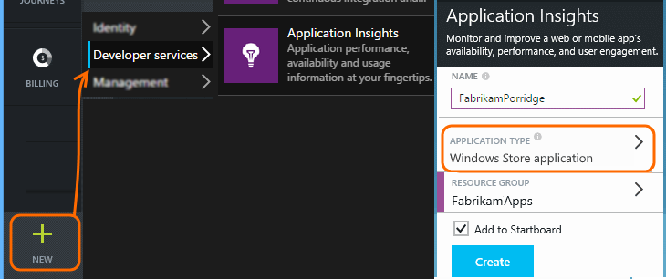

<properties 
	pageTitle="Application Insights для классических приложений Windows" 
	description="Анализ использования и производительности приложения Windows с помощью Application Insights." 
	services="application-insights" 
    documentationCenter="windows"
	authors="alancameronwills" 
	manager="keboyd"/>

<tags 
	ms.service="application-insights" 
	ms.workload="tbd" 
	ms.tgt_pltfrm="ibiza" 
	ms.devlang="na" 
	ms.topic="article" 
	ms.date="04/04/2015" 
	ms.author="awills"/>

# Application Insights в классических приложениях Windows

*Application Insights находится в состоянии предварительной версии.*

[AZURE.INCLUDE [app-insights-selector-get-started](../includes/app-insights-selector-get-started.md)]

С помощью Application Insights можно наблюдать за использованием и производительностью вашего развернутого приложения.

*Хотя можно сделать пакет SDK Application Insights для работы в классическом приложении, в настоящее время этот сценарий не поддерживается. Но если вы захотите поэкспериментировать с ним, здесь приведены некоторые советы для этого.*


## <a name="add"></a> Создание ресурса Application Insights


1.  На [портале Azure][portal] создайте новый ресурс Application Insights. В качестве типа приложения выберите приложение ASP.NET или приложение Магазина Windows. 

    

    \(Выбор типа приложения определяет содержимое колонки «Обзор» и свойства, доступные в [обозревателе метрик][metrics].\)

2.  Сделайте копию ключа инструментирования

    

## <a name="sdk"></a>Установка пакета SDK в приложении


1. В Visual Studio отредактируйте пакеты NuGet вашего проекта классического приложения. 

2. Установите ядро пакета SDK Application Insights.

    

    \(В качестве альтернативы можно выбрать пакет SDK Application Insights для веб-приложений. Это обеспечивает некоторые данные  телеметрии встроенного счетчика производительности. \)

3. Отредактируйте файл ApplicationInsights.config \(который был добавлен установкой NuGet\). Вставьте следующий фрагмент непосредственно перед закрывающим тегом:

    &lt;InstrumentationKey&gt;\*скопированный ключ\*&lt;/InstrumentationKey&gt;

    Тот же самый результат можно получить и с помощью следующего кожа:
    
    `TelemetryConfiguration.Active.InstrumentationKey = "your key";`

4. При установке пакета SDK Web Apps вам может также потребоваться закомментировать  веб-модули телеметрии в ApplicationInsights.config

## <a name="telemetry"></a>Вставка вызовов телеметрии

Создайте экземпляр `TelemetryClient`, а затем [используйте его для отправки телеметрии][track].

Используйте `TelemetryClient.Flush` для отправки сообщений перед закрытием приложения. \(Это не рекомендуется для других типов приложений.\)

Например, в приложении Windows Forms можно написать следующее:

```C#

    public partial class Form1 : Form
    {
        private TelemetryClient tc = new TelemetryClient();
        ...
        private void Form1_Load(object sender, EventArgs e)
        {
            tc.TrackPageView("Form1");
            ...
        }

        protected override void OnClosing(CancelEventArgs e)
        {
            stop = true;
            if (tc != null)
            {
                tc.Flush(); // only for desktop apps
            }
            base.OnClosing(e);
        }

```

Используйте любой из [API Application Insights][track] для отправки телеметрии. В классических приложениях Windows телеметрия не отправляется автоматически. Обычно следует использовать:

* TrackPageView\(pageName\) при переключении форм, страниц или вкладок;
* TrackEvent\(eventName\) для других действий пользователя;
* TrackTrace\(logEvent\) для [ведения журнала диагностики][diagnostic];
* TrackException\(исключение\) в предложениях catch;
* TrackMetric\(имя, значение\) в фоновой задаче для отправки периодических отчетов с метриками, не присоединенными к определенным событиям.

Чтобы просматривать количество пользователей и сеансов, задайте инициализатор контекста:

    class TelemetryInitializer: IContextInitializer
    {
        public void Initialize(TelemetryContext context)
        {
            context.User.Id = Environment.UserName;
            context.Session.Id = DateTime.Now.ToFileTime().ToString();
            context.Session.IsNewSession = true;
        }
    }

    static class Program
    {
        ...
        static void Main()
        {
            TelemetryConfiguration.Active.ContextInitializers.Add(
                new TelemetryInitializer());
            ...


## <a name="run"></a>Запуск проекта

[Запустите приложение с помощью клавиши F5](http://msdn.microsoft.com/library/windows/apps/bg161304.aspx) и используйте его, чтобы создать некоторый объем телеметрии.

В Visual Studio вы увидите число отправленных событий.


## <a name="monitor"></a>Просмотр данных мониторинга

Вернитесь в колонку вашего приложения на портале Azure.

В поиске по журналу диагностики будут отображаться первые события.

Если вам требуется больше данных, нажмите кнопку «Обновить» через несколько секунд.

Если вы использовали TrackMetric параметр measurements в TrackEvent, откройте [обозреватель метрик][metrics] и откройте колонку «Фильтры», где увидите метрики.


## <a name="usage"></a>Дальнейшие действия

[Отслеживание использования приложения][track]

[Ведение журналов диагностики и поиск по ним][diagnostic]

[Устранение неполадок][qna]


<!--Link references-->

[diagnostic]: app-insights-diagnostic-search.md
[metrics]: app-insights-metrics-explorer.md
[portal]: http://portal.azure.com/
[qna]: app-insights-troubleshoot-faq.md
[track]: app-insights-custom-events-metrics-api.md


<!--HONumber=54-->