<properties 
	pageTitle="Защита приложения API Azure" 
	description="Обеспечение защиты приложения API Azure с помощью Visual Studio." 
	services="app-service\api" 
	documentationCenter=".net" 
	authors="tdykstra" 
	manager="wpickett" 
	editor="jimbe"/>

<tags 
	ms.service="app-service-api" 
	ms.workload="web" 
	ms.tgt_pltfrm="dotnet" 
	ms.devlang="na" 
	ms.topic="article" 
	ms.date="03/24/2015" 
	ms.author="tdykstra"/>

# Защита приложения API: добавление проверки подлинности Azure Active Directory или поставщика социальных сетей

## Обзор

В учебнике [Развертывание приложения API](app-service-dotnet-deploy-api-app.md) вы развернули приложение API с уровнем доступности **Доступно всем пользователям**. В этом учебнике показано, как защитить приложение API, чтобы к нему могли получить доступ только пользователи, прошедшие проверку подлинности.

Вы выполните следующие действия.

- Вызов приложения API для проверки его работоспособности.
- Применение правил проверки подлинности к приложению API.
- Повторный вызов приложения API, чтобы убедиться, что оно отклоняет запросы, не прошедшие проверку подлинности.
- Вход в систему настроенного поставщика.
- Повторный вызов приложения API, чтобы убедиться, что доступ с проверкой подлинности работает.

## Предварительные требования

Этот учебник работает с приложением API, созданным на шаге [Создание приложения API](app-service-dotnet-create-api-app.md) и развернутым на шаге [Развертывание приложения API](app-service-dotnet-deploy-api-app.md).

## Использование браузера для вызова приложения API 

Самый простой способ проверки наличия общего доступа к приложению API - вызов его из браузера.

1. В браузере перейдите на [портале Azure].

3. На домашней странице последовательно щелкните пункты **Обзор > Приложения API**, а затем выберите имя приложения API, которое требуется защитить.

	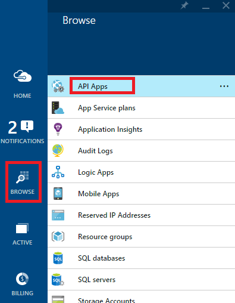

	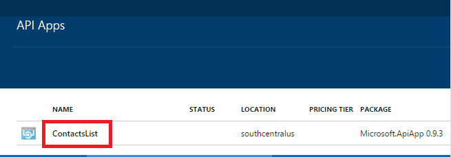

3. В колонке **Приложение API** щелкните **URL-адрес**, чтобы открыть окно браузера, которое вызывает приложение API.

	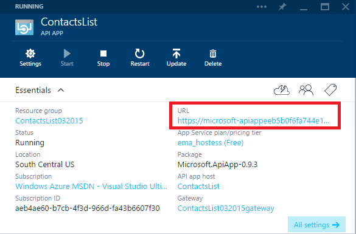

2. Добавьте `/api/contacts/get/` к URL-адресу в адресной строке браузера.

	Например, если URL-адрес приложения API следующий:

    	https://microsoft-apiappeeb5bdsasd744e188be7fa26f239bd4b.azurewebsites.net/

	Полный URL-адрес будет:

    	https://microsoft-apiappeeb5bdsasd744e188be7fa26f239bd4b.azurewebsites.net/api/contacts/get/

	Разные браузеры обрабатывают вызовы API по-разному. На изображении показан успешно выполненный вызов из браузера Chrome.

	

2. Сохраните использованный URL-адрес; он потребуется далее в учебнике.

## Защита приложения API

Приложение API развертывается в группе ресурсов. Вы можете добавлять веб- и другие приложения API в одну группу ресурсов, и каждое приложение API в группе ресурсов может иметь один из трех параметров доступности:
<!--задача: схема, на которой отображаются разные параметры доступности-->

- **Общедоступный (анонимный)** - любой пользователь может вызвать приложение API за пределами группы ресурсов, не выполнив вход.
- **Общедоступный (с проверкой подлинности)** - только пользователи, выполнившие проверку подлинности, могут вызвать приложение API за пределами группы ресурсов.
- **Внутренний** - только другие приложения API или веб-приложения в той же группе ресурсов могут вызвать приложение API.

При создании Visual Studio группы ресурсов также создается *шлюз*.  Шлюз - это специальное веб-приложение, которое обрабатывает все запросы, предназначенные для приложений API в группе ресурсов.

При переходе к колонке группы ресурсов на [портале Azure] вы можете увидеть приложение API и шлюз на схеме.

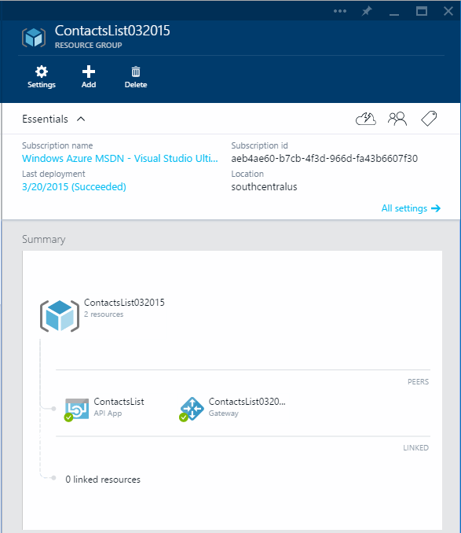

Чтобы настроить в приложении API возможность принимать только запросы, прошедшие проверку подлинности, потребуется задать уровень доступности **Общедоступный (с проверкой подлинности)** и настроить в шлюзе запрос проверки подлинности от поставщика, например Azure Active Directory, Google или Facebook.

1. Вернитесь к колонке **Приложение API** для приложения API, которое требуется защитить.

2. В колонке **Приложение API** щелкните **Параметры**, а затем - **Параметры приложения**.

	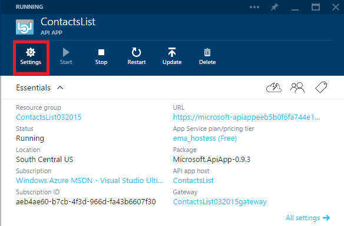

	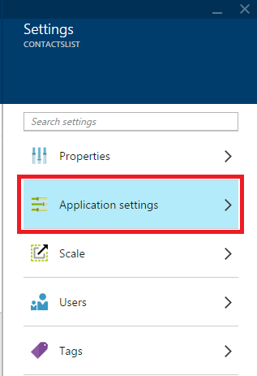

3. В колонке **Параметры приложения** измените **Уровень доступа** на **Общедоступный (с проверкой подлинности)**, а затем нажмите кнопку **Сохранить**.

	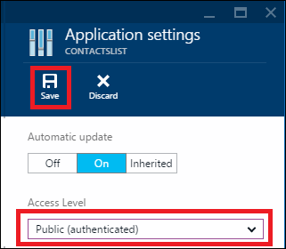

	Теперь вы защитили приложение API от несанкционированного доступа. Далее в шлюзе потребуется указать, какого поставщика проверки подлинности следует использовать.

4. Прокрутите экран влево, к колонке **Приложение API** и щелкните ссылку на шлюз.

	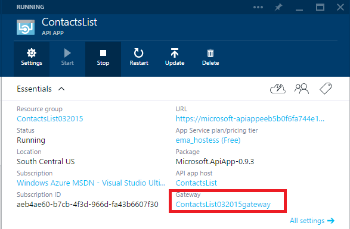

7. В колонке **Шлюз** щелкните **Параметры**, а затем - **Удостоверение**.

	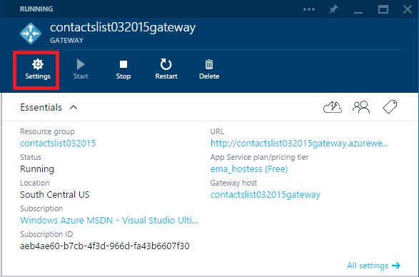

	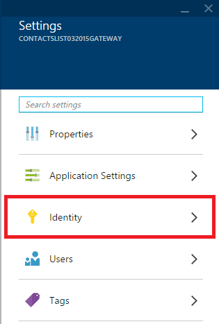

	В колонке **Удостоверение** можно переходить к разным колонкам для настройки проверки подлинности с помощью Azure Active Directory и нескольких других поставщиков.

	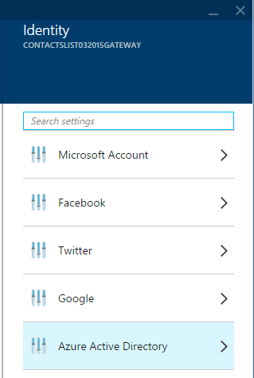
  
3. Выберите поставщика удостоверений, которого следует использовать, и выполните шаги в соответствующей статье, чтобы настроить приложение API с помощью того же поставщика. Эти статьи были написаны для мобильных приложений, но действия не отличаются от действий для приложений API. В некоторых случаях требуется использовать [старый портал]. 

 - [Учетная запись Майкрософт](app-service-mobile-how-to-configure-microsoft-authentication-preview.md)
 - [Имя для входа Facebook](app-service-mobile-how-to-configure-facebook-authentication-preview.md)
 - [Имя для входа Twitter](app-service-mobile-how-to-configure-twitter-authentication-preview.md)
 - [Имя для входа Google](app-service-mobile-how-to-configure-google-authentication-preview.md)
 - [Azure Active Directory](app-service-mobile-how-to-configure-active-directory-authentication-preview.md)

Например, на следующих снимках экрана показано, что должно отображаться на страницах [старого портала] и в колонках [портале Azure] после настройки проверки подлинности Azure Active Directory.

На портале Azure в колонке **Azure Active Directory** содержится поле **Идентификатор клиента** приложения, созданного на вкладке "Azure Active Directory" старого портала, и поле **Разрешенные клиенты** Azure Active Directory (например, "contoso.onmicrosoft.com").

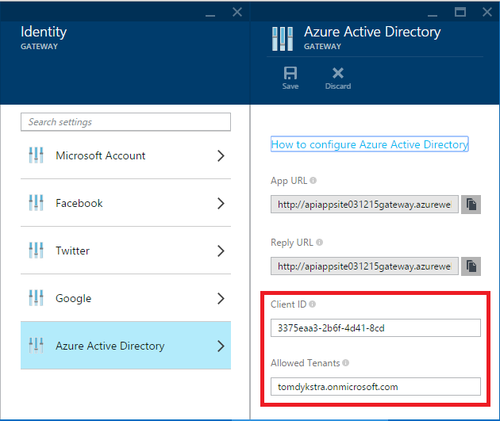

На старом портале на вкладке **Настройка** приложения, созданного на вкладке **Azure Active Directory**, содержатся поля **URL-адрес единого входа**, **URI идентификатора приложения** и **URL-адрес ответа** из колонки **Azure Active Directory** на портале Azure.

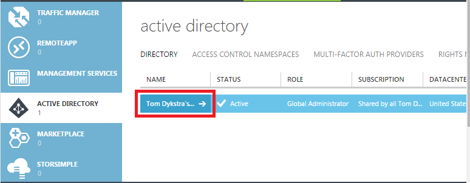

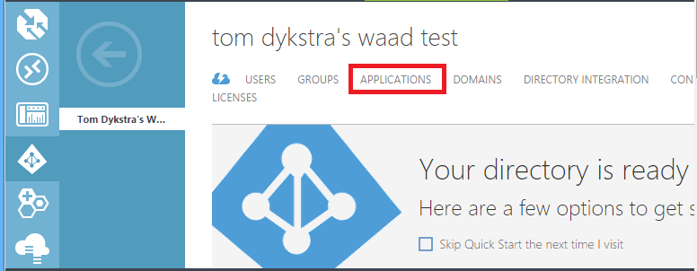

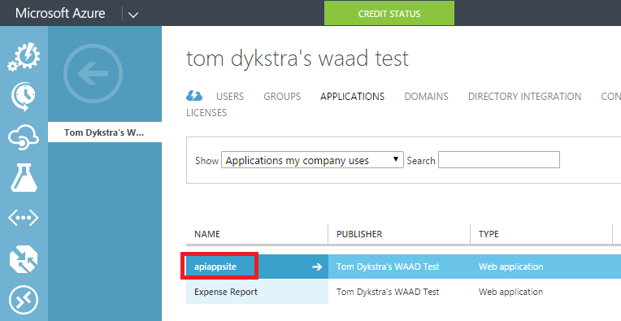

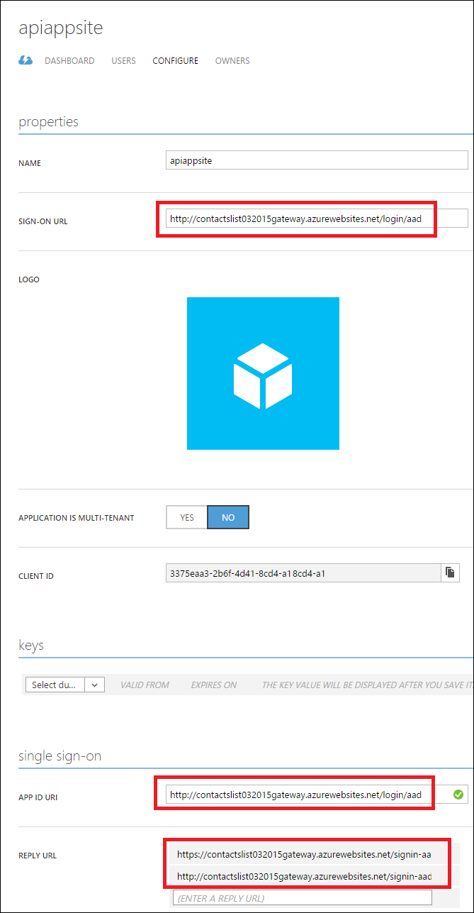

(В URL-адресе ответа на изображении выше показан один URL-адрес дважды: с `http:` и с `https:`.)

## Контроль работоспособности проверки подлинности 

1. Откройте окно браузера и введите в адресной строке URL-адрес, вызывающий метод `GET` приложения API, как вы делали это ранее.

	На этот раз попытка доступа к приложению API приведет к сообщению об ошибке.

	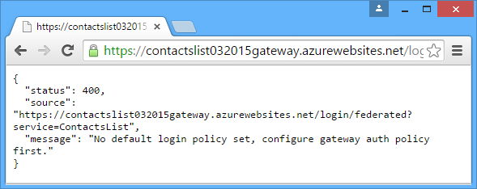

2. В браузере перейдите по URL-адресу входа. 

    	http://[resourcegroupname]gateway.azurewebsites.net/login/[providername]

	Например, если вы назвали группу ресурсов "myfirstrg" и настроили в шлюзе проверку подлинности Azure Active Directory, URL-адрес будет следующим:

    	http://myfirstrggateway.azurewebsites.net/login/aad

	Обратите внимание, что в отличие от предыдущего URL-адреса этот URL-адрес не включает имя приложения API:  проверку подлинности выполняет шлюз, а не приложение API.  Шлюз обрабатывает проверку подлинности для всех приложений API в группе ресурсов.

	(Если у вас возникла проблема при входе, попробуйте открыть окно в закрытом или анонимном режиме.)

3. Введите учетные данные, когда в браузере откроется страница для входа. 
 
	Если вы настроили имя для входа Azure Active Directory, используйте одного из пользователей, указанного на вкладке **Пользователи** для приложения, созданного на вкладке "Azure Active Directory" [портале Azure], например, admin@contoso.onmicrosoft.com.

	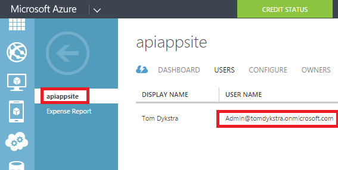

	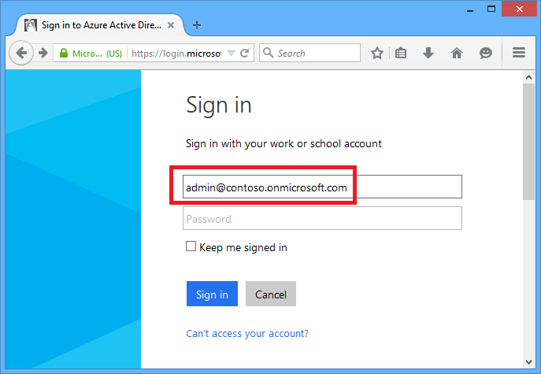

4. После того, как появится сообщение "вход выполнен", снова введите URL-адрес в метод GET приложения API.

	На этот раз вызов будет выполнен, так как вы прошли проверку подлинности. Шлюз распознает, что вы являетесь прошедшим проверку подлинности пользователем и передаст запрос в приложение API.

	

	
	<!--задача: замените на изображение с вымышленными именами-->

## Использование Postman для отправки запроса POST

При входе в шлюз он возвращает токен проверки подлинности.  Этот токен должен быть включен во все запросы из внешних источников, проходящих через шлюз. При получении доступа к API в браузере обычно браузер сохраняет токен в файл cookie и отправляет его вместе с последующими вызовами в API.

Таким образом, вы видите, что происходит в фоновом режиме. В этом разделе средство браузера используется для создания и отправки запроса POST, и вы получаете токен проверки подлинности из файла cookie и включаете его в заголовок HTTP.

В этих инструкциях показано, как использовать средство Postman в браузере Chrome, но то же самое можно сделать с помощью любого клиентского средства REST и средств разработчика браузера.

1. В окне браузера Chrome выполните действия для проверки подлинности, показанные в предыдущем разделе, а затем откройте средства разработчика (F12).

	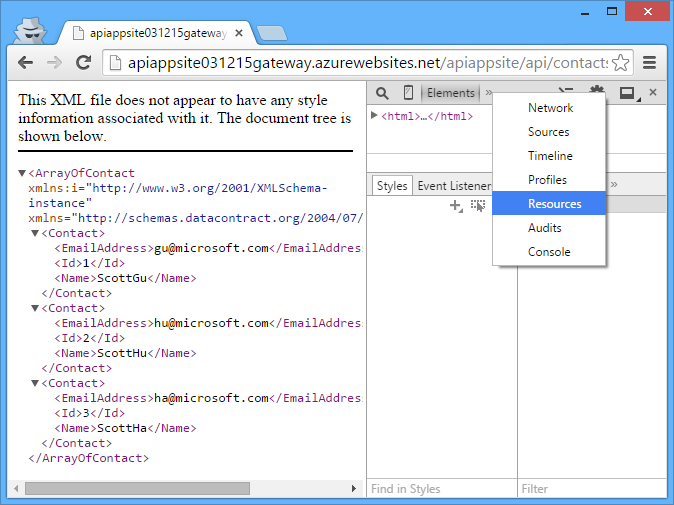

3. На вкладке **Ресурсы** средств разработчика Chrome найдите файлы cookie для шлюза и трижды щелкните значение файла cookie **x-zumo-auth**, чтобы выбрать их все.

	**Примечание.** Убедитесь, что вы получили полное значение файла cookie. При двойном щелчке вы получите только его первую часть.

5. Щелкните правой кнопкой мыши **Значение** файла cookie **x-zumo-auth**, а затем выберите **Копировать**.

	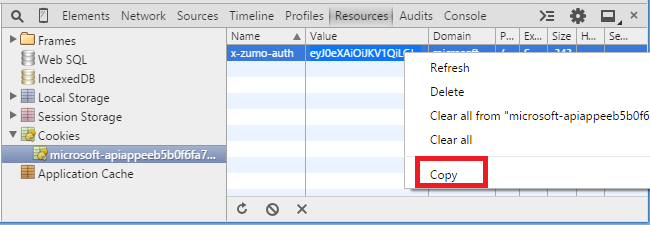

4. Установите расширение Postman в браузере Chrome, если вы еще этого не сделали.

6. Откройте расширение Postman.

7. В поле "URL-адрес запроса" введите URL-адрес метода GET приложения API, использованный ранее, но пропустите `get/` в конце.
 
		http://[apiappurl]/api/contacts
    
8. Щелкните **Заголовки** и добавьте заголовок *x-zumo-auth*. Вставьте значение токена из буфера обмена в поле **Значение**.

9. Добавьте заголовок *Content-Type* со значением *application/json*.

10. Щелкните **form-data**, а затем добавьте ключ *contact* со следующим значением:

		{   "Id": 0,   "Name": "Li Yan",   "EmailAddress": "yan@contoso.com" }

11. Щелкните "Отправить".

	Приложение API вернет ответ *201 Created*.

	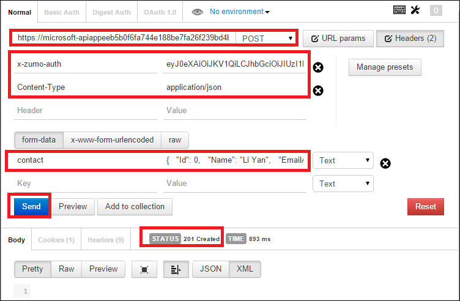

12. Чтобы убедиться, что этот запрос не будет работать без токена проверки подлинности, удалите заголовок проверки подлинности и снова щелкните "Отправить".

	Вы получите ответ *403 Forbidden*.

	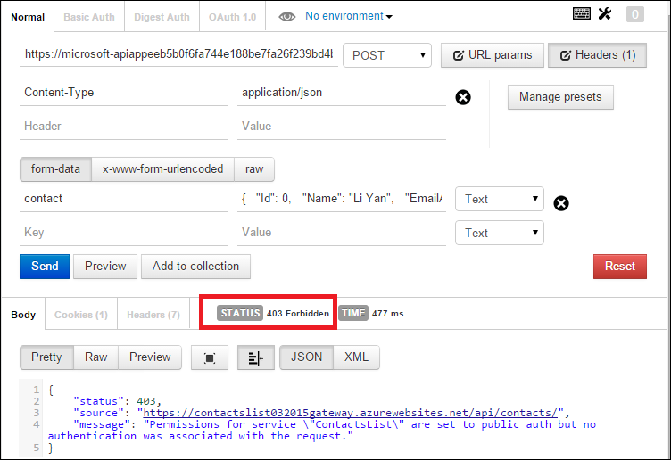

## Дальнейшие действия

Вы узнали, как защитить приложение API Azure с помощью запроса проверки подлинности Azure Active Directory или поставщика социальных сетей. Дополнительные сведения см. в разделе [Что такое приложения API?](app-service-api-apps-why-best-platform.md). 

[старый портал]: https://manage.windowsazure.com/
[портале Azure]: https://portal.azure.com/

<!--HONumber=49-->