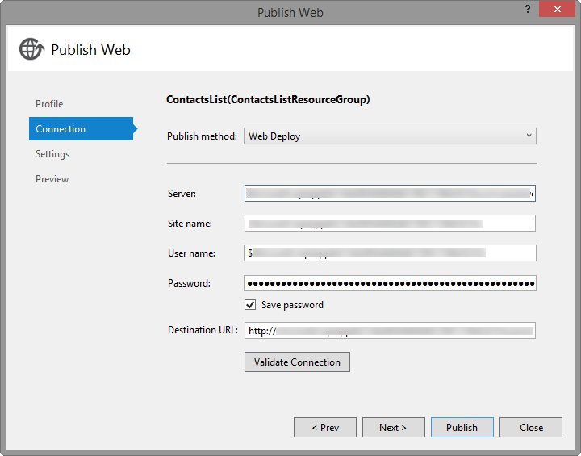
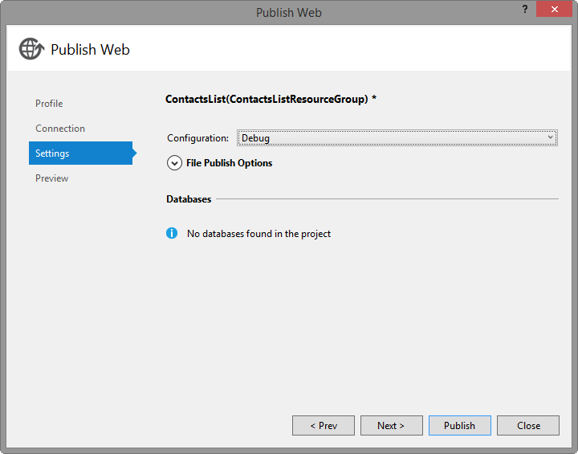

<properties 
	pageTitle="Развертывание приложения API в службе приложений Azure" 
	description="Узнайте, как развернуть проект приложения API в подписке Azure." 
	services="app-service\api" 
	documentationCenter=".net" 
	authors="bradygaster" 
	manager="wpickett" 
	editor="jimbe"/>

<tags 
	ms.service="app-service-api" 
	ms.workload="web" 
	ms.tgt_pltfrm="dotnet" 
	ms.devlang="na" 
	ms.topic="article" 
	ms.date="05/04/2015" 
	ms.author="bradyg;tarcher"/>

# Развертывание приложения API в службе приложений Azure 

## Обзор

В этом учебнике предстоит развернуть проект веб-API, созданный в [предыдущем учебнике](app-service-dotnet-create-api-app.md), в новое [приложение API](app-service-api-apps-why-best-platform.md). Вы будете использовать Visual Studio для создания ресурса приложения API в [службе приложений Azure](app-service-value-prop-what-is.md) и развертывания кода веб-API в приложение API Azure.

### Другие варианты развертывания

Существует много других способов развертывания приложений API. Приложение API — это [веб-приложение](app-service-web-overview.md) с дополнительными возможностями для размещения веб-служб, и все [способы развертывания, которые доступны для веб-приложений](web-sites-deploy.md), также можно использовать с приложениями API. Веб-приложение, размещающее приложение API, называется хостом приложения API на портале предварительной версии Azure, и вы можете настраивать развертывание с помощью колонки портала хоста приложения API. Сведения о колонке хоста приложения API см. в разделе [Управление приложением API](app-service-api-manage-in-portal.md).

Тот факт, что приложения API основаны на веб-приложениях, также означает, что вы можете развертывать в приложениях API код, написанный для платформ, отличных от ASP.NET. Пример, в котором используется Git для развертывания кода Node.js в приложении API, см. в разделе [Создание приложения API Node.js в службе приложений Azure](app-service-api-nodejs-api-app.md).
 
## Развертывание приложения API 

В этом разделе будут показаны действия, необходимые для развертывания приложения API в подписке Azure.

1. В **обозревателе решений** щелкните правой кнопкой мыши проект (не решение) и выберите пункт **Опубликовать...**. 

	

2. Откройте вкладку **Профиль** и щелкните элемент **Приложения API Microsoft Azure (предварительная версия)**.

	

3. Нажмите кнопку **Создать**, чтобы подготовить новое приложение API в подписке Azure.

	

4. В диалоговом окне **Создание приложения API** введите следующее.

	- В поле **Имя приложения API** введите ContactsList. 
	- Если у вас несколько подписок Azure, выберите ту, которую хотите использовать.
	- В разделе **План обслуживания приложения** выберите один из существующих планов обслуживания приложений или щелкните **Создать план обслуживания приложения** и введите имя нового плана. 
	- В разделе **Группа ресурсов** выберите одну из существующих групп ресурсов или щелкните **Создать новую группу ресурсов** и введите имя. Имя должно быть уникальным; рассмотрите возможность использования имени приложения в качестве префикса и добавления персональных данных, например учетной записи Майкрософт (без символа «@»).  
	- В разделе **Уровень доступа** выберите **Доступно всем пользователям**. Этот параметр сделает API общедоступным, что подходит для этого учебника. Позднее вы можете ограничить доступ на портале предварительной версии Azure.
	- В поле **Регион** выберите ближайший регион.  

	

5. Нажмите кнопку **ОК**, чтобы создать приложение API в выбранной подписке. Поскольку этот процесс может занять несколько минут, Visual Studio отображает диалоговое окно подтверждения.

	

6. Нажмите кнопку **ОК** в диалоговом окне подтверждения. Процесс подготовки создаст группу ресурсов и приложение API в подписке Azure. Visual Studio отображает ход выполнения в окне **Действия службы приложений Azure **.

	

7. После подготовки приложения API щелкните правой кнопкой мыши проект в **обозревателе решений** и выберите пункт **Опубликовать**, чтобы повторно открыть диалоговое окно публикации. Профиль публикации, созданный на предыдущем шаге, должен быть уже выбран. Нажмите кнопку **Опубликовать**, чтобы начать процесс развертывания.

	

В окне **Действия службы приложений Azure** отображается ход развертывания.

## Просмотр приложения на портале предварительной версии Azure

В этом разделе вы перейдете на портал для просмотра основных параметров, доступных для приложений API, и внесете изменения в итерацию приложения API. После каждого развертывания на портале будут отображаться изменения, внесенные в приложение API.

1. В браузере перейдите на [портал предварительной версии Azure](https://portal.azure.com). 

2. Нажмите кнопку **Обзор** на боковой панели и выберите **Приложения API**.

	

3. Выберите созданное приложение API из списка приложений API в подписке.

	

4. Щелкните **Определение API**. В колонке **Определение API** приложения отобразится список операций API, определенных при создании приложения.

	

5. Теперь вернитесь в проект в Visual Studio и добавьте следующий код в файл **ContactsController.cs**. Этот код добавляет метод **Post**, который можно использовать для отправки новых экземпляров `Contact` в API.

		[HttpPost]
		public HttpResponseMessage Post([FromBody] Contact contact)
		{
			// todo: save the contact somewhere
			return Request.CreateResponse(HttpStatusCode.Created);
		}

	

6. В **обозревателе решений** щелкните правой кнопкой мыши проект и выберите команду **Опубликовать**.

	

7. Перейдите на вкладку **Параметры**.

8. В раскрывающемся списке **Конфигурация** выберите элемент **Отладка**.

	

9. Перейдите на вкладку **Предварительный просмотр**.

10. Нажмите **Начало предварительного просмотра**, чтобы просматривать изменения, которые будут внесены.

	

11. Щелкните **Опубликовать**.

12. После завершения процесса публикации вернитесь на портал, закройте и снова откройте колонку **Определение API**. Вы увидите новую конечную точку API, которую только что создали и развернули напрямую в подписке Azure.

	

## Дальнейшие действия

Вы увидели, как возможности прямого развертывания в Visual Studio упрощают итерацию и ускоряют развертывание и проверку правильности работы API. В [следующем учебнике](app-service-dotnet-remotely-debug-api-app.md) будет показано, как отлаживать приложение API во время его выполнения в Azure.

<!--HONumber=54-->