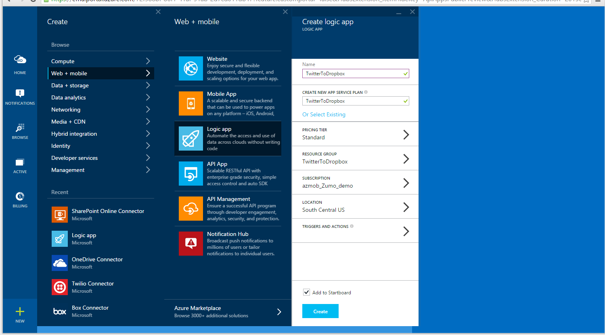
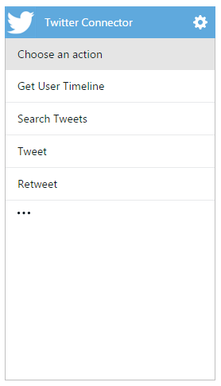
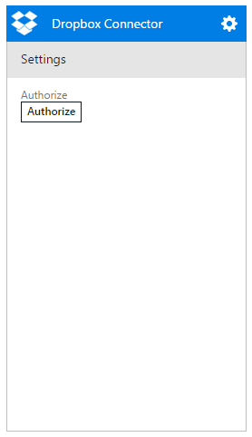

<properties 
	pageTitle="Создание приложения логики" 
	description="Начните с создания простого приложения логики." 
	authors="stepsic-microsoft-com" 
	manager="dwrede" 
	editor="" 
	services="app-service\logic" 
	documentationCenter=""/>

<tags
	ms.service="app-service-logic"
	ms.workload="integration"
	ms.tgt_pltfrm="na"
	ms.devlang="na"
	ms.topic="article"
	ms.date="03/20/2015"
	ms.author="stepsic"/>

#Создание нового приложения логики
В этой статье показывается, как всего за несколько минут можно создавать приложения логики службы приложений. Мы рассмотрим рабочий процесс, который позволяет получать набор интересующих твитов в папку Dropbox.

Для использования этого сценария вам понадобится:

- подписка Azure;
- учетная запись Twitter;
- учетная запись Dropbox.

<!--- TODO: Add try it now information here -->

##Создание соединителей

Сначала необходимо создать два соединителя, которые будут использоваться: **соединитель Dropbox** и **соединитель Twitter**. Чтобы создать их, выполните следующие действия.

1. Щелкните **Marketplace** на начальном экране и найдите **Twitter**. 

2. Выберите соединитель Twitter и нажмите кнопку "Создать". Появится колонка, в которой можно задать все параметры. Вы можете оставить имя **Соединитель Twitter**.

3. В поле **Создать новый план обслуживания приложения** введите имя плана.
	
	>[AZURE.NOTE]В этом разделе предполагается, что вы создаете новый план обслуживания приложения. Если вы используете существующий план обслуживания приложения, нажмите **Выбрать существующий**, выберите существующий план и переходите к следующему разделу.
 
4.  Выберите **ценовую категорию** для этого нового плана.
 
	>[AZURE.NOTE]По умолчанию отображаются только планы, рекомендуемые для приложений логики. Нажмите **Просмотреть все**, чтобы увидеть все доступные планы. При выборе для приложения логики категории Free вы можете запускать его не чаще одного раза в час и использовать не более 1000 действий в месяц.

5. Создайте **группу ресурсов** для вашего потока. 

	Группы ресурсов действуют как контейнеры для приложений. Все ресурсы для вашего приложения будут находиться в одной группе ресурсов.

6. Если у вас есть несколько подписок Azure, выберите ту, которую будете использовать.

7. Выберите **расположение** для запуска приложения логики.

	

8. Щелкните **Создать**. Этап подготовки может занять одну-две минуты. 

9. Теперь повторите этот процесс с Dropbox.

##Запуск приложения логики

Теперь необходимо создать новое приложение логики.

1. Нажмите кнопку **+ Создать** в нижнем левом углу экрана, разверните узел **Мобильные и веб-приложения**, а затем щелкните элемент **Приложение логики**. 

 	Появится колонка "Создание приложения логики", где можно указать некоторые основные параметры для начала работы.

	
	
2. В поле **Имя** введите понятное имя для приложения логики.

3. Выберите **план обслуживания приложения**, который использовался при создании соединителей. В результате расположение, подписка и группа ресурсов будут выбраны автоматически.

Таким образом делаются основные настройки, но пока не следует нажимать кнопку **Создать**. Далее вы будете добавлять триггеры и действия в рабочий процесс.

## Добавление триггера

Триггеры - это то, что запускает ваше приложение логики. Затем вы добавите триггер повторения, который будет запускать ваш рабочий процесс по заданному расписанию.

1. В колонке **Создание приложения логики** щелкните пункт **Триггеры и действия**. 

	Откроется полноэкранный конструктор, отображающий ваш поток. С правой стороны находится список всех служб, которые могут иметь триггеры. 

2. В разделе **Встроенные** щелкните **Повторение**.
	
	Появится окно, в котором можно указать параметры повторения.

	

4.  Выберите **частоту** и **интервал** повторения (например, один раз в час) и щелкните зеленую галочку.

Теперь добавим действие в поток.

## Добавление действия Twitter

Действия - это то, что делает рабочий процесс. Вы можете задать любое количество действий и упорядочить их так, чтобы информация из одного действия передавалась в следующее.

1. В области справа найдите **соединитель Twitter** и щелкните его. 

2. После того как он будет загружен, нажмите кнопку **Авторизовать**, войдите в свою учетную запись Twitter и нажмите **Авторизовать приложение**. 

	Это предоставит соединителю доступ к вашей учетной записи Twitter. Отобразится список возможных операций, предоставляемых соединителем Twitter. 

	

3. Щелкните действие **Искать твиты**, а затем в поле **Укажите запрос** введите что-нибудь типа `#MicrosoftAzure` и щелкните зеленую галочку.

	

Теперь соединитель Twitter стал частью рабочего процесса.

## Добавление действия Dropbox и создание приложения

Последний шаг заключается в добавлении действия, которое отправляет твиты в файл Dropbox. 

1. В области справа щелкните пункт **Соединитель Dropbox**. 
  
2. После завершения подготовки нажмите кнопку **Авторизовать**, войдите в свою учетную запись Dropbox и нажмите кнопку **Разрешить**.

	
	
	Это предоставит соединителю доступ к вашей учетной записи Dropbox. Отобразится список возможных операций, предоставляемых соединителем Dropbox. 
 
4. Нажмите **Отправить файл**.  

	Появится окно с параметрами Dropbox, которые необходимо установить, чтобы передавать данные из поиска Twitter в Dropbox.

	

3. В поле **FilePath** введите `/tweet.txt`
  
4. В поле **Содержимое** нажмите кнопку с многоточием (`...`) и выберите пункт **Текст твита**. 
 
	В текстовое поле будет вставлено значение `@first(body('twitterconnector')).TweetText`. Эта функция создает значение, содержащее следующие части.

	Часть содержимого                               | Описание
	------------------------------------------ | ------------
	 `@`                                       | Указывает, что вы ввели функцию, а не фактическое значение.
	`actions('twitterconnector').outputs.body` | Получает твиты, извлеченные запросом соединителя Twitter.
	`first()`                                  | Действие поиска твитов возвращает список, но вам нужно отправить один файл.
	`.TweetText`                               | Выбирает свойство сообщения твита.
	
5. Щелкните зеленую галочку, чтобы сохранить параметры соединителя.

5. Теперь, когда конструкция завершена, нажмите кнопку **Просмотр кода** в верхнем левом углу конструктора и обратите внимание, что это код JSON, который определяет рабочий процесс, только что созданный вами в конструкторе. Мы более подробно рассмотрим этот код в [следующем разделе][Использование функций приложения логики].

6. Нажмите кнопку **ОК** внизу экрана, а затем нажмите кнопку **Создать**. 

	Новое приложение логики создано.

## Управление приложением логики после его создания

Теперь ваше приложение логики запущено и работает. Каждый раз, когда запускается запланированный рабочий процесс, он ищет твиты с  указанным хэш-тегом. Когда соответствующий твит обнаруживается, он отправляет его в вашу папку Dropbox. Теперь мы покажем, как отключать приложение, и вы увидите, как это работает. 

1. Нажмите кнопку **Обзор** с левой стороны экрана и выберите пункт **Приложения логики**. 
 
2. Щелкните только что созданное приложение логики, чтобы увидеть его текущий статус и общие сведения. 

3. Чтобы изменить новое приложение логики, нажмите **Триггеры и действия**. 
 
5. Чтобы отключить приложение, нажмите кнопку **Отключить** в командной строке.

Менее чем за 5 минут вы смогли создать простое приложение логики, работающее в облаке. Дополнительные сведения об использовании функций приложений логики см. в статье [Использование функций приложения логики].

<!-- Shared links -->
[Портал Azure]: https://portal.azure.com
[Использование функций приложения логики]: app-service-logic-use-logic-app-features.md

<!--HONumber=49-->