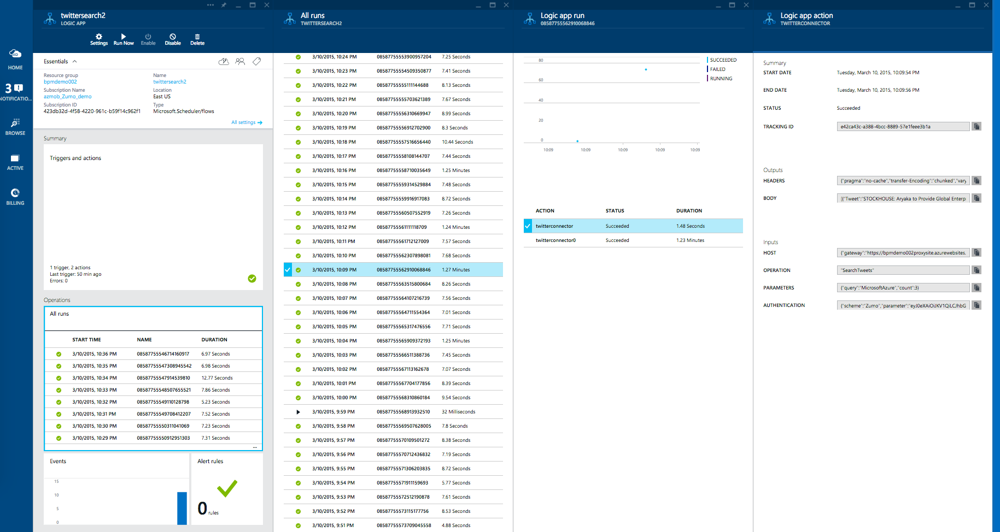
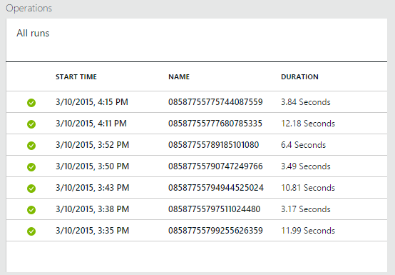
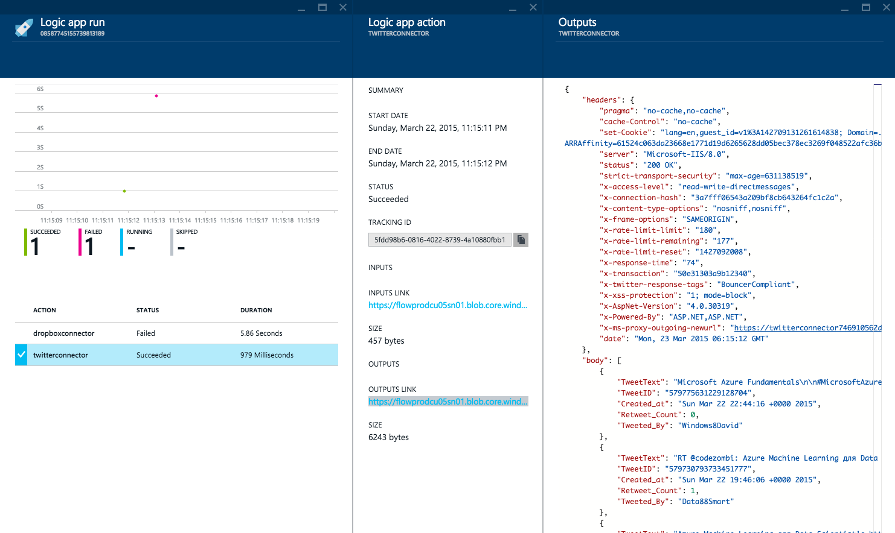

<properties 
	pageTitle="Мониторинг приложений логики" 
	description="Просмотр результатов действий приложений логики." 
	authors="stepsic-microsoft-com" 
	manager="dwrede" 
	editor="" 
	services="app-service\logic" 
	documentationCenter=""/>

<tags
	ms.service="app-service-logic"
	ms.workload="integration"
	ms.tgt_pltfrm="na"
	ms.devlang="na"
	ms.topic="article"
	ms.date="03/10/2015"
	ms.author="stepsic"/>

#Мониторинг приложений логики

После создания приложения логики в результате выполнения шагов, описанных в учебнике [Создание приложения логики](app-service-logic-create-a-logic-app.md), можно просмотреть полный журнал его выполнения на портале Azure. Чтобы просмотреть журнал, нажмите кнопку **Обзор** с левой стороны экрана портала и выберите пункт **Приложения логики**. Появится список приложений логики в вашей подписке. Приложение логики может быть **включено** или **отключено**. **Включенное** приложение логики означает, что триггеры будут запускать это приложение логики в ответ на события триггера, а **отключенное** приложение логики не будет запускаться в ответ на события.

В колонке для вашего приложения логики есть два полезных для мониторинга раздела.

- В разделе **Сводка** показывается последнее состояние, и этот раздел является отправной точкой для изменения приложения логики.
- В разделе **Все запуски** показывается список всех запусков этого приложения логики.

##Запуски

В этом списке запусков показывается **время начала**, **идентификатор запуска** (его можно использовать при вызове REST API) и **длительность** конкретного выполнения. Щелкните любую строку, чтобы увидеть сведения об этом конкретном запуске.

В колонке сведения показывается график с временем выполнения и последовательностью всех действий в этом запуске. Под ним приводится полный список всех выполненных действий.

Наконец, в конкретном действии можно получить все данные, переданные в это действие и полученные из этого действия, в разделах **Входные данные** и **Выходные данные**.

Другая важная часть сведений — это **идентификатор отслеживания**. Этот идентификатор передается в заголовках всех вызовов действия. Если журнал ведется в своей собственной службе, рекомендуется зарегистрировать идентификатор отслеживания, а затем можно будет ссылаться на этот идентификатор в перекрестных ссылках ваших собственных журналов.

##Журнал триггера и управление версиями

Существует две дополнительные возможности, которые пока недоступны в пользовательском интерфейсе (вскоре появятся), но доступны посредством [REST API](http://go.microsoft.com/fwlink/?LinkID=525617&clcid=0x409).

1. **Журнал триггеров** — триггеры, выполняющие опросы, проверяют API через определенные интервалы времени, но запускают выполнение в зависимости от ответа (например, код `200` означает запустить выполнение, а код `202` — не запускать). С помощью журнала триггера вы можете увидеть все вызовы, которые были произведены, но не привели к запуску приложения логики (были получены ответы с кодом `202`).

2. **Предыдущие версии** — при обновлении определения приложения логики предыдущая версия определения сохраняется. Это делается потому, что если в это время происходит выполнение, то оно будет ссылаться на версию приложения логики, существовавшую на момент запуска выполнения. Определения запусков нельзя изменять во время их выполнения. REST API журнала версий предоставляет доступ к этим сведениям.

<!--HONumber=54-->