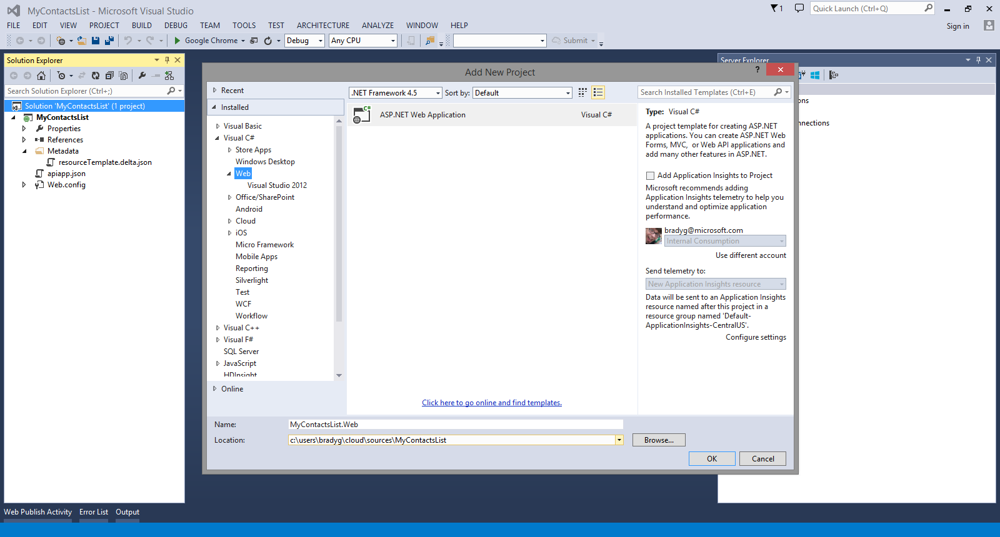
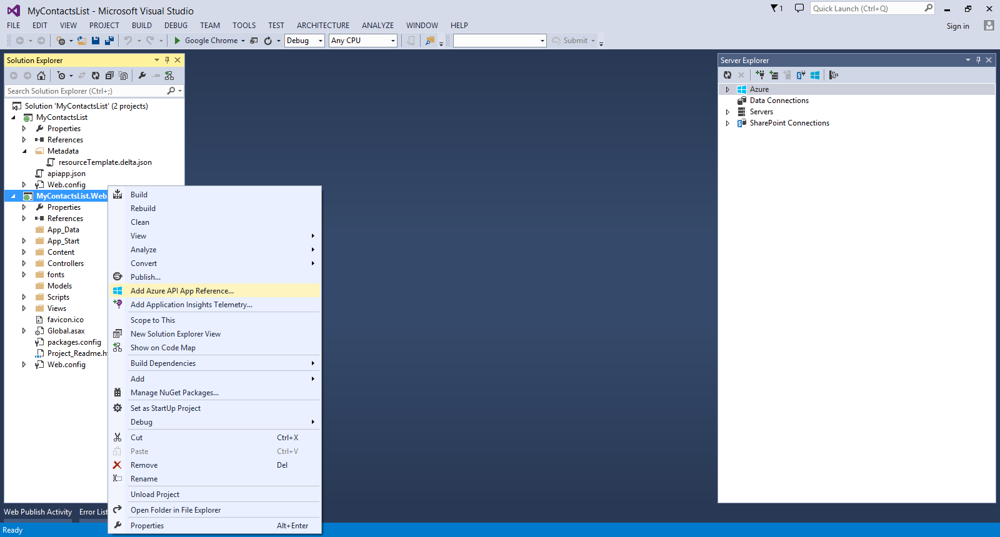
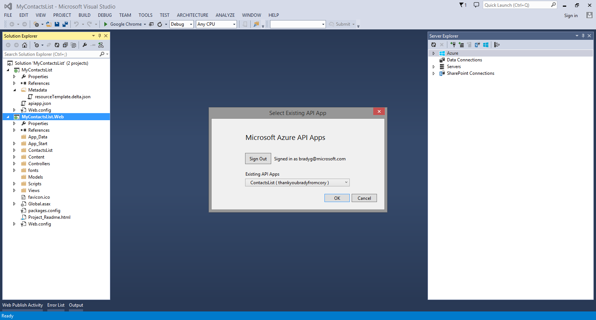
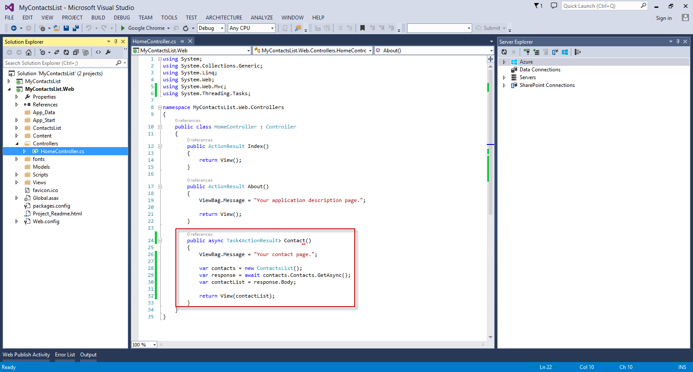
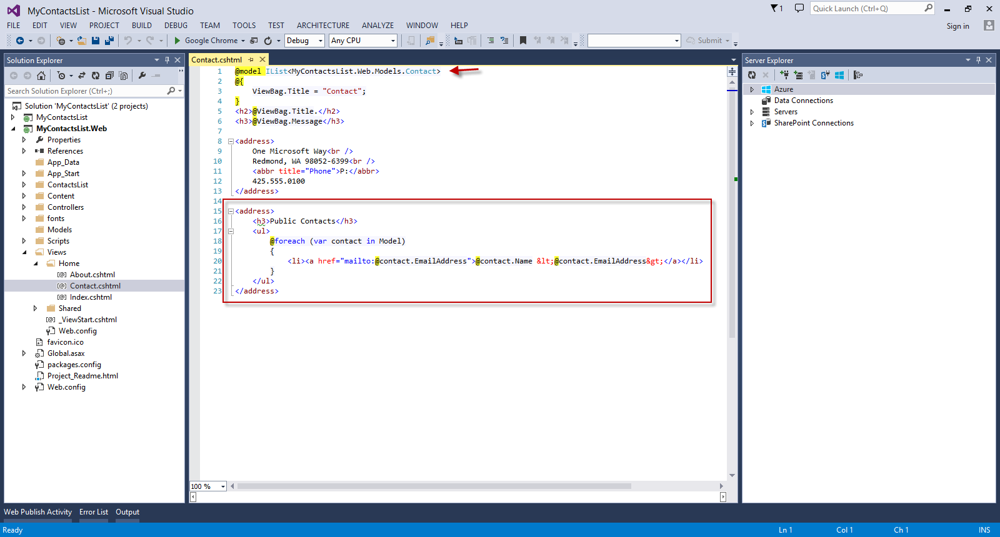

<properties 
	pageTitle="Подключение мобильных и веб-приложений к интерфейсам API SaaS (O365/SharePoint/Salesforce) в службе приложения Azure" 
	description="В этом учебнике показано, как использовать приложение API SaaS из ASP.NET, размещенного в веб-приложениях службы приложений Azure." 
	services="app-service\web" 
	documentationCenter="" 
	authors="syntaxc4" 
	manager="yochayk" 
	editor=""/>

<tags
	ms.service="app-service-web"
	ms.devlang="dotnet"
	ms.topic="article"
	ms.tgt_pltfrm="na"
	ms.workload="web" 
	ms.date="03/24/2015"
	ms.author="cfowler"/>

# Подключение мобильных и веб-приложений к интерфейсам API SaaS (O365/SharePoint/Salesforce) в службе приложения Azure

В этом учебнике показано, как использовать приложение API из ASP.NET, размещенного в [веб-приложениях службы приложений](http://go.microsoft.com/fwlink/?LinkId=529714).

## Обзор

Вы узнаете:

- Как использовать приложение API из ASP.NET, размещенного в веб-приложениях.

## Предварительные требования

Этот учебник основан на данных из учебников по приложению PI:

1. [Создание приложения API Azure](app-service-dotnet-create-api-app)
2. [Публикация приложения API Azure](app-service-dotnet-publish-api-app)
3. [Развертывание приложения API Azure](app-service-dotnet-deploy-api-app)
4. [Отладка приложения API Azure](app-service-dotnet-remotely-debug-api-app)

## Превращение приложения API в общедоступное

На [портале Azure](http://go.microsoft.com/fwlink/?LinkId=529715) выберите приложение API. На панели команд нажмите кнопку **Параметры**. В разделе **Основные параметры** измените **Уровень доступа** на **Public (anonymous)** (Общедоступный - анонимный).

## Создание приложения ASP.NET MVC в Visual Studio

1. Откройте Visual Studio. Используйте диалоговое окно **Новый проект**, чтобы добавить новое **Веб-приложение ASP.NET**. Нажмите кнопку **ОК**.

	

1. Выберите шаблон **MVC**. Щелкните **Изменить аутентификацию**, выберите **Без проверки подлинности**, а затем нажмите кнопку **ОК** дважды.

	

1. В обозревателе решений щелкните правой кнопкой мыши только что созданный проект веб-приложения и выберите пункт **Add Azure App Reference** (Добавить ссылку на приложение Azure).

	

1. В раскрывающемся списке **Existing API Apps** (Существующие API приложения) выберите API приложение, к которому хотите подключиться.

	

	>[AZURE.NOTE] Код клиента для подключения к API приложению создается автоматически из конечной точки Swagger API.

1. Чтобы использовать созданный код API, откройте файл HomeController.cs и замените действие `Contact` следующим:

	    public async Task<ActionResult> Contact()
	    {
	        ViewBag.Message = "Your contact page.";
	
	        var contacts = new ContactsList();
	        var response = await contacts.Contacts.GetAsync();
	        var contactList = response.Body;
	
	        return View(contactList);
	    }

	

1. Обновите представление `Contact` для отражения динамического списка контактов с помощью следующего кода:  
	<pre>// Add to the very top of the view file
	@model IList&lt;MyContactsList.Web.Models.Contact&gt;
	
	// Replace the default email addresses with the following
    &lt;h3&gt;Public Contacts&lt;/h3&gt;
    &lt;ul&gt;
        @foreach (var contact in Model)
        {
            &lt;li&gt;&lt;a href=&quot;mailto:@contact.EmailAddress&quot;&gt;@contact.Name &amp;lt;@contact.EmailAddress&amp;gt;&lt;/a&gt;&lt;/li&gt;
        }
    &lt;/ul&gt; 
	</pre>

	

## Развертывание веб-приложения в веб-приложениях в службе приложений

Следуйте инструкциям из раздела [Развертывание веб-приложения Azure](web-sites-deploy.md).

>[AZURE.NOTE] Если вы хотите ознакомиться со службой приложений Azure до создания учетной записи Azure, перейдите в раздел [Оценка службы приложений](http://go.microsoft.com/fwlink/?LinkId=523751), где вы можете быстро создать краткосрочное начальное веб-приложение в службе приложений. Никаких кредитных карт и обязательств.

## Изменения
* Руководство по изменениям при переходе от веб-сайтов к службе приложений см. в разделе [Служба приложений Azure и ее влияние на существующие службы Azure](http://go.microsoft.com/fwlink/?LinkId=529714).
* Руководство по изменениям на новом портале по сравнению со старым см. в разделе [Краткий справочник по навигации на портале предварительной версии](http://go.microsoft.com/fwlink/?LinkId=529715).

<!--HONumber=49-->