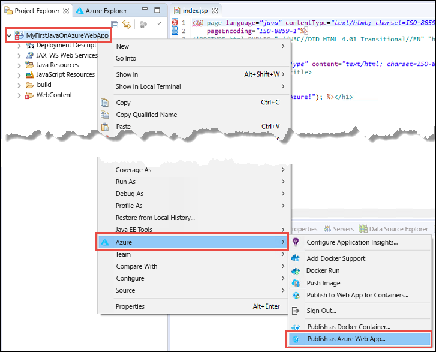
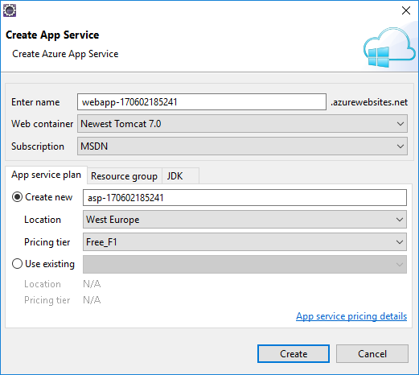
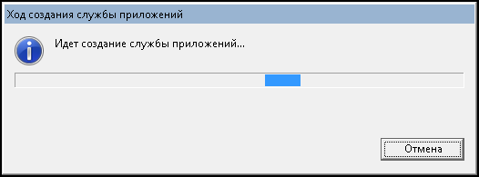
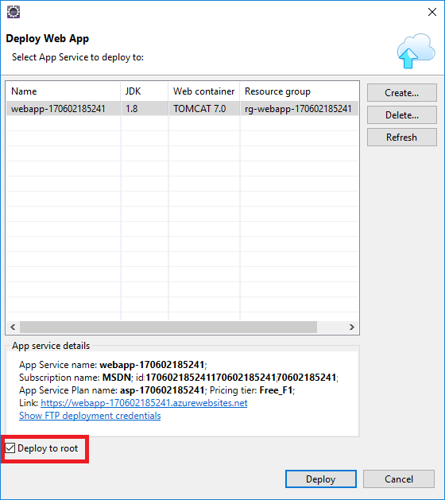
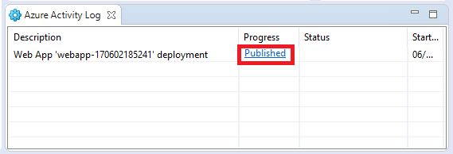
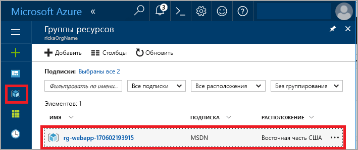
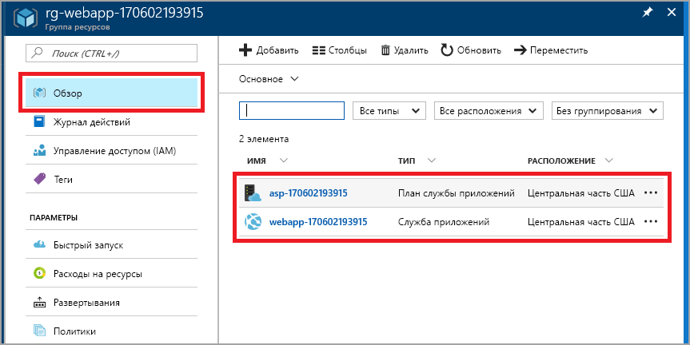
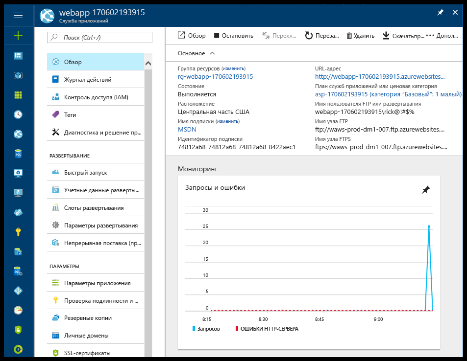

# <a name="create-your-first-java-web-app-in-azure"></a>Создание первого веб-приложения Java в Azure

[Служба приложений Azure](overview.md) — это служба веб-размещения с самостоятельной установкой исправлений и высоким уровнем масштабируемости. В этом кратком руководстве показано, как развернуть веб-приложение Java в службе приложений с помощью [интегрированной среды разработки Eclipse для разработчиков Java EE](https://www.eclipse.org/).

> [!NOTE]
>
> В этом кратком руководстве объясняется, как использовать среду разработки Eclipse для публикации веб-приложения Java в службе приложений. Но вы можете использовать IntelliJ IDEA версии Ultimate или Community. Дополнительные сведения см. в статье [Создание веб-приложения Hello World для Azure с помощью Eclipse](/java/azure/intellij/azure-toolkit-for-intellij-create-hello-world-web-app).
>

После завершения работы с этим руководством ваше приложение при просмотре в веб-браузере будет выглядеть следующим образом:


[!INCLUDE [quickstarts-free-trial-note](../../includes/quickstarts-free-trial-note.md)]

## <a name="prerequisites"></a>Предварительные требования

Для работы с этим кратким руководством установите:

* Бесплатную <a href="https://www.eclipse.org/downloads/" target="_blank">интегрированную среду разработки Eclipse для разработчиков Java EE</a>. В этом кратком руководстве используется Eclipse Neon.
* <a href="/java/azure/eclipse/azure-toolkit-for-eclipse-installation" target="_blank">Набор средств Azure для Eclipse</a>.

> [!NOTE]
>
> Чтобы выполнить инструкции этого руководства, войдите в учетную запись Azure с помощью набора средств Azure для Eclipse. См. [инструкции по входу для набора средств Azure для Eclipse](/java/azure/eclipse/azure-toolkit-for-eclipse-sign-in-instructions).
>

## <a name="create-a-dynamic-web-project-in-eclipse"></a>Создание динамических веб-проектов в Eclipse

В Eclipse щелкните **File** (Файл) > **New** (Создать) > **Dynamic Web Project** (Динамический веб-проект).

В диалоговом окне **New Dynamic Web Project** (Новый динамический веб-проект) присвойте проекту имя **MyFirstJavaOnAzureWebApp** и нажмите кнопку **Finish** (Готово).
   


### <a name="add-a-jsp-page"></a>Добавление страницы JSP

Если обозреватель проектов не отображается, разверните его.


В обозревателе проектов разверните проект **MyFirstJavaOnAzureWebApp**.
Щелкните правой кнопкой мыши **WebContent**, а затем щелкните **New** (Создать) > **JSP File** (JSP-файл).


В диалоговом окне **New JSP File** (Создание JSP-файла):

* Назовите файл **index.jsp**.
* Выберите **Готово**.

  

В файле index.jsp замените элемент `<body></body>` следующей разметкой:

```jsp
<body>
<h1><% out.println("Hello Azure!"); %></h1>
</body>
```

Сохраните изменения.

> [!NOTE]
>
> Если появится сообщение об ошибке в строке 1, которое ссылается на отсутствующий класс сервлетов Java, его можно пропустить.
> 
> 
>

## <a name="publish-the-web-app-to-azure"></a>Публикация веб-приложения в Azure

В обозревателе проектов щелкните правой кнопкой мыши проект и выберите **Azure** > **Publish as Azure Web App** (Опубликовать как веб-приложение Azure).



При появлении соответствующего запроса с диалоговым окном **входа в Azure** выполните действия, описанные в статье [Инструкции по входу для набора средств Azure для Eclipse](/java/azure/eclipse/azure-toolkit-for-eclipse-sign-in-instructions), чтобы ввести учетные данные.

### <a name="deploy-web-app-dialog-box"></a>Диалоговое окно развертывания веб-приложения

После входа в учетную запись Azure отобразится диалоговое окно **Deploy Web App** (Развертывание веб-приложения).

Нажмите кнопку **Создать**.


### <a name="create-app-service-dialog-box"></a>Диалоговое окно "Создание службы приложений"

Откроется диалоговое окно **Create App Service** (Создание службы приложений) со значениями по умолчанию. Число **170602185241**, показанное на следующем изображении, отличается от числа, которое появится в вашем диалоговом окне.


В диалоговом окне **Create App Service** (Создание службы приложений):

* Введите уникальное имя для веб-приложения или оставьте автоматически созданное имя. Это имя должно быть уникальным в Azure. Имя является частью URL-адреса веб-приложения. Например, если имя веб-приложения — **MyJavaWebApp**, то URL-адрес будет *myjavawebapp.azurewebsites.net*.
* Для целей этого руководства оставьте веб-контейнер по умолчанию.
* Выберите подписку Azure.
* На вкладке **App service plan** (План службы приложений):

  * **Create new** (Создать). Оставьте имя по умолчанию. Это имя плана службы приложений.
  * **Location** (Расположение). Выберите **West Europe** (Западная Европа) или ближайшее к вам расположение.
  * **Pricing tier** (Ценовая категория). Выберите бесплатный вариант. Сведения о функциях см. на странице [цен на службу приложений](https://azure.microsoft.com/pricing/details/app-service/?ref=microsoft.com&utm_source=microsoft.com&utm_medium=docs&utm_campaign=visualstudio).

   

[!INCLUDE [app-service-plan](../../includes/app-service-plan.md)]

### <a name="resource-group-tab"></a>Вкладка Resource group (Группа ресурсов)

Выберите вкладку **Resource group** (Группа ресурсов). Оставьте значение по умолчанию для группы ресурсов.


[!INCLUDE [resource-group](../../includes/resource-group.md)]

Нажмите кнопку **Создать**.

<!--
### The JDK tab

Select the **JDK** tab. Keep the default, and then select **Create**.


-->

Набор средств Azure создает веб-приложение и отображает диалоговое окно хода выполнения.



### <a name="deploy-web-app-dialog-box"></a>Диалоговое окно развертывания веб-приложения

В диалоговом окне **Deploy Web App** (Развертывание веб-приложения) установите флажок **Deploy to root** (Развернуть в корень). Если у вас есть служба приложений в *wingtiptoys.azurewebsites.net* и вы не выполните развертывание в корневой каталог, тогда веб-приложение **MyFirstJavaOnAzureWebApp** будет развернуто в каталоге *wingtiptoys.azurewebsites.net/MyFirstJavaOnAzureWebApp*.



В диалоговом окне отображаются выбранные значения Azure, JDK и веб-контейнера.

Нажмите кнопку **Deploy** (Развернуть) для публикации веб-приложения в Azure.

После завершения публикации щелкните ссылку **Опубликовано** в диалоговом окне **Журнал действий Azure**.



Поздравляем! Веб-приложение успешно развернуто в Azure. 


## <a name="update-the-web-app"></a>Обновление веб-приложения

Измените пример кода JSP на другое сообщение.

```jsp
<body>
<h1><% out.println("Hello again Azure!"); %></h1>
</body>
```

Сохраните изменения.

В обозревателе проектов щелкните правой кнопкой мыши проект и выберите **Azure** > **Publish as Azure Web App** (Опубликовать как веб-приложение Azure).

Появится диалоговое окно **Deploy Web App** (Развертывание веб-приложения) с ранее созданной службой приложений. 

> [!NOTE] 
> Устанавливайте флажок **Deploy to root** (Развернуть в корень) при каждой публикации. 
> 

Выберите веб-приложение и щелкните **Deploy** (Развернуть) для публикации изменений.

Когда появится ссылка **Publishing** (Публикация), щелкните ее и перейдите к веб-приложению, чтобы увидеть изменения.

## <a name="manage-the-web-app"></a>Управление веб-приложением

Перейдите на <a href="https://portal.azure.com" target="_blank">портал Azure</a>, чтобы увидеть созданное веб-приложение.

В меню слева выберите **Группы ресурсов**.



Выберите группу ресурсов. На странице отображаются ресурсы, созданные в этом кратком руководстве.



Выберите веб-приложение (**webapp-170602193915** на предыдущем рисунке).

Появится страница **Обзор**. Здесь вы можете наблюдать за работой приложения. Вы можете выполнять базовые задачи управления: обзор, завершение, запуск, перезагрузку и удаление. На вкладках в левой части страницы отображаются различные конфигурации, которые можно открыть. 



[!INCLUDE [clean-up-section-portal-web-app](../../includes/clean-up-section-portal-web-app.md)]

## <a name="next-steps"></a>Дополнительная информация

> [!div class="nextstepaction"]
> [Сопоставление пользовательского домена](app-service-web-tutorial-custom-domain.md)
