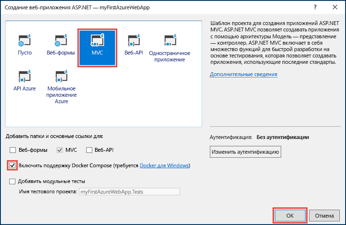
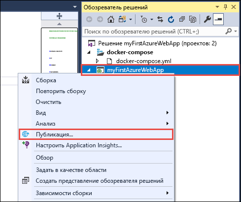
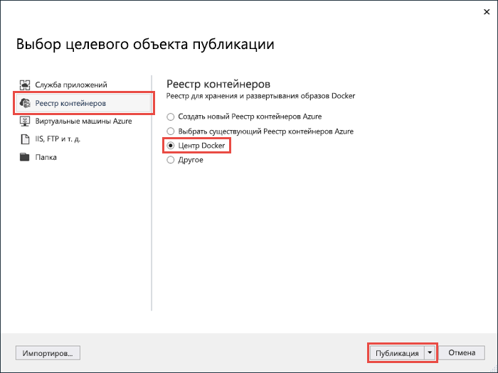
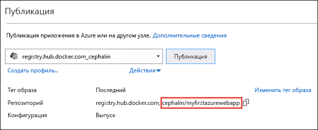
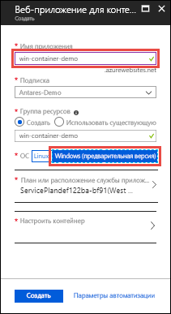
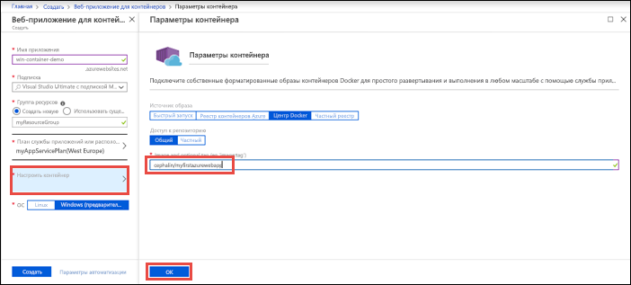
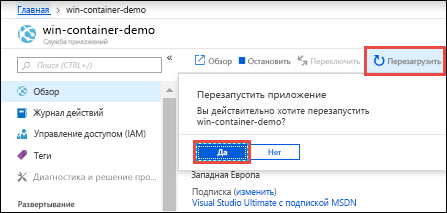

# <a name="run-a-custom-windows-container-in-azure-preview"></a>Запуск пользовательского контейнера Windows в Azure (предварительная версия)

[Служба приложений Azure](overview.md) предоставляет предопределенные стеки приложений на платформе Windows, например ASP.NET или Node.js, выполняющиеся в IIS. Предварительно настроенная среда Windows блокирует в операционной системе возможность административного доступа, установки программного обеспечения, изменений в глобальном кэше сборок и т. д. (см. раздел [Функциональные возможности операционной системы для службы приложений Azure](operating-system-functionality.md)). Если приложению требуется более высокий уровень доступа, чем предусмотрено в предварительно настроенной среде, можно развернуть пользовательский контейнер Windows. В этом кратком руководстве показано, как развернуть приложение ASP.NET в образе Windows на сайте [Docker Hub](https://hub.docker.com/) из Visual Studio и запустить его в пользовательском контейнере в Службе приложений Azure.


## <a name="prerequisites"></a>Предварительные требования

Для работы с этим руководством:

- <a href="https://hub.docker.com/" target="_blank">зарегистрируйте учетную запись центра Docker</a>.
- <a href="https://docs.docker.com/docker-for-windows/install/" target="_blank">Установите Docker для ОС Windows</a>.
- <a href="https://docs.microsoft.com/virtualization/windowscontainers/quick-start/quick-start-windows-10#2-switch-to-windows-containers" target="_blank">Переключите Docker для запуска контейнеров Windows</a>.
- <a href="https://www.visualstudio.com/downloads/" target="_blank">Установите Visual Studio 2017</a>, а также следующие рабочие нагрузки: **ASP.NET и веб-разработка** и **разработка Azure**. Если у вас уже установлена версия Visual Studio 2017, сделайте следующее.
    - Установите последние обновления для Visual Studio, выбрав **Справка** > **Проверить наличие обновлений**.
    - Добавьте рабочие нагрузки в Visual Studio, выбрав **Инструменты** > **Get Tools and Features** (Получить инструменты и компоненты).

## <a name="create-an-aspnet-web-app"></a>Создание веб-приложения ASP.NET

Создайте проект в Visual Studio, последовательно выбрав пункты **Файл > Создать > Проект**. 

В диалоговом окне **Новый проект** последовательно выберите пункты **Visual C# > Интернет > Веб-приложение ASP.NET (.NET Framework)**.

Присвойте приложению имя _myFirstAzureWebApp_ и нажмите кнопку **ОК**.
   


Вы можете развернуть любой тип веб-приложения ASP.NET в Azure. Для примера в этом руководстве выберите шаблон **MVC** и задайте для аутентификации значение **Без аутентификации**.

Выберите **Включить поддержку Docker Compose**.

Нажмите кнопку **ОК**.



Если файл _Dockerfile_ не открылся автоматически, откройте его в **обозревателе решений**.

Необходимо использовать [поддерживаемый родительский образ](#use-a-different-parent-image). Измените родительский образ, заменив строку `FROM` приведенным ниже кодом. Затем сохраните файл.

```Dockerfile
FROM microsoft/aspnet:4.7.1
```

В меню последовательно выберите пункты **Отладка > Запуск без отладки**, чтобы запустить веб-приложение локально.


## <a name="publish-to-docker-hub"></a>Публикация на сайте Docker Hub

Щелкните правой кнопкой мыши проект **myFirstAzureWebApp** в **обозревателе решений** и выберите **Опубликовать**.



Мастер публикации запустится автоматически. Выберите **Реестр контейнеров** > **Docker Hub** > **Опубликовать**.



Укажите данные учетной записи Docker Hub и щелкните **Сохранить**. 

Дождитесь завершения развертывания. Теперь на странице **Публикация** отображается имя репозитория, который будет использован позже в службе приложений.



Скопируйте имя этого репозитория для последующего использования.

## <a name="sign-in-to-azure"></a>Вход в Azure

Войдите на портал Azure по адресу https://portal.azure.com.

## <a name="create-a-windows-container-app"></a>Создание приложения-контейнера Windows

1. Выберите **Создать ресурс** в верхнем левом углу окна портала Azure.

2. В поле поиска над списком ресурсов Azure Marketplace найдите и выберите **Веб-приложение для контейнеров**.

3. Укажите имя приложения, например *win-container-demo*, примите значения по умолчанию, чтобы создать группу ресурсов, а затем щелкните **Windows (предварительная версия)** в поле **ОС**.

    

4. Создайте план службы приложений, щелкнув **Расположение или план службы приложений** > **Создать**. Укажите имя нового плана, примите значения по умолчанию и нажмите кнопку **ОК**.

    

5. Щелкните **Настроить контейнер**. На странице **Образ и дополнительный тег** укажите имя репозитория, скопированное при [публикации на сайте Docker Hub](#publish-to-docker-hub), затем нажмите кнопку **ОК**.

    

    Если у вас есть пользовательский образ для веб-приложения в другом расположении, например [реестре контейнеров Azure](/azure/container-registry/) или любом другом частном репозитории, его можно настроить здесь.

6. Нажмите кнопку **Создать** и подождите, пока Azure создаст необходимые ресурсы.

## <a name="browse-to-the-container-app"></a>Переход к контейнеру приложения

По завершении операции Azure отображается окно уведомления.


1. Щелкните **Перейти к ресурсу**.

2. На странице приложения щелкните ссылку в разделе **URL-адрес**.

В браузере откроется следующая страница:


Подождите несколько минут и повторите попытку, пока не отобразится домашняя страница ASP.NET по умолчанию.


**Поздравляем!** Вы запустили свой первый пользовательский контейнер Windows в службе приложений Azure.

## <a name="see-container-start-up-logs"></a>Просмотр журналов запуска контейнера

Загрузка контейнера Windows может занять некоторое время. Чтобы просмотреть ход выполнения, перейдите по следующему URL-адресу, указав вместо *\<app_name >* имя приложения.
```
https://<app_name>.scm.azurewebsites.net/api/logstream
```

Потоковые журналы выглядят следующим образом:

```
2018-07-27T12:03:11  Welcome, you are now connected to log-streaming service.
27/07/2018 12:04:10.978 INFO - Site: win-container-demo - Start container succeeded. Container: facbf6cb214de86e58557a6d073396f640bbe2fdec88f8368695c8d1331fc94b
27/07/2018 12:04:16.767 INFO - Site: win-container-demo - Container start complete
27/07/2018 12:05:05.017 INFO - Site: win-container-demo - Container start complete
27/07/2018 12:05:05.020 INFO - Site: win-container-demo - Container started successfully
```

## <a name="update-locally-and-redeploy"></a>Обновление на локальном компьютере и повторное развертывание

В **обозревателе решений** откройте _Views\Home\Index.cshtml_.

Найдите тег HTML `<div class="jumbotron">` в верхней области и замените его следующим кодом:

```HTML
<div class="jumbotron">
    <h1>ASP.NET in Azure!</h1>
    <p class="lead">This is a simple app that we’ve built that demonstrates how to deploy a .NET app to Azure App Service.</p>
</div>
```

Чтобы выполнить повторное развертывание в Azure, щелкните правой кнопкой мыши проект **myFirstAzureWebApp** в **обозревателе решений**, а затем выберите **Опубликовать**.

На странице публикации выберите **Опубликовать** и дождитесь завершения публикации.

Чтобы указать службе приложений извлечь новый образ из Docker Hub, перезапустите приложение. На странице приложения на портале щелкните **Перезапустить** > **Да**.



Еще раз [перейдите к контейнерному приложению](#browse-to-the-container-app). После обновления веб-страницы сначала должна появиться страница "Starting up" (Запуск) приложения, а через несколько минут должна отобразиться обновленная веб-страница.


## <a name="use-a-different-parent-image"></a>Использование другого родительского образа

Вы можете использовать другой пользовательский образ Docker, чтобы запустить приложение. При этом необходимо выбрать правильный [родительский образ](https://docs.docker.com/develop/develop-images/baseimages/) для платформы, которую вы хотите использовать: 

- Для развертывания приложений .NET Framework используйте родительский образ на основе выпуска [канала долгосрочного обслуживания (LTSC)](https://docs.microsoft.com/windows-server/get-started/semi-annual-channel-overview#long-term-servicing-channel-ltsc) для Windows Server Core 2016. 
- Для развертывания приложений .NET Core используйте родительский образ на основе выпуска [канала долгосрочного обслуживания (LTSC)](https://docs.microsoft.com/windows-server/get-started/semi-annual-channel-overview#long-term-servicing-channel-ltsc) для Windows Server Nano 2016. 

Скачивание родительского образа во время запуска приложения занимает некоторое время. Но вы можете ускорить запуск, используя один из следующих родительских образов, уже кэшированных в службе приложений Azure:

- [microsoft/iis](https://hub.docker.com/r/microsoft/iis/):windowsservercore-ltsc2016, последняя версия
- [microsoft/iis](https://hub.docker.com/r/microsoft/iis/):nanoserver-sac2016
- [microsoft/aspnet](https://hub.docker.com/r/microsoft/aspnet/):4.7.2-windowsservercore-ltsc2016, 4.7.2, последняя версия
- [microsoft/dotnet](https://hub.docker.com/r/microsoft/dotnet/):2.1-aspnetcore-runtime
- [microsoft/dotnet](https://hub.docker.com/r/microsoft/dotnet/):2.1-sdk

## <a name="next-steps"></a>Дополнительная информация

> [!div class="nextstepaction"]
> [Перенос в контейнер Windows в Azure](app-service-web-tutorial-windows-containers-custom-fonts.md)
