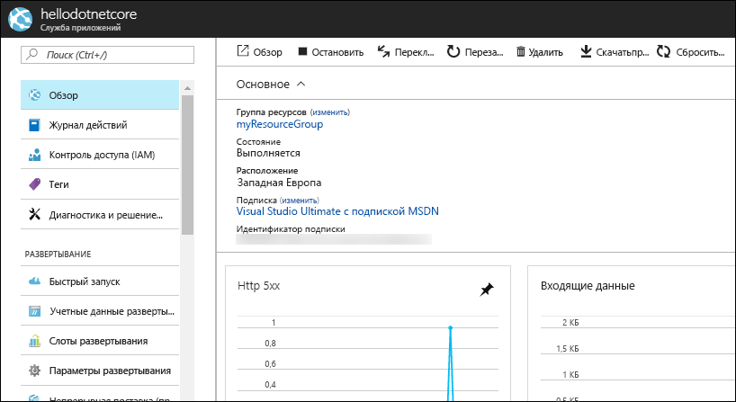

# <a name="create-a-net-core-web-app-in-a-linux-container-in-azure"></a>Создание веб-приложения .NET Core в контейнере Linux в Azure

Платформа [Веб-приложение для контейнеров](app-service-linux-intro.md) — это высокомасштабируемая служба размещения с самостоятельной установкой исправлений на основе операционной системы Linux. В этом кратком руководстве показано, как создать приложение [.NET Core](https://docs.microsoft.com/aspnet/core/) на платформе Azure "Веб-приложения для контейнеров". Создайте веб-приложение с помощью [Azure CLI](https://docs.microsoft.com/cli/azure/get-started-with-azure-cli) и разверните код .NET Core в веб-приложении с помощью Git.


Выполните действия, приведенные ниже, с помощью компьютера Mac, Windows или Linux. 

## <a name="prerequisites"></a>Предварительные требования

Для работы с этим кратким руководством сделайте следующее:

* [установите Git](https://git-scm.com/);
* [установите пакет SDK для .NET Core](https://www.microsoft.com/net/download/core).

[!INCLUDE [quickstarts-free-trial-note](../../../includes/quickstarts-free-trial-note.md)]

## <a name="create-the-app-locally"></a>Локальное создание приложения ##

В окне терминала на компьютере создайте каталог `hellodotnetcore` и перейдите в него. 

```bash
md hellodotnetcore
cd hellodotnetcore
``` 

Создайте веб-приложение .NET Core.

```bash
dotnet new web
``` 

## <a name="run-the-app-locally"></a>Локальный запуск приложения

Восстановите пакеты NuGet и запустите приложение.

```bash
dotnet restore
dotnet run
```

Откройте веб-браузер и перейдите к приложению в `http://localhost:5000`.

На странице отобразится сообщение **Hello World** из примера приложения.


В окне терминала нажмите клавиши **CTRL+C**, чтобы выйти из веб-сервера. Инициализируйте репозиторий Git для проекта .NET Core.

```bash
git init
git add .
git commit -m "first commit"
```

[!INCLUDE [cloud-shell-try-it.md](../../../includes/cloud-shell-try-it.md)]

[!INCLUDE [Configure deployment user](../../../includes/configure-deployment-user.md)] 

[!INCLUDE [Create resource group](../../../includes/app-service-web-create-resource-group.md)] 

[!INCLUDE [Create app service plan](../../../includes/app-service-web-create-app-service-plan-linux.md)] 

## <a name="create-a-web-app"></a>Создание веб-приложения

Создайте [веб-приложение](../app-service-web-overview.md) в рамках плана `myAppServicePlan` службы приложений с помощью команды [az webapp create](/cli/azure/webapp#create). Не забудьте указать уникальное имя приложения вместо `<app name>`.

Для среды выполнения в следующей команде задано значение `DOTNETCORE|1.1`. Чтобы просмотреть все поддерживаемые среды выполнения, выполните команду [az webapp list-runtimes](/cli/azure/webapp#list-runtimes).

```azurecli-interactive
az webapp create --resource-group myResourceGroup --plan myAppServicePlan --name <app name> --runtime "DOTNETCORE|1.1" --deployment-local-git
```

[!INCLUDE [Create web app](../../../includes/app-service-web-create-web-app-result.md)] 


Вы создали пустое веб-приложение в контейнере Linux со включенным развертыванием Git.

[!INCLUDE [Push to Azure](../../../includes/app-service-web-git-push-to-azure.md)] 

```bash
Counting objects: 22, done.
Delta compression using up to 8 threads.
Compressing objects: 100% (18/18), done.
Writing objects: 100% (22/22), 51.21 KiB | 3.94 MiB/s, done.
Total 22 (delta 1), reused 0 (delta 0)
remote: Updating branch 'master'.
remote: Updating submodules.
remote: Preparing deployment for commit id '741f16d1db'.
remote: Generating deployment script.
remote: Project file path: ./hellodotnetcore.csproj
remote: Generated deployment script files
remote: Running deployment command...
remote: Handling ASP.NET Core Web Application deployment.
remote: ...............................................................................................
remote:   Restoring packages for /home/site/repository/hellodotnetcore.csproj...
remote: ....................................
remote:   Installing System.Xml.XPath 4.0.1.
remote:   Installing System.Diagnostics.Tracing 4.1.0.
remote:   Installing System.Threading.Tasks.Extensions 4.0.0.
remote:   Installing System.Reflection.Emit.ILGeneration 4.0.1.
remote:   ...
remote: Finished successfully.
remote: Running post deployment command(s)...
remote: Deployment successful.
To https://cephalin-dotnetcore.scm.azurewebsites.net/cephalin-dotnetcore.git
 * [new branch]      master -> master
```

## <a name="browse-to-the-app"></a>Переход в приложение

Перейдите в развертываемое приложение с помощью веб-браузера.

```bash
http://<app_name>.azurewebsites.net
```

Пример кода Node.js выполняется в веб-приложении службы приложений Azure.


**Поздравляем!** Вы развернули свое первое приложение Node.js в службе приложений.

## <a name="update-and-redeploy-the-code"></a>Обновление и повторное развертывание кода

В локальном каталоге откройте файл _Startup.cs_. Внесите некоторые изменения в текст в вызове метода `context.Response.WriteAsync`:

```csharp
await context.Response.WriteAsync("Hello Azure!");
```

Зафиксируйте изменения в Git, а затем отправьте изменения кода в Azure.

```bash
git commit -am "updated output"
git push azure master
```

После завершения развертывания переключитесь в окно браузера, открытое на этапе **перехода в приложение**, и щелкните "Обновить".


## <a name="manage-your-new-azure-web-app"></a>Управление новым веб-приложением Azure

Перейдите на <a href="https://portal.azure.com" target="_blank">портал Azure</a> для управления созданным веб-приложением.

В меню слева выберите **Службы приложений**, а затем щелкните имя своего веб-приложения Azure.


Отобразится страница обзора вашего веб-приложения. Вы можете выполнять базовые задачи управления: обзор, завершение, запуск, перезагрузку и удаление. 



В меню слева доступно несколько страниц для настройки приложения. 

[!INCLUDE [cli-samples-clean-up](../../../includes/cli-samples-clean-up.md)]

## <a name="next-steps"></a>Дальнейшие действия

> [!div class="nextstepaction"]
> [Создание веб-приложения .NET Core с базой данных SQL на платформе Azure "Веб-приложение для контейнеров"](tutorial-dotnetcore-sqldb-app.md)

