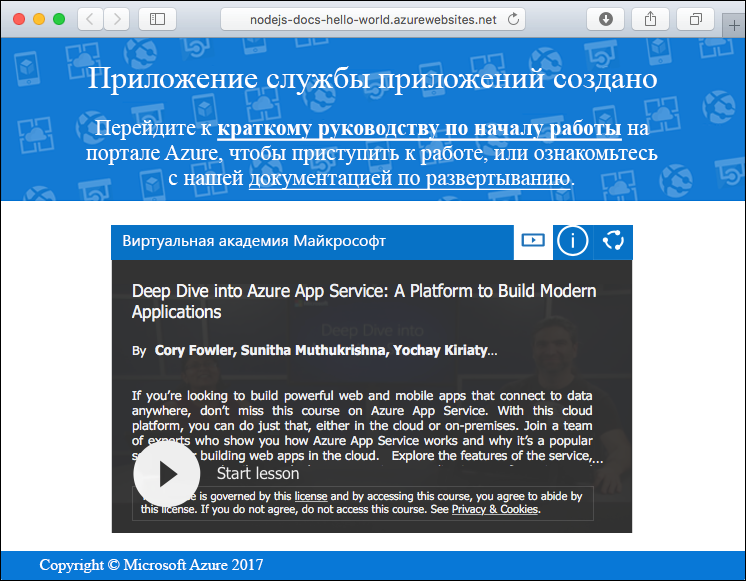
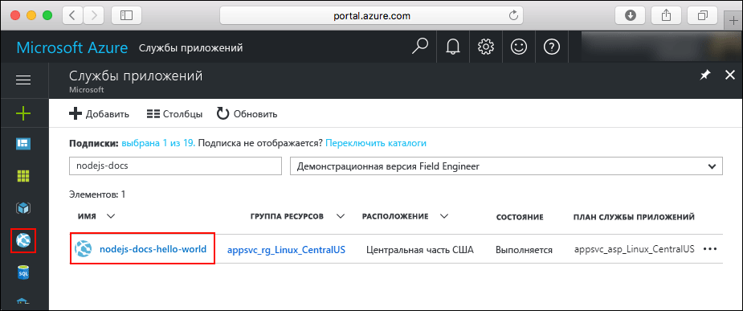
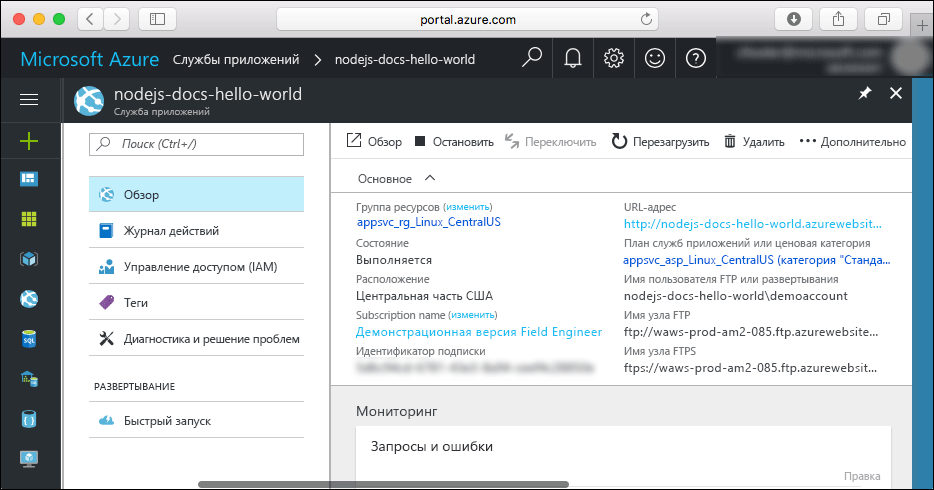

# <a name="create-a-nodejs-web-app-in-azure-app-service-on-linux"></a>Создание веб-приложения Node.js в службе приложений Azure в Linux

> [!NOTE]
> В этой статье мы развернем приложение в службе приложений на платформе Linux. Сведения о развертывании в службе приложений на платформе _Windows_ см. в статье [Создание веб-приложений Node.js в Azure](../app-service-web-get-started-nodejs.md).
>

[Служба приложений на платформе Linux](app-service-linux-intro.md) — это высокомасштабируемая служба размещения с самостоятельной установкой исправлений на основе операционной системы Linux. В этом кратком руководстве показано, как развернуть приложение Node.js в службе приложений в Linux с помощью встроенного образа. С помощью [Azure CLI](https://docs.microsoft.com/cli/azure/get-started-with-azure-cli) вы можете создать веб-приложение со встроенным образом, в котором можно развернуть код Node.js, используя Git.


Выполните инструкции, приведенные в этом руководстве, на компьютере Mac, Windows или Linux. Или вы можете следовать указаниям в [видео](#video) по этой теме.

[!INCLUDE [quickstarts-free-trial-note](../../../includes/quickstarts-free-trial-note.md)]

## <a name="prerequisites"></a>предварительным требованиям

Для работы с этим кратким руководством сделайте следующее:

* <a href="https://git-scm.com/" target="_blank">установите Git</a>;
* <a href="https://nodejs.org/" target="_blank">установите Node.j и NPM</a>.

## <a name="download-the-sample"></a>Скачивание примера приложения

В окне терминала на компьютере выполните следующую команду, чтобы клонировать репозиторий с примером приложения на локальный компьютер.

```bash
git clone https://github.com/Azure-Samples/nodejs-docs-hello-world
```

Используйте это окно терминала для выполнения всех команд в рамках этого руководства.

Перейдите в каталог, в котором содержится образец кода.

```bash
cd nodejs-docs-hello-world
```

## <a name="run-the-app-locally"></a>Локальный запуск приложения

Запустите приложение в локальной среде, открыв окно терминала и выполнив скрипт `npm start`, чтобы запустить встроенный HTTP-сервер Node.js.

```bash
npm start
```

Откройте веб-браузер и перейдите к примеру приложения по адресу `http://localhost:1337`.

На странице отобразится сообщение **Hello World** из примера приложения.


В окне терминала нажмите клавиши **CTRL+C**, чтобы выйти из веб-сервера.

[!INCLUDE [cloud-shell-try-it.md](../../../includes/cloud-shell-try-it.md)]

[!INCLUDE [Configure deployment user](../../../includes/configure-deployment-user.md)]

[!INCLUDE [Create resource group](../../../includes/app-service-web-create-resource-group-linux.md)]

[!INCLUDE [Create app service plan](../../../includes/app-service-web-create-app-service-plan-linux.md)]

## <a name="create-a-web-app"></a>Создание веб-приложения

[!INCLUDE [Create web app](../../../includes/app-service-web-create-web-app-nodejs-linux-no-h.md)]

Перейдите к только что созданному веб-приложению. Замените _&lt;имя_приложения>_ уникальным именем веб-приложения.

```bash
http://<app name>.azurewebsites.net
```

Новое веб-приложение должно выглядеть так:



[!INCLUDE [Push to Azure](../../../includes/app-service-web-git-push-to-azure.md)]

```bash
Counting objects: 23, done.
Delta compression using up to 4 threads.
Compressing objects: 100% (21/21), done.
Writing objects: 100% (23/23), 3.71 KiB | 0 bytes/s, done.
Total 23 (delta 8), reused 7 (delta 1)
remote: Updating branch 'master'.
remote: Updating submodules.
remote: Preparing deployment for commit id 'bf114df591'.
remote: Generating deployment script.
remote: Generating deployment script for node.js Web Site
remote: Generated deployment script files
remote: Running deployment command...
remote: Handling node.js deployment.
remote: Kudu sync from: '/home/site/repository' to: '/home/site/wwwroot'
remote: Copying file: '.gitignore'
remote: Copying file: 'LICENSE'
remote: Copying file: 'README.md'
remote: Copying file: 'index.js'
remote: Copying file: 'package.json'
remote: Copying file: 'process.json'
remote: Deleting file: 'hostingstart.html'
remote: Ignoring: .git
remote: Using start-up script index.js from package.json.
remote: Node.js versions available on the platform are: 4.4.7, 4.5.0, 6.2.2, 6.6.0, 6.9.1.
remote: Selected node.js version 6.9.1. Use package.json file to choose a different version.
remote: Selected npm version 3.10.8
remote: Finished successfully.
remote: Running post deployment command(s)...
remote: Deployment successful.
To https://<app_name>.scm.azurewebsites.net:443/<app_name>.git
 * [new branch]      master -> master
```

## <a name="browse-to-the-app"></a>Переход в приложение

Перейдите в развертываемое приложение с помощью веб-браузера.

```bash
http://<app_name>.azurewebsites.net
```

Пример кода Node.js выполняется в веб-приложении со встроенным образом.


**Поздравляем!** Вы развернули свое первое приложение Node.js в службе приложений в Linux.

## <a name="update-and-redeploy-the-code"></a>Обновление и повторное развертывание кода

В локальном каталоге откройте файл `index.js` в приложении Node.js и немного измените текст в вызове `response.end`.

```nodejs
response.end("Hello Azure!");
```

Зафиксируйте изменения в Git, а затем отправьте изменения кода в Azure.

```bash
git commit -am "updated output"
git push azure master
```

После завершения развертывания переключитесь в окно браузера, открытое на этапе **перехода в приложение**, и щелкните "Обновить".


## <a name="manage-your-new-azure-web-app"></a>Управление новым веб-приложением Azure

Перейдите на <a href="https://portal.azure.com" target="_blank">портал Azure</a> для управления созданным веб-приложением.

В меню слева выберите **Службы приложений**, а затем щелкните имя своего веб-приложения Azure.



Отобразится страница обзора вашего веб-приложения. Вы можете выполнять базовые задачи управления: обзор, завершение, запуск, перезагрузку и удаление. 



В меню слева доступно несколько страниц для настройки приложения. 

[!INCLUDE [cli-samples-clean-up](../../../includes/cli-samples-clean-up.md)]

## <a name="video"></a>Видео

>[!VIDEO https://www.youtube.com/embed/S9eqK7xPKqU]

## <a name="next-steps"></a>Дополнительная информация

> [!div class="nextstepaction"]
> [Node.js с MongoDB](tutorial-nodejs-mongodb-app.md)
