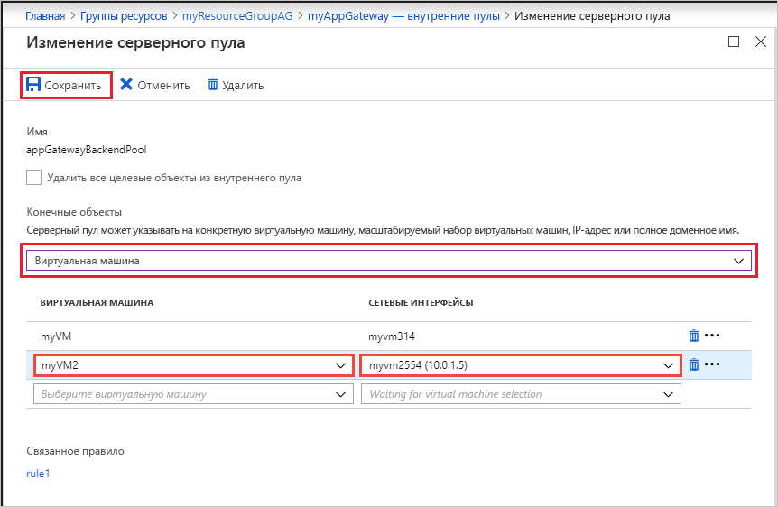

# <a name="create-an-application-gateway-using-the-azure-portal"></a>Создание шлюза приложений с помощью портала Azure

Портал Azure можно использовать для создания шлюзов приложений и управления ими. В этом кратком руководстве показано, как создать сетевые ресурсы, внутренние серверы и шлюз приложений.

Если у вас еще нет подписки Azure, [создайте бесплатную учетную запись Azure](https://azure.microsoft.com/free/?WT.mc_id=A261C142F), прежде чем начинать работу.

## <a name="log-in-to-azure"></a>Вход в Azure

Войдите на портал Azure по адресу [http://portal.azure.com](http://portal.azure.com)

## <a name="create-an-application-gateway"></a>Создание шлюза приложений

Виртуальная сеть необходима для обмена данными между создаваемыми ресурсами. В этом примере создаются две подсети: одна для шлюза приложений, а другая — для внутренних серверов. Вы можете создать виртуальную сеть во время создания шлюза приложений.

1. Нажмите кнопку **Создать** в верхнем левом углу портала Azure.
2. Щелкните **Сети**, а затем в списке "Рекомендованные" выберите **Шлюз приложений**.
3. Введите следующие значения для шлюза приложений:

    - *myAppGateway* — для имени шлюза приложений.
    - *myResourceGroupAG* — для новой группы ресурсов.

    

4. Оставьте значения по умолчанию для остальных параметров и нажмите кнопку **ОК**.
5. Щелкните **Выбрать виртуальную сеть**, выберите **Создать**, а затем введите следующие значения для виртуальной сети:

    - *myVNet* — имя виртуальной сети;
    - *10.0.0.0/16* — диапазон адресов виртуальной сети;
    - *myAGSubnet* — имя подсети;
    - *10.0.0.0/24* — диапазон адресов подсети.

    

6. Нажмите кнопку **ОК**, чтобы создать виртуальную сеть и подсеть.
6. Щелкните **Выбрать общедоступный IP-адрес**, выберите **Создать**, а затем введите имя общедоступного IP-адреса. В этом примере общедоступный IP-адрес — *myAGPublicIPAddress*. Оставьте значения по умолчанию для остальных параметров и нажмите кнопку **ОК**.
8. Примите значения по умолчанию для конфигурации прослушивателя, оставьте брандмауэр веб-приложения отключенным и нажмите кнопку **ОК**.
9. Просмотрите параметры на странице сводки и нажмите кнопку **ОК**, чтобы создать виртуальную сеть, общедоступный IP-адрес и шлюз приложений. Процесс создания шлюза приложений может занять несколько минут. Дождитесь успешного завершения развертывания, прежде чем переходить к следующему разделу.

### <a name="add-a-subnet"></a>Добавление подсети

1. Щелкните **Все ресурсы** в меню слева, а затем из списка ресурсов выберите **myVNet**.
2. Щелкните **Подсети**, а затем — **Подсеть**.

    

3. Введите *myBackendSubnet* в качестве имени подсети и нажмите кнопку **ОК**.

## <a name="create-backend-servers"></a>Создание внутренних серверов

В этом примере вы создадите две виртуальные машины, которые будут использоваться как внутренние серверы для шлюза приложений. Вы также установите службы IIS на виртуальных машинах, чтобы убедиться, что шлюз приложений успешно создан.

### <a name="create-a-virtual-machine"></a>Создание виртуальной машины

1. Нажмите кнопку **Создать**.
2. Щелкните **Вычисления**, а затем в списке "Рекомендованные" выберите **Windows Server 2016 Datacenter**.
3. Введите следующие значения для виртуальной машины:

    - *myVM* — имя виртуальной машины;
    - *azureuser* — имя пользователя учетной записи администратора;
    - *Azure123456!* — пароль.
    - Щелкните **Use existing** (Использовать существующую), а затем выберите *myResourceGroupAG*.

4. Последовательно выберите **ОК**.
5. Выберите значение **DS1_V2** в качестве размера виртуальной машины и нажмите кнопку **Выбрать**.
6. Убедитесь, что выбрана виртуальная сеть **myVNet** и подсеть **myBackendSubnet**. 
7. Щелкните **Отключено**, чтобы отключить диагностику загрузки.
8. Нажмите кнопку **ОК**, просмотрите параметры на странице сводки и нажмите кнопку **Создать**.

### <a name="install-iis"></a>Установка служб IIS

1. Откройте интерактивную оболочку и убедитесь, что для нее задано значение **PowerShell**.

    

2. Чтобы установить службы IIS, выполните на виртуальной машине следующие команды: 

    ```azurepowershell-interactive
    Set-AzureRmVMExtension `
      -ResourceGroupName myResourceGroupAG `
      -ExtensionName IIS `
      -VMName myVM `
      -Publisher Microsoft.Compute `
      -ExtensionType CustomScriptExtension `
      -TypeHandlerVersion 1.4 `
      -SettingString '{"commandToExecute":"powershell Add-WindowsFeature Web-Server; powershell Add-Content -Path \"C:\\inetpub\\wwwroot\\Default.htm\" -Value $($env:computername)"}' `
      -Location EastUS
    ```

3. Создайте вторую виртуальную машину и установите службы IIS, следуя только что выполненным инструкциям. Введите *myVM2* в качестве имени виртуальной машины и значения параметра VMName в команде Set-AzureRmVMExtension.

### <a name="add-backend-servers"></a>Добавление внутренних серверов

3. Выберите **Все ресурсы**, а затем щелкните **myAppGateway**.
4. Щелкните **Серверные пулы**. Пул по умолчанию был создан автоматически с помощью шлюза приложений. Щелкните **appGatewayBackendPool**.
5. Щелкните **Добавить цель**, чтобы добавить в серверный пул каждую созданную виртуальную машину.

    

6. Выберите команду **Сохранить**.

## <a name="test-the-application-gateway"></a>Тестирование шлюза приложений

1. Найдите общедоступный IP-адрес для шлюза приложений на экране обзора. Выберите **Все ресурсы**, а затем щелкните **myAGPublicIPAddress**.

    

2. Скопируйте общедоступный IP-адрес и вставьте его в адресную строку браузера.

    


## <a name="clean-up-resources"></a>Очистка ресурсов

Ставшие ненужными группу ресурсов, шлюз приложений и все связанные ресурсы можно удалить. Для этого выберите группу ресурсов, содержащую шлюз приложений, и щелкните **Удалить**.

## <a name="next-steps"></a>Дополнительная информация

В этом кратком руководстве вы создали группу ресурсов, сетевые ресурсы и внутренние серверы. Затем с помощью этих ресурсов вы создали шлюз приложения. Чтобы узнать больше о шлюзах приложений и связанных с ними ресурсах, перейдите к статьям с инструкциями.
