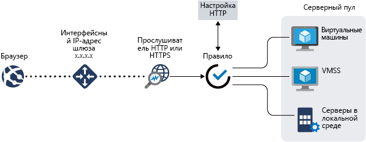
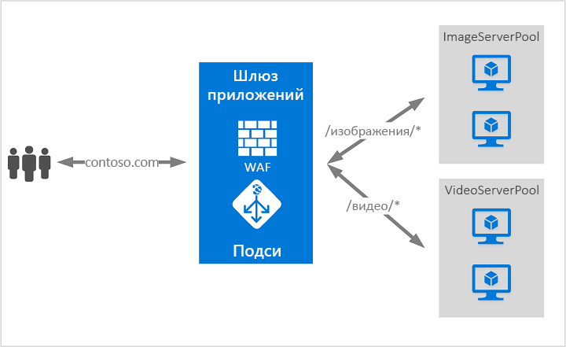

# Что такое шлюз приложений Azure?

Шлюз приложений Azure — это подсистема балансировки нагрузки веб-трафика, предназначенная для управления трафиком веб-приложений. Традиционные подсистемы балансировки нагрузки работают на транспортном уровне (уровень 4 OSI — протоколы TCP и UDP) и маршрутизируют трафик к IP-адресу и порту назначения в зависимости от исходного IP-адреса и порта.

Однако шлюз приложений обеспечивает дополнительную точность. Например, вы можете маршрутизировать трафик на основе входящего URL-адреса. Поэтому, если во входящем URL-адресе есть элемент `/images`, вы можете направлять трафик к определенному набору (пулу) серверов, настроенных для изображений. Если в URL-адресе есть элемент `/video`, трафик направляется к другому пулу, оптимизированному для видео.

Этот тип маршрутизации называется балансировкой нагрузки на уровне приложения (уровень 7 OSI). Шлюз приложений Azure может выполнять маршрутизацию на основе URL-адреса и многие другие действия. 

Шлюз приложений Azure включает описанные ниже возможности.

## Общедоступная предварительная версия автомасштабирования

В дополнение к функциям, описанным в этой статье, Шлюз приложений также предлагает общедоступную предварительную версию нового SKU [Standard_V2] с возможностью автомасштабирования и другими важными улучшениями производительности.

- **Автоматическое масштабирование**. Шлюз приложений или развертывания WAF в SKU автоматического масштабирования могут изменять масштаб в соответствии с изменениями в объеме трафика. Кроме того, автоматическое масштабирование позволяет не выбирать размер развертывания или количество экземпляров во время подготовки. 

- **Избыточность в пределах зоны**. Развертывание шлюза приложений или WAF теперь может охватывать несколько Зон доступности; это снимает необходимость в подготовке и закреплении отдельных экземпляров Шлюза приложений в каждой зоне с помощью диспетчера трафика.

- **Статический виртуальный IP-адрес** — виртуальный IP-адрес шлюза приложений теперь поддерживает исключительно статический тип виртуального IP-адреса. Это гарантирует, что виртуальный IP-адрес, связанный со шлюзом приложений, не изменится даже после перезагрузки.

- **Ускорение развертывания и обновления** по сравнению с общедоступным SKU. 

- **В пять раз более высокая скорость загрузки** чем в общедоступном SKU.

Дополнительные сведения о функциях общедоступной предварительной версии Шлюза приложений см. в статье [Автоматическое масштабирование и шлюз приложений, избыточный между зонами (общедоступная предварительная версия)](application-gateway-autoscaling-zone-redundant.md).

## Завершение запросов SSL

Шлюз приложений поддерживает функции моста SSL, после применения которых трафик обычно передается в незашифрованном виде на внутренние серверы. Это позволяет избавить веб-серверы от накладных расходов, связанных с ресурсоемкими операциями шифрования и расшифровки. Но иногда незашифрованный обмен данными на серверах не является приемлемым вариантом. Причина может заключаться в требованиях безопасности и соответствия или в том, что приложение может принимать только безопасные подключения. Теперь для таких приложений служба "Шлюз приложений" поддерживает сквозное шифрование SSL.

## Общедоступная версия контроллера входящего трафика Службы Azure Kubernetes 

Контроллер входящего трафика Шлюза приложений работает в качестве модуля pod в кластере AKS и позволяет Шлюзу приложений выполнять функции входа для кластера AKS. 

Дополнительные сведения см. в статье [Azure Application Gateway Ingress Controller](https://azure.github.io/application-gateway-kubernetes-ingress/) (Контроллер входящего трафика Шлюза приложений Azure).

## фильтрация подключений;

Фильтрация подключений поможет обеспечить корректное удаление элементов серверного пула на протяжении запланированных обновлений службы. Этот параметр включается через параметры HTTP серверной части и может применяться ко всем элементам серверного пула при создании правила. После включения Шлюз приложений гарантирует, что все снятые с регистрации экземпляры серверного пула не получат новых запросов, а имеющиеся запросы будут выполняться в течение установленного времени. Это относится и к экземплярами серверного пула, которые явно удалены из него с помощью вызова API, и к экземплярам серверного пула, которые после проверки работоспособности рассматриваются как неработоспособные.

## Пользовательские страницы ошибок
Шлюз приложений позволяет создавать пользовательские страницы ошибок вместо отображения страниц ошибок по умолчанию. На пользовательской странице ошибок вы можете использовать собственные символику и макет.

Дополнительные сведения см. в статье [Create Application Gateway custom error pages](custom-error.md) (Создание пользовательских страниц ошибок с помощью Шлюза приложений).

## Брандмауэр веб-приложения

Брандмауэр веб-приложения (WAF) — это компонент шлюза приложений, обеспечивающий централизованную защиту веб-приложений от распространенных эксплойтов и уязвимостей. Брандмауэр веб-приложения основан на правилах из [основных наборов правил OWASP (открытый проект безопасности веб-приложений)](https://www.owasp.org/index.php/Category:OWASP_ModSecurity_Core_Rule_Set_Project) версии 3.0 или 2.2.9. 

Веб-приложения все чаще подвергаются вредоносным атакам, использующим общеизвестные уязвимости. Повсеместно используются уязвимости для атак путем внедрения кода SQL и межсайтовых сценариев, и это лишь немногие из них. Предотвращение таких атак в коде приложения может быть сложной задачей и потребовать тщательного обслуживания, исправления и мониторинга на многих уровнях топологии приложения. Централизованный брандмауэр веб-приложения значительно упрощает управление безопасностью и помогает администраторам защищать приложение от угроз вторжения. Решение WAF может быстрее реагировать на угрозы безопасности по сравнению с защитой каждого отдельного веб-приложения благодаря установке исправлений известных уязвимостей в центральном расположении. Существующие шлюзы приложений можно преобразовать в шлюзы приложений с поддержкой брандмауэра веб-приложений.

## Маршрутизация на основе URL-адреса

Маршрутизация на основе URL-путей позволяет направлять трафик в пулы тыловых серверов в зависимости от URL-путей поступающих запросов. Один из сценариев — это маршрутизация запросов на различные типы содержимого в различные пулы.

Например, запросы для `http://contoso.com/video/*` направляются в VideoServerPool, а запросы для `http://contoso.com/images/*` — в ImageServerPool. Если ни один из шаблонов пути не подходит, выбирается пул DefaultServerPool.

## Размещение нескольких сайтов

Размещение нескольких сайтов позволяет настроить в одном экземпляре шлюза приложений несколько веб-сайтов. Эта функция позволяет настроить более эффективную топологию развернутых служб, добавляя до 20 веб-сайтов в один шлюз приложений. Каждый веб-сайт может быть направлен к собственному пулу. Например, шлюз приложений может обслуживать трафик для `contoso.com` и `fabrikam.com` из двух пулов серверов с именами ContosoServerPool и FabrikamServerPool.

Запросы для `http://contoso.com` маршрутизируются в ContosoServerPool, а запросы для `http://fabrikam.com` — в FabrikamServerPool.

Точно так же в одном развернутом шлюзе приложений можно разместить два поддомена одного родительского домена. К примерам использования поддоменов можно отнести размещение `http://blog.contoso.com` и `http://app.contoso.com` в одном развернутом шлюзе приложений.

## Перенаправление

Для многих веб-приложений привычна поддержка автоматического перенаправления с HTTP на HTTPS, чтобы все взаимодействия между приложением и его пользователями осуществлялись по зашифрованному пути. 

В прошлом вы могли использовать такие методы, как создание выделенного пула, единственным назначением которого было перенаправление запросов, получаемых по HTTP, на HTTPS. Шлюз приложений поддерживает возможность перенаправления трафика на шлюз приложений. Это упрощает конфигурацию приложения, оптимизирует использование ресурсов и обеспечивает поддержку новых сценариев перенаправления, включая глобальное перенаправление на основе пути. Поддержка перенаправления для шлюза приложений не ограничена лишь перенаправлением с HTTP на HTTPS. Это универсальный механизм перенаправления, позволяющий перенаправить трафик с любого порта и на любой порт, определяемый с помощью правил. Также поддерживается перенаправление на внешние веб-сайты.

Возможности поддержки перенаправления для шлюза приложений:

- Глобальное перенаправление с одного порта на другой через шлюз. Это позволяет организовать на сайте перенаправление с HTTP на HTTPS.
- Перенаправление на основе пути. Этот тип перенаправления позволяет организовать перенаправление с HTTP на HTTPS только в указанную область сайта, например в область корзины для покупок, которая обозначается как `/cart/*`.
- Перенаправление на внешний сайт.

## Сходство сеансов

Функция сходства сеансов на основе файлов cookie удобна, если нужно, чтобы сеанс пользователя выполнялся на одном и том же сервере. Используя управляемые шлюзом файлы cookie, шлюз приложений может направлять последующий трафик из сеанса пользователя на тот же сервер для обработки. Эта функция важна, когда состояние сеанса сохраняется локально на сервере для сеанса пользователя.

## Трафик WebSocket и HTTP/2

Шлюз приложений обеспечивает встроенную поддержку протоколов WebSocket и HTTP/2. Настраиваемый пользователем параметр для выборочного включения или отключения поддержки WebSocket отсутствует. Поддержку HTTP/2 можно включить с помощью Azure PowerShell.

Протоколы WebSocket и HTTP/2 обеспечивают полную дуплексную связь между клиентом и сервером через длительное TCP-подключение. Благодаря этому обеспечивается лучшее интерактивное взаимодействие между веб-сервером и клиентом, которое может быть двунаправленным, без необходимости выполнять опрос, как это требуется в реализациях на основе HTTP. В отличие от HTTP эти протоколы обеспечивают низкие издержки и могут повторно использовать одно и тоже TCP-подключение для нескольких запросов и ответов, благодаря чему ресурсы используются более эффективно. Эти протоколы предназначены для работы через традиционные HTTP-порты 80 и 443.

## Повторное создание заголовков HTTP (общедоступная предварительная версия)

Заголовки HTTP позволяют клиенту и серверу передавать дополнительную информацию вместе с запросом или ответом. Повторное создание этих заголовков HTTP помогает вам выполнить несколько важных сценариев, например, добавление полей заголовков, связанных с безопасностью (HSTS/X-XSS-Protection), или удаление полей заголовков ответов, которые могут раскрыть конфиденциальную информацию (например, имя внутреннего сервера). 

Шлюз приложений теперь поддерживает возможность повторного создания заголовков входящих HTTP-запросов, а также исходящих HTTP-ответов. Вы сможете добавлять, удалять или обновлять заголовки запросов и ответов HTTP, пока пакеты запросов и ответов перемещаются между клиентским и внутренним пулами. Вы можете повторно создать как стандартные (определенные в [RFC 2616](https://www.ietf.org/rfc/rfc2616.txt)), так и нестандартные поля заголовка.  

Дополнительные сведения об этой функции общедоступной предварительной версии см. в разделе [Rewrite HTTP headers with Application Gateway (public preview)](rewrite-http-headers.md) (Повторное создание заголовков HTTP с помощью Шлюза приложений (общедоступная предварительная версия)).

## Дополнительная информация

В зависимости от требований и среды можно создать тестовый шлюз приложений с помощью портала Azure, Azure PowerShell или Azure CLI:

- [Краткое руководство Направление веб-трафика с помощью Шлюза приложений Azure на портале Azure](quick-create-portal.md).
- [Краткое руководство Направление веб-трафика с помощью Шлюза приложений Azure в Azure PowerShell](quick-create-powershell.md).
- [Краткое руководство Направление веб-трафика с помощью Шлюза приложений Azure и Azure CLI](quick-create-cli.md).
