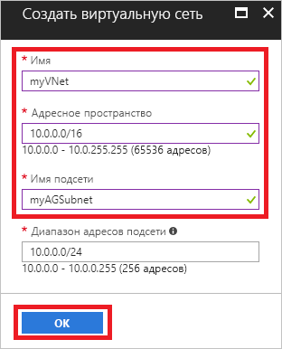
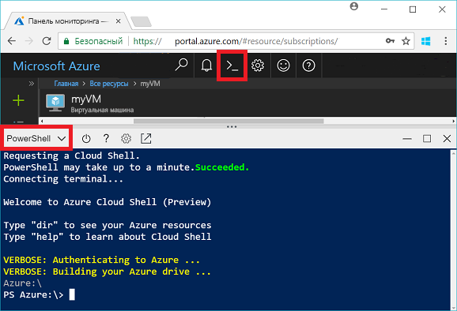
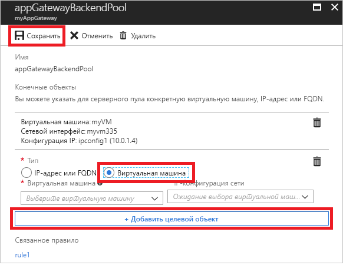
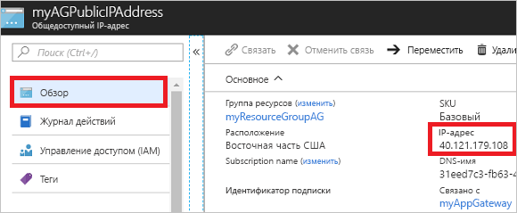

# <a name="quickstart-direct-web-traffic-with-azure-application-gateway---azure-portal"></a>Краткое руководство. Направление веб-трафика с помощью шлюза приложений Azure на портале Azure

Шлюз приложений Azure позволяет направлять веб-трафик приложения к определенным ресурсам. Для этого портам назначаются прослушиватели, создаются определенные правила, и в серверный пул добавляются соответствующие ресурсы.

Из этого краткого руководства вы узнаете, как с помощью портала Azure быстро создать шлюз приложений с двумя виртуальными машинами в серверном пуле. Затем вы протестируете шлюз, чтобы убедиться, что он работает правильно.

Если у вас еще нет подписки Azure, [создайте бесплатную учетную запись Azure](https://azure.microsoft.com/free/?WT.mc_id=A261C142F), прежде чем начинать работу.

## <a name="log-in-to-azure"></a>Вход в Azure

Войдите на портал Azure по адресу [http://portal.azure.com](http://portal.azure.com)

## <a name="create-an-application-gateway"></a>Создание шлюза приложений

Для шлюза приложений нужно создать виртуальную сеть, чтобы он мог обмениваться данными с другими ресурсами. Вы можете создать виртуальную сеть во время создания шлюза приложений. В этом примере создаются две подсети: одна предназначена для шлюза приложений, а другая — для виртуальных машин. 

1. Выберите **Создать ресурс** в верхнем левом углу окна на портале Azure.
2. Щелкните **Сети**, а затем в списке "Рекомендованные" выберите **Шлюз приложений**.
3. Введите следующие значения для шлюза приложений:

    - *myAppGateway* — для имени шлюза приложений.
    - *myResourceGroupAG* — для новой группы ресурсов.

    

4. Оставьте значения по умолчанию для остальных параметров и нажмите кнопку **ОК**.
5. Последовательно выберите **Choose a virtual network (Выбрать виртуальную сеть)** > **Создать**, а затем введите следующие значения для виртуальной сети:

    - *myVNet* — имя виртуальной сети;
    - *10.0.0.0/16* — диапазон адресов виртуальной сети;
    - *myAGSubnet* — имя подсети;
    - *10.0.0.0/24* — диапазон адресов подсети.

    

6. Нажмите кнопку **ОК**, чтобы создать виртуальную сеть и подсеть.
6. Последовательно выберите **Choose a virtual network (Выбрать виртуальную сеть)** > **Создать**, а затем введите имя общедоступного IP-адреса. В этом примере общедоступный IP-адрес — *myAGPublicIPAddress*. Оставьте значения по умолчанию для остальных параметров и нажмите кнопку **ОК**.
8. Оставьте значения по умолчанию для конфигурации прослушивателя, оставьте брандмауэр веб-приложения отключенным и нажмите кнопку **ОК**.
9. Просмотрите параметры на странице сводки и нажмите кнопку **ОК**, чтобы создать виртуальную сеть, общедоступный IP-адрес и шлюз приложений. Создание шлюза приложений может занять до 30 минут. Дождитесь успешного завершения развертывания, прежде чем переходить к следующему разделу.

### <a name="add-a-subnet"></a>Добавление подсети

1. Щелкните **Все ресурсы** в меню слева, а затем из списка ресурсов выберите **myVNet**.
2. Последовательно выберите **Подсети** > **Подсеть**.

    

3. Введите *myBackendSubnet* в качестве имени подсети и нажмите кнопку **ОК**.

## <a name="create-backend-servers"></a>Создание внутренних серверов

В этом примере вы создадите две виртуальные машины, которые будут использоваться как внутренние серверы для шлюза приложений. 

### <a name="create-a-virtual-machine"></a>Создание виртуальной машины

1. Нажмите кнопку **Создать**.
2. Выберите **Вычисления**, а затем в списке "Рекомендованные" выберите **Windows Server 2016 Datacenter**.
3. Введите следующие значения для виртуальной машины:

    - *myVM* — имя виртуальной машины;
    - *azureuser* — имя пользователя учетной записи администратора;
    - *Azure123456!* — пароль.
    - Щелкните **Use existing** (Использовать существующую), а затем выберите *myResourceGroupAG*.

4. Последовательно выберите **ОК**.
5. Укажите размер виртуальной машины, выбрав значение **DS1_V2**, и щелкните **Выбрать**.
6. Убедитесь, что выбрана виртуальная сеть **myVNet** и подсеть **myBackendSubnet**. 
7. Щелкните **Отключено**, чтобы отключить диагностику загрузки.
8. Нажмите кнопку **ОК**, просмотрите параметры на странице сводки и нажмите кнопку **Создать**.

### <a name="install-iis"></a>Установка служб IIS

Вы установите службы IIS на виртуальных машинах, чтобы убедиться, что шлюз приложений успешно создан.

1. Откройте интерактивную оболочку и убедитесь, что для нее задано значение **PowerShell**.

    

2. Чтобы установить службы IIS, выполните на виртуальной машине следующие команды: 

    ```azurepowershell-interactive
    Set-AzureRmVMExtension `
      -ResourceGroupName myResourceGroupAG `
      -ExtensionName IIS `
      -VMName myVM `
      -Publisher Microsoft.Compute `
      -ExtensionType CustomScriptExtension `
      -TypeHandlerVersion 1.4 `
      -SettingString '{"commandToExecute":"powershell Add-WindowsFeature Web-Server; powershell Add-Content -Path \"C:\\inetpub\\wwwroot\\Default.htm\" -Value $($env:computername)"}' `
      -Location EastUS
    ```

3. Создайте вторую виртуальную машину и установите службы IIS, следуя только что выполненным инструкциям. Введите *myVM2* в качестве имени виртуальной машины и значения параметра VMName в команде Set-AzureRmVMExtension.

### <a name="add-backend-servers"></a>Добавление внутренних серверов

Когда вы создадите виртуальные машины, их нужно будет добавить в серверный пул в шлюзе приложений.

1. Последовательно выберите **Все ресурсы** > **myAppGateway**.
2. Щелкните **Серверные пулы**. Пул по умолчанию был создан автоматически с помощью шлюза приложений. Щелкните **appGatewayBackendPool**.
3. Последовательно выберите **Добавить целевой объект** > **Виртуальная машина** и щелкните *myVM*. Последовательно выберите **Добавить целевой объект** > **Виртуальная машина** и щелкните *myVM2*.

    

4. Выберите команду **Сохранить**.

## <a name="test-the-application-gateway"></a>Тестирование шлюза приложений

Для создания шлюза приложений не требуется устанавливать службы IIS. Но в рамках этого руководства они устанавливаются, чтобы проверить, создан ли шлюз приложений.

1. Найдите общедоступный IP-адрес для шлюза приложений на экране обзора. Последовательно выберите **Все ресурсы** > **myAGPublicIPAddress**.

    

2. Скопируйте общедоступный IP-адрес и вставьте его в адресную строку браузера.

    

Когда вы обновляете браузер, должно отобразиться имя другой виртуальной машины.

## <a name="clean-up-resources"></a>Очистка ресурсов

Сначала просмотрите ресурсы, созданные вместе со шлюзом приложений. Затем вы можете удалить группу ресурсов, шлюз приложений и все связанные с ними ресурсы, если они больше не требуются. Для этого выберите группу ресурсов, содержащую шлюз приложений, и щелкните **Удалить**.

## <a name="next-steps"></a>Дополнительная информация

> [!div class="nextstepaction"]
> [Manage web traffic with an application gateway using Azure CLI](./tutorial-manage-web-traffic-cli.md) (Управление веб-трафиком с помощью шлюза приложений в Azure CLI)
