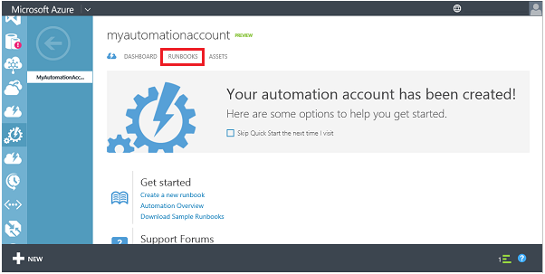

<properties 
	pageTitle="Начало работы со службой автоматизации Azure" 
	description="Узнайте, как импортировать и выполнять задания по автоматизации в Azure." 
	services="automation" 
	documentationCenter="" 
	authors="bwren" 
	manager="stevenka" 
	editor=""/>

<tags 
	ms.service="automation" 
	ms.workload="tbd" 
	ms.tgt_pltfrm="na" 
	ms.devlang="na" 
	ms.topic="hero-article" 
	ms.date="2/20/2015" 
	ms.author="bwren"/>

# Начало работы со службой автоматизации Azure

## Что такое служба автоматизации Azure

Служба автоматизации Microsoft Azure позволяет пользователям автоматизировать задачи, типичные для выполнения в облачных средах. Такие задачи обычно выполняются вручную, занимают много времени, подвержены ошибкам и часто повторяются. С помощью модулей Runbook, основанных на рабочих процессах Windows PowerShell, в среде Azure можно создавать ресурсы, отслеживать их состояние, управлять ими и развертывать их. С помощью этого руководства вы научитесь запускать простой модуль Runbook, а в конце вам будут предложены ресурсы для изучения дополнительных возможностей службы.

## Учебник
В этом учебнике описывается процедура создания учетной записи службы автоматизации, импорта примера модуля Runbook «Hello World» в службу автоматизации Azure, запуска этого модуля и последующего просмотра результатов его выполнения.

Для работы с этим учебником вам потребуется подписка Azure. Если у вас ее нет, <a href="/pricing/member-offers/msdn-benefits-details/" target="_blank">активируйте преимущества для подписчиков MSDN</a> или <a href="/pricing/free-trial/" target="_blank">зарегистрируйтесь в бесплатной пробной версии</a>.

[AZURE.INCLUDE [automation-note-authentication](../includes/automation-note-authentication.md)]

## Создание учетной записи службы автоматизации

Учетная запись службы автоматизации — это контейнер для ваших ресурсов в службе автоматизации Azure. Он позволяет разделять среды и дополнительно упорядочивать рабочие процессы. Дополнительные сведения см. в статье [Учетные записи автоматизации](http://aka.ms/runbookauthor/azure/automationaccounts) в библиотеке службы автоматизации. Если у вас уже есть учетная запись, этот шаг можно пропустить.

1.	Выполните вход на [портал управления Azure](http://manage.windowsazure.com).

2.	На портале управления выберите **Создать учетную запись автоматизации**.

	

3.	На странице **Добавление новой учетной записи службы автоматизации** введите имя учетной записи и выберите для нее регион. Регион определяет, где будут храниться соответствующие ресурсы службы автоматизации. Регион не влияет на функциональность учетной записи, но модули Runbook могут выполняться быстрее, если ресурсы Azure и учетная запись службы автоматизации будут храниться рядом. Указав все необходимые сведения, щелкните флажок.

	

## Импорт модуля Runbook из коллекции

[Коллекция Runbook](http://aka.ms/runbookgallery) содержит образцы модулей Runbook, которые можно импортировать непосредственно в учетную запись службы автоматизации Azure. Это даст вам возможность использовать работу других пользователей PowerShell и службы автоматизации Azure. На этом этапе вы импортируете из коллекции модуль-образец «Hello World».

4.	На странице **Автоматизация** щелкните только что созданную новую учетную запись.
 
	

5.	Щелкните **МОДУЛИ RUNBOOK**.

	
  
6.	Щелкните **Создать** \> **Модуль Runbook** \> **Из Коллекции**.

	

7.  Выберите категорию **Учебные**, а затем **Hello World для службы автоматизации Azure **. Нажмите кнопку со стрелкой, направленной вправо.

	

8.  Ознакомьтесь с содержанием модуля Runbook, а затем нажмите кнопку со стрелкой вправо.

	

8.	Ознакомьтесь с информацией о модуле Runbook, а затем нажмите на кнопку c флажком.

	

## Публикация модуля Runbook 

Модуль Runbook сначала импортируется в режиме черновика. Это означает, что вы все еще можете изменять его. Публикация версии модуля, которую можно запускать, выполняется позже. Так как этот модуль представляет собой образец и для него не требуются дополнительные настройки, его можно опубликовать без каких-либо изменений. Дополнительные сведения см. в статье [Изменение Runbook](http://aka.ms/runbookauthor/azure/publishrunbook).

9.	После завершения импорта модуля Runbook щелкните **Write-HelloWorld**.

	

9.	Щелкните **АВТОР**, а затем щелкните **ЧЕРНОВИК**.

	Изменить содержимое модуля Runbook можно в режиме черновика. Для этого модуля Runbook вносить изменения не потребуется.

	
 
10.	Нажмите кнопку **ОПУБЛИКОВАТЬ**, чтобы пометить модуль Runbook как готовый для использования в производственной среде.

	
   
11.	Когда появится запрос на подтверждение, нажмите кнопку **Да**.
 
	

## Запуск модуля Runbook

Импортировав и опубликовав модуль Runbook, запустите его и просмотрите выходные данные. Дополнительные сведения см. в статьях [Запуск Runbook](http://aka.ms/runbookauthor/azure/startrunbook) и [Выходные данные и сообщения Runbook](http://aka.ms/runbookauthor/azure/runbookoutput).

12.	После открытия модуля Runbook **Write-HelloWorld** щелкните **ЗАПУСТИТЬ**.

	
 
13.	На странице **Укажите значения параметров Runbook** введите **Имя**, которое будет использоваться в качестве входного параметра для сценария Write-HelloWorld.ps1, и установите флажок.

	
  
14.	Щелкните **ЗАДАНИЯ**, чтобы проверить состояние только что запущенного задания Runbook, и щелкните метку времени в столбце **ЗАПУСК ЗАДАНИЯ** для просмотра информации о заданиях.

	

15.	На странице **СВОДКА** можно просмотреть сводку, введенные параметры и результат задания.
 
	

Поздравляем! Вы завершили работу с этим учебником.

## Дальнейшие действия 
1. Простой модуль Runbook в этом учебнике **не управляет службами Azure**. Большинство модулей используют для этого [командлеты Azure](http://msdn.microsoft.com/library/jj156055.aspx), для чего требуется аутентификация в подписке Azure. Чтобы настроить свою подписку Azure для работы с этими командлетами, следуйте инструкциям в статье [Настройка Azure для управления с помощью модулей Runbook](http://aka.ms/azureautomationauthentication).  
2. Дополнительные сведения о возможностях службы автоматизации Azure приведены в разделе [Ресурсы](#resources) ниже.
3. Подпишитесь на [блог о службе автоматизации Azure](http://azure.microsoft.com/blog/tag/azure-automation) и следите за новостями от группы разработчиков.

## Ресурсы

Дополнительные сведения о службе автоматизации Azure и создании собственных модулей Runbook можно найти и на других ресурсах.

- [Библиотека службы автоматизации Azure](http://go.microsoft.com/fwlink/p/?LinkId=392860). Содержит полную документацию по настройке и администрированию службы автоматизации Azure, а также по созданию собственных модулей Runbook. 
- [Командлеты Azure PowerShell](http://msdn.microsoft.com/library/jj156055.aspx). Здесь приведены сведения об автоматизации операций в службах Azure с помощью Windows PowerShell. Модули Runbook используют эти командлеты для работы с ресурсами Azure.
- [Блог о службе автоматизации](http://azure.microsoft.com/blog/tag/azure-automation). Место, где Майкрософт предлагаем самые последние сведения о службе автоматизации Azure.
- [Форум о службе автоматизации](http://go.microsoft.com/fwlink/p/?LinkId=390561). Тут можно публиковать вопросы о службе автоматизации Azure и адресовать их сообществу и представителям Майкрософт.

## Примеры и вспомогательные модули Runbook

Мы совместно с сообществом, которое создалось вокруг службы автоматизации Azure, предоставляем примеры модулей Runbook, которые помогут вам научиться создавать собственные решения, а также вспомогательные модули, которые можно использовать для создания более крупных задач автоматизации. Эти модули можно загрузить с сайта [Центр сценариев](http://go.microsoft.com/fwlink/p/?LinkId=393029) или импортировать непосредственно в службу автоматизации Azure с помощью [коллекции Runbook](http://aka.ms/runbookgallery).
  

## Отзыв

<strong>Отправляйте нам отзывы!</strong> Если вы ищете модуль интеграции или определенное решение для службы автоматизации Azure, в котором используются модули Runbook, разместите соответствующий запрос на сайте «Центр сценариев». Если вы хотите оставить отзыв или запрос на ту или иную функцию для службы автоматизации Azure, оставляйте их на сайте [User Voice](http://feedback.windowsazure.com/forums/34192--general-feedback). Спасибо!<!--HONumber=52-->
