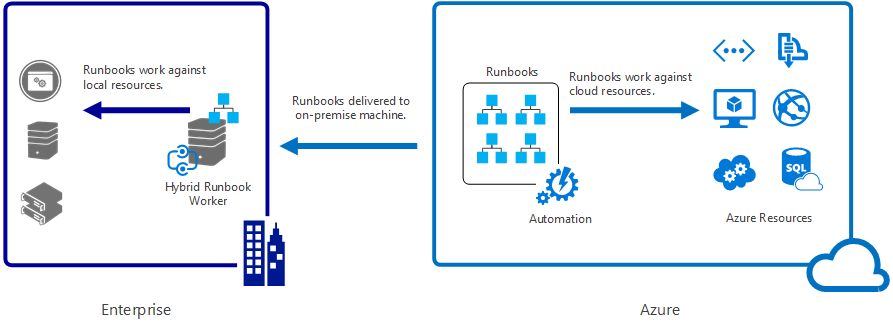
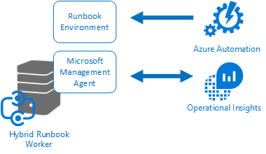
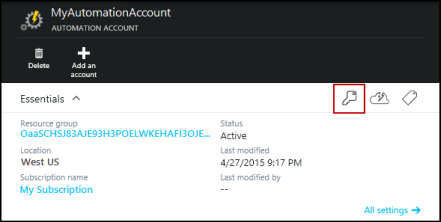

<properties 
   pageTitle="Гибридные компоненты Runbook Worker в службе автоматизации Azure"
   description="В этой статье содержатся сведения об установке и использовании гибридного компонента Runbook Worker, который является элементом службы автоматизации Azure, позволяющей запускать модули Runbook на компьютерах в локальном центре обработки данных."
   services="automation"
   documentationCenter=""
   authors="bwren"
   manager="stevenka"
   editor="tysonn" />
<tags 
   ms.service="automation"
   ms.devlang="na"
   ms.topic="article"
   ms.tgt_pltfrm="na"
   ms.workload="infrastructure-services"
   ms.date="05/11/2015"
   ms.author="bwren" />

# Гибридные компоненты Runbook Worker в службе автоматизации Azure

Модули Runbook в службе автоматизации Azure не могут получить доступ к ресурсам локального центра обработки данных, поскольку они выполняются в облаке Azure. Функция гибридных компонентов Runbook Worker службы автоматизации Azure позволяет запускать модули Runbook на компьютерах, расположенных в центре обработки данных, для управления локальными ресурсами. Модули Runbook хранятся и управляются службой автоматизации Azure и затем доставляются в одну или несколько локальных машин, где они выполняются.

Эта функция проиллюстрирована на следующем изображении.

Вы можете назначить один или несколько компьютеров в вашем центре обработки данных в качестве гибридного компонента Runbook Worker и запускать модули Runbook при помощи службы автоматизации Azure. Каждый компонент Worker требует наличия агента управления Майкрософт с подключением к Azure Operational Insights и средой Runbook службы автоматизации Azure. Operational Insights используется только для установки и технического обслуживания агента управления, а также для отслеживания работы функций компонента Worker. Предоставление элементов Runbook и инструкций по их запуску выполняется службой автоматизации Azure.

Для поддержки гибридных компонентов Runbook Worker отсутствуют требования к брандмауэру для входящих подключений. Агент на локальном компьютере инициирует весь обмен данными со службой автоматизации Azure в облаке. При запуске модуля Runbook служба автоматизации Azure создает инструкцию, которая извлекается агентом. После этого агент извлекает модуль Runbook и все сопутствующие параметры, применяемые перед запуском модуля. Кроме того, из службы автоматизации Azure извлекаются все [средства](http://msdn.microsoft.com/library/dn939988.aspx), которые используются в модуле Runbook.

## Группы гибридных компонентов Runbook Worker

Каждый гибридный компонент Runbook Worker является членом группы гибридных компонентов Runbook Worker, которая указывается при установке агента. Группа может включать одного агента, но в нее можно установить несколько агентов для обеспечения высокого уровня доступности.

При запуске модуля Runbook в гибридном компоненте Runbook Worker указывается группа, в которой он будет выполнен. Члены группы будут определять, какой компонент Worker будет обслуживать запрос. Указание конкретного компонента Worker для выполнения конкретной задачи не предусмотрено.

## Установка гибридного компонента Runbook Worker

### Подготовка среды службы автоматизации Azure

Выполните следующие действия для подготовки среды службы автоматизации Azure для гибридных компонентов Runbook Worker.

#### 1. Создание рабочей области Azure Operational Insights
Если у вас еще нет рабочей области Operational Insights в учетной записи Azure, то следует создать его, воспользовавшись инструкциями в статье [Создание рабочей области Operational Insights](../operational-insights-setup-workspace). Если у вас уже есть рабочая область, вы можете использовать ее.

#### 2. Решение для автоматизации развертывания
Решение автоматизации, которое является компонентом Operational Insights, принудительно устанавливает компоненты, необходимые для конфигурации и поддержки среды модулей Runbook. Следуйте инструкциям, размещенным в статье [Решения Operational Insights](../operational-insights-add-solution), чтобы установить пакет **Служба автоматизации Azure**.

### Настройка локальных машин
Выполните следующие шаги для каждой из локальных машин, которую планируется использовать как гибридный компонент Runbook Worker.

#### 1. Установите агент управления Майкрософт
Агент управления Майкрософт подключает компьютер к Operational Insights и позволяет выполнять логические операции, включенные в решение. Следуйте инструкциям в разделе [Подключение компьютеров напрямую к Operational Insights](../operational-insights-direct-agent), чтобы установить агент на локальный компьютер и подключить его к Operational Insights.

#### 2. Установите среду модулей Runbook и выполните подключение к службе автоматизации Azure
При добавлении компьютера к Operational Insights решение автоматизации устанавливает модуль PowerShell **HybridRegistration**, который содержит командлет **Add-HybridRunbookWorker**. Этот командлет используется для установки среды модулей Runbook на компьютере и ее регистрации в службе автоматизации Azure.

Откройте сеанс PowerShell с правами администратора и запустите следующую команду, чтобы импортировать модуль.

	Import-Module HybridRegistration 

При получении сообщения об ошибке с сообщением о том, что файл модуля не найден, возможно, потребуется воспользоваться следующей командой, которая будет использовать весь путь к файлу модуля.

	Import-Module "C:\Program Files\Microsoft Monitoring Agent\Agent\AzureAutomationFiles\HybridRegistration\HybridRegistration.psd1"

После этого запустите командлет **Add-HybridRunbookWorker**, используя следующий синтаксис:

	Add-HybridRunbookWorker –Name <String> -EndPoint <Url> -Token <String>

- **Имя** — это имя группы гибридных компонентов Runbook Worker. Если эта группа уже существует в учетной записи автоматизации, то к ней добавляется текущий компьютер. Если она еще не существует, то выполняется ее добавление.
- **Конечная точка** — это URL-адрес службы агента. Его можно получить на портале предварительной версии Azure в колонке **Управление ключами**.  
- **Токен** — **первичный ключ доступа** в колонке **Управление ключами**. Колонку "Управление ключами" можно открыть нажатием на значок ключа на панели элементов для учетной записи службы автоматизации.  

#### 3. Установка модулей PowerShell 
Модули Runbook могут использовать любые из действий и командлетов, которые определены в модулях, установленных в вашей среде службы автоматизации Azure. Эти модули не развертываются автоматически на локальных машинах, поэтому их необходимо устанавливать вручную. Исключением является модуль Azure, который устанавливается по умолчанию и предоставляет доступ к командлетам для всех служб и действий службы автоматизации Azure.

Поскольку главной целью функции гибридного компонента Runbook Worker является управление локальными ресурсами, скорее всего, вам потребуется установить модули, которые поддерживают эти ресурсы. Сведения об установке модулей Windows PowerShell можно найти в разделе [Установка модулей](http://msdn.microsoft.com/library/dd878350.aspx).

## Запуск модулей Runbook на гибридном компоненте Runbook Worker

В разделе [Запуск модуля Runbook в службе автоматизации Azure](../automation-starting-a-runbook) описываются различные методы запуска модуля Runbook. Гибридный компонент Runbook Worker добавляет параметр **RunOn**, при помощи которого можно указать имя группы гибридных компонентов Runbook Worker. При указании группы модуль Runbook извлекается и запускается компонентами Worker в этой группе. Если этот параметр не указан, то он будет запущен в службе автоматизации Azure в обычном режиме.

При запуске модуля Runbook на портале предварительной версии Azure для вас будет выведен параметр **Запуск в**, в котором можно выбрать **Azure** или **Гибридный компонент Worker**. При выборе значения **Гибридный компонент Worker** можно выбрать группу из раскрывающегося списка.

Используйте параметр **RunOn**. Вы можете использовать следующую команду для запуска модуля Runbook с названием Test-Runbook в группе гибридных компонентов Runbook Worker с именем MyHybridGroup при помощи Windows PowerShell.

	Start-AzureAutomationRunbook –AutomationAccountName "MyAutomationAccount" –Name "Test-Runbook" -RunOn "MyHybridGroup"

>[AZURE.NOTE]Параметр **RunOn** был добавлен в командлет **Start-AzureAutomationRunbook** в Microsoft Azure PowerShell версии 0.9.1. Если у вас установлена более ранняя версия, следует [загрузить последнюю версию](http://azure.microsoft.com/downloads). Вам потребуется установить эту версию на рабочую станцию, на которой вы будете запускать модуль Runbook из Windows PowerShell. Вам не нужно устанавливать его на компьютер с компонентом Worker, если вы не собираетесь запускать модули Runbooks с этого компьютера. В настоящий момент вы не можете запускать модуль Runbook в гибридном компоненте Runbook Worker из другого модуля Runbook, поскольку для этого потребуется установить последнюю версию Azure Powershell в учетной записи службы автоматизации. Последняя версия будет автоматически обновлена в службе автоматизации Azure и будет автоматически принудительно установлена в компонентах Worker.

## Создание модулей Runbook для гибридного компонента Runbook Worker

В структуре модулей Runbook, которые работают в службе автоматизации Azure, отсутствует разница между ними и теми модулями, которые работают в гибридном компоненте Runbook Worker. Модули Runbook, которые будут использоваться в каждом из этих вариантов, скорее всего, будут значительно различаться, поскольку модули Runbook для гибридного компонента Runbook Worker будут обычно управлять локальными ресурсами в вашем центре обработки данных, в то время как модули Runbook в службе автоматизации Azure будут управлять ресурсами в облаке Azure.

### Разрешения для модулей Runbook

Модели Runbook будут работать в контексте локальной системной учетной записи в гибридном компоненте Runbook Worker, поэтому они должна предоставлять свои собственные средства проверки подлинности по отношению к ресурсам, к которым планируется осуществлять доступ. Они не могут использовать тот же [метод, который обычно используется для модулей Runbook, для которых выполняется проверка подлинности в ресурсах Azure](automation-configuring.md/#configuring-authentication-to-azure-resources), поскольку планируется их доступ к ресурсам за пределами Azure.

В модуле Runbook можно использовать элементы [Учетные данные](http://msdn.microsoft.com/library/dn940015.aspx) и [Сертификат](http://msdn.microsoft.com/library/dn940013.aspx) с командлетами, позволяющими указать учетные данных для проверки подлинности в различных ресурсах. В следующем примере показана часть модуля Runbook, предназначенная для перезапуска компьютера. Он извлекает учетные данные из набора учетных данных, а также имя компьютера из набора переменных, после чего использует эти значения в сочетании с командлетом Restart-Computer.

	$Cred = Get-AutomationCredential "MyCredential"
	$Computer = Get-AutomationVariable "ComputerName"

	Restart-Computer -ComputerName $Computer  -Credential $Cred

Вы можете также использовать [InlineScript](automation-runbook-concepts.md/#inline-script), который позволяет запускать блоки кода на другом компьютере с учетными данными, указанными в [общем параметре PSCredential](http://technet.microsoft.com/library/jj129719.aspx).

### Создание и тестирование модулей Runbook

Вы можете отредактировать модуль Runbook для гибридного компонента Runbook Worker в службе автоматизации Azure, однако вы можете столкнуться с трудностями при попытке тестирования модуля Runbook в редакторе. Модули PowerShell, которые осуществляют доступ к локальным ресурсам, не могут устанавливаться в среде службы автоматизации Azure; если это будет сделано, успешное тестирование станет невозможным. Если вы все же установите необходимые модули, то модуль Runbook будет запущен, однако он не сможет получить доступ к локальным ресурсам в степени, необходимой для завершения тестирования.

## Связь с автоматизацией управления службами

[Автоматизация управления службами (SMA)](http://aka.ms/runbookauthor/sma) представляет собой компонент пакета Microsoft Azure, который позволяет запускать те же модули Runbook, которые поддерживаются в службе автоматизации Azure в локальном центре обработки данных. В отличие от службы автоматизации Azure, SMA требует локальной установки с включением портала управления пакетом Microsoft Azure и базы данных для размещения модулей Runbook и конфигурации SMA. Служба автоматизации Azure предоставляет эти службы в облаке, для чего необходимо поддерживать гибридные компоненты Runbook Worker в локальной среде.

Если вы являетесь существующим пользователем SMA, вы можете переместить ваши модели Runbook в службу автоматизации Azure, чтобы затем их использовать с гибридным компонентом Runbook Worker без изменений, предполагая, что они будут выполнять собственную проверку подлинности по отношению к ресурсам, как это описано в разделе [Создание модулей Runbook для гибридного компонента Runbook Worker](#creating-runbooks-for-hybrid-runbook-worker). Модули Runbook в SMA выполняются в контексте учетной записи службы на сервере компонентов Worker, который может обеспечивать проверку подлинности для модулей Runbook.

Вы можете воспользоваться следующими критериями, чтобы определить, что больше подходит под ваши требования: служба автоматизации Azure с гибридным компонентом Runbook Worker или автоматизация управления службами (SMA).

- Для SMA необходима локальная установка пакета Microsoft Azure, в которой используется значительно больше локальных ресурсов с большими затратами на обслуживание, чем в службе автоматизации Azure, которой необходим лишь агент, установленный на локальных компонентах Runbook Worker. Агенты управляются при помощи Operational Insights, что позволяет дополнительно снизить затраты на обслуживание. 
- Служба автоматизации Azure сохраняет свои модули Runbook в облаке и предоставляет их локальным гибридным компонентам Runbooks Worker. Если ваша политика безопасности не допускает развертывания такой модели, тогда необходимо использовать SMA.
- Пакет Microsoft Azure бесплатен для загрузки, в то время как в отношении службы автоматизации Azure может взиматься плата по подписке. Azure. Для SMA необходимо поддерживать несколько баз данных.
- Служба автоматизации Azure с гибридным компонентом Runbook Worker позволяет управлять модулями Runbook для облачных ресурсов и локальных ресурсов из одного места в отличие от модели с отдельным управлением службой автоматизации Azure и SMA.
- Служба автоматизации Azure обладает расширенными функциями, такими как создание графических компонентов, которые недоступны в SMA. 

## Связанные статьи

- [Запуск модуля Runbook в службе автоматизации Azure](../automation-starting-a-runbook)
- [Редактирование модуля Runbook в службе автоматизации Azure](https://msdn.microsoft.com/library/dn879137.aspx)

<!---HONumber=58-->