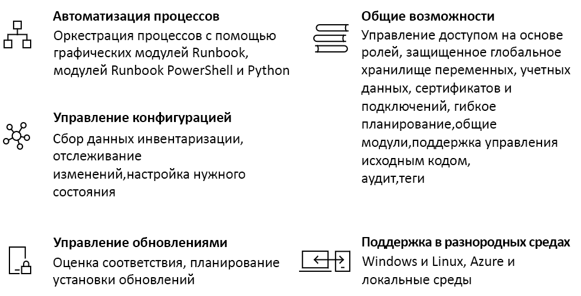

# Общие сведения о службе автоматизации Azure

Служба автоматизации Azure — это облачная служба автоматизации и настройки, которая обеспечивает согласованное управление в Azure и других средах. Она включает функции автоматизации процессов, управления обновлениями и настройки. Служба автоматизации Azure обеспечивает полный контроль во время развертывания, использования и вывода из эксплуатации рабочих нагрузок и ресурсов.
В этой статье содержится краткий обзор службы автоматизации Azure и ответы на некоторые распространенные вопросы. Дополнительные сведения о разных возможностях вы можете получить по предоставленным в этом обзоре ссылкам.

## Возможности службы автоматизации Azure

### Автоматизация процессов

Служба автоматизации Azure позволяет автоматизировать задачи управления облаком, которые выполняются регулярно, требуют много времени и могут привести к ошибкам. Благодаря такой автоматизации вы сможете сосредоточиться на задачах, повышающих ценность вашего бизнеса. Уменьшение ошибок и увеличение эффективности также позволяет сократить эксплуатационные затраты. Вы можете интегрировать службы Azure с другими общедоступными системами, которые потребуются для развертывания и настройки комплексных процессов, а также управления ими. Эта служба позволяет [создавать модули runbook](automation-runbook-types.md) с помощью графического редактора, PowerShell или Python. Гибридная рабочая роль runbook позволяет объединять и оркестрировать задачи управления в локальных средах. [Веб-перехватчики](automation-webhooks.md) дают возможность выполнять запросы и обеспечивать непрерывную поставку и выполнение операций, используя средства автоматизации ITSM, DevOps и систем мониторинга.

### Управление конфигурацией

[Desired State Configuration](automation-dsc-overview.md) в службе автоматизации Azure — это облачное решение для PowerShell DSC, которое предоставляет службы, необходимые для корпоративных сред. Вы можете управлять ресурсами DSC в службе автоматизации Azure и передавать на виртуальные машины и физические компьютеры конфигурации с опрашивающего сервера DSC, размещенного в облаке Azure. Эта служба позволяет создавать многофункциональные отчеты о важных событиях, например об отклонении узлов от назначенной конфигурации. Вы получите возможности мониторинга и автоматического обновления конфигурации для физических компьютеров и виртуальных машин, работающих в облаке или локальной среде под управлением Windows или Linux.

Вы сможете просматривать ресурсы в гостевой системе, чтобы контролировать установленные в них приложения и другие элементы конфигурации. Широкие возможности создания отчетов и поиска позволяют быстро получить подробные сведения о том, что и как настроено в операционной системе. Вы сможете отслеживать изменения в службах, управляющих программах, программном обеспечении, реестре и файлах, что позволит быстро выявлять источники проблем. Кроме того, DSC поможет диагностировать нежелательные изменения в среде и будет оповещать о них.

### Управление обновлениями

Обновление систем Windows и Linux в гибридных средах можно выполнить с помощью службы автоматизации Azure. Вы сможете контролировать соблюдение требований к обновлению в локальной среде, Azure и других облачных средах. Вы сможете создать расписание развертываний, чтобы координировать установку обновлений в течение определенного периода обслуживания. Из развертывания можно исключить обновления, которые не нужно устанавливать на определенных компьютерах.

### Возможности общего доступа

Служба автоматизации Azure состоит из нескольких общих ресурсов, что упрощает автоматизацию и настройку сред в нужном масштабе.

* **[Управление доступом на основе ролей](automation-role-based-access-control.md)** позволяет контролировать доступ к учетной записи благодаря роли оператора службы автоматизации, предоставляющей права на запуск задач отдельно от прав на их создание.
* **[Переменные](automation-variables.md)**  позволяют сохранять содержимое, которое можно использовать в нескольких конфигурациях и модулях runbook. Изменяя значения переменных, вы избавляетесь от необходимости изменять сами модули runbook или конфигурации, которые на них ссылаются.
* **[Учетные данные](automation-credentials.md)** позволяют безопасно хранить конфиденциальные сведения, которые могут использоваться при выполнении модулей runbook и конфигураций.
* **[Сертификаты](automation-certificates.md)** можно сохранять и предоставлять во время выполнения для аутентификации и защиты развернутых ресурсов.
* **[Подключения](automation-connections.md)**. Вы можете сохранять пары "имя — значение" с общей информацией при подключении к системам из раздела ресурсов подключения. Подключения определяются автором модуля и используются конфигурациями и модулями runbook во время выполнения.
* **[Расписания](automation-schedules.md)** позволяют запускать в службе действия автоматизации в определенное время.
* **[Интеграция с системой управления версиями](automation-source-control-integration.md)** позволяет использовать конфигурацию как код, то есть регистрировать модули runbook и файлы конфигурации в системе управления версиями.
* **[Модули PowerShell](automation-integration-modules.md)** применяются для управления Azure и другими системами. Импортируйте в учетную запись службы автоматизации командлеты и ресурсы DSC, разработанные компанией Майкрософт, сторонними производителями, сообществом или вашей организацией.

### Windows и Linux

Служба автоматизации Azure предназначена для работы в гибридной облачной среде, а также на платформах Windows и Linux. Она предоставляет последовательный способ автоматизации и настройки операционных систем и развернутых на них рабочих нагрузок.

### Коллекция сообщества

Просмотрите [коллекцию службы автоматизации](automation-runbook-gallery.md), чтобы подобрать из коллекции PowerShell и центра сценариев Майкрософт модули runbook и другие модули для быстрого начала интеграции и создания собственных процессов.

## Распространенные сценарии службы автоматизации

Служба автоматизации Azure управляет инфраструктурой и приложениями на всем протяжении их жизненного цикла. Переносите в систему знания о том, как в организации создаются и поддерживаются рабочие нагрузки. Используйте распространенные языки, такие как PowerShell и Python, Desired State Configuration, а также графические модули runbook. Получите полный список всех развернутых ресурсов для нацеливания, создания отчетов и проверки соответствия требованиям. Выявляйте изменения, которые могут привести к ошибкам в конфигурации, и улучшайте соответствие рабочим требованиям.

* **Создание и развертывание ресурсов**. Развертывайте виртуальные машины в гибридной среде с помощью модулей runbook и шаблонов Azure Resource Manager. Интеграция с инструментами разработки, например Jenkins и Azure DevOps.
* **Настройка виртуальных машин**. Оцените и настройте на компьютерах Windows и Linux нужную конфигурацию для инфраструктуры и приложений.
* **Мониторинг**. Отслеживайте на компьютерах изменения, которые приводят к проблемам, устраняйте их или передавайте для решения в системы управления.
* **Защита**. Помещайте в карантин виртуальные машины, для которых сработали предупреждения системы безопасности. Настройте требования к гостевым системам.
* **Управление**. Настройте для команд управление доступом на основе ролей. Восстанавливайте неиспользуемые ресурсы.

## Цены на службу автоматизации

Цены на службу автоматизации Azure см. на [этой странице](https://azure.microsoft.com/pricing/details/automation/).

## Дополнительная информация

> [!div class="nextstepaction"]
> [Создание учетной записи службы автоматизации](automation-quickstart-create-account.md)
