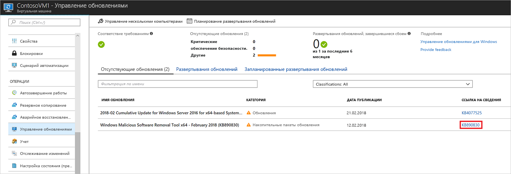
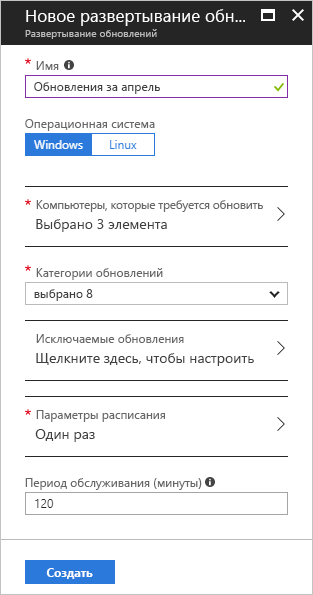

# <a name="manage-windows-updates-with-azure-automation"></a>Управление обновлениями Windows в службе автоматизации Azure

Управление обновлениями позволяет управлять обновлениями и исправлениями виртуальных машин.
Из этого руководства вы узнаете, как быстро оценить состояние доступных обновлений, назначить время установки необходимых обновлений, проверить результаты развертывания и создать оповещение, чтобы убедиться, что обновления успешно применены.

Сведения о ценах см. на странице [цены на службу автоматизации](https://azure.microsoft.com/pricing/details/automation/).

Из этого руководства вы узнаете, как выполнять такие задачи:

> [!div class="checklist"]
> * подключение виртуальной машины к управлению обновлениями;
> * Просмотр оценки обновлений
> * Настройка оповещений
> * Планирование развертывания обновлений
> * просмотр результатов развертывания.

## <a name="prerequisites"></a>предварительным требованиям

Для работы с этим учебником необходимы указанные ниже компоненты.

* Подписка Azure. Если у вас ее нет, [активируйте ежемесячную сумму денег на счете в Azure для подписчиков Visual Studio](https://azure.microsoft.com/pricing/member-offers/msdn-benefits-details/) или зарегистрируйте [бесплатную учетную запись](https://azure.microsoft.com/free/?WT.mc_id=A261C142F).
* [Учетная запись службы автоматизации](automation-offering-get-started.md) для хранения runbook наблюдателя, runbook действия и задачи наблюдателя.
* [Виртуальная машина](../virtual-machines/windows/quick-create-portal.md) для подключения.

## <a name="log-in-to-azure"></a>Вход в Azure

Войдите на портал Azure по адресу https://portal.azure.com.

## <a name="enable-update-management"></a>Включение управления обновлениями

Для работы с этим руководством прежде всего нужно включить управление обновлениями на виртуальной машине.

1. На портале Azure в меню слева выберите **Виртуальные машины**, а затем выберите виртуальную машину в списке.
2. На странице виртуальных машин в разделе **Операции** выберите пункт **Управление обновлениями**. Откроется страница **Включение управления обновлениями**.

Проверка выполняется, чтобы определить, включено ли управление обновлениями для этой виртуальной машины. При этом проверяется рабочее пространство Log Analytics и связанная учетная запись службы автоматизации, а также наличие решения по управлению обновлениями в рабочей области.

Рабочая область [Log Analytics](../log-analytics/log-analytics-overview.md?toc=%2fazure%2fautomation%2ftoc.json) используется для сбора данных, созданных компонентами и службами, такими как "Управление обновлениями". Рабочая область предоставляет единое расположение для проверки и анализа данных из нескольких источников.

В процессе проверки также определяется, была ли виртуальная машина подготовлена с помощью Microsoft Monitoring Agent (MMA) и гибридной рабочей роли службы автоматизации.
Агент позволяет взаимодействовать со службой автоматизации Azure и получать сведения о состоянии обновления. Для взаимодействия со службой автоматизации Azure, а также для загрузки обновлений агенту требуется порт 443, который должен быть открыт.

Если во время подключения обнаружится, что отсутствует один из следующих компонентов, он будет автоматически добавлен.

* [Рабочая область Log Analytics](../log-analytics/log-analytics-overview.md?toc=%2fazure%2fautomation%2ftoc.json).
* [Учетная запись службы автоматизации](./automation-offering-get-started.md).
* [Гибридная рабочая роль runbook](./automation-hybrid-runbook-worker.md) включена на виртуальной машине.

Откроется экран **Управление обновлениями**. Настройте расположение, рабочую область Log Analytics и учетную запись службы автоматизации, затем нажмите кнопку **Включить**. Если эти поля неактивны и выделены серым цветом, то для этой виртуальной машины настроено другое решение автоматизации, а значит необходимо использовать ту же рабочую область и ту же учетную запись службы автоматизации.


Включение решения может занять несколько минут. В это время не закрывайте окно браузера.
После включения решения сведения об отсутствующих обновлениях на виртуальной машине передаются в Log Analytics.
На получение данных для анализа может уйти от 30 минут до 6 часов.

## <a name="view-update-assessment"></a>Просмотр оценок обновления

После включения решения **Управление обновлениями** отобразится экран **Управление обновлениями**.
Если будут обнаружены отсутствующие обновления, их список можно просмотреть на вкладке **Отсутствующие обновления**.

Выберите элемент **Ссылка на сведения** для любого из этих обновлений, чтобы открыть в новом окне соответствующую статью технической поддержки. На ней вы получите важные сведения об обновлении.



Щелкнув обновление в любой другой точке, вы откроете окно **поиска по журналам** для выбранного обновления. Запрос поиска по журналам настроен на сведения о конкретном обновлении. Вы можете изменить этот запрос или создать собственный запрос, чтобы просмотреть подробные сведения об обновлениях, развернутых или отсутствующих в вашей среде.


## <a name="configure-alerting"></a>Настройка оповещений

На этом шаге вы настроите оповещение, чтобы можно было получать сведения об успешном развертывании обновлений. Вы создадите оповещение на основе запроса службы Log Analytics. Можно написать любой пользовательский запрос для дополнительных оповещений, чтобы охватить множество сценариев. На портале Azure перейдите к разделу **Монитор** и щелкните **Создать оповещение**. После этого откроется страница **Создать правило**.

В разделе **1. Определение условия оповещения** щелкните **+ Выбор цели**. В разделе **Filter by resource type** (Фильтрация по типу ресурсов) выберите **Log Analytics**. Выберите рабочую область Log Analytics и нажмите кнопку **Готово**.


Нажмите кнопку **+ Add criteria** (+ Добавить условие), чтобы открыть страницу **Настроить логику сигналов**. В таблице выберите **Custom log search** (Пользовательский поиск по журналам). Введите следующий запрос в текстовом поле **Поисковый запрос**. Этот запрос возвращает сведения о компьютерах и название запуска обновления, завершенного в рамках указанного интервала времени.

```loganalytics
UpdateRunProgress
| where InstallationStatus == 'Succeeded'
| where TimeGenerated > now(-10m)
| summarize by UpdateRunName, Computer
```

Введите **1** в разделе **Пороговое значение** для логики оповещений. По завершении нажмите кнопку **Готово**.


В разделе **2. Определение сведений об оповещении** присвойте для оповещения понятное имя и описание. Задайте в разделе **Серьезность** значение **Информационный (уровень серьезности 2)**, так как это оповещение об успешном выполнении.


В разделе **3. Определение группы действий** щелкните **+ New action group** (+ Новая группа действий). Группа действий содержит действия, которые можно использовать для нескольких оповещений. Они могут включать в себя (но не ограничиваются) уведомления электронной почты, модули Runbook, веб-перехватчики и многое другое. Дополнительные сведения о группах действий см. в статье [Create and manage action groups in the Azure portal](../monitoring-and-diagnostics/monitoring-action-groups.md) (Создание групп действий и управление ими на портале Azure).

В поле **Имя группы действий** введите понятное и краткое имя. Короткое имя используется вместо полного имени группы действий при отправке уведомлений с помощью этой группы.

В разделе **Действия** (понятное имя действия, например **Уведомления по электронной почте**) в столбце **Тип действия** выберите **Email/SMS/Push/Voice** (Электронная почта, SMS, push-уведомление, голосовой вызов). В разделе **Сведения** выберите **Изменить сведения**.

На странице **Email/SMS/Push/Voice** (Электронная почта, SMS, push-уведомление, голосовой вызов) присвойте имя для действия. Установите флажок **Адрес электронной почты** и введите адрес электронной почты, который нужно использовать.


Нажмите кнопку **ОК** на странице **Email/SMS/Push/Voice** (Электронная почта, SMS, push-уведомление, голосовой вызов), чтобы закрыть ее, и нажмите кнопку **ОК**, чтобы закрыть страницу **Добавить группу действий**.

Вы можете настроить тему отправляемого сообщения электронной почты, выбрав **Тема электронного письма** в разделе **Настройка действий** на странице **Создать правило**. По завершении щелкните **Создать правило оповещения**. Это приведет к созданию правила, которое оповещает об успешном завершении развертывания обновления и предоставляет сведения о том, на каких компьютерах выполнялось развертывание.

## <a name="schedule-an-update-deployment"></a>Планирование развертывания обновлений

После настройки оповещений, чтобы установить обновления, составьте план развертывания в рамках графика выпуска и периода обслуживания.
Вы можете выбрать типы обновлений, которые будут включены в развертывание.
Например, можно включить только критические обновления или обновления для системы безопасности и исключить накопительные пакеты обновления.

> [!WARNING]
> Если обновления требуют перезагрузки, виртуальная машина перезагружается автоматически.

Чтобы запланировать новое развертывание обновления для виртуальной машины, перейдите к разделу **Управление обновлениями** и выберите в верхней части экрана элемент **Запланировать развертывание обновлений**.

На экране **New update deployment** (Новое развертывание обновлений) укажите следующие сведения:

* **Имя**. Введите уникальное имя для развертывания обновлений.

* **Операционная система**. Выберите операционную систему для развертывания обновлений.

* **Update classification** (Классификация обновлений). Выберите типы программного обеспечения, которые были включены в развертывание обновления. Для целей этого руководства сохраните выбор всех типов.

  Ниже приведены типы классификации:

   |ОС  |type  |
   |---------|---------|
   |Windows     | критические обновления;</br>обновления для системы безопасности;</br>накопительные пакеты обновления;</br>пакеты дополнительных компонентов;</br>пакеты обновления;</br>обновления определений;</br>Средства</br>Обновления        |
   |Linux     | критические обновления и обновления для системы безопасности;</br>Другие обновления       |

   Описание типов классификации обновлений см. в этом [разделе](automation-update-management.md#update-classifications).

* **Параметры расписания**. Откроется страница параметров расписания. Время начала по умолчанию — на 30 минут позднее текущего времени. В будущем для этого параметра можно задать любое время от 10 минут.

   Кроме того, можно указать, происходит ли развертывание один раз, или настроить расписание повторяющегося развертывания.
   Выберите **Однократно** в разделе **Периодичность**. Оставьте предложенное по умолчанию значение "1 день" и нажмите кнопку **ОК**. Это действие устанавливает расписание с периодическим повторением.

* **Период обслуживания (в минутах)**. Сохраните здесь значение по умолчанию. Вы можете задать период времени, в течение которого должно завершаться развертывание обновления. Этот параметр позволяет гарантировать соблюдение определенного периода обслуживания.



Завершив настройку расписания, нажмите кнопку **Создать**. Вы вернетесь к панели мониторинга состояния. Выберите **Запланированные развертывания обновлений**, чтобы отобразить созданный график развертывания.

## <a name="view-results-of-an-update-deployment"></a>Просмотр результатов развертывания обновлений

После запуска запланированного развертывания вы можете контролировать его состояние на вкладке **Развертывания обновлений** раздела **Управление обновлениями**.
Пока развертывание выполняется, для него отображается состояние **Выполнение**.
При успешном завершении появится состояние **Выполнено**.
В случае сбоя одного или нескольких обновлений в развертывании устанавливается состояние **Частичный сбой**.
Щелкните завершенное развертывание обновлений, чтобы просмотреть панель мониторинга этого развертывания обновлений.


Плитка **Результаты обновления** содержит сводную информацию об общем количестве обновлений и результатах их развертывания на виртуальной машине.
В таблице справа представлена подробная информация о каждом обновлении и результатах установки.
Возможные значения представлены в следующем списке.

* **Not attempted** (Попытка не предпринималась). Обновление не установлено из-за недостатка времени в связи с заданной длительностью окна обслуживания.
* **Выполнено.** Обновление было успешно выполнено.
* **Сбой.** Обновление не удалось выполнить.

Щелкните **Все журналы** для просмотра всех записей журнала, созданных при развертывании.

Щелкните плитку **Вывод** для просмотра потока заданий runbook, отвечающих за управление развертыванием обновления на целевой виртуальной машине.

Щелкните **Ошибки**, чтобы просмотреть подробные сведения о любых ошибках развертывания.

После успешного развертывания обновления отправляется сообщение электронной почты, уведомляющее об успешном выполнении (как на следующем изображении).


## <a name="next-steps"></a>Дальнейшие действия

Из этого руководства вы узнали, как выполнить следующие задачи:

> [!div class="checklist"]
> * подключение виртуальной машины к управлению обновлениями;
> * Просмотр оценки обновлений
> * Настройка оповещений
> * Планирование развертывания обновлений
> * просмотр результатов развертывания.

Теперь переходите к обзору решения для управления обновлениями.

> [!div class="nextstepaction"]
> [Update Management solution](../operations-management-suite/oms-solution-update-management.md?toc=%2fazure%2fautomation%2ftoc.json) (Решение для управления обновлениями)
