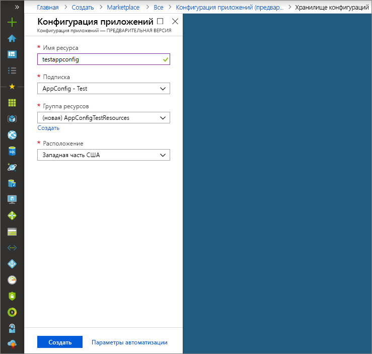

# <a name="quickstart-create-a-java-spring-app-with-app-configuration"></a>Краткое руководство. Создание приложения Java Spring с помощью службы конфигурации приложений Azure

Конфигурация приложений Azure — это служба для управления конфигурациями в Azure. С ее помощью вы можете централизовано хранить и администрировать все параметры приложения отдельно от кода. В этом руководстве показано, как интегрировать службу с приложением Java Spring.

Шаги из этого краткого руководства можно выполнять в любом редакторе кода. [Visual Studio Code](https://code.visualstudio.com/) является отличным вариантом, который доступен на платформах Windows, macOS и Linux.

## <a name="prerequisites"></a>Предварительные требования

Для работы с этим руководством установите поддерживаемую версию [комплекта разработчика Java (JDK)](https://aka.ms/azure-jdks) версии 8 и [Apache Maven](https://maven.apache.org/) версии 3.0 или выше.

[!INCLUDE [quickstarts-free-trial-note](../../includes/quickstarts-free-trial-note.md)]

## <a name="create-an-app-configuration-store"></a>Создание хранилища конфигураций приложений

1. Чтобы создать хранилище конфигураций приложений, войдите на [портал Azure](https://aka.ms/azconfig/portal). Выберите **+ Создать ресурс** в левом верхнем углу страницы. В поле **Поиск в Marketplace** введите **Конфигурация приложений** и нажмите клавишу ВВОД.

    

2. В результатах поиска выберите **Конфигурация приложений** и щелкните **Создать**.

3. На странице **Конфигурация приложений** > **Создать** введите приведенные ниже параметры.

    | Параметр | Рекомендуемое значение | ОПИСАНИЕ |
    |---|---|---|
    | **Имя ресурса** | Глобально уникальное имя | Введите уникальное имя для ресурса хранилища конфигураций приложений. Имя должно быть строкой длиной от 1 до 63 символов и содержать только цифры, буквы и символ `-`. Имя не может начинаться или заканчиваться символом `-`. Кроме того, не допускается последовательное использование символов `-`.  |
    | **Подписка** | Ваша подписка | Выберите подписку Azure, которую нужно использовать для тестирования конфигурации приложений. Если в вашей учетной записи есть только одна подписка, она выбирается автоматически, а раскрывающееся меню **Подписка** не отображается. |
    | **Группа ресурсов** | *AppConfigTestResources* | Выберите или создайте группу ресурсов для ресурса хранилища конфигураций приложений. Эта группа может быть полезна для упорядочения нескольких ресурсов, которые может потребоваться удалить одновременно путем удаления группы ресурсов. Дополнительные сведения см. в статье [Управление ресурсами Azure через портал](https://docs.microsoft.com/azure/azure-resource-manager/resource-group-overview). |
    | **Местоположение.** | *Центральная часть США* | В поле **Расположение** укажите, где будет географически располагаться ресурс SignalR. Для наилучшей производительности создайте ресурс в одном регионе с другими компонентами приложения. |

    

4. Нажмите кнопку **Создать**. Завершение развертывания может занять несколько минут.

5. После завершения развертывания выберите **Параметры** > **Ключи доступа**. Запишите строку подключения для первичного ключа с атрибутом только для чтения или чтения и записи. Она пригодится позже для настройки обмена данными между приложением и созданным хранилищем конфигураций приложений. Строка подключения имеет следующий формат:

        Endpoint=<your_endpoint>;Id=<your_id>;Secret=<your_secret>

    Используйте всю строку в приложении.

6. Выберите **Обозреватель ключей и значений** > **+ Создать**, чтобы добавить следующие пары "ключ-значение":

    | Ключ | Значение |
    |---|---|
    | /application/config.message | Привет |

    Поля **Метка** и **Тип контента** пока заполнять не нужно.

## <a name="create-a-spring-boot-app"></a>Создание приложения Spring Boot

Для создания проекта Spring Boot воспользуйтесь [Spring Initializr](https://start.spring.io/).

1. Перейдите по адресу <https://start.spring.io/>.

2. Задайте такие параметры:

   * Выберите в соответствующих полях **Maven Project** (Проект Maven) и **Java**.
   * Выберите **Spring Boot** не ниже версии 2.0.
   * Заполните поля **Group** (Группа) и **Artifact** (Артефакт) для приложения.
   * Добавьте зависимость **Web** (Веб).

3. После указания предыдущих параметров выберите **Создать проект**. При появлении запроса скачайте проект на локальный компьютер.

## <a name="connect-to-an-app-configuration-store"></a>Подключение к хранилищу конфигураций приложений

1. После извлечения файлов в локальной системе простое приложение Spring Boot можно редактировать. Найдите файл *pom.xml* в корневой папке приложения.

2. Откройте файл *pom.xml* в текстовом редакторе и добавьте начальное приложение Spring Cloud Azure Config в список `<dependencies>`:

    ```xml
    <dependency>
        <groupId>com.microsoft.azure</groupId>
        <artifactId>spring-cloud-starter-azure-appconfiguration-config</artifactId>
        <version>1.1.0.M1</version>
    </dependency>
    ```

3. Создайте файл Java с именем *MessageProperties.java* в каталоге пакета приложения. Добавьте следующие строки.

    ```java
    @ConfigurationProperties(prefix = "config")
    public class MessageProperties {
        private String message;

        public String getMessage() {
            return message;
        }

        public void setMessage(String message) {
            this.message = message;
        }
    }
    ```

4. Создайте файл Java с именем *HelloController.java* в каталоге пакета приложения. Добавьте следующие строки.

    ```java
    @RestController
    public class HelloController {
        private final MessageProperties properties;

        public HelloController(MessageProperties properties) {
            this.properties = properties;
        }

        @GetMapping
        public String getMessage() {
            return "Message: " + properties.getMessage();
        }
    }
    ```

5. Откройте основной файл приложения Java и добавьте `@EnableConfigurationProperties`, чтобы включить эту функцию.

    ```java
    @SpringBootApplication
    @EnableConfigurationProperties(MessageProperties.class)
    public class AzureConfigApplication {
        public static void main(String[] args) {
            SpringApplication.run(AzureConfigApplication.class, args);
        }
    }
    ```

6. В каталоге ресурсов создайте файл с именем `bootstrap.properties` и добавьте в него приведенные ниже строки. Замените примеры значений на соответствующие свойства хранилища конфигураций приложений.

    ```properties
    spring.cloud.azure.appconfiguration.stores[0].connection-string=[your-connection-string]
    ```

## <a name="build-and-run-the-app-locally"></a>Создание и запуск приложения локально

1. Создайте приложение Spring Boot с помощью Maven и запустите его, например, следующим образом:

    ```shell
    mvn clean package
    mvn spring-boot:run
    ```
2. После запуска приложение можно протестировать с помощью средства *curl*, например:

      ```shell
      curl -X GET http://localhost:8080/
      ```
    Вы увидите сообщение, которое указали в хранилище конфигураций приложений.

## <a name="clean-up-resources"></a>Очистка ресурсов

[!INCLUDE [azure-app-configuration-cleanup](../../includes/azure-app-configuration-cleanup.md)]

## <a name="next-steps"></a>Дополнительная информация

В этом кратком руководстве описано, как создать хранилище конфигураций приложений и использовать его с приложением Java Spring. Дополнительные сведения см. в статье [Spring в Azure](https://docs.microsoft.com/java/azure/spring-framework/).

Ознакомьтесь с дополнительными сведениями об использовании службы "Конфигурация приложений" в следующем учебнике, посвященном проверке подлинности.

> [!div class="nextstepaction"]
> [Руководство. Интеграция с управляемыми удостоверениями Azure](./integrate-azure-managed-service-identity.md)