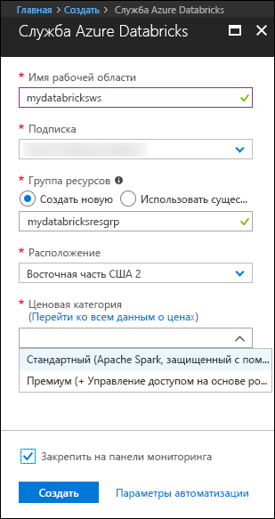
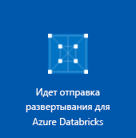
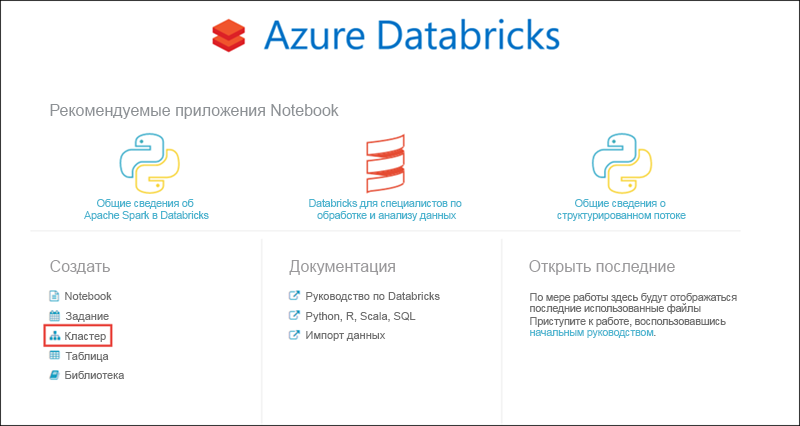
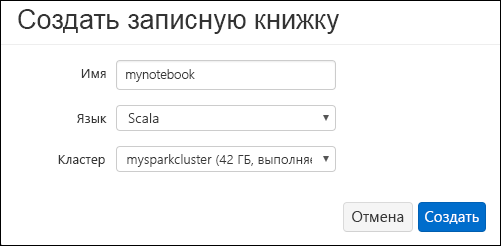
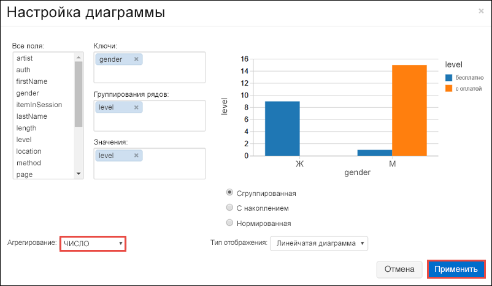
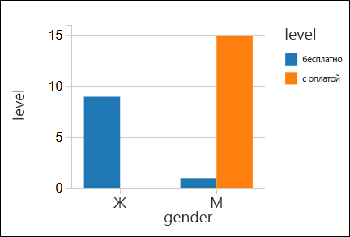
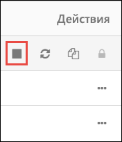

# <a name="quickstart-run-a-spark-job-on-azure-databricks-using-the-azure-portal"></a>Краткое руководство. Запуск задания Spark в Azure Databricks с помощью портала Azure

Это краткое руководство содержит сведения о создании рабочей области Azure Databricks и кластера Apache Spark в этой рабочей области. Наконец, вы узнаете, как выполнить задание Spark на кластере Databricks. Дополнительные сведения об Azure Databricks см. в статье [Что такое Azure Databricks?](what-is-azure-databricks.md).

При помощи этого краткого руководства в рамках задания Spark вы проанализируете данные подписки на радиоканал, чтобы получить сведения о соотношении бесплатного и оплачиваемого использования в зависимости от демографических данных.

Если у вас еще нет подписки Azure, [создайте бесплатную учетную запись Azure](https://azure.microsoft.com/free/), прежде чем начинать работу.

## <a name="log-in-to-the-azure-portal"></a>Войдите на портал Azure.

Войдите на [портал Azure](https://portal.azure.com).

## <a name="create-an-azure-databricks-workspace"></a>Создание рабочей области Azure Databricks

В этом разделе вы создадите рабочую область Azure Databricks с помощью портала Azure.

1. На портале Azure выберите **Создать ресурс** > **Данные и аналитика** > **Azure Databricks**.

    

2. В разделе **службы Azure Databricks** укажите значения для создания рабочей области Databricks.

    

    Укажите следующие значения.
    
    |Свойство  |ОПИСАНИЕ  |
    |---------|---------|
    |**Имя рабочей области**     | Укажите имя рабочей области Databricks.        |
    |**Подписка**     | Выберите подписку Azure в раскрывающемся списке.        |
    |**Группа ресурсов**     | Укажите, следует ли создать новую группу ресурсов или использовать имеющуюся. Группа ресурсов — это контейнер, содержащий связанные ресурсы для решения Azure. Дополнительные сведения см. в [обзоре группы ресурсов Azure](../azure-resource-manager/resource-group-overview.md). |
    |**Местоположение.**     | Выберите регион **Восточная часть США 2**. Другие доступные регионы см. в статье о [доступности служб Azure по регионам](https://azure.microsoft.com/regions/services/).        |
    |**Ценовая категория**     |  Вы можете выбрать уровень **Стандартный** или **Премиум**. Дополнительные сведения об этих ценовых категориях см. на [странице цен на Databricks](https://azure.microsoft.com/pricing/details/databricks/).       |

    Выберите **Закрепить на панели мониторинга** и щелкните **Создать**.

4. Создание рабочей области займет несколько минут. Во время создания рабочей области на портале с правой стороны отображается плитка **Идет отправка развертывания для Azure Databricks**. Возможно, вам потребуется прокрутить панель мониторинга, чтобы увидеть эту плитку. В верхней части экрана также будет отображаться индикатор хода выполнения. Следить за выполнением можно с помощью любого из этих элементов.

    

## <a name="create-a-spark-cluster-in-databricks"></a>Создание кластера Spark в Databricks

> [!NOTE]
> Чтобы использовать бесплатную учетную запись для создания кластера Azure Databricks, перед созданием кластера перейдите в свой профиль и измените свою подписку на **оплату по мере использования**. Дополнительные сведения см. на странице [создания бесплатной учетной записи Azure](https://azure.microsoft.com/free/).

1. На портале Azure перейдите к созданной рабочей области Databricks, а затем выберите **Launch Workspace** (Запуск рабочей области).

2. Вы будете перенаправлены на портал Azure Databricks. На портале выберите **Кластер**.

    

3. На странице **создания кластера** укажите значения для создания кластера.

    

    Для всех остальных параметров, кроме следующих, примите значения по умолчанию:

    * Введите имя кластера.
    * В рамках этой статьи создайте кластер со средой выполнения **4.0**.
    * Убедитесь, что установлен флажок **Terminate after \_\_ minutes of activity** (Завершить через \_\_ минут бездействия). Укажите длительность (в минутах) для завершения работы кластера, если тот не используется.
    
    Выберите **Create cluster** (Создать кластер). После запуска кластера можно вложить записные книжки в кластер и запустить задания Spark.

Дополнительные сведения о создании кластеров см. в статье [о создании кластера Spark в Azure Databricks](https://docs.azuredatabricks.net/user-guide/clusters/create.html).


## <a name="download-a-sample-data-file"></a>Загрузка примера файла данных
Загрузите пример файла данных JSON и сохраните его в хранилище больших двоичных объектов.

1. Загрузите этот пример файла данных JSON [из Github](https://raw.githubusercontent.com/Azure/usql/master/Examples/Samples/Data/json/radiowebsite/small_radio_json.json) на локальный компьютер. Щелкните правой кнопкой мыши кнопку "Сохранить", чтобы сохранить необработанный файл на локальном компьютере.

2. Если у вас еще нет учетной записи хранения, создайте ее.
    - На портале Azure выберите **Создать ресурс**. Выберите категорию **Хранилище**, затем выберите **Учетные записи хранения**
    - Предоставьте уникальное имя учетной записи хранения.
    - Выберите **Тип учетной записи**: **Хранилище BLOB-объектов**
    - Выберите имя **группы ресурсов**. Используйте группу ресурсов, в которой создана рабочая область Databricks.
    
    Дополнительные сведения см. в статье [Об учетных записях хранения Azure](../storage/common/storage-quickstart-create-account.md).

3. Создайте контейнер хранилища в учетной записи хранилища BLOB-объектов и отправьте туда пример файла JSON. Для передачи файла также можно использовать портал Azure или [Обозреватель службы хранилища Microsoft Azure](../vs-azure-tools-storage-manage-with-storage-explorer.md).

    - Откройте учетную запись хранилища на портале Azure.
    - Выберите **Большие двоичные объекты**.
    - Выберите **+ Контейнер** для создания нового пустого контейнера.
    - Укажите **имя** для контейнера, например `databricks`.
    - Выберите уровень доступа **Private (non anonymous access)** (Частный (без анонимного доступа)).
    - После создания контейнера выберите имя контейнера.
    - Нажмите кнопку **Отправить**.
    - На странице **Файлы** выберите для просмотра **значок папки**, а затем выберите пример файла `small_radio_json.json` для передачи.
    - Чтобы отправить файл, выберите **Отправить**.

## <a name="run-a-spark-sql-job"></a>Выполнение задания Spark SQL
Выполните указанные ниже задачи, чтобы создать записную книжку в Databricks, настроить ее для считывания данных из учетной записи хранения больших двоичных объектов Azure, а затем запустить задание Spark SQL в данных.

1. В левой области щелкните **рабочую область**. В раскрывающемся списке **рабочей области** выберите **Создать**, а затем выберите **записную книжку**.

    

2. В диалоговом окне **создания записной книжки** введите имя, выберите **Scala** в качестве языка, а затем выберите созданный ранее кластер Spark.

    

    Нажмите кнопку **Создать**.

3. На этом шаге свяжите учетную запись службы хранения Azure с кластером Spark Databricks. Есть два способа выполнения этой ассоциации. Вы можете подключить учетную запись хранения Azure к файловой системе Databricks (DBFS) или получить прямой доступ к учетной записи хранения Azure из создаваемого приложения.

    > [!IMPORTANT]
    >В этой статье используется **подход с подключением хранилища к DBFS**. Он гарантирует, что подключенное хранилище самостоятельно связывается с файловой системой кластера. Таким образом, любое приложение, обращающееся к кластеру, может также использовать связанное хранилище. Подход с получением прямого доступа ограничен использованием приложения, с помощью которого настраивается доступ.
    >
    > Для применения подхода с подключением необходимо создать кластер Spark с версией среды выполнения Databricks **4.0**, выбранной в этой статье.

    В следующем фрагменте кода замените `{YOUR CONTAINER NAME}`, `{YOUR STORAGE ACCOUNT NAME}` и `{YOUR STORAGE ACCOUNT ACCESS KEY}` соответствующими значениями для вашей учетной записи хранения Azure. Вставьте фрагмент кода в пустую ячейку в записной книжке и нажмите сочетание клавиш SHIFT + ВВОД, чтобы запустить ячейку кода.

    * **Подключите учетную запись хранения к DBFS (рекомендуется)**. В этом фрагменте кода путь к учетной записи хранения Azure подключается к `/mnt/mypath`. Таким образом, при следующих попытках получить доступ к учетной записи хранения Azure вам не нужно будет предоставлять полный путь. Вы можете просто указать `/mnt/mypath`.

          dbutils.fs.mount(
            source = "wasbs://{YOUR CONTAINER NAME}@{YOUR STORAGE ACCOUNT NAME}.blob.core.windows.net/",
            mountPoint = "/mnt/mypath",
            extraConfigs = Map("fs.azure.account.key.{YOUR STORAGE ACCOUNT NAME}.blob.core.windows.net" -> "{YOUR STORAGE ACCOUNT ACCESS KEY}"))

    * **Получите прямой доступ к учетной записи хранения.**

          spark.conf.set("fs.azure.account.key.{YOUR STORAGE ACCOUNT NAME}.blob.core.windows.net", "{YOUR STORAGE ACCOUNT ACCESS KEY}")

    Сведения о том, как получить ключ учетной записи хранения, см. в разделе [Управление учетной записью хранения](../storage/common/storage-account-manage.md#access-keys).

    > [!NOTE]
    > Вы также можете воспользоваться Azure Data Lake Store с кластером Spark в Azure Databricks. Дополнительные сведения см. в разделе [Azure Data Lake Store](https://go.microsoft.com/fwlink/?linkid=864084).

4. Выполните инструкцию SQL для создания временной таблицы, используя данные образца файла данных JSON, **small_radio_json.json**. В указанном ниже фрагменте кода замените значения заполнителя именем контейнера и учетной записи хранения. Вставьте фрагмент кода в ячейку кода в записной книжке, а затем нажмите сочетание клавиш SHIFT + ВВОД. Во фрагменте кода `path` обозначает расположение примера файла JSON, который вы передали в учетную запись хранения Azure.

    ```sql
    %sql
    DROP TABLE IF EXISTS radio_sample_data;
    CREATE TABLE radio_sample_data
    USING json
    OPTIONS (
     path "/mnt/mypath/small_radio_json.json"
    )
    ```

    После успешного выполнения команды все данные из файла JSON будут отображаться в виде таблицы в кластере Databricks.

    Волшебная команда языка `%sql` позволяет выполнить код SQL из записной книжки, даже если записная книжка другого типа. Дополнительные сведения см. в статье об [объединении языков программирования в записной книжке](https://docs.azuredatabricks.net/user-guide/notebooks/index.html#mixing-languages-in-a-notebook).

5. Рассмотрим моментальный снимок примера данных JSON, чтобы лучше ознакомиться с запросом, который вы выполняете. Вставьте следующий фрагмент кода в ячейку кода и нажмите клавиши **SHIFT + ВВОД**.

    ```sql
    %sql
    SELECT * from radio_sample_data
    ```

6. Отобразятся табличные данные, как показано на следующем снимке экрана (показаны только некоторые столбцы).

    

    Среди прочего пример данных демонстрирует пол аудитории радиоканала (имя столбца **gender**), а также категорию подписки (бесплатная или платная) (имя столбца **level**).

7. Теперь можно создать визуальное представление данных по каждому полу, а также по числу пользователей с бесплатными и платными учетными записями. В нижней части выходных табличных данных щелкните значок **линейчатой диаграммы**, а затем — **параметры построения**.

    

8. В разделе **настроек построения** перетащите значения, как показано на снимке экрана.

    

    * Для параметра **Ключи** задайте значение **gender**.
    * Для параметра **Series groupings** (Группирование ряда) задайте значение **level**.
    * Для параметра **Значения** задайте значение **level**.
    * Для параметра **Агрегирование** задайте значение **COUNT**.

    Нажмите кнопку **Применить**.

9. Выходные данные отображают визуальное представление, как показано на следующем снимке экрана:

    

## <a name="clean-up-resources"></a>Очистка ресурсов

Когда вы выполните задачи в статье, можно будет завершить работу кластера. Для этого в рабочей области Azure Databricks на панели слева выберите **Кластеры**. Для кластера, работу которого необходимо завершить, переместите указатель мыши на многоточие в столбце **Actions** (Действия) и выберите значок **Завершить**.



Если не завершить работу кластера вручную, она завершится автоматически, если во время создания кластера вы установили флажок **Terminate after \_\_ minutes of inactivity** (Завершать работу после \_\_ мин бездействия). В этом случае работа кластера автоматически завершается, если он был неактивным в течение определенного времени.

## <a name="next-steps"></a>Дополнительная информация

В этой статье вы создали кластер Spark в Azure Databricks и запустили задание Spark, используя данные в хранилище Azure. Вы также можете просмотреть [источники данных Spark](https://docs.azuredatabricks.net/spark/latest/data-sources/index.html), чтобы узнать, как импортировать данные из источников данных в Azure Databricks. Перейдите к следующей статье, чтобы узнать, как выполнять операции ETL (извлечения, преобразование и загрузка данных) с помощью Azure Databricks.

> [!div class="nextstepaction"]
>[Извлечение, преобразование и загрузка данных с помощью Azure Databricks](databricks-extract-load-sql-data-warehouse.md)
