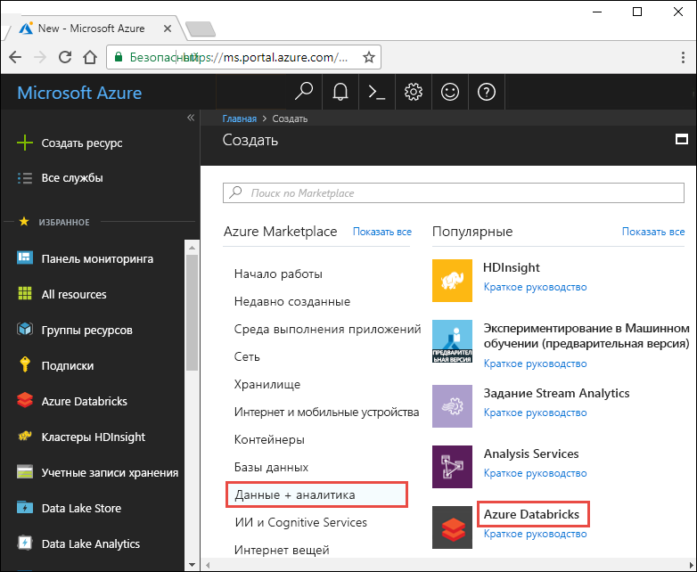
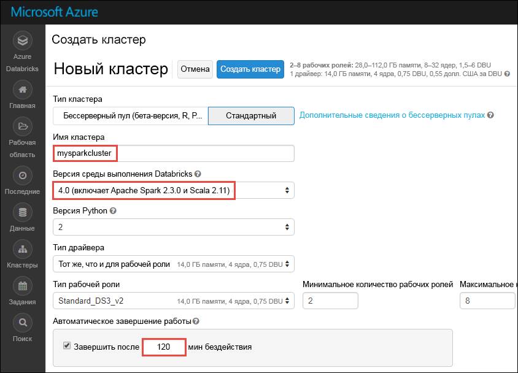
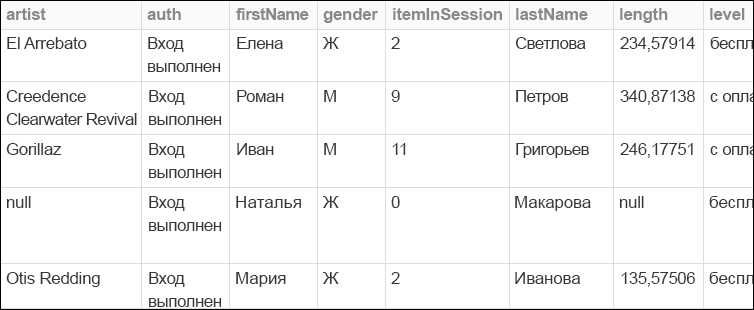

# <a name="quickstart-run-a-spark-job-on-azure-databricks-using-the-azure-portal"></a>Краткое руководство. Запуск задания Spark в Azure Databricks с помощью портала Azure

Это краткое руководство содержит сведения о создании рабочей области Azure Databricks и кластера Apache Spark в этой рабочей области. Наконец, вы узнаете, как выполнить задание Spark на кластере Databricks. Дополнительные сведения об Azure Databricks см. в статье [Что такое Azure Databricks?](what-is-azure-databricks.md).

## <a name="log-in-to-the-azure-portal"></a>Войдите на портал Azure.

Войдите на [портал Azure](https://portal.azure.com).

## <a name="create-a-databricks-workspace"></a>Создание рабочей области Databricks

В этом разделе вы создадите рабочую область Azure Databricks с помощью портала Azure. 

1. На портале Azure щелкните **+**, выберите **Данные+аналитика**, а затем — **Azure Databricks (Preview)** (Azure Databricks (предварительная версия)). 

    

2. В разделе **Azure Databricks (предварительная версия)** выберите **Создать**.

    > [!NOTE]
    > Сейчас Azure Databricks находится в ограниченной предварительной версии. Если вы хотите, чтобы ваша подписка Azure учитывалась при создании списка разрешений для предварительной версии, необходимо заполнить [форму регистрации](https://databricks.azurewebsites.net/).

2. В разделе **службы Azure Databricks** укажите следующие значения:

    

    * Для параметра **Имя рабочей области** укажите имя для рабочей области Databricks.
    * Для параметра **Подписка** выберите подписку в раскрывающемся списке.
    * Для параметра **Группа ресурсов** укажите, хотите ли вы создать группу ресурсов или использовать имеющуюся. Группа ресурсов — это контейнер, содержащий связанные ресурсы для решения Azure. Дополнительные сведения см. в [обзоре группы ресурсов Azure](../azure-resource-manager/resource-group-overview.md).
    * Для параметра **Расположение** выберите **Восточная часть США 2**. Другие доступные регионы см. в статье о [доступности служб Azure по регионам](https://azure.microsoft.com/regions/services/).

3. Щелкните **Создать**.

## <a name="create-a-spark-cluster-in-databricks"></a>Создание кластера Spark в Databricks

1. На портале Azure перейдите к созданной рабочей области Databricks, а затем выберите **Initialize Workspace** (Инициализация рабочей области).

2. Вы будете перенаправлены на портал Azure Databricks. На портале выберите **Кластер**.

    

3. На странице **создания кластера** укажите значения для создания кластера.

    

    * Введите имя кластера.
    * Убедитесь, что установлен флажок **Terminate after ___ minutes of activity** (Завершить работу после ___ минут активности). Укажите длительность (в минутах) для завершения работы кластера, если тот не используется.
    * Примите все остальные значения по умолчанию. 
    * Выберите **Create cluster** (Создать кластер). После запуска кластера можно вложить записные книжки в кластер и запустить задания Spark.

Дополнительные сведения о создании кластеров см. в статье [о создании кластера Spark в Azure Databricks](https://docs.azuredatabricks.net/user-guide/clusters/create.html).

## <a name="run-a-spark-sql-job"></a>Выполнение задания Spark SQL

Прежде чем приступить к работе с этим разделом, сделайте следующее:

* [Создайте учетную запись хранения Azure](../storage/common/storage-create-storage-account.md#create-a-storage-account). 
* Скачайте образец файла JSON с [сайта GitHub](https://github.com/Azure/usql/blob/master/Examples/Samples/Data/json/radiowebsite/small_radio_json.json). 
* Загрузите образец файла JSON в созданную учетную запись хранения Azure. Для передачи файлов можно использовать [обозреватель службы хранилища Microsoft Azure](../vs-azure-tools-storage-manage-with-storage-explorer.md).

Выполните указанные ниже действия, чтобы создать записную книжку в Databricks, настроить ее для считывания данных из учетной записи хранения больших двоичных объектов Azure, а затем запустить задание Spark SQL в данных.

1. В левой области щелкните **рабочую область**. В раскрывающемся списке **рабочей области** выберите **Создать**, а затем выберите **записную книжку**.

    

2. В диалоговом окне **создания записной книжки** введите имя, выберите **Scala** в качестве языка, а затем выберите созданный ранее кластер Spark.

    

    Щелкните **Создать**.

3. В указанном ниже фрагменте кода замените `{YOUR STORAGE ACCOUNT NAME}` именем созданной учетной записи хранения Azure, а `{YOUR STORAGE ACCOUNT ACCESS KEY}` — ключом доступа учетной записи хранения. Вставьте фрагмент кода в пустую ячейку в записной книжке и нажмите сочетание клавиш SHIFT + ВВОД, чтобы запустить ячейку кода. В этом фрагменте кода настраивается записная книжка для считывания данных из хранилища BLOB-объектов Azure.

       spark.conf.set("fs.azure.account.key.{YOUR STORAGE ACCOUNT NAME}.blob.core.windows.net", "{YOUR STORAGE ACCOUNT ACCESS KEY}")
    
    Сведения о том, как получить ключ учетной записи хранения, см. в статье [об управлении ключами доступа хранилища](../storage/common/storage-create-storage-account.md#manage-your-storage-account).

    > [!NOTE]
    > Вы также можете воспользоваться Azure Data Lake Store с кластером Spark в Azure Databricks. Дополнительные сведения см. в разделе [Azure Data Lake Store](https://go.microsoft.com/fwlink/?linkid=864084).

4. Выполните инструкцию SQL для создания временной таблицы, используя данные образца файла данных JSON, **small_radio_json.json**. В указанном ниже фрагменте кода замените значения заполнителя именем контейнера и учетной записи хранения. Вставьте фрагмент кода в ячейку кода в записной книжке, а затем нажмите сочетание клавиш SHIFT + ВВОД. Во фрагменте кода `path` обозначает расположение примера файла JSON, который вы передали в учетную запись хранения Azure.

    ```sql
    %sql 
    CREATE TEMPORARY TABLE radio_sample_data
    USING json
    OPTIONS (
     path "wasbs://{YOUR CONTAINER NAME}@{YOUR STORAGE ACCOUNT NAME}.blob.core.windows.net/small_radio_json.json"
    )
    ```

    После успешного выполнения команды все данные из файла JSON будут отображаться в виде таблицы в кластере Databricks.

    Волшебная команда языка `%sql` позволяет выполнить код SQL из записной книжки, даже если записная книжка другого типа. Дополнительные сведения см. в статье об [объединении языков программирования в записной книжке](https://docs.azuredatabricks.net/user-guide/notebooks/index.html#mixing-languages-in-a-notebook).

5. Рассмотрим моментальный снимок примера данных JSON, чтобы лучше ознакомиться с запросом, который мы запускаем. Вставьте следующий фрагмент кода в ячейку кода и нажмите клавиши **SHIFT + ВВОД**.

    ```sql
    %sql 
    SELECT * from radio_sample_data
    ```

6. Отобразятся табличные данные, как показано на следующем снимке экрана (показаны только некоторые столбцы).

    

    Среди прочего пример данных демонстрирует пол аудитории радиоканала (имя столбца **gender**), а также категорию подписки (бесплатная или платная) (имя столбца **level**).

7. Теперь можно создать визуальное представление данных по каждому полу, а также по числу пользователей с бесплатными и платными учетными записями. В нижней части выходных табличных данных щелкните значок **линейчатой диаграммы**, а затем — **параметры построения**.

    

8. В разделе **настроек построения** перетащите значения, как показано на снимке экрана.

    

    * Для параметра **Ключи** задайте значение **gender**.
    * Для параметра **Series groupings** (Группирование ряда) задайте значение **level**.
    * Для параметра **Значения** задайте значение **level**.
    * Для параметра **Агрегирование** задайте значение **COUNT**.

    Нажмите кнопку **Применить**.

9. Выходные данные отображают визуальное представление, как показано на следующем снимке экрана:

     

## <a name="clean-up-resources"></a>Очистка ресурсов

Если при создании кластера Spark установлен флажок **Terminate after ___ minutes of activity** (Завершить работу после ___ минут активности), работа кластера будет автоматически завершена, если он был неактивен в течение определенного времени.

Если вы не установили флажок, необходимо вручную завершить работу кластера. Для этого в рабочей области Azure Databricks на левой панели выберите **Кластеры**. Для кластера, который необходимо отключить, переместите указатель мыши на многоточие в столбце **Действия** и щелкните значок **Terminate** (Завершить).


## <a name="next-steps"></a>Дальнейшие действия

В этой статье вы создали кластер Spark в Azure Databricks и запустили задание Spark, используя данные в хранилище Azure. Вы также можете просмотреть [источники данных Spark](https://docs.azuredatabricks.net/spark/latest/data-sources/index.html), чтобы узнать, как импортировать данные из источников данных в Azure Databricks. Перейдите к следующей статье, чтобы узнать, как использовать Azure Data Lake Store с Azure Databricks.

> [!div class="nextstepaction"]
>[Azure Data Lake Store](https://go.microsoft.com/fwlink/?linkid=864084)