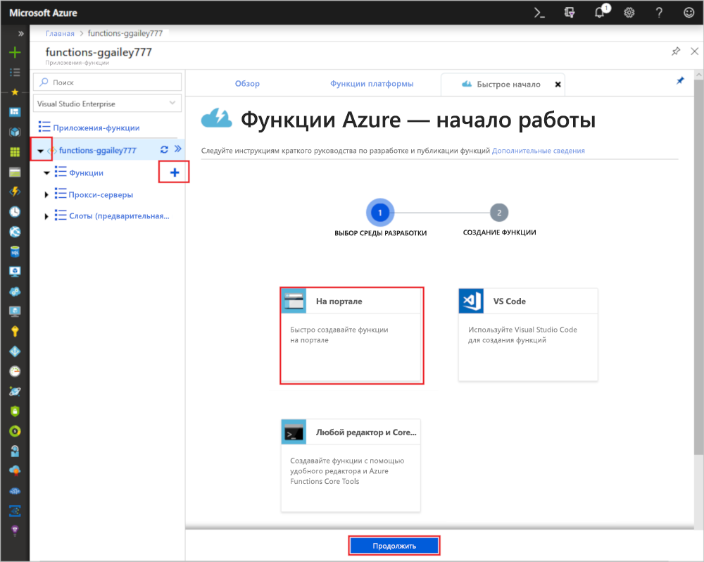
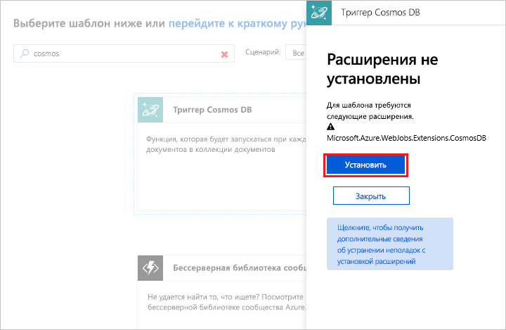
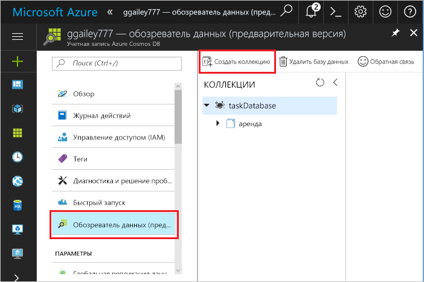

# Создание функции, активируемой с помощью Azure Cosmos DB

Узнайте, как создать функцию, которая активируется при добавлении или изменении данных в Azure Cosmos DB. Дополнительные сведения о службе Azure Cosmos DB см. в статье [ Обработка данных бессерверных баз данных с помощью Azure Cosmos DB и Функций Azure](../cosmos-db/serverless-computing-database.md).

## Предварительные требования

Для работы с этим руководством:

+ Если у вас еще нет подписки Azure, [создайте бесплатную учетную запись Azure](https://azure.microsoft.com/free/?WT.mc_id=A261C142F), прежде чем начинать работу.

> [!NOTE]
> [!INCLUDE [SQL API support only](../../includes/functions-cosmosdb-sqlapi-note.md)]

## создание учетной записи Azure Cosmos DB;

Перед созданием триггера необходимо получить учетную запись Azure Cosmos DB с API SQL.

[!INCLUDE [cosmos-db-create-dbaccount](../../includes/cosmos-db-create-dbaccount.md)]

## Создание приложения-функции Azure

[!INCLUDE [Create function app Azure portal](../../includes/functions-create-function-app-portal.md)]

Затем создайте функцию в новом приложении-функции.

## Создание триггера Azure Cosmos DB

1. Разверните приложение-функцию и нажмите кнопку **+** рядом с элементом **Функции**. Если это первая функция в приложении-функции, последовательно выберите **На портале** и **Продолжить**. Если нет, перейдите к шагу 3.

   

1. Последовательно выберите **Дополнительные шаблоны** и **Finish and view templates** (Закончить и просмотреть шаблоны).

    

1. В поле поиска введите `cosmos` и выберите шаблон **триггера Azure Cosmos DB**.

1. Если появится соответствующий запрос, щелкните **Установить**, чтобы установить в приложение-функцию расширение Azure Cosmos DB. По завершении установки щелкните **Продолжить**.

    

1. Настройте новый триггер с параметрами, как указано в таблице под изображением.

    

    | Параметр      | Рекомендуемое значение  | Описание                                |
    | ------------ | ---------------- | ------------------------------------------ |
    | **Имя** | значение по умолчанию | Используйте имя функции по умолчанию, предложенное шаблоном.|
    | **Подключение учетной записи Azure Cosmos DB** | Новый параметр | Щелкните **Создать**, выберите **подписку** и созданную ранее **учетную запись базы данных**, а затем нажмите кнопку **Выбрать**. Будет создан параметр приложения для подключения к учетной записи. Этот параметр используется в привязке для подключения к базе данных. |
    | **Имя коллекции** | Items | Имя коллекции для отслеживания. |
    | **Create lease collection if it doesn't exist** (Создать коллекцию аренд, если она не существует) | Флажок установлен | Коллекция не существует, создайте ее. |
    | **Database name** (Имя базы данных) | Задачи | Имя базы данных с коллекцией для отслеживания. |

1. Нажмите кнопку **Создать**, чтобы создать функцию, активируемую с помощью Azure Cosmos DB. После создания функции отображается код функции на основе шаблона.  

    

    Этот шаблон функции записывает в журналы количество документов и идентификатор первого документа.

Затем подключитесь к учетной записи Azure Cosmos DB и создайте в базе данных `Tasks` коллекцию `Items`.

## Создание коллекции элементов

1. Откройте второй экземпляр [портала Azure](https://portal.azure.com) на новой вкладке в браузере.

1. В левой части портала разверните панель значков, введите `cosmos` в поле поиска и выберите **Azure Cosmos DB**.

    

1. Выберите учетную запись Azure Cosmos DB, а затем выберите **обозреватель данных**. 

1. В разделе **Коллекции** выберите **taskDatabase** и **Новая коллекция**.

    

1. На странице **Добавить коллекцию** используйте параметры, перечисленные в таблице под изображением. 

    

    | Параметр|Рекомендуемое значение|ОПИСАНИЕ |
    | ---|---|--- |
    | **Идентификатор базы данных** | Задачи |Имя новой базы данных. Должен соответствовать имени, заданному в привязке функции. |
    | **Идентификатор коллекции** | Items | Имя новой коллекции. Должен соответствовать имени, заданному в привязке функции.  |
    | **Емкость хранилища** | Фиксированный (10 ГБ)|Используйте значение по умолчанию. Это значение представляет емкость хранилища базы данных. |
    | **Пропускная способность** |400 ЕЗ| Используйте значение по умолчанию. Чтобы сократить задержку, позже вы можете увеличить масштаб пропускной способности. |
    | **[Ключ секции](../cosmos-db/partition-data.md)** | /category|Ключ секции, который равномерно распределяет данные в каждой секции. Для создания высокопроизводительной коллекции важно выбрать правильный ключ раздела. | 

1. Нажмите кнопку **ОК**, чтобы создать коллекцию элементов. Процесс создания коллекции может занять некоторое время.

После создания коллекции, указанной в привязке функции, можно протестировать функцию, добавив в новую коллекцию документы.

## Проверка функции

1. Разверните новую коллекцию **taskCollection** в обозревателе данных, выберите **Documents** (Документы), а затем — **Новый документ**.

    

1. Замените содержимое нового документа следующим содержимым, а затем выберите **Сохранить**.

        {
            "id": "task1",
            "category": "general",
            "description": "some task"
        }

1. На портале переключитесь на первую вкладку браузера, содержащую функцию. Разверните журналы функций и убедитесь, что новый документ активировал функцию. На экране будет видно, что значение идентификатора документа `task1` записано в журналы. 

    

1. (Необязательно.) Перейдите обратно к документу, внесите изменения и нажмите кнопку **Изменить**. Затем вернитесь к журналам функций и убедитесь, что изменение также активировало функцию.

## Очистка ресурсов

[!INCLUDE [Next steps note](../../includes/functions-quickstart-cleanup.md)]

## Дополнительная информация

Вы создали функцию, которая запускается при добавлении или изменении документов в Azure Cosmos DB. Дополнительные сведения о триггерах Azure Cosmos DB см. в статье [Привязки Azure Cosmos DB для службы "Функции Azure"](functions-bindings-cosmosdb.md).

[!INCLUDE [Next steps note](../../includes/functions-quickstart-next-steps.md)]
