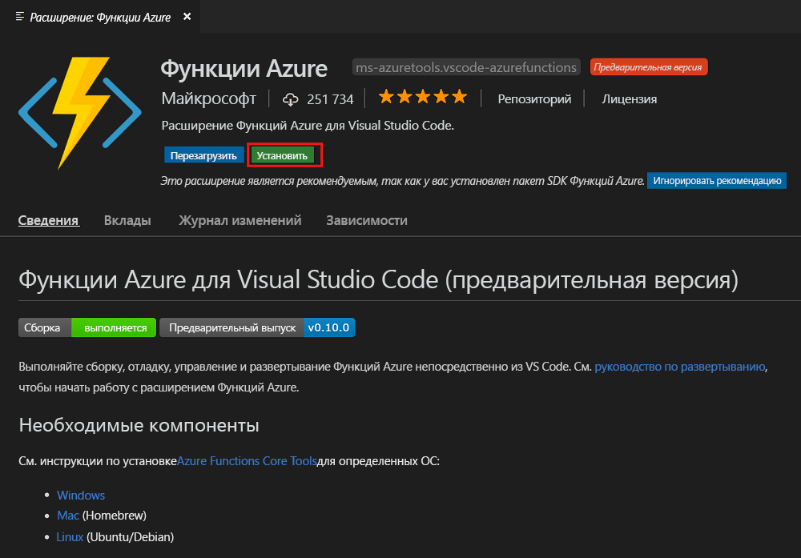
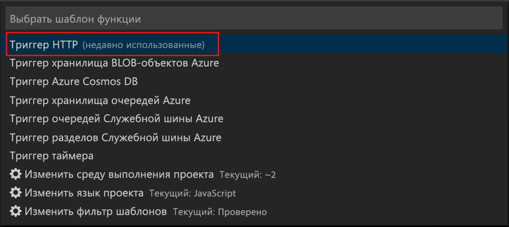

# Создание функции в Azure с помощью Visual Studio Code

Решение "Функции Azure" позволяет выполнять код в [бессерверной](https://azure.microsoft.com/overview/serverless-computing/) среде без необходимости создавать виртуальную машину или публиковать веб-приложение.

В этой статье описано, как с помощью [Расширение "Функции Azure" для Visual Studio Code] создать и проверить функцию Hello World на локальном компьютере с помощью Microsoft Visual Studio Code. Затем вы опубликуете код функции в Azure.

Сейчас это расширение поддерживает функции C#, JavaScript и Java. Описанные в этой статье шаги могут различаться в зависимости от выбранного языка для проекта Функции Azure. Расширение сейчас доступно в режиме предварительной версии. Дополнительные сведения см. в разделе [Расширение "Функции Azure" для Visual Studio Code].

## Предварительные требования

Для работы с этим кратким руководством сделайте следующее:

* Установите [Visual Studio Code](https://code.visualstudio.com/) на одной из [поддерживаемых платформ](https://code.visualstudio.com/docs/supporting/requirements#_platforms). В нашем в статье примере функция создавалась и тестировалась на устройстве под управлением macOS (High Sierra).

* Установите [основные инструменты расширения "Функции Azure"](functions-run-local.md#v2) версии 2.x, имеющей статус предварительной.

* Установите необходимые дополнительные средства для выбранного языка:

    | Язык | Добавочный номер |
    | -------- | --------- |
    | **C#** | [C# для Visual Studio Code](https://marketplace.visualstudio.com/items?itemName=ms-vscode.csharp); [Средства .NET Core CLI](https://docs.microsoft.com/dotnet/core/tools/?tabs=netcore2x)*   |
    | **Java** | [Отладчик для Java](https://marketplace.visualstudio.com/items?itemName=vscjava.vscode-java-debug) [JDK 1.8](http://www.oracle.com/technetwork/java/javase/downloads/index.html) [Maven 3+](https://maven.apache.org/) |
    | **JavaScript** | [Node 8.0+](https://nodejs.org/)  |

    \* Также требуется для основных инструментов.

[!INCLUDE [quickstarts-free-trial-note](../../includes/quickstarts-free-trial-note.md)]

## Установка расширения "Функции Azure"

Расширение "Функции Azure" предназначено для создания, тестирования и развертывания функций в Azure.

1. В Visual Studio Code откройте **Extensions** (Расширения) и найдите `azure functions` или [перейдите по этой ссылке](vscode:extension/ms-azuretools.vscode-azurefunctions).

1. Выберите **Install** (Установить), чтобы установить расширение для Visual Studio Code. 

    

1. Перезапустите Visual Studio Code и щелкните значок Azure на панели действий. Вы увидите область Azure Functions (Функции Azure) на боковой панели.

    

## Создание проекта Функций Azure

С помощью шаблона проекта Функции Azure в Visual Studio Code можно создать проект и затем опубликовать его в виде приложения-функции в Azure. Приложение-функция позволяет группировать функции в логические единицы для развертывания и совместного использования ресурсов, а также управления ими.

1. В Visual Studio Code выберите логотип Azure, чтобы отобразить область **Azure: Functions** (Azure: Функции), после чего щелкните значок Create New Project (Создать проект).

    

1. Выберите расположение для рабочей области проекта и нажмите **Select** (Выбрать).

    > [!NOTE]
    > Рассматриваемый в этой статье пример выполняется вне рабочей области. В этом случае не нужно указывать папку проекта, которая является частью рабочей области.

1. Выберите язык для проекта приложения-функции. В этом примере используется JavaScript.
    

1. Когда появится запрос, выберите **Add to workspace** (Добавить в рабочую область).

Редактор Visual Studio Code создаст проект приложения-функции в новой рабочей области. Проект будет содержать файлы конфигурации [host.json](functions-host-json.md) и [local.settings.json](functions-run-local.md#local-settings-file), а также файлы проекта для указанного языка. В папке проекта также появится новый репозиторий Git.

## Создание функции, активируемой HTTP

1. В расширении "**Функции Azure**" щелкните значок Create Function (Создать функцию).

    

1. Укажите папку со своим проектом приложения-функции и выберите шаблон функции **HTTP trigger** (Триггер HTTP).

    

1. Введите `HTTPTrigger`, чтобы задать имя функции и нажмите клавишу ВВОД, после чего укажите способ проверки подлинности **Anonymous** (Анонимно).

    

    С помощью шаблона функции, активируемой HTTP-запросом, будет создана функция на выбранном вами языке.

    

К функции можно добавить входные и выходные привязки, изменив файл function.json. См. дополнительные сведения о [триггерах и привязках в Функциях Azure](functions-triggers-bindings.md).

Созданный проект функции и функцию, активируемую HTTP, можно протестировать на локальном компьютере.

## Локальное тестирование функции

Основные инструменты службы "Функции Azure" позволяют запускать проекты функций Azure на локальном компьютере разработчика. Вам будет предложено установить эти инструменты при первом запуске функции из Visual Studio Code.  

1. Чтобы протестировать созданную функцию, установите точку останова в коде функции и нажмите клавишу F5 для запуска проекта приложения-функции. Выходные данные основных инструментов отображаются на панели **Terminal** (Терминал).

1. На панели **Terminal** (Терминал) скопируйте URL-адрес конечной точки функции, активируемой HTTP-запросом.

    

1. Вставьте URL-адрес запроса в адресную строку браузера. Добавьте строку запроса `?name=<yourname>` в этот URL-адрес и выполните запрос. Выполнение функции приостановится при достижении точки останова.

    

1. При продолжении выполнения функции в браузере отобразится следующий ответ на запрос GET:

    

1. Нажмите клавиши SHIFT+F1, чтобы остановить отладку.

Убедившись, что функция выполняется правильно на локальном компьютере, опубликуйте проект в Azure.

## Вход в Azure

Прежде чем публиковать приложение, необходимо войти в Azure.

1. В области **Azure: Functions** (Azure: Функции) выберите **Sign in to Azure** (Войти в Azure). Если у вас нет учетной записи, можно создать **бесплатную учетную запись Azure**.

    

1. При появлении запроса выберите **Copy & Open** (Копировать и открыть) или скопируйте отображаемый код и откройте <https://aka.ms/devicelogin> в браузере.

1. Скопированный код вставьте на странице **Device Login** (Вход на устройство), проверьте, выполнен ли вход в Visual Studio Code, и щелкните **Continue** (Продолжить).  

1. Войдите в учетную запись, используя учетные данные Azure. Выполнив вход, можно закрыть браузер.

## Публикация проекта в Azure

Visual Studio Code позволяет опубликовать проект функций непосредственно в Azure. При этом вы создаете приложение-функцию и связанные ресурсы в своей подписке Azure. Приложение-функция обеспечивает контекст выполнения функций. Проект упаковывается и развертывается в новом приложении-функции в вашей подписке Azure. 

В этой статье предполагается, что вы создаете новое приложение-функцию. Публикация в существующее приложение-функцию перезаписывает содержимое этого приложения в Azure.

1. В области **Azure: Functions** ( Azure: Функции) щелкните значок Deploy to Function App (Развернуть в приложение-функцию).

    

1. Выберите папку проекта, которая является текущей рабочей областью.

1. Если у вас есть несколько подписок, выберите ту, в которой будет размещено приложение-функция, после чего щелкните **+Create New Function App** (Создать приложение-функцию).

1. Введите глобальное уникальное имя для приложения-функции и нажмите клавишу ВВОД. Допустимые символы для имени приложения-функции: `a-z`, `0-9` и `-`.

1. Выберите **+Create New Resource Group** (Создать группу ресурсов), назначьте глобальное уникальное имя группе ресурсов, например `myResourceGroup`, и нажмите клавишу ВВОД. Вы также можете использовать существующую группу ресурсов.

1. Выберите **+Create New Storage Account** (Создать учетную запись хранения), введите глобальное уникальное имя группы ресурсов для вашего приложения-функции и нажмите клавишу ВВОД. Имя учетной записи хранения должно содержать от 3 до 24 символов и состоять только из цифр и строчных букв. Вы также можете использовать имеющуюся учетную запись.

1. Выберите расположение в ближайшем к вам [регионе](https://azure.microsoft.com/regions/) или регионе, ближайшем к другим службам, к которым обращаются ваши функции.

    После того как вы укажете расположение, начнется создание приложения-функции. После создания приложения-функции и применения пакета развертывания отобразится уведомление.

1. Выберите **View Output** (Просмотреть выходные данные) в уведомлении, чтобы просмотреть результаты создания и развертывания ресурсов Azure.

    

1. Запишите URL-адрес нового приложения-функции в Azure. Он понадобится для тестирования функции после публикации проекта в Azure.

    

1. В области **Azure: Functions** (Azure: Функции) вы увидите новое приложение-функцию, появившееся в вашей подписке. Если развернуть этот узел, отобразятся функции в приложении-функции, а также параметры приложения и прокси-серверы функций.

    

    В узле приложения-функции нажмите клавишу CTRL и щелкните правой кнопкой мыши, чтобы отобразить список доступных задач по управлению и настройке приложения-функции в Azure. Приложение-функцию можно также просмотреть на портале Azure.

## Тестирование функции в Azure

1. Скопируйте URL-адрес HTTP-триггера на панели **Output** (Выходные данные). Как и в предыдущем случае, добавьте строку запроса `?name=<yourname>` в конец этого URL-адреса и выполните запрос.

    URL-адрес для вызова функции, активируемой HTTP-запросом, должен быть указан в таком формате:

        http://<functionappname>.azurewebsites.net/api/<functionname>?name=<yourname> 

1. Вставьте этот URL-адрес HTTP-запроса в адресную строку браузера. Ниже показан ответ в браузере на удаленный запрос GET, возвращаемый функцией: 

    

## Дополнительная информация

С помощью Visual Studio Code вы создали приложение-функцию с простой функцией, активируемой HTTP-запросом. Дополнительные сведения о разработке функций на определенном языке см. в справочниках по языкам [JavaScript](functions-reference-node.md), [.NET](functions-dotnet-class-library.md) или [Java](functions-reference-java.md).

Далее можно узнать о локальном тестировании и отладке из терминала или командной строки основных инструментов "Функций Azure".

> [!div class="nextstepaction"]
> [Создание и тестирование кода на локальном компьютере](functions-run-local.md)

[Azure Functions Core Tools]: functions-run-local.md
[Расширение "Функции Azure" для Visual Studio Code]: https://marketplace.visualstudio.com/items?itemName=ms-azuretools.vscode-azurefunctions
