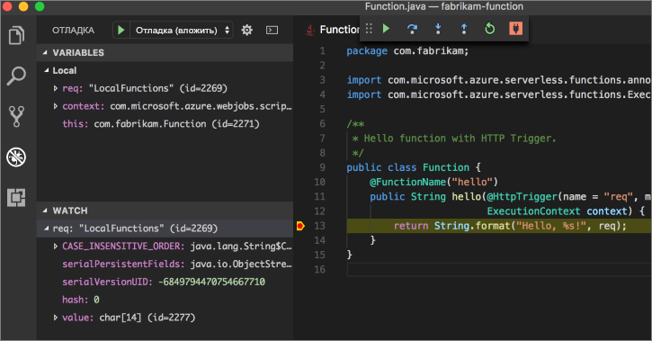

# <a name="create-your-first-function-with-java-and-maven-preview"></a>Создание первой функции с помощью Java и Maven (предварительная версия)

[!INCLUDE [functions-java-preview-note](../../includes/functions-java-preview-note.md)]

В этом кратком руководстве содержится информация о том, как создать проект функции [без сервера](https://azure.microsoft.com/overview/serverless-computing/) с помощью Maven, локально протестировать и развернуть его в решении "Функции Azure". После выполнения этих действий, приложение-функция активированного HTTP будет запущена в Azure.


[!INCLUDE [quickstarts-free-trial-note](../../includes/quickstarts-free-trial-note.md)]

## <a name="prerequisites"></a>Предварительные требования
Для разработки функций приложения с помощью Java, должны быть установлены следующие компоненты:

-  [Java Developer Kit (JDK)](https://www.azul.com/downloads/zulu/) версии 8.
-  [Apache Maven](https://maven.apache.org) 3.0 или более поздней версии.
-  [Интерфейс командной строки Azure](https://docs.microsoft.com/cli/azure)

> [!IMPORTANT] 
> Переменной среде JAVA_HOME необходимо присвоить расположение установки JDK, чтобы завершить выполнение заданий этого краткого руководства.

## <a name="install-the-azure-functions-core-tools"></a>Установка основных инструментов Функций Azure

Основные средства Функций Azure предоставляют возможность записи, выполнения и отладки Функций Azure в локальной среде разработки с помощью терминала или командной строки. 

Прежде чем продолжить, установите на локальном компьютере [основные инструменты версии 2](functions-run-local.md#v2).

## <a name="generate-a-new-functions-project"></a>Создание нового проекта функций

В пустой папке выполните следующую команду, чтобы создать проект функций из [архетипа Maven](https://maven.apache.org/guides/introduction/introduction-to-archetypes.html).

### <a name="linuxmacos"></a>Linux/MacOS

```bash
mvn archetype:generate \
    -DarchetypeGroupId=com.microsoft.azure \
    -DarchetypeArtifactId=azure-functions-archetype 
```

### <a name="windows-cmd"></a>Windows (CMD)
```cmd
mvn archetype:generate ^
    -DarchetypeGroupId=com.microsoft.azure ^
    -DarchetypeArtifactId=azure-functions-archetype
```

Maven запросит значения, необходимые для завершения создания проекта. Дополнительную информацию о значениях _groupId_, _artifactId_ и о _версии_ см. по ссылке [соглашения об именовании Maven](https://maven.apache.org/guides/mini/guide-naming-conventions.html). Значение _appName_ должно быть уникальным в Azure, поэтому Maven создает имя приложения на основе ранее заданного по умолчанию _artifactId_. Значение _ackageName_ определяет пакет Java для создаваемого кода функции.

Значение `appRegion` указывает, в каком [регионе Azure](https://azure.microsoft.com/global-infrastructure/regions/) будет запущено развернутое приложение-функция. Вы можете получить список значений имен регионов с помощью команды `az account list-locations` в Azure CLI. Значение `resourceGroup` указывает, в какой группе ресурсов Azure будет создано приложение-функция.

Идентификаторы `com.fabrikam.functions` и `fabrikam-functions` ниже используются в качестве примера и для понимания дальнейших шагов в этом кратком руководстве. Рекомендуется ввести собственные значения для Maven на этом шаге.

```Output
Define value for property 'groupId': com.fabrikam.functions
Define value for property 'artifactId' : fabrikam-functions
Define value for property 'version' 1.0-SNAPSHOT : 
Define value for property 'package': com.fabrikam.functions
Define value for property 'appName' fabrikam-functions-20170927220323382:
Define value for property 'appRegion' westus : 
Define value for property 'resourceGroup' java-functions-group: 
Confirm properties configuration: Y
```

Maven создает файлы проекта в новой папке с именем _artifactId_, в этом примере — `fabrikam-functions`. Созданный в проекте и готовый для запуска код — это простая функция [активации HTTP](/azure/azure-functions/functions-bindings-http-webhook), возвращающая текст запроса после строки "Hello, ".

```java
public class Function {
    @FunctionName("HttpTrigger-Java")
    public HttpResponseMessage HttpTriggerJava(
    @HttpTrigger(name = "req", methods = {HttpMethod.GET, HttpMethod.POST}, authLevel = AuthorizationLevel.ANONYMOUS) HttpRequestMessage<Optional<String>> request,final ExecutionContext context) {
        context.getLogger().info("Java HTTP trigger processed a request.");

        // Parse query parameter
        String query = request.getQueryParameters().get("name");
        String name = request.getBody().orElse(query);

        if (name == null) {
            return request.createResponseBuilder(HttpStatus.BAD_REQUEST).body("Please pass a name on the query string or in the request body").build();
        } else {
            return request.createResponseBuilder(HttpStatus.OK).body("Hello, " + name).build();
        }
    }
}
```

## <a name="run-the-function-locally"></a>Локальное выполнение функции

Измените каталог на только что созданную папку проекта, создайте и запустите функцию с помощью Maven.

```
cd fabrikam-functions
mvn clean package 
mvn azure-functions:run
```

> [!NOTE]
> При возникновении исключения `javax.xml.bind.JAXBException` с Java 9 инструкции по его устранению см. на [GitHub](https://github.com/jOOQ/jOOQ/issues/6477).

Вы увидите эти выходные данные, если функция выполняется локально на компьютере и готова отвечать на запросы HTTP:

```Output
Listening on http://0.0.0.0:7071/
Hit CTRL-C to exit...

Http Functions:

        HttpTrigger-Java: http://localhost:7071/api/HttpTrigger-Java
```

Вызовите функцию из командной строки, используя curl в новом окне терминала:

```
curl -w '\n' -d LocalFunctionTest http://localhost:7071/api/HttpTrigger-Java
```

```Output
Hello, LocalFunctionTest
```

Используйте `Ctrl-C` в терминале, чтобы остановить код функции.

## <a name="deploy-the-function-to-azure"></a>Развертывание функции для Azure

В процессе развертывания для Функций Azure используются данные учетной записи из Azure CLI. Прежде чем продолжить, [войдите с помощью Azure CLI](/cli/azure/authenticate-azure-cli?view=azure-cli-latest).

```azurecli
az login
```

Разверните свой код в новом приложении-функции, используя целевой объект Maven `azure-functions:deploy`.

```
mvn azure-functions:deploy
```

После завершения развертывания появится URL-адрес, который можно использовать для доступа к приложению-функции Azure:

```output
[INFO] Successfully deployed Function App with package.
[INFO] Deleting deployment package from Azure Storage...
[INFO] Successfully deleted deployment package fabrikam-function-20170920120101928.20170920143621915.zip
[INFO] Successfully deployed Function App at https://fabrikam-function-20170920120101928.azurewebsites.net
[INFO] ------------------------------------------------------------------------
```

Проверьте приложение-функцию, работающее в Azure, используя `cURL`. Необходимо изменить URL-адрес из примера ниже, чтобы он соответствовал развернутому URL-адресу приложения-функции из предыдущего шага.

```
curl -w '\n' -d AzureFunctionsTest https://fabrikam-functions-20170920120101928.azurewebsites.net/api/HttpTrigger-Java
```

```Output
Hello, AzureFunctionsTest
```

## <a name="next-steps"></a>Дополнительная информация

Вы создали приложение-функцию Java с помощью простого триггера HTTP и развернули его в Функциях Azure.

- Дополнительные сведения о разработке функции Java см. в статье [Azure Functions Java developer guide](functions-reference-java.md) (Руководство разработчика Java для Функций Azure).
- Добавьте в проект дополнительные функции с помощью различных триггеров целевого объекта Maven`azure-functions:add`.
- Проведите отладку функций локально с помощью Visual Studio Code. С помощью установленного [пакета расширения Java](https://marketplace.visualstudio.com/items?itemName=vscjava.vscode-java-pack) и проекта функций, открытого в Visual Studio Code, [присоедините отладчик](https://code.visualstudio.com/Docs/editor/debugging#_launch-configurations) к порту 5005. Затем установите точку останова в редакторе и активируйте функции во время локального выполнения: 
- Проведите отладку функций удаленно с помощью Visual Studio Code. Инструкции см. в документе по [созданию бессерверных приложений Java](https://code.visualstudio.com/docs/java/java-serverless#_remote-debug-functions-running-in-the-cloud).
