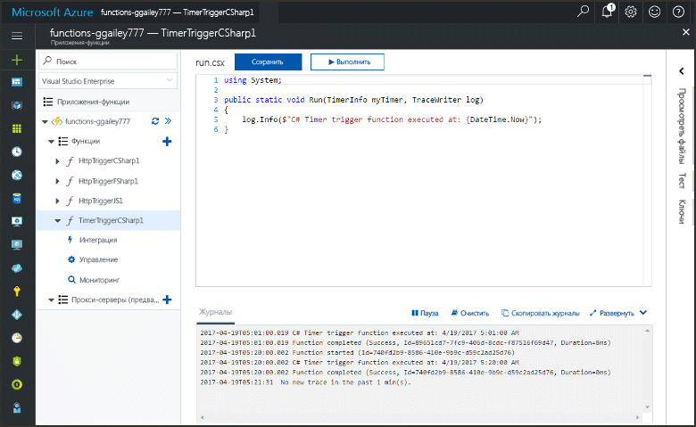
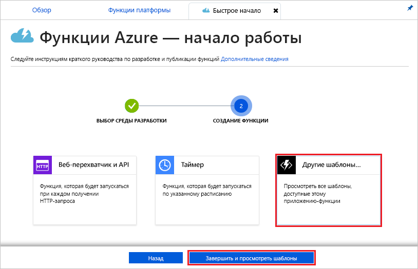
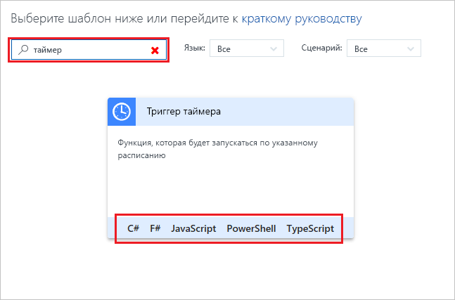
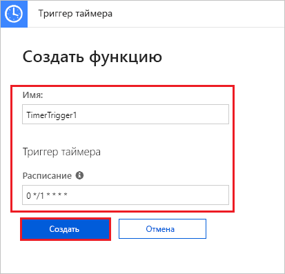

# Создание в Azure функции, активируемой по таймеру

Узнайте, как создать [независимую от сервера](https://azure.microsoft.com/overview/serverless-computing/) функцию, которая выполняется на основе определенного расписания с помощью Функций Azure.

## предварительным требованиям

Для работы с этим руководством:

+ Если у вас еще нет подписки Azure, [создайте бесплатную учетную запись Azure](https://azure.microsoft.com/free/?WT.mc_id=A261C142F), прежде чем начинать работу.

## Создание приложения-функции Azure

[!INCLUDE [Create function app Azure portal](../../includes/functions-create-function-app-portal.md)]

Затем создайте функцию в новом приложении-функции.

## Создание функции, активируемой по таймеру

1. Разверните приложение-функцию и нажмите кнопку **+** рядом с элементом **Функции**. Если это первая функция в приложении-функции, выберите **Пользовательская функция**. Откроется полный набор шаблонов функций.

    

2. В поле поиска введите `timer` и выберите нужный язык для шаблона триггера таймера. 

    

3. Настройте новый триггер с параметрами, как указано в таблице под изображением.

    

    | Параметр | Рекомендуемое значение | Описание |
    |---|---|---|
    | **Имя** | значение по умолчанию | Определяет имя функции, активируемой по таймеру. |
    | **[Расписание](http://en.wikipedia.org/wiki/Cron#CRON_expression)** | 0 \*/1 \* \* \* \* | [Выражение CRON](http://en.wikipedia.org/wiki/Cron#CRON_expression) с шестью полями, в котором запланировано ежеминутное выполнение функции. |

2. Нажмите кнопку **Создать**. Будет создана функция на выбранном вами языке, которая будет выполняться каждую минуту.

3. Проверьте выполнение, просмотрев записанные в журналах сведения трассировки.

    

Теперь потребуется изменить расписание функции, чтобы она выполнялась раз в час, а не раз в минуту. 

## Обновление расписания таймера

1. Разверните вашу функцию и щелкните **Интеграция**. Здесь вы определяете входные и выходные привязки для вашей функции, а также задаете расписание. 

2. Введите в поле **Расписание** новое часовое значение `0 0 */1 * * *`, а затем щелкните **Сохранить**.  

Теперь функция будет выполняться раз в час. 

## Очистка ресурсов

[!INCLUDE [Next steps note](../../includes/functions-quickstart-cleanup.md)]

## Дополнительная информация

Вы создали функцию, которая выполняется на основе расписания.

[!INCLUDE [Next steps note](../../includes/functions-quickstart-next-steps.md)]

Дополнительные сведения о триггерах см.в статье [Настройка триггеров для выполнения кода с помощью Функций Azure](functions-bindings-timer.md).
