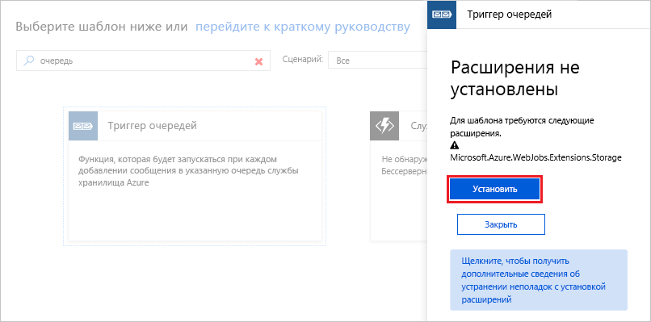
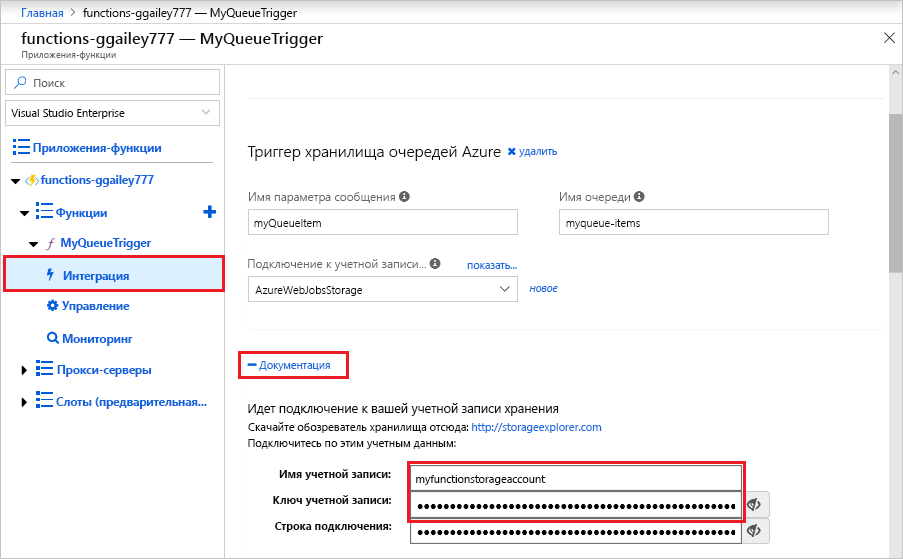
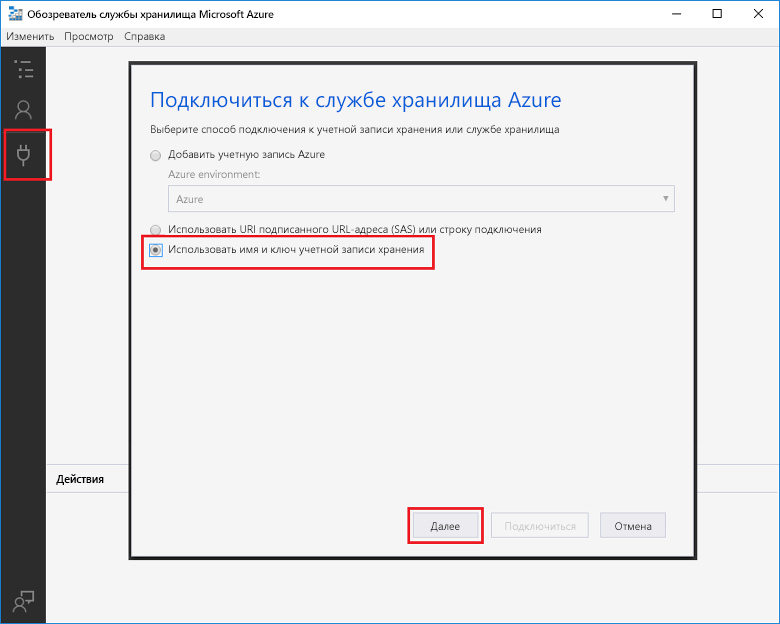
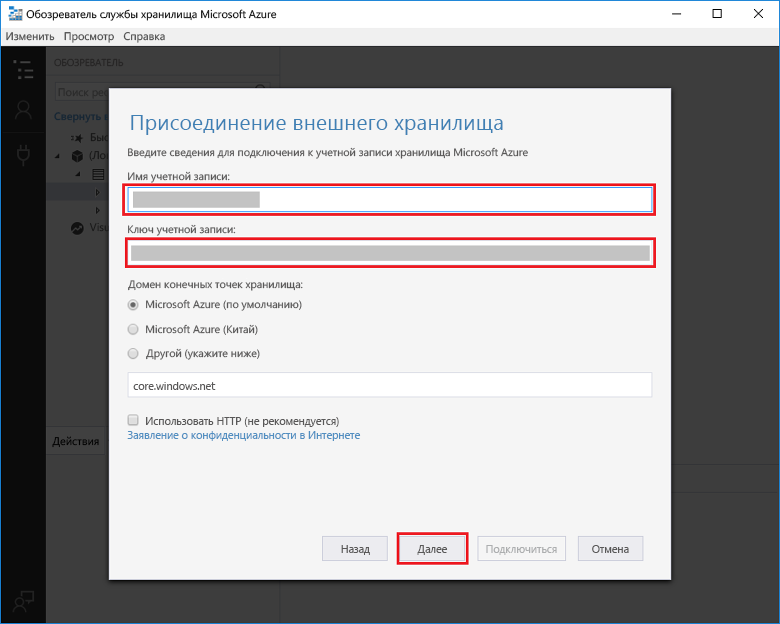
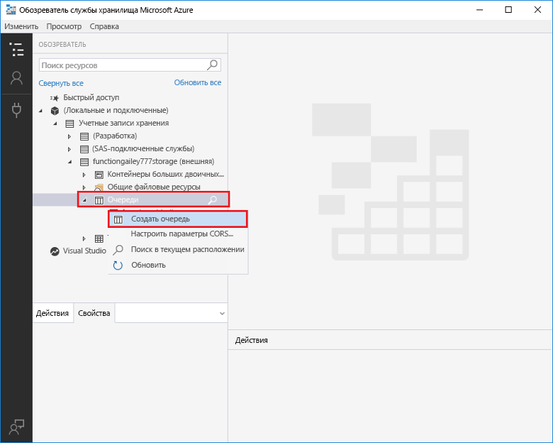
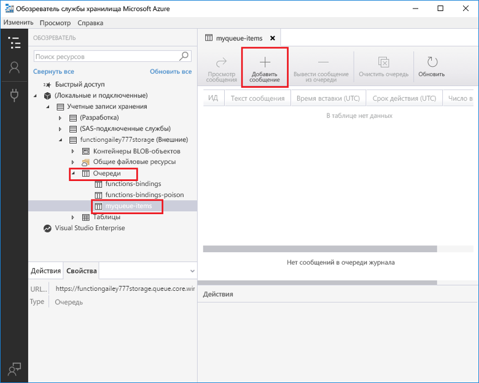

# Создание функции, активируемой хранилищем очередей Azure

Узнайте, как создавать функцию, активируемую при отправке сообщений в очередь службы хранилища Azure.  

Выполнение всех шагов в этой статье займет меньше пяти минут.

## Предварительные требования

[!INCLUDE [Previous quickstart note](../../includes/functions-quickstart-previous-topics.md)]

Вам необходимо скачать и установить [обозреватель службы хранилища Microsoft Azure](http://storageexplorer.com/). 

[!INCLUDE [functions-portal-favorite-function-apps](../../includes/functions-portal-favorite-function-apps.md)] 

## Создание функции, активируемой очередью

Разверните свое приложение-функцию, нажмите кнопку **+** рядом с **Функции**, а затем щелкните шаблон **QueueTrigger** для нужного языка. Затем используйте настройки, указанные в таблице, и щелкните **Создать**.

    
| Настройка      |  Рекомендуемое значение   | Описание                                        |
| ------------ |  ----------------- | -------------------------------------------------- |
| **Имя очереди**   | myqueue-items    | Имя очереди для подключения к вашей учетной записи хранения. |
| **Подключение к учетной записи хранения** | AzureWebJobStorage | Вы можете использовать подключение к учетной записи хранения, которое уже используется вашим приложением-функцией, или создать его.  |
| **Имя функции** | Уникальное для вашего приложения-функции | Имя функции, активируемой очередью. |  

Затем необходимо подключиться к своей учетной записи хранения Azure и создать очередь службы хранилища **myqueue-items**.

## Создание очереди

1. Щелкните **Интегрировать** в своей функции, затем разверните узел **Документация** и скопируйте **имя учетной записи** и **ключ учетной записи**. Эти учетные данные используются для подключения к учетной записи хранения. Если вы уже подключились к учетной записи хранения, перейдите к шагу 4.
 
    v

2. Запустите инструмент [Обозреватель службы хранилища Microsoft Azure](http://storageexplorer.com/), щелкните значок подключения слева, выберите **Use a storage account name and key** (Использовать имя и ключ учетной записи хранения), а затем щелкните **Далее**.

    
    
3. Введите **имя учетной записи** и **ключ учетной записи** из шага 1, щелкните **Далее**, а затем — **Подключить**. 
  
    

4. Разверните подключенную учетную запись хранения, щелкните правой кнопкой мыши **Очереди** (Контейнеры больших двоичных объектов), а затем щелкните **Создать очередь**, введите `myqueue-items` и нажмите клавишу ВВОД.
 
    

Теперь, когда вы создали очередь хранилища, испытайте функцию, добавив сообщение в очередь.  

## Проверка функции

1. На портале Azure перейдите к вашей функции, в нижней части страницы разверните **Журналы** и убедитесь, что потоковая передача журналов не остановлена.

2. Разверните свою учетную запись в обозревателе хранилищ, узел **Очереди** и **myqueue-items**, а затем щелкните **Add message** (Добавить сообщение). 

    

2. Введите сообщение Hello World в поле **Текст сообщения** и щелкните **ОК**.
 
3. Подождите несколько секунд, а затем вернитесь в журналы функции и убедитесь, что новое сообщение было считано из очереди. 

    

4. Вернитесь в обозреватель хранилища, щелкните **Обновить** и убедитесь, что сообщение было обработано и больше не находится в очереди.

## Очистка ресурсов

[!INCLUDE [Next steps note](../../includes/functions-quickstart-cleanup.md)]

## Дальнейшие действия

Вы создали функцию, которая выполняется при добавлении сообщения в очередь хранилища. 

[!INCLUDE [Next steps note](../../includes/functions-quickstart-next-steps.md)]

Дополнительные сведения о триггерах хранилища очередей см. в статье [Привязки очередей службы хранилища для Функций Azure](functions-bindings-storage-queue.md). 

