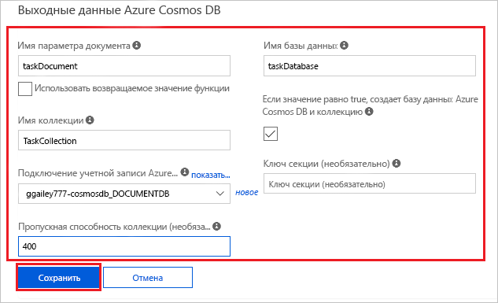
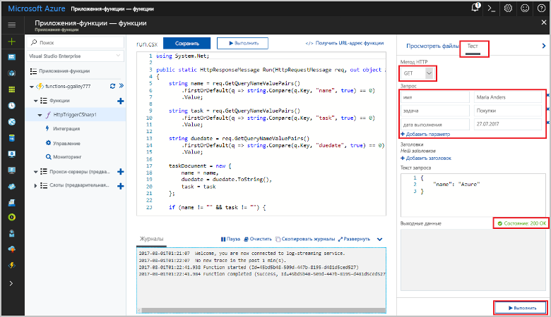

# <a name="store-unstructured-data-using-azure-functions-and-cosmos-db"></a>Хранение неструктурированных данных с помощью служб Функции Azure и Cosmos DB

Azure Cosmos DB — это отличный способ хранения неструктурированных данных и данных в формате JSON. В сочетании с функциями Azure Cosmos DB позволяет быстро и просто сохранять данные, используя код гораздо меньшего объема, чем требуется для хранения данных в реляционной базе данных.

В этом руководстве объясняется, как с помощью портала Azure создать функцию Azure, которая сохраняет неструктурированные данные в документе Cosmos DB. 

## <a name="prerequisites"></a>Предварительные требования

[!INCLUDE [Previous quickstart note](../../includes/functions-quickstart-previous-topics.md)]

[!INCLUDE [functions-portal-favorite-function-apps](../../includes/functions-portal-favorite-function-apps.md)]

## <a name="create-a-function"></a>Создание функции

Создайте новый универсальный объект webhook на C# с именем `MyTaskList`.

1. Разверните список существующих функций и щелкните знак "+", чтобы создать новую функцию.
1. Выберите GenericWebHook-CSharp и введите имя `MyTaskList`.


## <a name="add-an-output-binding"></a>Добавление выходной привязки

Функция Azure может включать один триггер и любое количество входных или выходных привязок. В этом примере мы будем использовать в качестве выходной привязки триггер HTTP-запроса и документ Cosmos DB.

1. Щелкните вкладку *Интегрировать* для функции, чтобы просмотреть или изменить триггеры и привязки функции.
1. Выберите ссылку *Новое выходное значение* в правом верхнем углу страницы.

Примечание. Триггер HTTP-запроса уже настроен, однако вам необходимо добавить привязку документа Cosmos DB.


1. Введите необходимые сведения, чтобы создать привязку. Используйте следующую таблицу для определения значений.



|  Поле | Значение  |
|---|---|
| Имя параметра документа | Имя, которое ссылается на объект Cosmos DB в коде |
| Имя базы данных | Имя базы данных для сохранения документов |
| Имя коллекции | Имя объединения баз данных Cosmos DB |
| Would you like the Cosmos DB and collection created for you (Нужно ли создать базу данных Cosmos DB и коллекцию автоматически) | "Да" или "Нет" |
| Cosmos DB account connection (Подключение к учетной записи Cosmos DB) | Строка подключения, указывающая на базу данных Cosmos DB |

Необходимо также настроить подключение к базе данных Cosmos DB.

1. Щелкните ссылку "Создать" рядом с надписью Cosmos DB account connection (Подключение к учетной записи Cosmos DB).
1. Заполните поля и выберите соответствующие параметры, необходимые для создания документа Cosmos DB.


|  Поле | Значение  |
|---|---|
| Идентификатор | Уникальный идентификатор для базы данных Cosmos DB  |
| API NoSQL | Cosmos DB или MongoDB  |
| Подписка | Подписка MSDN  |
| Группа ресурсов  | Создайте новую группу или выберите существующую.  |
| Расположение  | WestEurope  |

1. Нажмите кнопку *ОК* . Возможно, вам придется подождать несколько минут, пока Azure создает ресурсы.
1. Нажмите кнопку *Сохранить* .

## <a name="update-the-function-code"></a>Обновление кода функции

Замените код шаблона функции следующим кодом:

Обратите внимание, что для этого примера используется только код на языке C#.

```csharp
using System.Net;

public static HttpResponseMessage Run(HttpRequestMessage req, out object taskDocument, TraceWriter log)
{
    string name = req.GetQueryNameValuePairs()
        .FirstOrDefault(q => string.Compare(q.Key, "name", true) == 0)
        .Value;

    string task = req.GetQueryNameValuePairs()
        .FirstOrDefault(q => string.Compare(q.Key, "task", true) == 0)
        .Value;

    string duedate = req.GetQueryNameValuePairs()
        .FirstOrDefault(q => string.Compare(q.Key, "duedate", true) == 0)
        .Value;

    taskDocument = new {
        name = name,
        duedate = duedate.ToString(),
        task = task
    };

    if (name != "" && task != "") {
        return req.CreateResponse(HttpStatusCode.OK);
    }
    else {
        return req.CreateResponse(HttpStatusCode.BadRequest);
    }
}

```

Этот пример кода считывает строки HTTP-запроса и назначает их в качестве членов объекта `taskDocument`. Объект `taskDocument` автоматически сохраняет данные в базе данных Cosmos DB и даже создает базу данных при первом использовании.

## <a name="test-the-function-and-database"></a>Тестирование функции и базы данных

1. На вкладке функции щелкните *Проверка* в правой части страницы портала и введите следующие строки HTTP-запроса:

| Строка запроса | Значение |
|---|---|
| name | Chris P. Bacon (Крис П. Бэйкон) |
| task | Make a BLT sandwich (Сделать сэндвич с беконом, салатом и помидором) |
| duedate | 05/12/2017 |

1. Щелкните ссылку *Выполнить*.
1. Убедитесь, что функция вернула код ответа *HTTP 200 ОК*.



Убедитесь, что запись создана в базе данных Cosmos DB.

1. Найдите базу данных на портале Azure и выберите ее.
1. Выберите пункт *Обозреватель данных*.
1. Разворачивайте узлы, пока не достигнете уровня записей документов.
1. Подтвердите запись базы данных. В базе данных вместе с данными будут содержаться дополнительные метаданные.


Если данные есть в документе, вы успешно создали функцию Azure, которая сохраняет неструктурированные данные в базе данных Cosmos DB.

## <a name="clean-up-resources"></a>Очистка ресурсов

[!INCLUDE [Next steps note](../../includes/functions-quickstart-cleanup.md)]

## <a name="next-steps"></a>Дальнейшие действия

Дополнительные сведения о функциях Azure см. в следующих статьях:

[!INCLUDE [Getting help note](../../includes/functions-get-help.md)]

[!INCLUDE [functions-quickstart-next-steps](../../includes/functions-quickstart-next-steps.md)]

