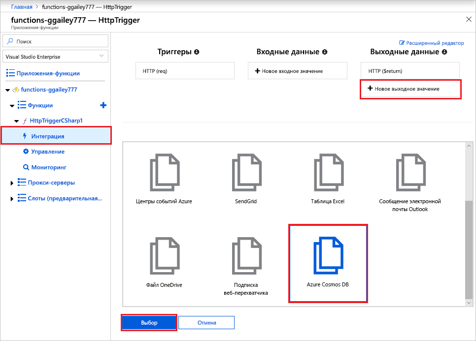
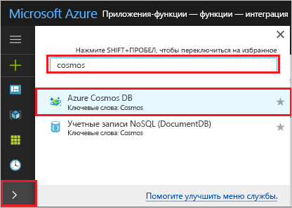

# <a name="store-unstructured-data-using-azure-functions-and-cosmos-db"></a>Хранение неструктурированных данных с помощью служб Функции Azure и Cosmos DB

[Azure Cosmos DB](https://azure.microsoft.com/services/cosmos-db/) — это отличный способ хранения неструктурированных данных и данных в формате JSON. В сочетании с функциями Azure Cosmos DB позволяет быстро и просто сохранять данные, используя код гораздо меньшего объема, чем требуется для хранения данных в реляционной базе данных.

В Функциях Azure входные и выходные привязки предоставляют декларативный способ подключения данных внешних служб к функции. В этой статье вы узнаете, как обновить имеющуюся функцию C#, чтобы добавить выходную привязку, которая сохраняет неструктурированные данные в документе Cosmos DB. 


## <a name="prerequisites"></a>Предварительные требования

Для работы с этим руководством:

[!INCLUDE [Previous quickstart note](../../includes/functions-quickstart-previous-topics.md)]

## <a name="add-an-output-binding"></a>Добавление выходной привязки

1. Разверните ваше приложение-функцию и функцию.

1. Выберите элементы **Интегрировать** и **Новые выходные данные**, которые находятся в верхней правой части страницы. Выберите **Azure Cosmos DB** и щелкните **Выбрать**.

    

3. Используйте параметры **Azure Cosmos DB output** (Выходные данные Azure Cosmos DB) как указано в таблице: 

    

    | Настройка      | Рекомендуемое значение  | Описание                                |
    | ------------ | ---------------- | ------------------------------------------ |
    | **Имя параметра документа** | taskDocument | Имя, которое ссылается на объект Cosmos DB в коде. |
    | **Database name** (Имя базы данных) | taskDatabase | Имя базы данных для сохранения документов. |
    | **Имя коллекции** | TaskCollection | Имя коллекции баз данных Cosmos DB. |
    | **If true, creates the Cosmos DB database and collection** (Если значение равно true, создается база данных Cosmos DB и коллекция) | Флажок установлен | Коллекция не существует, создайте ее. |

4. Выберите **Новый** рядом с надписью **Cosmos DB document connection** (Подключение к учетной записи Cosmos DB) и выберите **Создать**. 

5. Используйте параметры **Новая учетная запись**, как указано в таблице: 

    

    | Настройка      | Рекомендуемое значение  | Описание                                |
    | ------------ | ---------------- | ------------------------------------------ |
    | **Идентификатор** | Имя базы данных | Уникальный идентификатор для базы данных Cosmos DB  |
    | **API** | SQL (DocumentDB) | Выберите API базы данных документов.  |
    | **Подписка** | Подписка Azure | Подписка Azure  |
    | **Группа ресурсов** | myResourceGroup |  Используйте имеющуюся группу ресурсов, которая содержит функцию-приложение. |
    | **Расположение**  | WestEurope | Выберите расположение рядом с приложением-функцией или другими приложениями, которые используют хранимые документы.  |

6. Нажмите кнопку **ОК**, чтобы создать базу данных. Создание базы данных может занять несколько минут. После создания базы данных строка подключения к базе данных сохраняется в качестве параметра функции-приложения. Имя параметра приложения вставляется в строку **подключения к учетной записи Cosmos DB**. 
 
8. После задания строки подключения выберите **Сохранить**, чтобы создать привязку.

## <a name="update-the-function-code"></a>Обновление кода функции

Замените имеющийся код функции C# следующим кодом:

```csharp
using System.Net;

public static HttpResponseMessage Run(HttpRequestMessage req, out object taskDocument, TraceWriter log)
{
    string name = req.GetQueryNameValuePairs()
        .FirstOrDefault(q => string.Compare(q.Key, "name", true) == 0)
        .Value;

    string task = req.GetQueryNameValuePairs()
        .FirstOrDefault(q => string.Compare(q.Key, "task", true) == 0)
        .Value;

    string duedate = req.GetQueryNameValuePairs()
        .FirstOrDefault(q => string.Compare(q.Key, "duedate", true) == 0)
        .Value;

    taskDocument = new {
        name = name,
        duedate = duedate.ToString(),
        task = task
    };

    if (name != "" && task != "") {
        return req.CreateResponse(HttpStatusCode.OK);
    }
    else {
        return req.CreateResponse(HttpStatusCode.BadRequest);
    }
}

```
Этот пример кода считывает строки HTTP-запроса и назначает их в качестве полей объекта `taskDocument`. Привязка `taskDocument` отправляет данные объекта из этого параметра привязки для их сохранения в связанной базе данных документов. База данных создается при первом запуске функции.

## <a name="test-the-function-and-database"></a>Тестирование функции и базы данных

1. Разверните окно справа и выберите **Тест**. В разделе **Запрос** щелкните **Добавить параметр**, чтобы добавить следующие параметры в строку запроса:

    + `name`
    + `task`
    + `duedate`

2. Щелкните **Выполнить**. Должно быть возвращено состояние 200.

    

1. В левой части портала Azure разверните панель значков, введите `cosmos` в поле поиска и выберите **Azure Cosmos DB**.

    

2. Выберите базу данных, которую вы создали, а затем выберите **Обозреватель данных**. Разверните узлы **Коллекции**, выберите новый документ и убедитесь, что документ содержит ваши значения строки запроса, а также некоторые дополнительные метаданные. 

    

Вы успешно добавили привязку к триггеру HTTP, которая сохраняет неструктурированные данные в базе данных Cosmos DB.

[!INCLUDE [Clean-up section](../../includes/clean-up-section-portal.md)]

## <a name="next-steps"></a>Дальнейшие действия

[!INCLUDE [functions-quickstart-next-steps](../../includes/functions-quickstart-next-steps.md)]

Дополнительные сведения о привязке к базе данных Cosmos DB см. в статье [Привязки Cosmos DB в Функциях Azure](functions-bindings-documentdb.md).

