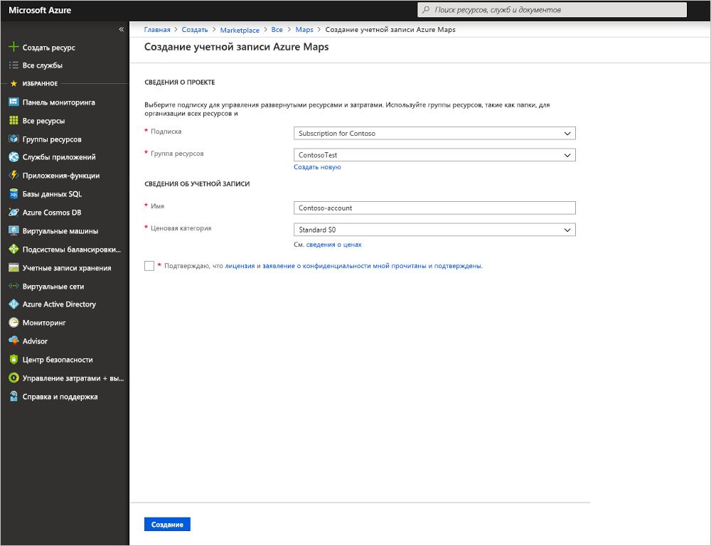

# Запуск карты с интерактивным поиском с помощью службы "Карты Azure"

В этой статье демонстрируются возможности службы "Карты Azure" для создания карты, которая предоставляет пользователям функции интерактивного поиска. В ней также описываются основные действия по созданию учетной записи службы "Карты" и получению ключа учетной записи для использования в демоверсии веб-приложения.

Если у вас еще нет подписки Azure, [создайте бесплатную учетную запись Azure](https://azure.microsoft.com/free/?WT.mc_id=A261C142F), прежде чем начинать работу.

## Войдите на портал Azure.

Войдите на [портал Azure](https://portal.azure.com/).

## Создание учетной записи и получение ключа

1. В верхнем левом углу [портала Azure](https://portal.azure.com) щелкните **Создать ресурс**.
2. В поле *Поиск по Marketplace* введите **Карты**.
3. Выберите *Результаты*, а затем — **Карты**. Нажмите кнопку **Создать**, расположенную под картой.
4. На странице **Создание учетной записи Azure Maps** введите следующие значения:
    - *Имя* новой учетной записи.
    - *Подписку*, которую необходимо использовать для этой учетной записи.
    - *Группу ресурсов* для этой учетной записи. Вы *создать новую* или *использовать существующую* группу ресурсов.
    - Выберите *расположение группы ресурсов*.
    - Ознакомьтесь с *лицензией* и *заявлением о конфиденциальности*, а затем установите флажок, чтобы принять условия соглашения.
    - Наконец, нажмите кнопку **Создать**.

    

5. После успешного создания учетной записи откройте ее и с помощью меню учетной записи перейдите на страницу "Параметры". Щелкните **Ключи**, чтобы получить первичный и вторичный ключи для своей учетной записи службы "Карты Azure". Скопируйте значение **Первичный ключ** в локальный буфер обмена, чтобы использовать его в следующем разделе.

## Скачивание приложения

1. Скачайте файл [interactiveSearch.html](https://github.com/Azure-Samples/azure-maps-samples/blob/master/src/interactiveSearch.html) или скопируйте его содержимое.
2. Сохраните его локально как файл **AzureMapDemo.html** и откройте в текстовом редакторе.
3. Найдите строку `<insert-key>` и замените ее значением **первичного ключа**, полученным в предыдущем разделе.

## Запуск приложения

1. Откройте файл **AzureMapDemo.html** в браузере на свой выбор.
2. Просмотрите карту Лос-Анджелеса. Измените масштаб карты, чтобы посмотреть, как автоматически отрисовывается карта, отображая больше или меньше информации в зависимости от масштаба. 
3. Измените центр карты по умолчанию. В файле **AzureMapDemo.html** найдите переменную **center**. Замените пару значений longitute и latitude для этой переменной новыми значениями: **[-74.0060, 40.7128]**. Сохраните файл и обновите страницу в браузере.
4. Проверьте, как работает интерактивный поиск. В поле поиска в левом верхнем углу демоверсии веб-приложения введите **restaurants**.
5. Наведите указатель мыши на список адресов или расположений, который отображается под полем поиска, и обратите внимание на то, как над соответствующим маркером на карте всплывают сведения об этом расположении. Для обеспечения конфиденциальности частных компаний отображаются вымышленные названия и адреса.

    

## Очистка ресурсов

В последующих руководствах подробно описывается использование и настройка службы "Карты" с помощью учетной записи. Если вы намерены перейти к их изучению, не удаляйте ресурсы, которые создали при работе с этим кратким руководством. Если вы не планируете продолжать работу, следуйте инструкциям ниже, чтобы удалить все созданные ресурсы.

1. Закройте браузер, в котором выполняется веб-приложение **AzureMapDemo.html**.
2. В меню слева на портале Azure щелкните **Все ресурсы** и выберите свою учетную запись службы "Карты". В верхней части колонки **Все ресурсы** щелкните **Удалить**.

## Дополнительная информация

В этом кратком руководстве вы создали учетную запись службы "Карты" и запустили демоверсию приложения. Чтобы узнать, как создать собственное приложение с использованием интерфейсов API службы "Карты", перейдите к следующему руководству.

> [!div class="nextstepaction"]
> [Поиск точек интереса с помощью службы "Карты"](./tutorial-search-location.md)

Дополнительные примеры кода и сведения о возможностях интерактивного программирования см. в указанных ниже практических руководствах.

> [!div class="nextstepaction"]
> [Как найти адрес с помощью REST API в Azure Maps](./how-to-search-for-address.md)

> [!div class="nextstepaction"]
> [Руководство по использованию Map Control в службе Azure Maps](./how-to-use-map-control.md)
