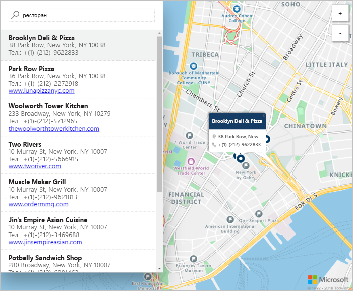

# Создание карты с интерактивным поиском с помощью службы Azure Maps

В этой статье демонстрируются возможности службы "Карты Azure" для создания карты, которая предоставляет пользователям функции интерактивного поиска. В этом руководстве описывается:
* создание учетной записи службы Azure Maps;
* получение ключа учетной записи для демоверсии веб-приложения.

Если у вас еще нет подписки Azure, [создайте бесплатную учетную запись Azure](https://azure.microsoft.com/free/?WT.mc_id=A261C142F), прежде чем начинать работу.

## Вход на портал Azure

Войдите на [портале Azure](https://portal.azure.com/).

## Создание учетной записи и получение ключа

1. В верхнем левом углу окна [портала Azure](https://portal.azure.com) щелкните **Создать ресурс**.
2. В поле **Поиск по Marketplace** введите **Карты**.
3. Выберите **Результаты**, а затем — **Карты**. Нажмите кнопку **Создать**, расположенную под картой.
4. На странице **Создание учетной записи Azure Maps** введите следующие значения:
    - **Имя** новой учетной записи.
    - **Подписку**, которую необходимо использовать для этой учетной записи.
    - **Группу ресурсов** для этой учетной записи. Вы можете выбрать **Создать новый** или **Использовать существующий** для группы ресурсов.
    - Выберите требуемую **ценовую категорию**.
    - Ознакомьтесь с **лицензией** и **заявлением о конфиденциальности**. Установите флажок, чтобы принять условия.
    - Нажмите кнопку **Создать**.

    

5. После успешного создания учетной записи откройте ее и найдите раздел "Параметры" в меню учетной записи. Щелкните **Ключи**, чтобы просмотреть первичный и вторичный ключи для своей учетной записи службы Azure Maps. Скопируйте значение **Первичный ключ** в локальный буфер обмена, чтобы использовать его в следующем разделе.

## Скачивание приложения

1. Скачайте файл [interactiveSearch.html](https://github.com/Azure-Samples/azure-maps-samples/blob/master/src/interactiveSearch.html) или скопируйте его содержимое.
2. Сохраните его локально как файл **AzureMapDemo.html**. Откройте в текстовом редакторе.
3. Найдите строку `<insert-key>`. Замените ее значением **Первичный ключ**, полученным в предыдущем разделе.

## Запуск приложения

1. Откройте файл **AzureMapDemo.html** в браузере на свой выбор.
2. Просмотрите карту Лос-Анджелеса. Измените масштаб карты, чтобы посмотреть, как автоматически отрисовывается карта, отображая больше или меньше информации в зависимости от масштаба. 
3. Измените центр карты по умолчанию. В файле **AzureMapDemo.html** найдите переменную **center**. Замените пару значений longitute и latitude для этой переменной новыми значениями: **[-74.0060, 40.7128]**. Сохраните файл и обновите страницу в браузере.
4. Проверьте, как работает интерактивный поиск. В поле поиска в левом верхнем углу демоверсии веб-приложения найдите **restaurants**.
5. Наведите указатель мыши на список адресов и расположений под полем поиска. Обратите внимание на то, как над соответствующим маркером на карте всплывают сведения об этом расположении. Для обеспечения конфиденциальности частных компаний отображаются вымышленные названия и адреса.

    

## Очистка ресурсов

В последующих руководствах подробно описывается использование и настройка службы Azure Maps с помощью учетной записи. Если вы намерены перейти к их изучению, не удаляйте ресурсы, созданные при работе с этим кратким руководством. Если вы не намерены продолжать изучение, выполните следующие действия, чтобы удалить ресурсы.

1. Закройте браузер, в котором выполняется веб-приложение **AzureMapDemo.html**.
2. На портале Azure в меню слева щелкните **Все ресурсы**. Затем выберите свою учетную запись службы Azure Maps. В верхней части области **Все ресурсы** выберите **Удалить**.

## Дополнительная информация

В этом кратком руководстве вы создали учетную запись службы Azure Maps и запустили демоверсию приложения. Чтобы узнать, как создать собственное приложение с использованием интерфейсов API службы Azure Maps, перейдите к следующему руководству:

> [!div class="nextstepaction"]
> [Поиск ближайшей точки интереса с помощью службы "Карты Azure"](./tutorial-search-location.md)

Дополнительные примеры кода и сведения о возможностях интерактивного программирования см. в следующих практических руководствах:

> [!div class="nextstepaction"]
> [Поиск адреса с помощью службы поиска Azure Maps](./how-to-search-for-address.md)

> [!div class="nextstepaction"]
> [Использование библиотеки Map Control в службе Azure Maps](./how-to-use-map-control.md)
